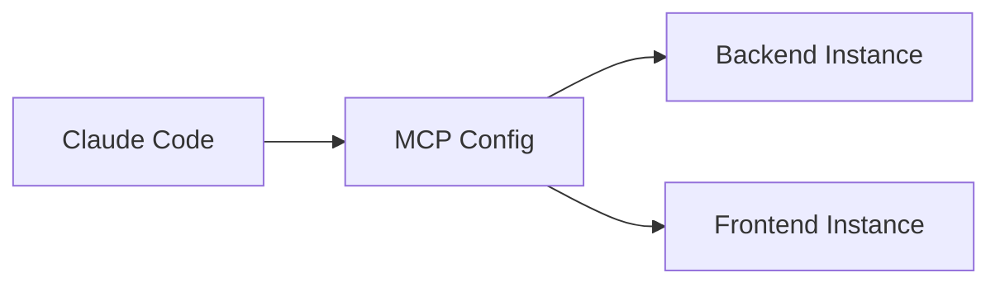

# Multi-Project Documentation

## Overview

Comprehensive documentation for God-Agent's multi-project support, enabling simultaneous work on 5+ projects with complete isolation.

**Added**: 2026-01-25
**Version**: 1.0

---

## Documentation Files

### Getting Started

#### 1. Multi-Project Index
**File**: `docs/getting-started/multi-project-index.md`
**Purpose**: Landing page for multi-project documentation
**Contents**:
- Overview of multi-project mode
- Key features and benefits
- Architecture diagram
- Quick start guide
- Common use cases
- FAQ

#### 2. Multi-Project Setup Guide
**File**: `docs/getting-started/multi-project-setup.md`
**Purpose**: Complete setup and configuration guide
**Contents**:
- Prerequisites
- Quick start (5 minutes)
- Interactive configuration helper usage
- Manual configuration
- Post-setup verification
- Advanced configuration patterns
- Best practices
- Troubleshooting

#### 3. CLI Usage Guide
**File**: `docs/getting-started/multi-project-cli-usage.md`
**Purpose**: Comprehensive A-Z CLI reference
**Contents**:
- Initial setup steps
- Configuration methods (interactive and manual)
- Basic operations
- Project management
- Task execution (simple, parallel, monitoring)
- Memory and context management
- Cross-project workflows
- CLI commands reference
- Advanced usage patterns

#### 4. Manual Configuration Guide
**File**: `docs/getting-started/multi-project-manual-config.md`
**Purpose**: Detailed manual configuration instructions
**Contents**:
- Configuration file structure
- Step-by-step manual setup
- Required and optional parameters
- Environment variables reference
- Complete configuration examples
- Data directory creation
- Validation procedures
- Testing configuration
- Common configuration patterns

---

### Examples

#### 5. Multi-Project Examples
**File**: `docs/examples/multi-project-examples.md`
**Purpose**: Real-world usage examples
**Contents**:
- Full-stack feature implementation (User Authentication)
- Microservices architecture workflows
- Monorepo package updates
- Database schema changes
- Bug fixes across multiple projects
- Performance optimization
- Best practices from examples

---

### Reference

#### 6. Multi-Project Quick Reference
**File**: `docs/reference/multi-project-quick-reference.md`
**Purpose**: Quick reference card and cheat sheet
**Contents**:
- Setup commands
- Configuration template
- Tool naming patterns
- Common operations
- Parallel execution
- Environment variables table
- File locations
- Troubleshooting quick fixes
- Common workflows
- Best practices (do's and don'ts)
- Resource usage table
- Quick checklist
- Emergency reset procedure

---

## Implementation Files

### Supporting Implementation

#### 7. Implementation Summary
**File**: `docs/MULTI_PROJECT_IMPLEMENTATION.md`
**Purpose**: Technical implementation details
**Contents**:
- Overview of changes
- Bootstrap enhancement details
- Configuration helper script details
- Setup scripts details
- MCP config template details
- CLAUDE.md updates
- Architecture diagram
- Usage examples
- File changes summary
- Testing checklist
- Success criteria

---

## MkDocs Integration

### Navigation Structure

The documentation is integrated into MkDocs with the following structure:

```yaml
nav:
  - Getting Started:
    - Multi-Project Support:
      - Overview: getting-started/multi-project-setup.md
      - CLI Usage Guide: getting-started/multi-project-cli-usage.md
      - Manual Configuration: getting-started/multi-project-manual-config.md
  - Examples:
    - Multi-Project Examples: examples/multi-project-examples.md
  - Reference:
    - Multi-Project Quick Reference: reference/multi-project-quick-reference.md
```

---

## Building the Documentation

### Prerequisites

```bash
# Install MkDocs and Material theme
pip install mkdocs mkdocs-material

# Or if using Homebrew (macOS)
brew install mkdocs
pip install mkdocs-material
```

### Build Commands

```bash
# Navigate to rubix-protocol root
cd D:\rubix-protocol

# Serve locally (with live reload)
mkdocs serve

# Open browser to: http://localhost:8000

# Build static site
mkdocs build

# Output to: site/
```

### Deploy

```bash
# Deploy to GitHub Pages
mkdocs gh-deploy

# Or build and copy to hosting
mkdocs build
# Copy site/ directory to web server
```

---

## Documentation Structure

```
docs/
├── getting-started/
│   ├── multi-project-index.md          # Landing page
│   ├── multi-project-setup.md          # Setup guide
│   ├── multi-project-cli-usage.md      # CLI A-Z guide
│   └── multi-project-manual-config.md  # Manual config
├── examples/
│   └── multi-project-examples.md       # Real-world examples
├── reference/
│   └── multi-project-quick-reference.md # Cheat sheet
└── MULTI_PROJECT_IMPLEMENTATION.md     # Technical details
```

---

## Features

### Mermaid Diagrams

All guides include Mermaid diagrams for visual representation:



### Admonitions

Documentation uses Material theme admonitions:

```markdown
!!! success "Key Benefits"
    - Complete isolation
    - True parallelism

!!! warning "Important"
    Must restart Claude Code after config changes

!!! info "Note"
    Use absolute paths for project roots
```

### Code Blocks

Syntax highlighting for multiple languages:

```typescript
// TypeScript examples
mcp__rubix_backend__god_codex_do({ ... });
```

```bash
# Bash commands
npm run build
```

```json
// JSON configuration
{ "mcpServers": { ... } }
```

### Tables

Comprehensive comparison tables:

| Feature | Single | Multi |
|---------|--------|-------|
| Projects | 1 | 2-10 |
| Memory | Shared | Isolated |

---

## Word Count

| Document | Words | Lines |
|----------|-------|-------|
| multi-project-index.md | ~1,800 | ~350 |
| multi-project-setup.md | ~3,500 | ~650 |
| multi-project-cli-usage.md | ~6,500 | ~1,200 |
| multi-project-manual-config.md | ~4,500 | ~850 |
| multi-project-examples.md | ~4,000 | ~750 |
| multi-project-quick-reference.md | ~2,500 | ~500 |
| **Total** | **~22,800** | **~4,300** |

---

## Coverage

### Topics Covered

✅ Installation and setup
✅ Interactive configuration
✅ Manual configuration
✅ Environment variables
✅ CLI commands
✅ Basic operations
✅ Project management
✅ Task execution
✅ Memory and context
✅ Cross-project workflows
✅ Parallel execution
✅ Real-world examples
✅ Troubleshooting
✅ Best practices
✅ Quick reference
✅ Advanced patterns
✅ FAQs

### User Journeys

✅ **First-time setup** - From zero to working multi-project configuration
✅ **Daily usage** - Common operations and workflows
✅ **Troubleshooting** - Solving common problems
✅ **Advanced usage** - Complex scenarios and patterns
✅ **Quick reference** - Fast lookup of commands and patterns

---

## Testing the Documentation

### Checklist

- [ ] Run `mkdocs serve` and verify no errors
- [ ] Check all internal links work
- [ ] Verify Mermaid diagrams render
- [ ] Test code block syntax highlighting
- [ ] Check admonitions display correctly
- [ ] Verify tables format properly
- [ ] Test navigation structure
- [ ] Check mobile responsiveness
- [ ] Verify search functionality
- [ ] Test all examples for accuracy

### Local Testing

```bash
# Serve locally
mkdocs serve

# Open in browser
# Navigate through all pages
# Test internal links
# Verify diagrams and formatting
```

---

## Maintenance

### Updating Documentation

When updating multi-project features:

1. Update relevant documentation files
2. Update version numbers and dates
3. Add changelog entries
4. Test with `mkdocs serve`
5. Rebuild and deploy

### Adding New Examples

To add new examples:

1. Add to `docs/examples/multi-project-examples.md`
2. Follow existing format (scenario, workflow, code)
3. Include real-world context
4. Update table of contents

### Fixing Issues

For documentation bugs:

1. Identify affected files
2. Make corrections
3. Test locally
4. Update last modified date
5. Rebuild documentation

---

## Links

### Internal

- [Multi-Project Setup](getting-started/multi-project-setup.md)
- [CLI Usage Guide](getting-started/multi-project-cli-usage.md)
- [Manual Configuration](getting-started/multi-project-manual-config.md)
- [Examples](examples/multi-project-examples.md)
- [Quick Reference](reference/multi-project-quick-reference.md)

### External

- [God-Agent Repository](https://github.com/BobbyRuby/rubix-protocol)
- [MkDocs Documentation](https://www.mkdocs.org/)
- [Material for MkDocs](https://squidfunk.github.io/mkdocs-material/)

---

## Support

For questions or issues:

1. Check relevant documentation section
2. Review Quick Reference
3. Check Examples for similar use cases
4. Review Troubleshooting sections
5. File issue on GitHub

---

## License

Documentation follows the same license as God-Agent repository.

---

**Last Updated**: 2026-01-25
**Version**: 1.0
**Author**: God-Agent Team
