# Data Flow

Complete documentation of how data flows through the RUBIX system.

## Memory Storage Flow

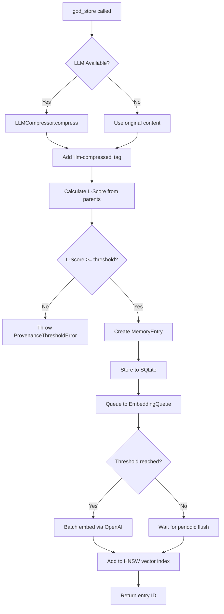

## Query Flow

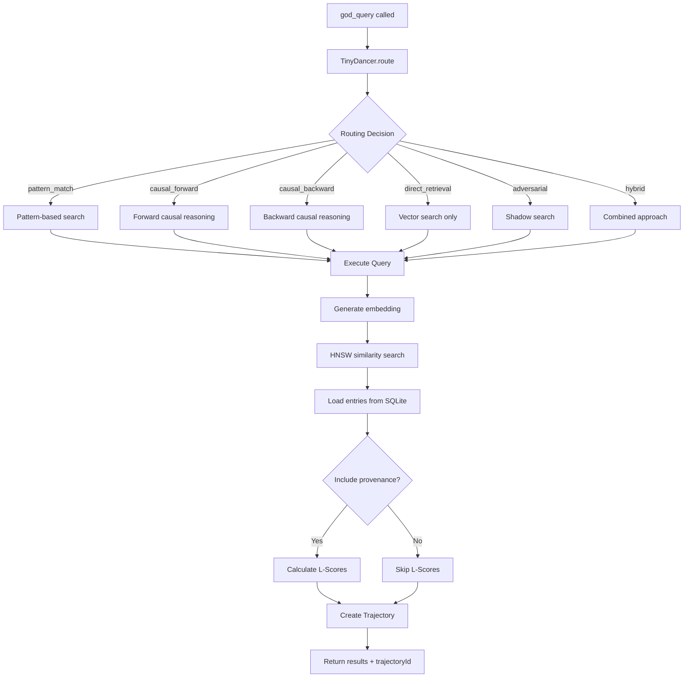

## Learning Flow (Sona)

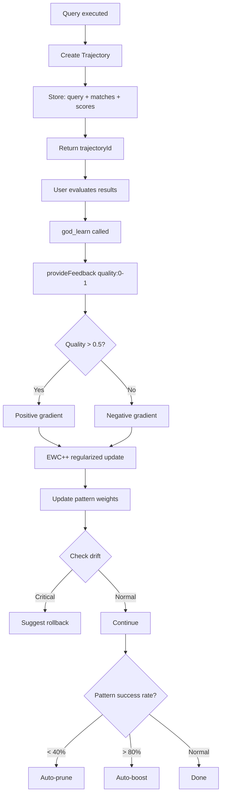

## Task Execution Flow

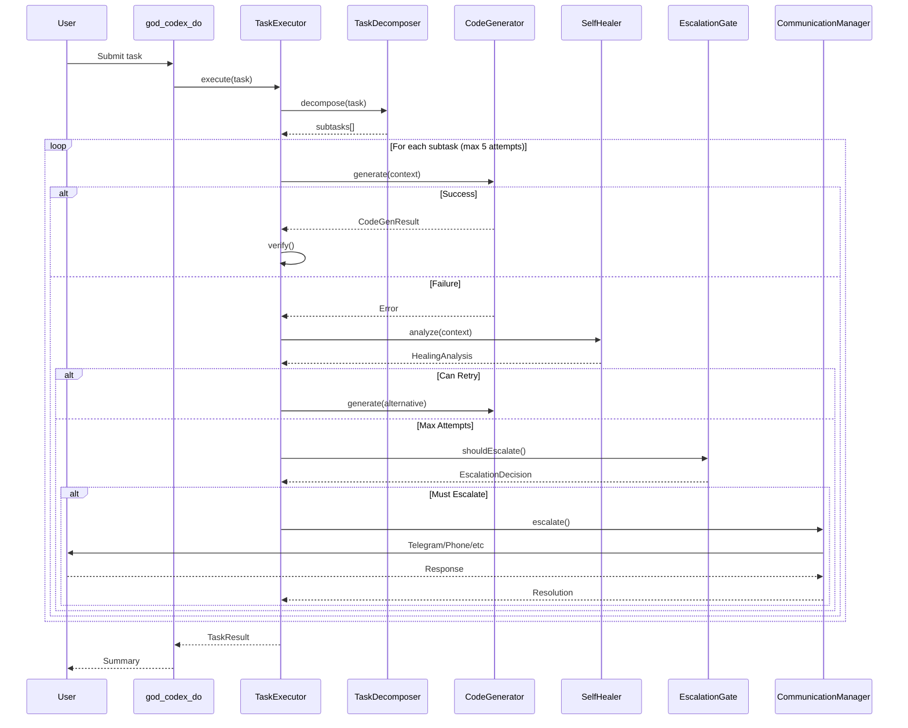

## Escalation Flow

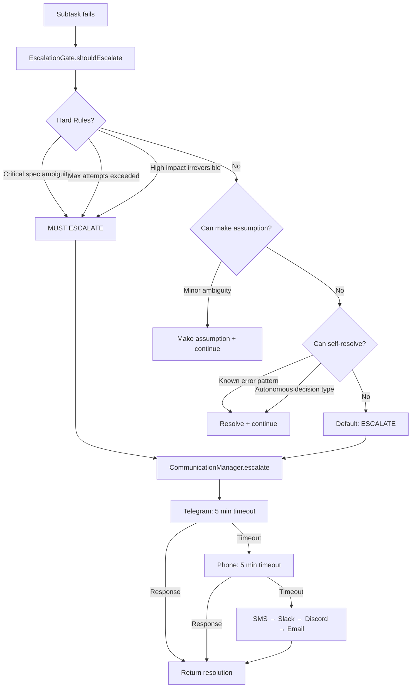

## Compression Flow

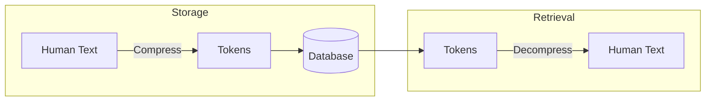

### Compression Pipeline

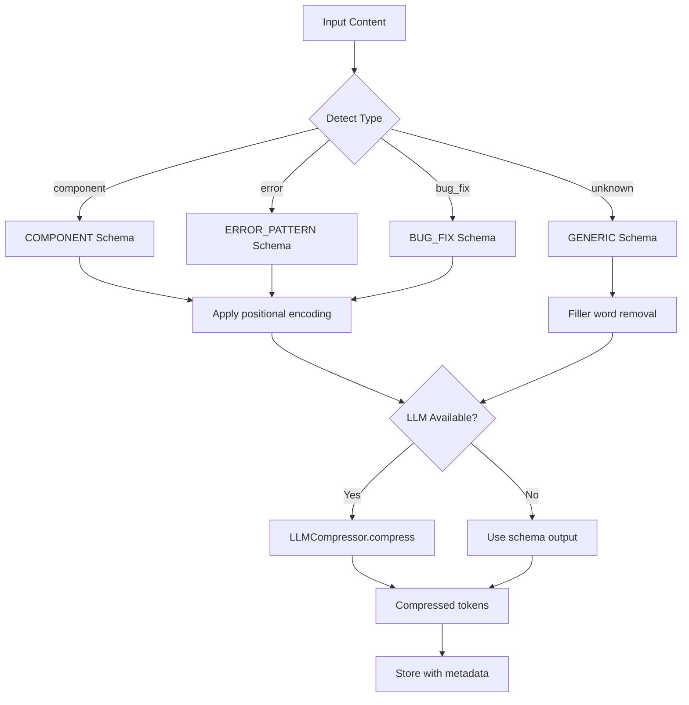

## GNN Enhancement Flow

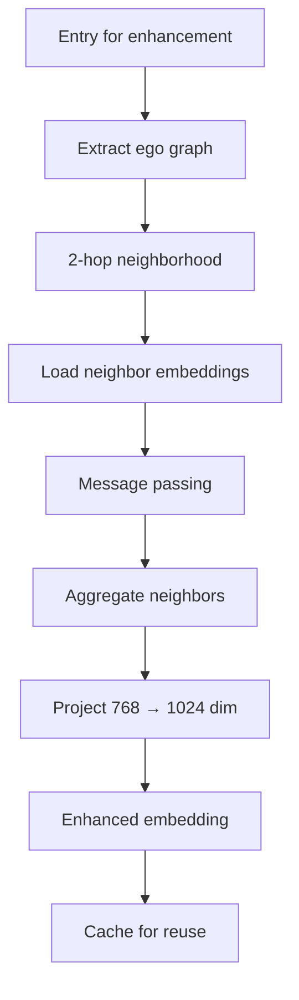

## Routing Decision Flow

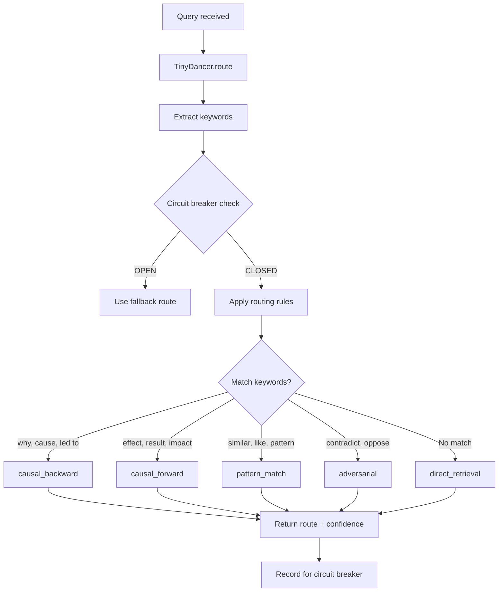

## Notification Flow

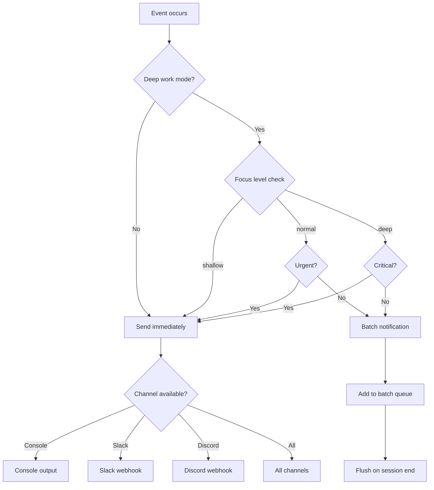

## Data Persistence

### SQLite Tables

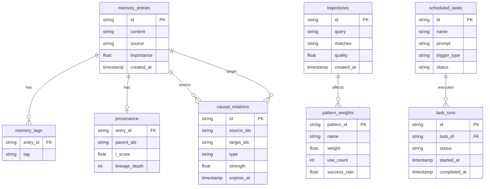

## Next Steps

- [Memory System](memory-system.md) - Deep dive into storage
- [Learning System](learning-system.md) - How Sona learns
- [Task Execution](task-execution.md) - RUBIX execution details
