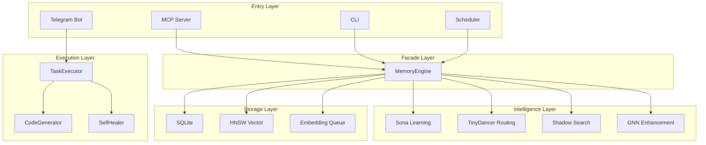

# Architecture Documentation

This section provides comprehensive documentation of the RUBIX/god-agent system architecture.

## Overview

RUBIX consists of **32+ distinct subsystems** organized into layers:



## Core Architecture Principles

1. **Modular Design**: Each subsystem has clear responsibilities and can fail independently
2. **Graceful Degradation**: Features fail gracefully without bringing down the entire system
3. **Learning Loop**: Continuous improvement through trajectory-based Sona engine
4. **Safety First**: Provenance tracking (L-Score), circuit breakers, containment
5. **User Respect**: Only escalates when genuinely necessary

## System Layers

| Layer | Components | Responsibility |
|-------|------------|----------------|
| Entry Points | MCP Server, CLI, Telegram, Scheduler | User/system interfaces |
| Core Facade | MemoryEngine | Unified API for all subsystems |
| Storage | SQLite, HNSW, EmbeddingQueue | Persistence and vector search |
| Intelligence | Sona, TinyDancer, ShadowSearch, GNN | Learning, routing, contradictions |
| Execution | TaskExecutor, CodeGenerator, SelfHealer | Autonomous task execution |
| Providers | Claude, Ollama | LLM abstraction |

## Architecture Documents

| Document | Description |
|----------|-------------|
| [System Overview](overview.md) | High-level architecture with main diagram |
| [Data Flow](data-flow.md) | How data moves through the system |
| [Memory System](memory-system.md) | MemoryEngine and storage architecture |
| [Task Execution](task-execution.md) | RUBIX task execution flow |
| [Learning System](learning-system.md) | Sona trajectory-based learning |
| [Routing System](routing-system.md) | TinyDancer query routing |

## Key Design Principles

### 1. Autonomous First

RUBIX makes decisions independently and only escalates when genuinely blocked:

- Minor ambiguities → Make reasonable assumption
- Known error patterns → Self-resolve
- Max attempts exceeded → Escalate to human

### 2. Self-Healing

Every failure triggers analysis:

1. Classify error type
2. Query similar past failures
3. Find approaches that worked
4. Try alternative strategies
5. Only escalate after max attempts

### 3. Continuous Learning

The Sona engine learns from every interaction:

- **Positive feedback** → Strengthen patterns
- **Negative feedback** → Weaken patterns
- **EWC++ regularization** → Prevent forgetting

### 4. Provenance Tracking

Every piece of information has an L-Score (reliability):

- `user_input` → 1.0 (highest trust)
- `agent_inference` → 0.9
- `tool_output` → 0.8
- Derived information → Decayed from parents

### 5. IDE-Like Powers

10 integrated capabilities:

1. LSP (Language Server Protocol)
2. Git integration
3. AST parsing and refactoring
4. Static analysis
5. Dependency graphing
6. Documentation mining
7. REPL/Debug
8. Profiling
9. Stack trace parsing
10. Database introspection

## Subsystem Count

| Category | Count | Examples |
|----------|-------|----------|
| Core | 5 | MemoryEngine, Config, Types |
| CODEX | 24 | TaskExecutor, CodeGenerator, SelfHealer |
| Memory | 7 | Compressors, EmbeddingCache, AsyncWriteQueue |
| Learning | 4 | SonaEngine, WeightManager, EWCRegularizer |
| Storage | 1 | SQLiteStorage |
| Routing | 3 | TinyDancer, CircuitBreaker |
| Providers | 4 | ProviderFactory, OllamaClient |
| Entry Points | 4 | MCP Server, CLI, Telegram, Scheduler |
| **Total** | **32+** | |

## Technology Stack

| Component | Technology |
|-----------|------------|
| Runtime | Node.js 20+ |
| Language | TypeScript 5.x |
| Database | SQLite (better-sqlite3) |
| Vector Search | HNSW (hnswlib-node) |
| Embeddings | OpenAI text-embedding-3-small |
| Code Generation | Claude Opus 4.5 |
| Browser Automation | Playwright |
| Protocol | Model Context Protocol (MCP) |

## File Structure

```
src/
├── mcp-server.ts         # MCP entry point (3000+ lines)
├── index.ts              # Main exports
├── core/                 # Core memory system
├── codex/                # RUBIX task execution
├── memory/               # Compression systems
├── learning/             # Sona learning
├── routing/              # TinyDancer routing
├── storage/              # SQLite persistence
├── vector/               # HNSW vector DB
├── providers/            # LLM providers
├── capabilities/         # IDE-like powers
├── playwright/           # Browser automation
├── communication/        # Multi-channel escalation
├── notification/         # Notification system
├── scheduler/            # Background daemon
├── telegram/             # Telegram bot
├── cli/                  # Command-line interface
└── deepwork/             # Focus mode
```

## Next Steps

- [System Overview](overview.md) - Start with the main architecture diagram
- [Task Execution](task-execution.md) - Understand how RUBIX executes tasks
- [Memory System](memory-system.md) - Learn about storage and retrieval
