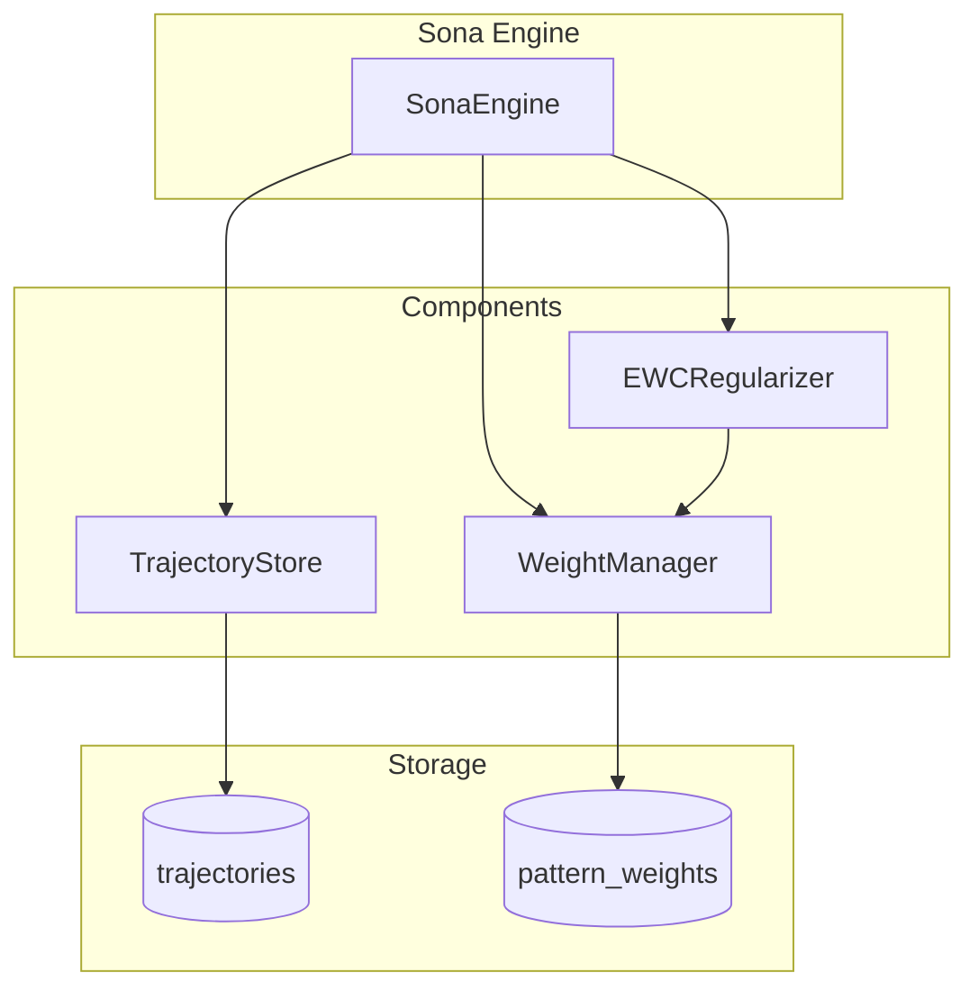
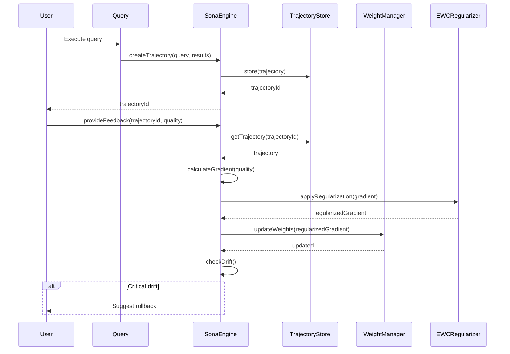
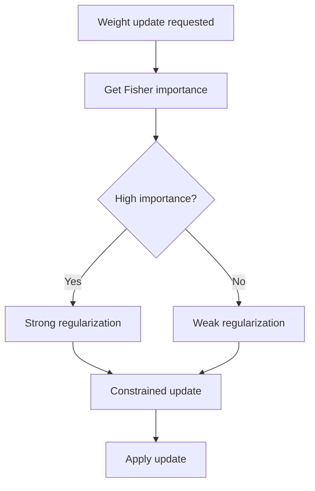

# Learning System Architecture

The Sona Engine provides continuous learning from query outcomes using trajectory-based feedback.

## Architecture Overview



## Core Components

### SonaEngine

**File:** `src/learning/SonaEngine.ts` (~250 lines)

The main learning engine that coordinates trajectory creation and feedback processing:

```typescript
class SonaEngine {
  trajectoryStore: TrajectoryStore;
  weightManager: WeightManager;
  ewcRegularizer: EWCRegularizer;

  async createTrajectory(query: string, results: QueryResult[]): Promise<string>;
  async provideFeedback(trajectoryId: string, quality: number): Promise<void>;
  async getPatternWeights(): Promise<PatternWeight[]>;
  async prunePatterns(): Promise<PrunedPattern[]>;
}
```

### TrajectoryStore

**File:** `src/learning/TrajectoryStore.ts` (~150 lines)

Persists learning trajectories:

```typescript
interface Trajectory {
  id: string;
  query: string;
  queryEmbedding: Float32Array;
  matches: MatchResult[];
  scores: number[];
  quality?: number;      // Feedback: 0.0 - 1.0
  route?: string;        // Routing strategy used
  createdAt: Date;
  feedbackAt?: Date;
}
```

### WeightManager

**File:** `src/learning/WeightManager.ts` (~200 lines)

LoRA-style efficient delta weights:

```typescript
interface PatternWeight {
  patternId: string;
  name: string;
  weight: number;        // Current weight
  baseWeight: number;    // Original weight
  delta: number;         // weight - baseWeight
  useCount: number;
  successRate: number;
  lastUpdated: Date;
}
```

### EWCRegularizer

**File:** `src/learning/EWCRegularizer.ts` (~150 lines)

Elastic Weight Consolidation prevents catastrophic forgetting:

```typescript
class EWCRegularizer {
  fisherMatrix: Map<string, number>;
  importanceThreshold: number;

  async calculateFisherDiagonal(patternId: string): Promise<number>;
  async applyRegularization(update: WeightUpdate): Promise<WeightUpdate>;
  async consolidate(): Promise<void>;
}
```

## Learning Flow



## Feedback Processing

### Quality Score Interpretation

| Quality | Meaning | Weight Update |
|---------|---------|---------------|
| 0.0 | Completely useless | Strong negative |
| 0.25 | Mostly irrelevant | Negative |
| 0.5 | Neutral | No change |
| 0.75 | Mostly useful | Positive |
| 1.0 | Perfect results | Strong positive |

### Gradient Calculation

```typescript
function calculateGradient(quality: number): number {
  // Map quality to gradient
  // quality > 0.5 → positive gradient
  // quality < 0.5 → negative gradient
  // quality = 0.5 → no change
  return (quality - 0.5) * 2;
}
```

### Weight Update

```typescript
async function updateWeight(patternId: string, gradient: number): Promise<void> {
  const current = await getWeight(patternId);
  const regularized = await ewc.applyRegularization({
    patternId,
    gradient
  });

  const newWeight = current.weight + (learningRate * regularized.gradient);
  const clampedWeight = Math.max(0.1, Math.min(2.0, newWeight));

  await setWeight(patternId, clampedWeight);
}
```

## EWC++ Regularization

Prevents catastrophic forgetting by constraining weight changes:



### Fisher Information Matrix

```typescript
// Diagonal approximation of Fisher matrix
fisherDiagonal[patternId] = E[(∂L/∂θ)²]

// Regularization strength
penalty = λ * Σᵢ Fᵢ(θᵢ - θᵢ*)²
```

Where:
- `Fᵢ` = Fisher importance for pattern i
- `θᵢ` = Current weight
- `θᵢ*` = Optimal weight after previous task
- `λ` = Regularization strength

## Pattern Management

### Auto-Pruning

Patterns with low success rates are automatically removed:

```typescript
// Prune criteria
if (useCount >= 100 && successRate < 0.4) {
  await prunePattern(patternId);
}
```

### Auto-Boosting

High-performing patterns get boosted:

```typescript
// Boost criteria
if (useCount >= 50 && successRate > 0.8) {
  await boostPattern(patternId, 1.2);  // 20% boost
}
```

## Drift Detection

Monitors for concept drift:

```typescript
interface DriftMetrics {
  avgQuality: number;       // Rolling average quality
  qualityVariance: number;  // Quality stability
  patternShift: number;     // Weight distribution change
  driftScore: number;       // Combined drift metric
}

function assessDrift(metrics: DriftMetrics): DriftLevel {
  if (metrics.driftScore > 0.8) return 'critical';
  if (metrics.driftScore > 0.5) return 'warning';
  return 'normal';
}
```

## Learning Statistics

```typescript
interface LearningStats {
  totalTrajectories: number;
  trajectoriesWithFeedback: number;
  feedbackRate: number;
  avgQuality: number;
  patternCount: number;
  avgPatternWeight: number;
  avgSuccessRate: number;
  driftScore: number;
  pruningCandidates: number;
  boostingCandidates: number;
}
```

## MCP Tools

### god_learn

Provide feedback for a trajectory:

```typescript
await mcp__rubix__god_learn({
  trajectoryId: "traj_abc123",
  quality: 0.8,
  route: "pattern_match"  // Optional
});
```

### god_learning_stats

Get learning statistics:

```typescript
const stats = await mcp__rubix__god_learning_stats();
// Returns: totalTrajectories, feedbackRate, avgQuality, etc.
```

### god_prune_patterns

Prune low-performing patterns:

```typescript
// Dry run
const preview = await mcp__rubix__god_prune_patterns({ dryRun: true });

// Actual prune
const pruned = await mcp__rubix__god_prune_patterns({ dryRun: false });
```

## Configuration

### Environment Variables

| Variable | Default | Description |
|----------|---------|-------------|
| `SONA_LEARNING_RATE` | `0.01` | Learning rate |
| `SONA_EWC_LAMBDA` | `100` | EWC regularization strength |
| `SONA_PRUNE_THRESHOLD` | `0.4` | Success rate for pruning |
| `SONA_PRUNE_MIN_USES` | `100` | Min uses before pruning |
| `SONA_BOOST_THRESHOLD` | `0.8` | Success rate for boosting |
| `SONA_DRIFT_THRESHOLD` | `0.5` | Drift warning threshold |

## Best Practices

### When to Provide Feedback

1. **After reviewing query results** - Rate how useful they were
2. **After using information** - Did it help accomplish the task?
3. **After finding errors** - Rate as low quality if information was wrong

### Quality Score Guidelines

| Scenario | Suggested Quality |
|----------|-------------------|
| Found exactly what I needed | 1.0 |
| Helpful but needed filtering | 0.75 |
| Some relevant, some not | 0.5 |
| Mostly irrelevant | 0.25 |
| Completely wrong/useless | 0.0 |

### Monitoring Learning Health

```typescript
const stats = await mcp__rubix__god_learning_stats();

// Check for issues
if (stats.driftScore > 0.5) {
  console.warn("High drift detected");
}

if (stats.feedbackRate < 0.1) {
  console.warn("Low feedback rate - learning may stagnate");
}

if (stats.avgQuality < 0.5) {
  console.warn("Low average quality - check query patterns");
}
```

## Next Steps

- [Routing System](routing-system.md) - TinyDancer query routing
- [Memory System](memory-system.md) - Storage architecture
- [Data Flow](data-flow.md) - Complete data flow diagrams
