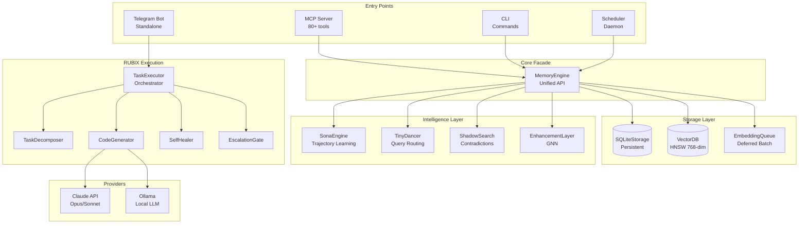

# System Architecture Overview

## High-Level Architecture

## Component Descriptions

### Entry Points

| Component | File | Purpose |
|-----------|------|---------|
| **MCP Server** | `src/mcp-server.ts` | Model Context Protocol server exposing 80+ tools to Claude Code |
| **CLI** | `src/cli/index.ts` | Command-line interface for direct interaction |
| **Telegram Bot** | `src/telegram/TelegramBot.ts` | Standalone bot for task submission and escalation |
| **Scheduler** | `src/scheduler/SchedulerDaemon.ts` | Background daemon for cron/event-based tasks |

### Core Facade

The **MemoryEngine** (`src/core/MemoryEngine.ts`) is the unified API facade that orchestrates all memory subsystems:

- SQLiteStorage for persistence
- VectorDB for HNSW semantic search
- EmbeddingService for OpenAI embeddings
- EmbeddingQueue for deferred batch processing
- ProvenanceStore for L-Score tracking
- CausalMemory for hypergraph relations
- PatternMatcher for reusable templates
- ShadowSearch for contradiction finding
- SonaEngine for continuous learning
- EnhancementLayer for GNN
- TinyDancer for query routing

### Storage Layer

| Component | Purpose | Technology |
|-----------|---------|------------|
| **SQLiteStorage** | Persistent database | better-sqlite3, 13+ tables |
| **VectorDB** | Semantic search | HNSW, 768-dim, 1M max elements |
| **EmbeddingQueue** | Batch embedding | OpenAI text-embedding-3-small |

### Intelligence Layer

| Component | Purpose | Key Feature |
|-----------|---------|-------------|
| **SonaEngine** | Continuous learning | EWC++ regularization |
| **TinyDancer** | Query routing | 7 reasoning strategies |
| **ShadowSearch** | Contradictions | Inverted embedding search |
| **EnhancementLayer** | GNN embedding | 2-hop neighborhood aggregation |

### RUBIX Execution

| Component | Purpose | Key Feature |
|-----------|---------|-------------|
| **TaskExecutor** | Main orchestrator | Coordinates all execution |
| **TaskDecomposer** | Task breakdown | 7 subtask types |
| **CodeGenerator** | Code gen | CLI-first with API fallback |
| **SelfHealer** | Failure analysis | Pattern matching + alternatives |
| **EscalationGate** | Escalation logic | Respects user attention |

### Providers

| Provider | Primary Use | Fallback |
|----------|------------|----------|
| **Claude** | Code generation | API when CLI quota exhausted |
| **Ollama** | Local inference | Rate-limited departments |

## Subsystem Count

The system consists of **32+ distinct subsystems**:

1. MemoryEngine (facade)
2. SQLiteStorage
3. VectorDB
4. EmbeddingService
5. EmbeddingQueue
6. ProvenanceStore
7. CausalMemory
8. PatternMatcher
9. ShadowSearch
10. SonaEngine
11. TrajectoryStore
12. WeightManager
13. EWCRegularizer
14. EnhancementLayer (GNN)
15. TinyDancer
16. CircuitBreaker
17. TaskExecutor
18. TaskDecomposer
19. CodeGenerator
20. SelfHealer
21. EscalationGate
22. LearningIntegration
23. AlternativesFinder
24. CausalDebugger
25. WorkingMemoryManager
26. CollaborativePartner
27. ContainmentManager
28. CommunicationManager
29. NotificationService
30. SchedulerDaemon
31. CapabilitiesManager
32. ConfigurationManager
