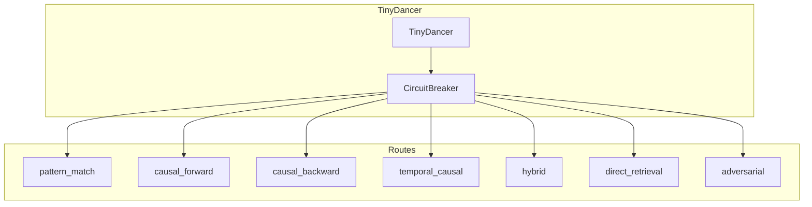
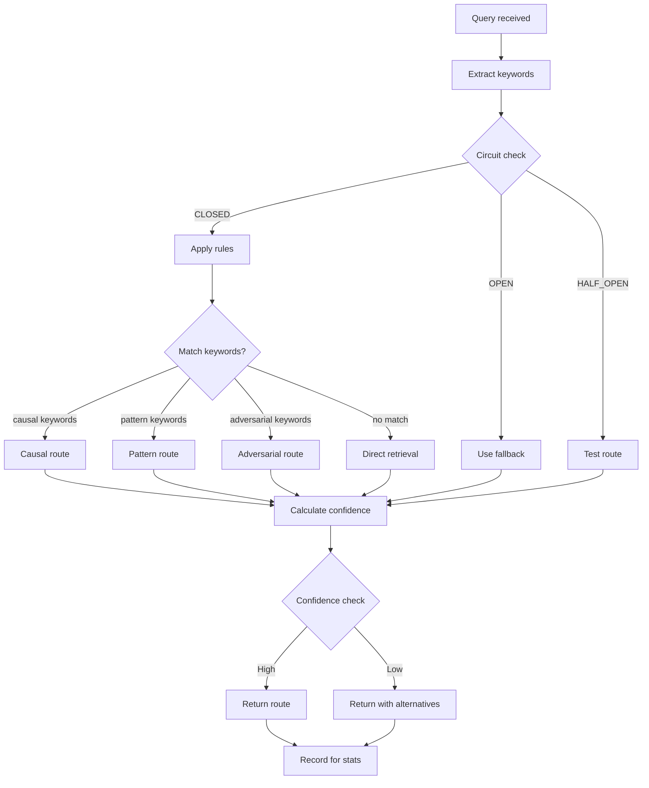
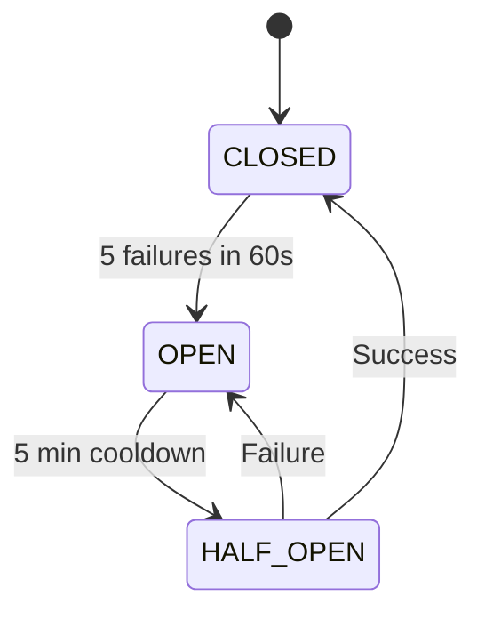

# Routing System Architecture

TinyDancer provides intelligent query routing to optimal reasoning strategies.

## Architecture Overview



## Core Components

### TinyDancer

**File:** `src/routing/TinyDancer.ts` (~400 lines)

Neural query router with rule-based keyword matching:

```typescript
class TinyDancer {
  circuitBreaker: CircuitBreaker;
  routeStats: Map<Route, RouteStats>;

  async route(query: string, options?: RouteOptions): Promise<RouteDecision>;
  async recordResult(route: Route, success: boolean): Promise<void>;
  getStats(): RoutingStats;
}
```

### CircuitBreaker

**File:** `src/routing/CircuitBreaker.ts` (~150 lines)

Protects against failing routes:

```typescript
class CircuitBreaker {
  circuits: Map<Route, CircuitState>;

  async checkCircuit(route: Route): Promise<CircuitStatus>;
  async recordFailure(route: Route): Promise<void>;
  async recordSuccess(route: Route): Promise<void>;
  async reset(route?: Route): Promise<void>;
}
```

## 7 Reasoning Routes

| Route | Purpose | Trigger Keywords |
|-------|---------|------------------|
| `pattern_match` | Find similar historical patterns | "similar", "like", "pattern", "before" |
| `causal_forward` | What effects does X cause? | "effect", "result", "impact", "lead to" |
| `causal_backward` | What caused X? | "why", "cause", "reason", "led to" |
| `temporal_causal` | Time-based cause-effect chains | "when", "after", "before", "sequence" |
| `hybrid` | Combined pattern + causal | Complex queries |
| `direct_retrieval` | Simple vector search | Default fallback |
| `adversarial` | Find contradictory evidence | "contradict", "oppose", "against" |

## Routing Flow



## Keyword Matching Rules

### Causal Backward

```typescript
const causalBackwardKeywords = [
  'why', 'cause', 'caused', 'reason',
  'led to', 'resulted in', 'because',
  'root cause', 'origin', 'source'
];
```

### Causal Forward

```typescript
const causalForwardKeywords = [
  'effect', 'impact', 'result',
  'consequence', 'outcome', 'lead to',
  'what happens', 'affects'
];
```

### Pattern Match

```typescript
const patternKeywords = [
  'similar', 'like', 'pattern',
  'before', 'previously', 'history',
  'example', 'case', 'instance'
];
```

### Adversarial

```typescript
const adversarialKeywords = [
  'contradict', 'oppose', 'against',
  'wrong', 'false', 'disprove',
  'counterargument', 'refute'
];
```

## Circuit Breaker

### States



### Thresholds

| Parameter | Value | Description |
|-----------|-------|-------------|
| `failureThreshold` | 5 | Failures to trip circuit |
| `failureWindow` | 60s | Window for counting failures |
| `cooldownPeriod` | 5 min | Time before testing recovery |
| `successThreshold` | 1 | Successes to close circuit |

### Circuit Status

```typescript
interface CircuitState {
  state: 'CLOSED' | 'OPEN' | 'HALF_OPEN';
  failureCount: number;
  successCount: number;
  lastFailure?: Date;
  cooldownEndsAt?: Date;
  totalFailures: number;
  totalSuccesses: number;
}
```

## Route Execution

### Pattern Match

```typescript
async function executePatternMatch(query: string): Promise<QueryResult[]> {
  // 1. Find similar historical queries
  const similarQueries = await findSimilarQueries(query);

  // 2. Get results that worked well for those queries
  const successfulResults = await getSuccessfulResults(similarQueries);

  // 3. Combine with current vector search
  const currentResults = await vectorSearch(query);

  // 4. Merge and rank
  return mergeAndRank(successfulResults, currentResults);
}
```

### Causal Forward

```typescript
async function executeCausalForward(query: string): Promise<QueryResult[]> {
  // 1. Find entities in query
  const entities = await extractEntities(query);

  // 2. Find causal relations where entities are sources
  const relations = await findRelations({
    sourceIds: entities,
    type: ['causes', 'enables', 'triggers']
  });

  // 3. Get target entries
  const targets = await getEntries(relations.targetIds);

  // 4. Combine with vector search
  return combineResults(targets, await vectorSearch(query));
}
```

### Causal Backward

```typescript
async function executeCausalBackward(query: string): Promise<QueryResult[]> {
  // 1. Find entities in query
  const entities = await extractEntities(query);

  // 2. Find causal relations where entities are targets
  const relations = await findRelations({
    targetIds: entities,
    type: ['causes', 'enables', 'triggers']
  });

  // 3. Get source entries (the causes)
  const sources = await getEntries(relations.sourceIds);

  // 4. Combine with vector search
  return combineResults(sources, await vectorSearch(query));
}
```

### Adversarial

```typescript
async function executeAdversarial(query: string): Promise<QueryResult[]> {
  // 1. Generate embedding
  const embedding = await embed(query);

  // 2. Invert embedding
  const inverted = embedding.map(v => -v);

  // 3. Search with inverted embedding
  const contradictions = await vectorSearch(inverted);

  // 4. Calculate refutation strength
  return contradictions.map(c => ({
    ...c,
    refutationStrength: calculateRefutation(c, query)
  }));
}
```

## Routing Statistics

```typescript
interface RoutingStats {
  totalRouted: number;
  routeCounts: Record<Route, number>;
  avgConfidence: Record<Route, number>;
  avgRoutingTimeMs: number;
  fallbackCount: number;
  circuitTrips: number;
}
```

## MCP Tools

### god_route

Route a query to optimal strategy:

```typescript
const decision = await mcp__rubix__god_route({
  query: "Why did the authentication fail?",
  preferredRoute: undefined,  // Let TinyDancer decide
  previousRoute: undefined
});

// Returns:
// {
//   route: "causal_backward",
//   confidence: 0.85,
//   alternatives: ["pattern_match", "hybrid"]
// }
```

### god_route_result

Record execution result:

```typescript
await mcp__rubix__god_route_result({
  route: "causal_backward",
  success: true  // or false
});
```

### god_routing_stats

Get routing statistics:

```typescript
const stats = await mcp__rubix__god_routing_stats();
// Returns: totalRouted, routeCounts, avgConfidence, etc.
```

### god_circuit_status

Check circuit breaker status:

```typescript
const status = await mcp__rubix__god_circuit_status();
// Returns circuit state for all routes
```

### god_reset_circuit

Reset circuit breaker:

```typescript
// Reset specific route
await mcp__rubix__god_reset_circuit({ route: "causal_backward" });

// Reset all routes
await mcp__rubix__god_reset_circuit();
```

## Configuration

### Environment Variables

| Variable | Default | Description |
|----------|---------|-------------|
| `TINYDANCER_CONFIDENCE_THRESHOLD` | `0.5` | Min confidence for route |
| `TINYDANCER_FALLBACK_ROUTE` | `direct_retrieval` | Fallback when low confidence |
| `CIRCUIT_FAILURE_THRESHOLD` | `5` | Failures to trip circuit |
| `CIRCUIT_FAILURE_WINDOW` | `60000` | Window in ms |
| `CIRCUIT_COOLDOWN` | `300000` | Cooldown in ms |

## Route Selection Algorithm

```typescript
function selectRoute(query: string): RouteDecision {
  const keywords = extractKeywords(query);
  const scores: Record<Route, number> = {};

  // Score each route based on keyword matches
  for (const route of routes) {
    const matchCount = countMatches(keywords, routeKeywords[route]);
    scores[route] = matchCount / routeKeywords[route].length;
  }

  // Check circuit breakers
  for (const route of Object.keys(scores)) {
    if (isCircuitOpen(route)) {
      scores[route] = 0;
    }
  }

  // Select highest scoring route
  const bestRoute = maxBy(scores);
  const confidence = scores[bestRoute];

  // Get alternatives
  const alternatives = Object.entries(scores)
    .filter(([r, s]) => r !== bestRoute && s > 0.3)
    .sort((a, b) => b[1] - a[1])
    .slice(0, 3)
    .map(([r]) => r);

  return {
    route: bestRoute,
    confidence,
    alternatives
  };
}
```

## Best Practices

### Handling Circuit Trips

```typescript
const status = await god_circuit_status();

for (const [route, state] of Object.entries(status.circuits)) {
  if (state.state === 'OPEN') {
    console.log(`Route ${route} is blocked`);
    console.log(`Cooldown ends: ${state.cooldownEndsAt}`);
  }
}
```

### Monitoring Route Health

```typescript
const stats = await god_routing_stats();

// Check for problematic routes
for (const [route, count] of Object.entries(stats.routeCounts)) {
  const confidence = stats.avgConfidence[route];
  if (confidence < 0.5) {
    console.warn(`Route ${route} has low confidence: ${confidence}`);
  }
}
```

### Manual Route Override

```typescript
// Force a specific route
const results = await god_query({
  query: "authentication issue",
  route: "causal_backward"  // Override TinyDancer
});
```

## Next Steps

- [Learning System](learning-system.md) - Sona trajectory learning
- [Memory System](memory-system.md) - Storage architecture
- [Task Execution](task-execution.md) - RUBIX execution flow
