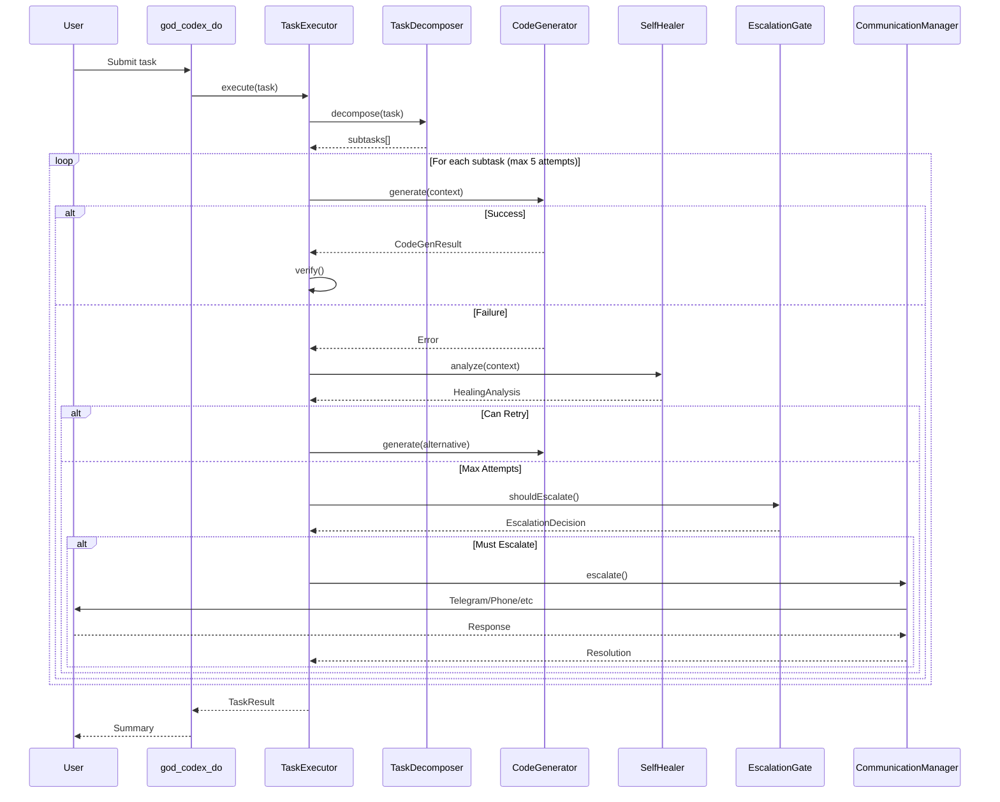
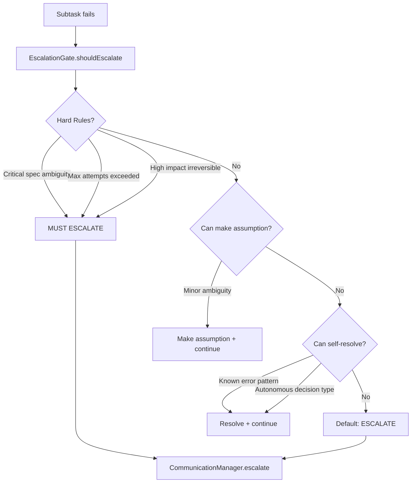

# Task Execution Architecture

## RUBIX Task Execution Flow



## TaskExecutor

**File:** `src/codex/TaskExecutor.ts` (~1800 lines)

The TaskExecutor is the main RUBIX orchestrator that coordinates all execution.

### Responsibilities

1. Receives task submissions from MCP tools or Telegram
2. Compresses input prompts to reduce token usage
3. Decomposes tasks into subtasks via TaskDecomposer
4. Executes subtasks with retry loop (up to 5 attempts)
5. Self-heals failures via SelfHealer
6. Escalates when genuinely blocked via EscalationGate
7. Returns TaskResult with summary

### Execution Modes

| Mode | Description | Use Case |
|------|-------------|----------|
| **Standard** | Normal execution | Most tasks |
| **RUBIX Mode** | Department heads | Complex tasks |
| **Phased** | 6-phase tokenized | Rate limit mitigation |

### Retry Strategy

| Attempt | Strategy |
|---------|----------|
| 1 | Standard approach |
| 2 | Alternative + learning suggestions |
| 3 | Extended thinking (16K tokens) |
| 4 | Different alternative approach |
| 5 | Final attempt with maximum context |
| - | Escalate if all fail |

### Internal Components

```typescript
class TaskExecutor {
  // Decomposition
  decomposer: TaskDecomposer;

  // Self-healing
  healer: SelfHealer;
  alternatives: AlternativesFinder;
  causalDebugger: CausalDebugger;

  // Escalation
  escalation: EscalationGate;

  // Code generation
  codeGenerator: CodeGenerator;

  // Learning
  learning: LearningIntegration;

  // Optional advanced modes
  collaborativePartner: CollaborativePartner;
  rubixOrchestrator: RubixOrchestrator;
  phasedExecutor: PhasedExecutor;

  // Deep work
  deepWork: DeepWorkManager;
}
```

## TaskDecomposer

**File:** `src/codex/TaskDecomposer.ts` (~200 lines)

Breaks tasks into executable subtasks with dependency analysis.

### 7 Subtask Types

| Type | Description | Example |
|------|-------------|---------|
| **research** | Analyze codebase, read docs | "Understand authentication flow" |
| **design** | Architecture planning | "Design component structure" |
| **code** | Code generation | "Implement login function" |
| **test** | Write/run tests | "Add unit tests for auth" |
| **integrate** | Wire components | "Connect auth to routes" |
| **verify** | Playwright verification | "Verify login works in browser" |
| **review** | Code quality check | "Review for security issues" |

### Decomposition Result

```typescript
interface DecomposeResult {
  subtasks: Subtask[];
  estimatedComplexity: 'low' | 'medium' | 'high';
  ambiguities: Ambiguity[];
  dependencies: DependencyGraph;
  needsClarification: boolean;
  clarificationText?: string;
}
```

## CodeGenerator

**File:** `src/codex/CodeGenerator.ts` (~500 lines)

Generates code using Claude Code CLI with API fallback.

### Execution Priority

1. **Claude Code CLI** (Max subscription - Opus by default) - PREFERRED
2. **Anthropic API** (fallback when quota exhausted)

### Features

- Parses `<file path="..." action="create|modify">` from responses
- Creates/modifies files in codebase
- Extended thinking support (escalating budget on retries)
- Detects quota exhaustion (triggers API fallback)
- Detects model downgrade (Opus→Sonnet)
- Captures tokens used + thinking tokens

### Configuration

```typescript
interface CodeGeneratorConfig {
  codebaseRoot: string;
  model: string;  // default: claude-opus-4-5-20251101
  maxTokens: number;  // default: 8192
  extendedThinking: {
    enabled: boolean;
    baseBudget: number;  // 5000
    budgetIncrement: number;  // 5000
    maxBudget: number;  // 16000
    enableOnAttempt: number;  // 2
  };
  cliModel: 'opus' | 'sonnet' | 'haiku';
  cliTimeout: number;  // 5 min
}
```

## SelfHealer

**File:** `src/codex/SelfHealer.ts` (~300 lines)

Analyzes failures and suggests recovery strategies.

### Analysis Pipeline

1. **Error Classification**
   - Type: syntax, type, runtime, test, integration, timeout, unknown
   - Transient check
   - Suggested strategy

2. **Failure Memory Query**
   - Search for similar failures using FailureMemoryService
   - Find approaches that worked before
   - Find approaches to avoid

3. **Enhanced Analysis** (via CapabilitiesManager)
   - Parse stack trace
   - Get stack context
   - Query git history
   - Run TypeScript diagnostics

4. **Healing Strategy Selection**
   - retry_with_context
   - simplify_approach
   - try_alternative
   - gather_more_context
   - break_into_smaller_steps
   - escalate

### HealingAnalysis Result

```typescript
interface HealingAnalysis {
  isFundamentalBlocker: boolean;
  reason: string;
  newApproach: string;
  needsMoreContext: boolean;
  contextNeeded: string[];
  suggestedActions: string[];
  similarFailures: SimilarFailure[];
}
```

## EscalationGate

**File:** `src/codex/EscalationGate.ts` (~300 lines)

Decides when to escalate to user (key to not annoying them).

### Escalation Decision Flow



### Hard Rules (Must Escalate)

- Critical spec ambiguity (businessImpact: high)
- Blocked after maxAttemptsBeforeEscalate (default: 5)
- High business impact irreversible actions

### Autonomous Decisions (No Escalation)

```typescript
const autonomousDecisions = [
  'dependency_minor_versions',
  'code_formatting',
  'variable_naming',
  'test_structure'
];
```

### Requires Approval (Must Escalate)

```typescript
const requireApproval = [
  'database_schema_changes',
  'api_breaking_changes',
  'new_dependencies',
  'architecture_changes'
];
```

### Escalation Types

| Type | Description |
|------|-------------|
| `clarification` | Need more information |
| `decision` | Choose between options |
| `blocked` | Cannot proceed |
| `approval` | Irreversible action |

## CommunicationManager

**File:** `src/communication/CommunicationManager.ts` (~300 lines)

Multi-channel escalation with automatic fallback.

### Fallback Chain

1. **Telegram** (instant push notifications)
2. **Phone** (voice call via CallMe/Twilio/Telnyx)
3. **SMS** (short message)
4. **Slack** (webhook posting)
5. **Discord** (webhook posting)
6. **Email** (SMTP)

### 5-Minute Timeout Per Channel

Each channel waits up to 5 minutes for response before trying the next.


