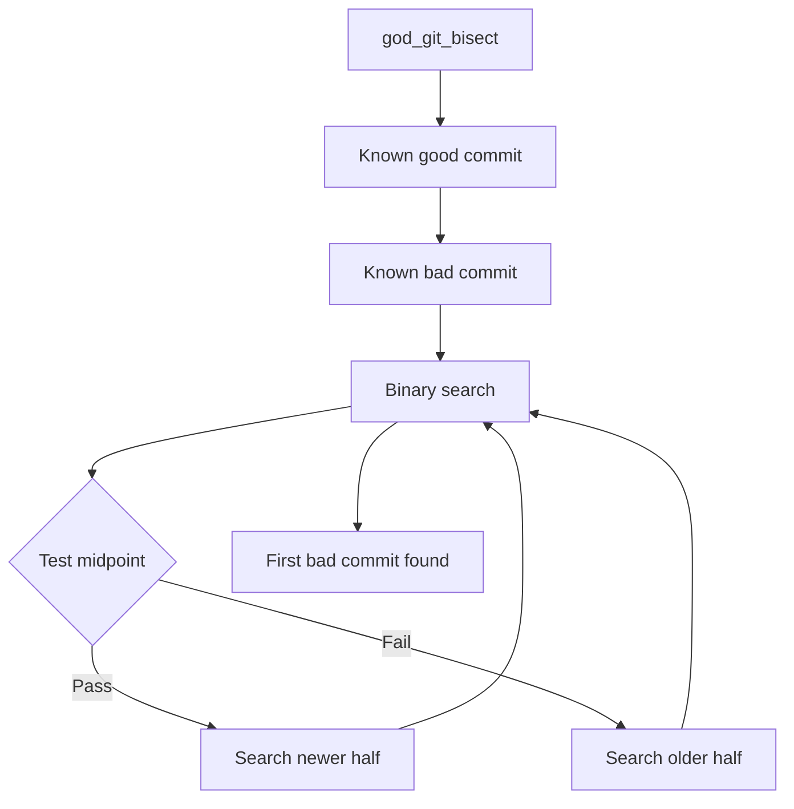

# Git Manager

Git repository analysis and operations.

## Location

`src/capabilities/GitManager.ts`

## Purpose

Provides git-related capabilities:

- Blame analysis (who wrote what)
- Bisect (find breaking commits)
- History analysis
- Diff viewing
- Branch management

## MCP Tools

| Tool | Purpose |
|------|---------|
| `god_git_blame` | Show who wrote each line |
| `god_git_bisect` | Binary search for breaking commit |
| `god_git_history` | View commit history |
| `god_git_diff` | Show file changes |
| `god_git_branches` | List branches |

## Blame Analysis

```typescript
const blame = await god_git_blame({
  file: "src/index.ts",
  startLine: 10,
  endLine: 20
});

// Result:
{
  lines: [
    { line: 10, author: "alice", commit: "abc123", date: "2024-01-15", content: "..." },
    { line: 11, author: "bob", commit: "def456", date: "2024-02-20", content: "..." }
  ]
}
```

## Bisect Flow



## Example: Find Breaking Commit

```typescript
const result = await god_git_bisect({
  good: "v1.0.0",           // Last known working
  bad: "HEAD",              // Current (broken)
  testCommand: "npm test"   // How to test
});

// Result:
{
  firstBadCommit: "abc123def",
  author: "developer@example.com",
  message: "Refactored auth module",
  date: "2024-03-15",
  stepsRequired: 7
}
```

## History Analysis

```typescript
const history = await god_git_history({
  file: "src/auth/login.ts",
  limit: 10,
  author: "alice@example.com"
});

// Result:
{
  commits: [
    { hash: "abc123", author: "alice", date: "...", message: "Fix login bug" },
    { hash: "def456", author: "alice", date: "...", message: "Add 2FA support" }
  ]
}
```

## Diff Viewing

```typescript
const diff = await god_git_diff({
  file: "src/index.ts",
  commit: "HEAD~3",
  staged: false
});

// Result:
{
  additions: 15,
  deletions: 8,
  hunks: [
    { startLine: 42, lines: [...] }
  ]
}
```

## Related

- [Capability Tools](../tools/capability-tools.md)
- [Capabilities Overview](index.md)
