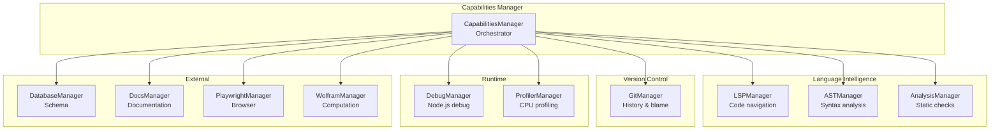
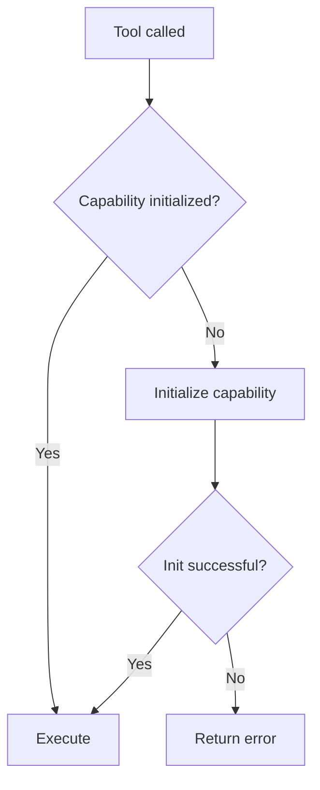

# Capabilities Overview

RUBIX provides 10 IDE-like capabilities for comprehensive development assistance.

## Capability Reference

| Capability | Description | Tools |
|------------|-------------|-------|
| [LSP](#lsp-manager) | Language Server Protocol | 6 |
| [Git](#git-manager) | Version control | 5 |
| [AST](#ast-manager) | Abstract Syntax Tree | 4 |
| [Analysis](#analysis-manager) | Static analysis | 4 |
| [Debug](#debug-manager) | Debugging | 5 |
| [Database](#database-manager) | DB introspection | 2 |
| [Profiler](#profiler-manager) | Performance | 3 |
| [Docs](#docs-manager) | Documentation | 2 |
| [Playwright](#playwright-manager) | Browser automation | 8 |
| [Wolfram](#wolfram-manager) | Computational | 4 |

---

## Architecture



---

## LSP Manager

Language Server Protocol integration for code intelligence.

### Features

- Go-to-definition
- Find references
- Diagnostics (errors, warnings)
- Symbol search
- Workspace-wide analysis

### Languages

- TypeScript / JavaScript
- Additional languages via external LSP servers

### Usage

```typescript
// Start LSP
await mcp__rubix__god_lsp_start();

// Find definition
const def = await mcp__rubix__god_lsp_definition({
  file: "src/api/users.ts",
  line: 25,
  column: 10
});

// Find all references
const refs = await mcp__rubix__god_lsp_references({
  file: "src/models/User.ts",
  line: 10,
  column: 14
});
```

**Tools:** `god_lsp_start`, `god_lsp_stop`, `god_lsp_definition`, `god_lsp_references`, `god_lsp_diagnostics`, `god_lsp_symbols`

---

## Git Manager

Git integration for version control analysis.

### Features

- Blame information
- Commit history
- Diff generation
- Branch management
- Binary search (bisect)

### Usage

```typescript
// Get blame for a file
const blame = await mcp__rubix__god_git_blame({
  file: "src/api/users.ts",
  startLine: 40,
  endLine: 50
});

// Find breaking commit
const bisect = await mcp__rubix__god_git_bisect({
  good: "v1.0.0",
  testCommand: "npm test"
});
```

**Tools:** `god_git_blame`, `god_git_bisect`, `god_git_history`, `god_git_diff`, `god_git_branches`

---

## AST Manager

Abstract Syntax Tree parsing and manipulation.

### Features

- Parse files to AST
- Query for node types
- Safe refactoring
- Symbol extraction

### Usage

```typescript
// Find all functions
const funcs = await mcp__rubix__god_ast_query({
  file: "src/api/users.ts",
  nodeType: "FunctionDeclaration"
});

// Rename safely
await mcp__rubix__god_ast_refactor({
  type: "rename",
  target: "src/api/users.ts:getUserById",
  newValue: "findUserById",
  scope: "all"
});
```

**Tools:** `god_ast_parse`, `god_ast_query`, `god_ast_refactor`, `god_ast_symbols`

---

## Analysis Manager

Static analysis for code quality.

### Features

- ESLint integration
- TypeScript type checking
- Dependency graph building
- Impact analysis

### Usage

```typescript
// Run linting
const lint = await mcp__rubix__god_analyze_lint({
  files: ["src/**/*.ts"]
});

// Check types
const types = await mcp__rubix__god_analyze_types({});

// Analyze change impact
const impact = await mcp__rubix__god_analyze_impact({
  file: "src/models/User.ts"
});
```

**Tools:** `god_analyze_lint`, `god_analyze_types`, `god_analyze_deps`, `god_analyze_impact`

---

## Debug Manager

Node.js debugging integration.

### Features

- Start debug sessions
- Set breakpoints
- Step through code
- Evaluate expressions
- Conditional breakpoints

### Usage

```typescript
// Start debugging
await mcp__rubix__god_debug_start({
  script: "src/index.ts"
});

// Set breakpoint
await mcp__rubix__god_debug_breakpoint({
  file: "src/api/users.ts",
  line: 42,
  condition: "user.id === 5"
});

// Step through
await mcp__rubix__god_debug_step({ action: "stepOver" });

// Evaluate expression
const result = await mcp__rubix__god_debug_eval({
  expression: "user.name"
});
```

**Tools:** `god_debug_start`, `god_debug_stop`, `god_debug_breakpoint`, `god_debug_step`, `god_debug_eval`

---

## Database Manager

Database schema introspection.

### Features

- Schema extraction
- TypeScript type generation
- Multi-database support (PostgreSQL, MySQL, SQLite)

### Usage

```typescript
// Get schema
const schema = await mcp__rubix__god_db_schema({
  connectionString: "postgresql://localhost/mydb"
});

// Generate types
const types = await mcp__rubix__god_db_types({
  exportFormat: "interface",
  addNullable: true
});
```

**Tools:** `god_db_schema`, `god_db_types`

---

## Profiler Manager

CPU profiling for performance analysis.

### Features

- CPU profiling
- Hotspot detection
- Performance recommendations

### Usage

```typescript
// Start profiling
await mcp__rubix__god_profile_start({
  script: "src/index.ts",
  duration: 30
});

// Get hotspots
const hotspots = await mcp__rubix__god_profile_hotspots();
```

**Tools:** `god_profile_start`, `god_profile_stop`, `god_profile_hotspots`

---

## Docs Manager

Documentation fetching and search.

### Features

- Fetch from URLs
- Search cached docs
- Package documentation lookup

### Usage

```typescript
// Fetch React docs
await mcp__rubix__god_docs_fetch({
  url: "https://react.dev/reference/react/useState"
});

// Search
const results = await mcp__rubix__god_docs_search({
  query: "useState hook",
  package: "react"
});
```

**Tools:** `god_docs_fetch`, `god_docs_search`

---

## Playwright Manager

Browser automation for testing and verification.

### Features

- Launch browsers (Chromium, Firefox, WebKit)
- Navigate and interact
- Take screenshots
- Assert states
- Console log capture

### Usage

```typescript
// Launch browser
const session = await mcp__rubix__god_pw_launch({
  browser: "chromium",
  headless: true
});

// Navigate and interact
await mcp__rubix__god_pw_navigate({
  sessionId: session.sessionId,
  url: "http://localhost:3000"
});

// Quick verification
await mcp__rubix__god_pw_verify({
  url: "http://localhost:3000",
  assertVisible: ["#header", "#login-button"]
});
```

**Tools:** `god_pw_launch`, `god_pw_close`, `god_pw_navigate`, `god_pw_screenshot`, `god_pw_action`, `god_pw_assert`, `god_pw_console`, `god_pw_verify`

---

## Wolfram Manager

Computational knowledge via Wolfram Alpha.

### Features

- Natural language queries
- Mathematical calculations
- Equation solving
- Unit conversions

### Usage

```typescript
// Integrate
const integral = await mcp__rubix__god_wolfram_query({
  query: "integrate x^2 sin(x) dx"
});

// Solve equation
const solutions = await mcp__rubix__god_wolfram_solve({
  equation: "x^3 - 4x + 2 = 0"
});

// Convert units
const converted = await mcp__rubix__god_wolfram_convert({
  value: 100,
  fromUnit: "USD",
  toUnit: "EUR"
});
```

**Tools:** `god_wolfram_query`, `god_wolfram_calculate`, `god_wolfram_solve`, `god_wolfram_convert`

---

## Capability Initialization

Capabilities are initialized on-demand:



### Check Status

```typescript
const status = await mcp__rubix__god_capabilities_status();

for (const [name, cap] of Object.entries(status.capabilities)) {
  console.log(`${name}: ${cap.enabled ? '✓' : '✗'} ${cap.initialized ? '(init)' : ''}`);
}
```

---

## Integration with CODEX

Capabilities are used during task execution:

```typescript
// In CodeGenerator.ts
async generateCode(subtask: Subtask): Promise<CodeGenResult> {
  // Use LSP for context
  const refs = await this.capabilities.lsp.findReferences(subtask.targetFile);

  // Use analysis for validation
  const impact = await this.capabilities.analysis.analyzeImpact(subtask.targetFile);

  // Generate code with context
  const result = await this.claude.generate({
    context: { refs, impact },
    subtask
  });

  // Use AST for safe refactoring
  if (result.requiresRename) {
    await this.capabilities.ast.refactor({
      type: "rename",
      target: result.renameTarget,
      newValue: result.newName
    });
  }

  return result;
}
```

---

## Environment Requirements

| Capability | Requires |
|------------|----------|
| LSP | TypeScript installed |
| Git | Git executable in PATH |
| Analysis | ESLint config present |
| Database | Database connection |
| Wolfram | WOLFRAM_APP_ID env var |

## Next Steps

- [Capability Tools](../tools/capability-tools.md) - Complete tool reference
- [Playwright Tools](../tools/playwright-tools.md) - Browser automation
- [CODEX System](../codex/task-executor.md) - Task execution
