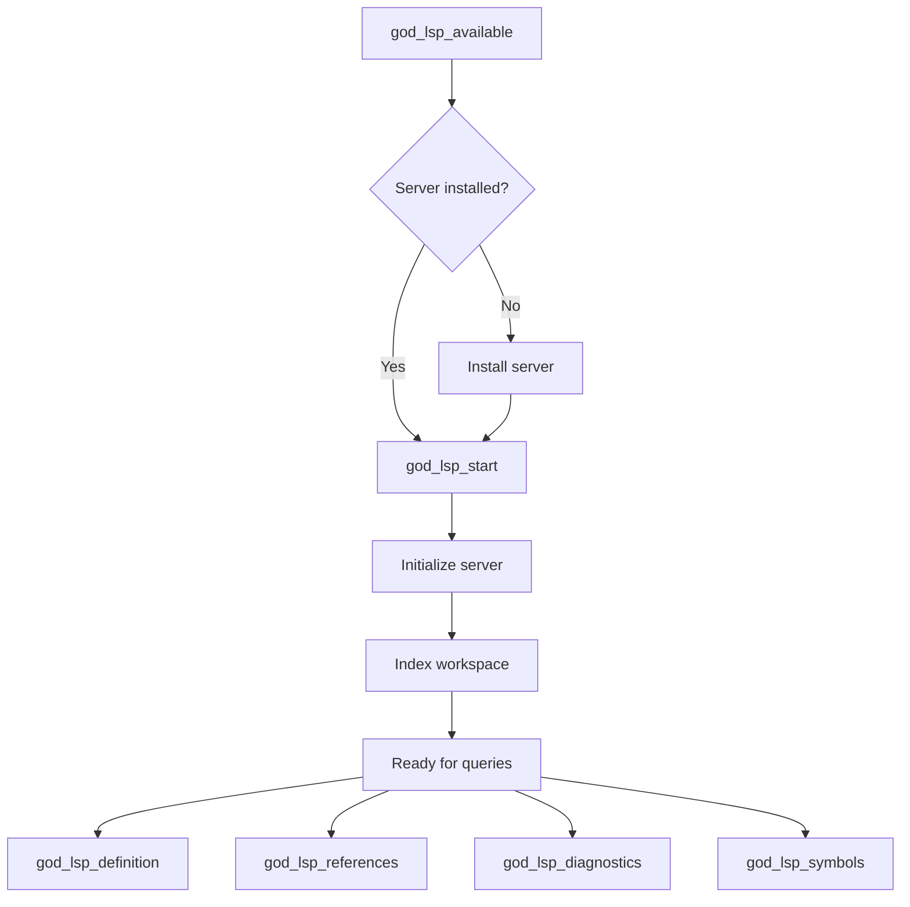

# LSP Manager

Language Server Protocol integration for code intelligence.

## Location

`src/capabilities/lsp/LSPManager.ts`

## Purpose

Provides IDE-like code intelligence:

- Go-to-definition
- Find references
- Diagnostics (errors/warnings)
- Symbol search
- Server availability checking

## Supported Languages (10)

| Language | Server | Install Command |
|----------|--------|-----------------|
| TypeScript | `typescript-language-server` | `npm i -g typescript-language-server typescript` |
| JavaScript | `typescript-language-server` | (same as TypeScript) |
| PHP | `intelephense` | `npm i -g intelephense` |
| CSS/SCSS/Less | `vscode-css-language-server` | `npm i -g vscode-langservers-extracted` |
| HTML | `vscode-html-language-server` | `npm i -g vscode-langservers-extracted` |
| SQL | `sql-language-server` | `npm i -g sql-language-server` |
| Java | `jdtls` | Download from Eclipse |
| Python | `pyright` | `npm i -g pyright` |
| Go | `gopls` | `go install golang.org/x/tools/gopls@latest` |
| Rust | `rust-analyzer` | `rustup component add rust-analyzer` |

## MCP Tools

| Tool | Purpose |
|------|---------|
| `god_lsp_start` | Start language server |
| `god_lsp_stop` | Stop language server |
| `god_lsp_available` | Check which servers are installed |
| `god_lsp_definition` | Go to definition |
| `god_lsp_references` | Find all references |
| `god_lsp_diagnostics` | Get errors/warnings |
| `god_lsp_symbols` | Search symbols |

## Usage Flow



## Example: Check Availability

```typescript
const result = await god_lsp_available();

// Result:
{
  summary: { available: 3, unavailable: 7, total: 10 },
  servers: [
    { language: "typescript", name: "TypeScript Language Server", available: true },
    { language: "javascript", name: "JavaScript Language Server", available: true },
    { language: "php", name: "Intelephense", available: false,
      installInstructions: "npm: npm install -g intelephense" },
    // ... more languages
  ]
}
```

## Example: Go to Definition

```typescript
const result = await god_lsp_definition({
  file: "src/index.ts",
  line: 42,
  column: 15
});

// Result:
{
  file: "src/utils/helper.ts",
  line: 10,
  column: 1,
  preview: "export function helper() {"
}
```

## Example: Find References

```typescript
const refs = await god_lsp_references({
  file: "src/utils/helper.ts",
  line: 10,
  column: 17,
  includeDeclaration: true
});

// Result:
{
  references: [
    { file: "src/utils/helper.ts", line: 10, column: 17 },
    { file: "src/index.ts", line: 42, column: 15 },
    { file: "src/api/handler.ts", line: 28, column: 8 }
  ],
  count: 3
}
```

## Diagnostics

```typescript
const diag = await god_lsp_diagnostics({
  file: "src/index.ts"
});

// Result:
{
  errors: [
    { line: 15, message: "Type 'string' is not assignable to type 'number'" }
  ],
  warnings: [
    { line: 42, message: "Unused variable 'temp'" }
  ]
}
```

## Registry Architecture

Language server configurations are centralized in `src/capabilities/lsp/registry.ts`:

```typescript
import { getSupportedLanguages, getLanguageEntry } from './registry.js';

// Get all supported languages
const languages = getSupportedLanguages();
// ['typescript', 'javascript', 'php', 'css', 'html', 'sql', 'java', 'python', 'go', 'rust']

// Get config for a specific language
const phpConfig = getLanguageEntry('php');
// { name: 'Intelephense', command: 'intelephense', ... }
```

## Related

- [Capability Tools](../tools/capability-tools.md)
- [Capabilities Overview](index.md)
- [AST Manager](ast-manager.md)
