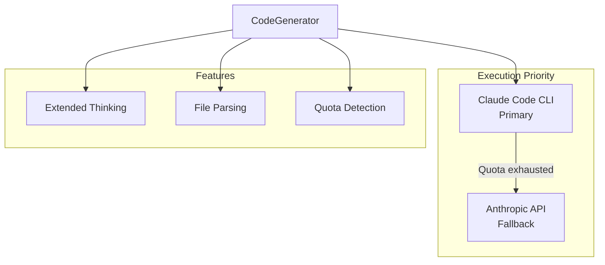
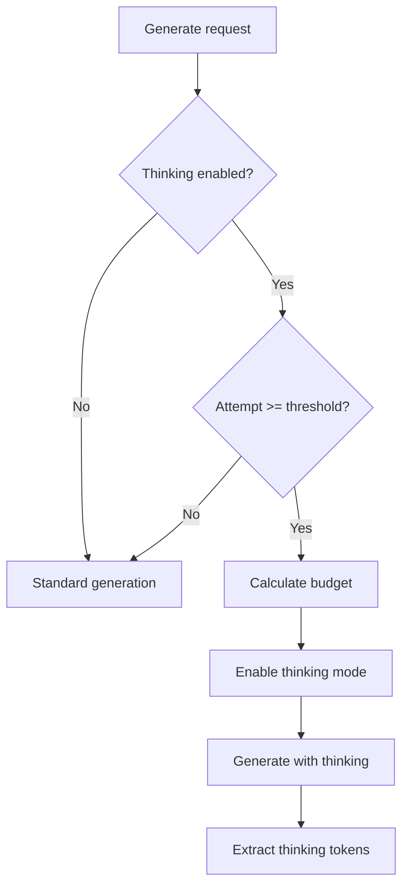

# CodeGenerator

**File:** `src/codex/CodeGenerator.ts` (~500 lines)

The CodeGenerator handles code generation using Claude Code CLI with API fallback.

## Overview



## Class Structure

```typescript
class CodeGenerator {
  private config: CodeGeneratorConfig;
  private claudeCodeExecutor: ClaudeCodeExecutor;
  private anthropicClient: Anthropic;
  private currentExecution: AbortController | null;
}
```

## Constructor

```typescript
const generator = new CodeGenerator({
  codebaseRoot: '/path/to/project',
  model: 'claude-opus-4-5-20251101',
  maxTokens: 8192,
  extendedThinking: {
    enabled: true,
    baseBudget: 5000,
    budgetIncrement: 5000,
    maxBudget: 16000,
    enableOnAttempt: 2
  },
  cliModel: 'opus',
  cliTimeout: 300000  // 5 minutes
});
```

## Main Method: generate()

```typescript
interface GenerateInput {
  subtask: Subtask;
  context: ExecutionContext;
  attempt: number;
  thinkingBudget: number;
  previousAttempts: PreviousAttempt[];
}

interface GenerateResult {
  success: boolean;
  files: GeneratedFile[];
  tokensUsed: number;
  thinkingTokens: number;
  executionMode: 'cli' | 'api';
  error?: string;
}

const result = await generator.generate({
  subtask: {
    type: 'code',
    description: 'Implement user login function'
  },
  context: {
    codebase: '/project',
    relevantFiles: ['src/auth/index.ts'],
    patterns: ['async/await', 'error handling']
  },
  attempt: 2,
  thinkingBudget: 10000,
  previousAttempts: []
});
```

## Execution Priority

### 1. Claude Code CLI (Primary)

Uses the Claude Code CLI with max subscription for Opus:

```typescript
private async executeViaCli(input: GenerateInput): Promise<GenerateResult> {
  const prompt = this.buildPrompt(input);

  try {
    const output = await this.claudeCodeExecutor.execute({
      prompt,
      cwd: this.config.codebaseRoot,
      model: this.config.cliModel,
      timeout: this.config.cliTimeout,
      thinkingBudget: input.thinkingBudget
    });

    // Parse files from output
    const files = this.parseFiles(output);

    return {
      success: true,
      files,
      tokensUsed: output.tokensUsed,
      thinkingTokens: output.thinkingTokens,
      executionMode: 'cli'
    };

  } catch (error) {
    if (this.isQuotaExhausted(error)) {
      // Fall back to API
      return this.executeViaApi(input);
    }
    throw error;
  }
}
```

### 2. Anthropic API (Fallback)

Falls back to direct API when CLI quota is exhausted:

```typescript
private async executeViaApi(input: GenerateInput): Promise<GenerateResult> {
  const prompt = this.buildPrompt(input);

  const response = await this.anthropicClient.messages.create({
    model: this.config.model,
    max_tokens: this.config.maxTokens,
    messages: [{ role: 'user', content: prompt }],
    ...(input.thinkingBudget > 0 && {
      thinking: {
        type: 'enabled',
        budget_tokens: input.thinkingBudget
      }
    })
  });

  const content = response.content
    .filter(c => c.type === 'text')
    .map(c => c.text)
    .join('');

  const files = this.parseFiles(content);

  return {
    success: true,
    files,
    tokensUsed: response.usage.output_tokens,
    thinkingTokens: response.usage.thinking_tokens || 0,
    executionMode: 'api'
  };
}
```

## Prompt Building

```typescript
private buildPrompt(input: GenerateInput): string {
  const { subtask, context, attempt, previousAttempts } = input;

  let prompt = `## Task
${subtask.description}

## Context
Codebase: ${context.codebase}
Relevant files: ${context.relevantFiles.join(', ')}
Patterns to follow: ${context.patterns.join(', ')}

## Instructions
Generate the code for this task. Use the following format for each file:

<file path="relative/path/to/file.ts" action="create|modify">
// file contents here
</file>
`;

  // Add previous attempts for learning
  if (previousAttempts.length > 0) {
    prompt += `\n## Previous Attempts\n`;
    for (const attempt of previousAttempts) {
      prompt += `Attempt ${attempt.attempt}: ${attempt.approach}\n`;
      prompt += `Error: ${attempt.error}\n\n`;
    }
    prompt += `Avoid the approaches that failed. Try a different strategy.\n`;
  }

  // Add constraints
  if (context.constraints?.length > 0) {
    prompt += `\n## Constraints\n`;
    for (const constraint of context.constraints) {
      prompt += `- ${constraint}\n`;
    }
  }

  return prompt;
}
```

## File Parsing

Parse `<file>` tags from output:

```typescript
private parseFiles(output: string): GeneratedFile[] {
  const fileRegex = /<file\s+path="([^"]+)"\s+action="(create|modify)"[^>]*>([\s\S]*?)<\/file>/g;
  const files: GeneratedFile[] = [];

  let match;
  while ((match = fileRegex.exec(output)) !== null) {
    files.push({
      path: match[1],
      action: match[2] as 'create' | 'modify',
      content: match[3].trim(),
      language: this.detectLanguage(match[1])
    });
  }

  return files;
}

private detectLanguage(path: string): string {
  const ext = path.split('.').pop();
  const langMap: Record<string, string> = {
    ts: 'typescript',
    tsx: 'typescript',
    js: 'javascript',
    jsx: 'javascript',
    py: 'python',
    rb: 'ruby',
    go: 'go',
    rs: 'rust'
  };
  return langMap[ext || ''] || 'text';
}
```

## File Application

Apply generated files to the codebase:

```typescript
async applyFiles(files: GeneratedFile[]): Promise<ApplyResult> {
  const results: FileResult[] = [];

  for (const file of files) {
    const fullPath = path.join(this.config.codebaseRoot, file.path);

    try {
      if (file.action === 'create') {
        // Ensure directory exists
        await fs.mkdir(path.dirname(fullPath), { recursive: true });
        await fs.writeFile(fullPath, file.content);
      } else {
        // Modify existing file
        await fs.writeFile(fullPath, file.content);
      }

      results.push({
        path: file.path,
        action: file.action,
        success: true
      });
    } catch (error) {
      results.push({
        path: file.path,
        action: file.action,
        success: false,
        error: error.message
      });
    }
  }

  return {
    success: results.every(r => r.success),
    results
  };
}
```

## Quota Detection

```typescript
private isQuotaExhausted(error: Error): boolean {
  const message = error.message.toLowerCase();
  return (
    message.includes('quota') ||
    message.includes('rate limit') ||
    message.includes('exceeded') ||
    message.includes('429')
  );
}

private isModelDowngrade(output: string): boolean {
  // Detect if CLI switched from Opus to Sonnet
  return output.includes('Model: sonnet') &&
         this.config.cliModel === 'opus';
}
```

## Abort

```typescript
abort(): void {
  if (this.currentExecution) {
    this.currentExecution.abort();
    this.currentExecution = null;
  }
}
```

## Extended Thinking



### Thinking Budget Progression

| Attempt | Budget | Notes |
|---------|--------|-------|
| 1 | 0 | No thinking |
| 2 | 5,000 | Base budget |
| 3 | 10,000 | +5,000 |
| 4 | 15,000 | +5,000 |
| 5 | 16,000 | Max budget |

## Configuration

| Option | Type | Default | Description |
|--------|------|---------|-------------|
| `codebaseRoot` | string | required | Project root |
| `model` | string | `claude-opus-4-5-20251101` | API model |
| `maxTokens` | number | `8192` | Max output tokens |
| `cliModel` | 'opus' \| 'sonnet' \| 'haiku' | `opus` | CLI model |
| `cliTimeout` | number | `300000` | CLI timeout (ms) |
| `extendedThinking.enabled` | boolean | `true` | Enable thinking |
| `extendedThinking.baseBudget` | number | `5000` | Initial budget |
| `extendedThinking.budgetIncrement` | number | `5000` | Per-retry |
| `extendedThinking.maxBudget` | number | `16000` | Maximum |
| `extendedThinking.enableOnAttempt` | number | `2` | Start attempt |

## Error Handling

```typescript
try {
  const result = await generator.generate(input);
} catch (error) {
  if (error.name === 'AbortError') {
    // Generation was cancelled
  } else if (error.message.includes('timeout')) {
    // CLI timeout exceeded
  } else if (error.message.includes('quota')) {
    // Both CLI and API quota exhausted
  } else {
    // Unknown error
  }
}
```

## Next Steps

- [TaskExecutor](task-executor.md) - Main orchestrator
- [SelfHealer](self-healer.md) - Failure analysis
- [ClaudeCodeExecutor](#) - CLI executor details
