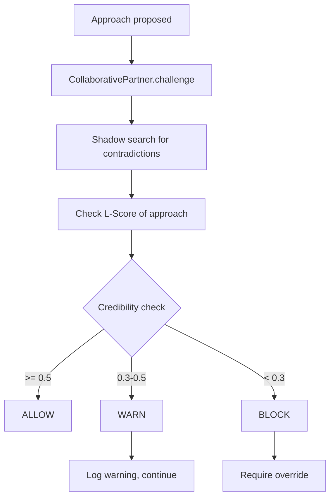

# CollaborativePartner

Proactive curiosity system that challenges decisions and validates approaches.

## Location

`src/codex/CollaborativePartner.ts`

## Purpose

The Collaborative Partner provides a "second opinion" on approaches before execution:

1. **Proactive Curiosity** - Asks questions before executing
2. **Challenge Decisions** - Uses shadow search to find contradictions
3. **Confidence Gates** - L-Score thresholds for warn/block
4. **Hard Gates** - Requires override for risky decisions

## Challenge Flow



## Configuration

```typescript
interface PartnerConfig {
  enabled: boolean;
  behaviors: {
    proactiveCuriosity: boolean;    // Ask questions
    challengeDecisions: boolean;     // Use shadow search
    hardGateHighRisk: boolean;       // Require override
  };
  thresholds: {
    credibilityWarnGate: number;     // Default: 0.5
    credibilityHardGate: number;     // Default: 0.3
    lScoreWarnGate: number;          // Default: 0.5
    lScoreHardGate: number;          // Default: 0.2
  };
}
```

## Challenge Result

```typescript
interface ChallengeResult {
  allowed: boolean;
  credibility: number;
  concerns: string[];
  contradictions: Array<{
    content: string;
    refutationStrength: number;
  }>;
  recommendation: 'proceed' | 'reconsider' | 'blocked';
}
```

## MCP Tools

| Tool | Purpose |
|------|---------|
| `god_partner_config` | Configure behavior/thresholds |
| `god_partner_challenge` | Manually trigger challenge |
| `god_partner_status` | Get current status |

## Example Challenge

```typescript
const result = await partner.challenge({
  approach: "Store user passwords in localStorage",
  taskDescription: "Add remember me feature"
});

// Result:
{
  allowed: false,
  credibility: 0.15,
  concerns: [
    "localStorage is accessible to XSS attacks",
    "Passwords should never be stored client-side"
  ],
  contradictions: [
    { content: "OWASP: Never store credentials in browser storage", refutationStrength: 0.95 }
  ],
  recommendation: "blocked"
}
```

## Related

- [EscalationGate](escalation-gate.md) - Human escalation
- [Partner Tools](../tools/partner-tools.md) - MCP tools
- [Shadow Search](../tools/causal-tools.md) - Contradiction finding
