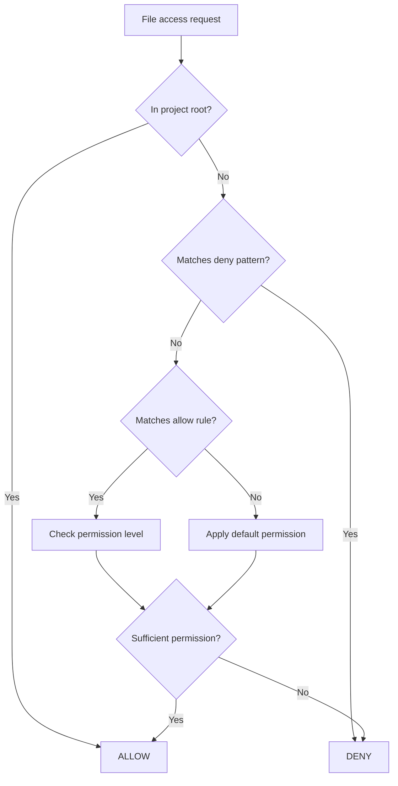

# ContainmentManager

Path-based permission system for file access control.

## Location

`src/codex/ContainmentManager.ts`

## Purpose

Controls which paths RUBIX can read/write during task execution:

- **Project root** - Always allowed (read-write)
- **Dangerous paths** - Always denied (secrets, keys)
- **Other paths** - Configurable rules

## Permission Levels

| Level | Read | Write | Example |
|-------|------|-------|---------|
| `deny` | No | No | `.env`, credentials |
| `read` | Yes | No | `/etc/`, system configs |
| `write` | No | Yes | (rarely used) |
| `read-write` | Yes | Yes | Project folder |

## Built-in Security Rules

These paths are **always denied**:

```
**/.env*           # Environment files
**/credentials*    # Credential files
**/*.key           # Private keys
**/*.pem           # Certificates
**/secrets*        # Secret files
**/.ssh/**         # SSH keys
**/.aws/**         # AWS credentials
**/.gcp/**         # GCP credentials
```

## Check Flow



## Configuration

```typescript
interface ContainmentConfig {
  enabled: boolean;
  projectRoot: string;           // Always allowed
  defaultPermission: Permission; // For unmatched paths
}

interface PathRule {
  pattern: string;      // Glob pattern
  permission: Permission;
  priority: number;     // Higher = checked first
  reason?: string;      // Human-readable reason
}
```

## MCP Tools

| Tool | Purpose |
|------|---------|
| `god_containment_check` | Check if path is allowed |
| `god_containment_config` | Configure containment |
| `god_containment_add_rule` | Add permission rule |
| `god_containment_remove_rule` | Remove rule |
| `god_containment_status` | Get current status |
| `god_containment_session` | Temporary session access |

## Session Permissions

Temporary access that expires on server restart:

```typescript
// Grant temporary read access to D: drive
await god_containment_session({
  action: "add",
  pattern: "D:/**",
  permission: "read",
  reason: "Search for project files"
});
```

## Example

```typescript
// Check if file can be written
const result = await containment.check({
  path: "/etc/hosts",
  operation: "write"
});

// Result:
{
  allowed: false,
  reason: "Path outside project root, default permission is 'deny'"
}
```

## Related

- [Containment Tools](../tools/containment-tools.md) - MCP tools
- [TaskExecutor](task-executor.md) - Uses containment
