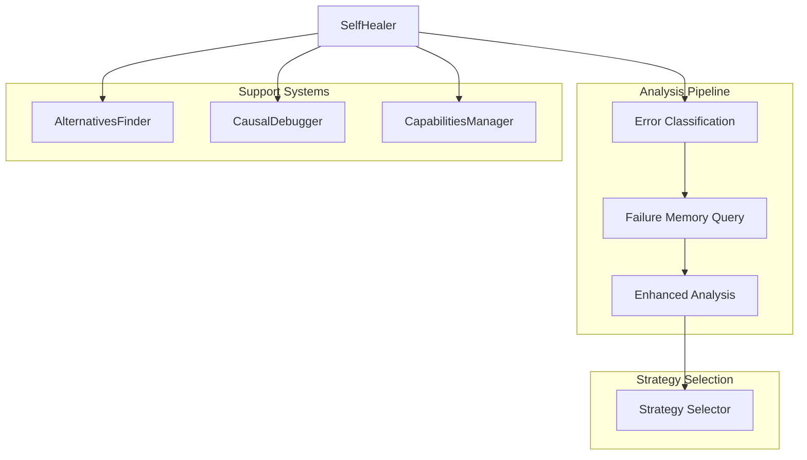

# SelfHealer

**File:** `src/codex/SelfHealer.ts` (~300 lines)

The SelfHealer analyzes failures and suggests recovery strategies for the TaskExecutor.

## Overview



## Class Structure

```typescript
class SelfHealer {
  private memoryEngine: MemoryEngine;
  private failureMemory: FailureMemoryService;
  private alternatives: AlternativesFinder;
  private causalDebugger: CausalDebugger;
  private capabilities: CapabilitiesManager;
}
```

## Main Method: analyze()

```typescript
interface AnalyzeInput {
  subtask: Subtask;
  error: Error;
  attempt: number;
  context: ExecutionContext;
  previousAttempts: PreviousAttempt[];
}

interface HealingAnalysis {
  isFundamentalBlocker: boolean;
  reason: string;
  newApproach: string;
  needsMoreContext: boolean;
  contextNeeded: string[];
  suggestedActions: string[];
  similarFailures: SimilarFailure[];
  errorType: ErrorType;
  isTransient: boolean;
}

const analysis = await healer.analyze({
  subtask,
  error,
  attempt: 3,
  context,
  previousAttempts
});
```

## Analysis Pipeline

### 1. Error Classification

```typescript
private classifyError(error: Error): ErrorClassification {
  const message = error.message.toLowerCase();
  const stack = error.stack || '';

  // Syntax errors
  if (message.includes('syntax') || message.includes('parse')) {
    return {
      type: 'syntax',
      isTransient: false,
      suggestedStrategy: 'simplify_approach'
    };
  }

  // Type errors
  if (message.includes('type') || message.includes('typescript')) {
    return {
      type: 'type',
      isTransient: false,
      suggestedStrategy: 'retry_with_context'
    };
  }

  // Runtime errors
  if (message.includes('runtime') || message.includes('undefined')) {
    return {
      type: 'runtime',
      isTransient: false,
      suggestedStrategy: 'try_alternative'
    };
  }

  // Test failures
  if (message.includes('test') || message.includes('assert')) {
    return {
      type: 'test',
      isTransient: false,
      suggestedStrategy: 'retry_with_context'
    };
  }

  // Integration errors
  if (message.includes('connect') || message.includes('network')) {
    return {
      type: 'integration',
      isTransient: true,
      suggestedStrategy: 'retry_with_context'
    };
  }

  // Timeout errors
  if (message.includes('timeout') || message.includes('timed out')) {
    return {
      type: 'timeout',
      isTransient: true,
      suggestedStrategy: 'simplify_approach'
    };
  }

  // Unknown
  return {
    type: 'unknown',
    isTransient: false,
    suggestedStrategy: 'gather_more_context'
  };
}
```

### 2. Failure Memory Query

```typescript
private async querySimilarFailures(
  error: Error,
  context: ExecutionContext
): Promise<SimilarFailure[]> {
  const failures = await this.failureMemory.query({
    error: error.message,
    context: context.description,
    topK: 10,
    minScore: 0.5
  });

  return failures.map(f => ({
    id: f.id,
    error: f.error,
    approach: f.approach,
    resolution: f.resolution,
    similarity: f.similarity,
    succeeded: f.succeeded
  }));
}
```

### 3. Enhanced Analysis

```typescript
private async enhancedAnalysis(
  error: Error,
  context: ExecutionContext
): Promise<EnhancedAnalysis> {
  const results: EnhancedAnalysis = {
    stackFrames: [],
    relevantCode: [],
    gitHistory: [],
    diagnostics: []
  };

  // Parse stack trace
  if (error.stack) {
    const frames = await this.capabilities.parseStackTrace(error.stack);
    results.stackFrames = frames;

    // Get code context for each frame
    for (const frame of frames.slice(0, 3)) {
      const code = await this.capabilities.getStackContext(
        frame.file,
        frame.line,
        5  // lines of context
      );
      results.relevantCode.push(code);
    }
  }

  // Check git history for relevant changes
  const history = await this.capabilities.getGitHistory({
    path: context.relevantFiles[0],
    limit: 5
  });
  results.gitHistory = history;

  // Run TypeScript diagnostics
  const diagnostics = await this.capabilities.getDiagnostics(
    context.relevantFiles
  );
  results.diagnostics = diagnostics;

  return results;
}
```

## Strategy Selection

### Available Strategies

| Strategy | When Used | Description |
|----------|-----------|-------------|
| `retry_with_context` | Type/test errors | Retry with more context |
| `simplify_approach` | Complex failures | Try simpler approach |
| `try_alternative` | Repeated failures | Use different approach |
| `gather_more_context` | Unknown errors | Gather more information |
| `break_into_smaller_steps` | Large tasks | Decompose further |
| `escalate` | Fundamental blockers | Ask user |

### Strategy Selection Logic

```typescript
private selectStrategy(
  classification: ErrorClassification,
  similarFailures: SimilarFailure[],
  attempt: number
): HealingStrategy {
  // If we have successful similar failures, use their approach
  const successfulFix = similarFailures.find(f => f.succeeded);
  if (successfulFix) {
    return {
      strategy: 'try_alternative',
      approach: successfulFix.resolution,
      reason: `Similar failure was resolved with: ${successfulFix.resolution}`
    };
  }

  // Avoid approaches that failed before
  const failedApproaches = similarFailures
    .filter(f => !f.succeeded)
    .map(f => f.approach);

  // Progressive strategy escalation
  if (attempt >= 4) {
    return {
      strategy: 'escalate',
      reason: 'Multiple approaches failed, need human input'
    };
  }

  if (attempt >= 3) {
    return {
      strategy: 'break_into_smaller_steps',
      reason: 'Task may be too complex'
    };
  }

  // Use classification suggestion
  return {
    strategy: classification.suggestedStrategy,
    avoidApproaches: failedApproaches,
    reason: `Error type ${classification.type} suggests ${classification.suggestedStrategy}`
  };
}
```

## Fundamental Blocker Detection

```typescript
private isFundamentalBlocker(
  classification: ErrorClassification,
  analysis: EnhancedAnalysis,
  attempt: number
): boolean {
  // Missing dependencies that can't be auto-installed
  if (classification.type === 'integration' &&
      analysis.diagnostics.some(d => d.includes('module not found'))) {
    return true;
  }

  // Permissions issues
  if (analysis.relevantCode.some(c => c.includes('EACCES'))) {
    return true;
  }

  // Authentication required
  if (analysis.diagnostics.some(d =>
    d.includes('authentication') || d.includes('unauthorized')
  )) {
    return true;
  }

  // Too many attempts with same error pattern
  if (attempt >= 4) {
    return true;
  }

  return false;
}
```

## Building the Analysis Result

```typescript
async analyze(input: AnalyzeInput): Promise<HealingAnalysis> {
  const { subtask, error, attempt, context, previousAttempts } = input;

  // 1. Classify error
  const classification = this.classifyError(error);

  // 2. Query similar failures
  const similarFailures = await this.querySimilarFailures(error, context);

  // 3. Enhanced analysis
  const enhanced = await this.enhancedAnalysis(error, context);

  // 4. Select strategy
  const strategy = this.selectStrategy(classification, similarFailures, attempt);

  // 5. Check for fundamental blocker
  const isBlocker = this.isFundamentalBlocker(classification, enhanced, attempt);

  // 6. Build new approach
  const newApproach = await this.alternatives.buildApproach({
    subtask,
    strategy,
    previousAttempts,
    similarFailures,
    enhanced
  });

  return {
    isFundamentalBlocker: isBlocker,
    reason: strategy.reason,
    newApproach,
    needsMoreContext: strategy.strategy === 'gather_more_context',
    contextNeeded: this.identifyNeededContext(enhanced),
    suggestedActions: this.buildSuggestedActions(strategy, enhanced),
    similarFailures,
    errorType: classification.type,
    isTransient: classification.isTransient
  };
}
```

## Integration with FailureMemoryService

```typescript
// Record failure for future learning
await this.failureMemory.record({
  taskId: context.taskId,
  subtaskId: subtask.id,
  error: error.message,
  errorType: classification.type,
  approach: context.currentApproach,
  context: context.description,
  stackTrace: error.stack,
  attemptNumber: attempt
});

// Later, when resolved
await this.failureMemory.resolve(failureId, {
  resolution: 'Used async/await pattern',
  approach: newApproach
});
```

## Causal Debugging

```typescript
private async causalAnalysis(
  error: Error,
  context: ExecutionContext
): Promise<CausalAnalysis> {
  // Find what might have caused this error
  const causes = await this.causalDebugger.findCauses({
    symptom: error.message,
    files: context.relevantFiles,
    recentChanges: await this.capabilities.getGitDiff()
  });

  return {
    probableCauses: causes,
    suggestedFixes: causes.map(c => c.suggestedFix)
  };
}
```

## Next Steps

- [TaskExecutor](task-executor.md) - Main orchestrator
- [EscalationGate](escalation-gate.md) - Escalation logic
- [AlternativesFinder](#) - Finding alternatives
