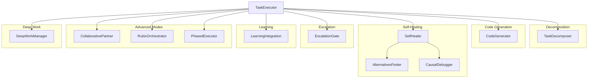
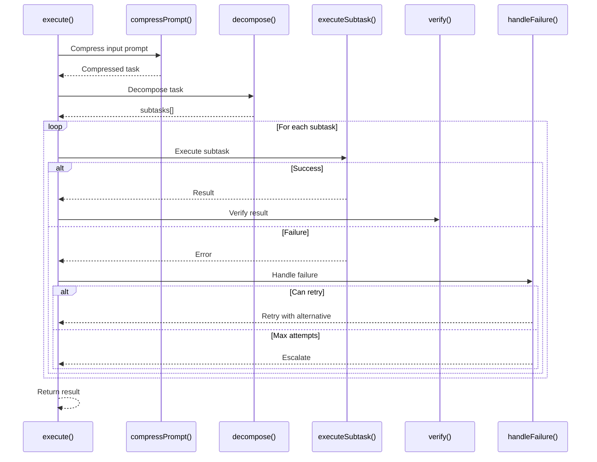

# TaskExecutor

**File:** `src/codex/TaskExecutor.ts` (~1800 lines)

The TaskExecutor is the main RUBIX orchestrator that coordinates all autonomous development execution.

## Overview



## Class Structure

```typescript
class TaskExecutor {
  // Configuration
  private config: TaskExecutorConfig;
  private codebaseRoot: string;

  // Core components
  private decomposer: TaskDecomposer;
  private codeGenerator: CodeGenerator;
  private healer: SelfHealer;
  private escalation: EscalationGate;
  private alternatives: AlternativesFinder;
  private causalDebugger: CausalDebugger;

  // Learning
  private learning: LearningIntegration;
  private workingMemory: WorkingMemoryManager;

  // Advanced modes
  private collaborativePartner: CollaborativePartner;
  private rubixOrchestrator: RubixOrchestrator;
  private phasedExecutor: PhasedExecutor;

  // Deep work
  private deepWork: DeepWorkManager;

  // State
  private currentTask: Task | null;
  private status: TaskStatus;
}
```

## Constructor

```typescript
const executor = new TaskExecutor({
  codebaseRoot: '/path/to/project',
  model: 'claude-opus-4-5-20251101',
  maxTokens: 8192,
  maxAttempts: 5,
  maxParallel: 5,
  failFast: true,
  extendedThinking: {
    enabled: true,
    baseBudget: 5000,
    budgetIncrement: 5000,
    maxBudget: 16000,
    enableOnAttempt: 2
  },
  memoryEngine: engine,
  communicationManager: comms
});
```

## Main Method: execute()

Execute a task autonomously:

```typescript
interface ExecuteInput {
  description: string;
  codebase: string;
  specification?: string;
  constraints?: string[];
  verificationUrl?: string;
  dryRun?: boolean;
}

interface ExecuteResult {
  success: boolean;
  taskId: string;
  status: TaskStatus;
  subtasksCompleted: number;
  subtasksTotal: number;
  artifacts: Artifact[];
  errors: TaskError[];
  duration: number;
}

const result = await executor.execute({
  description: "Add user authentication with JWT",
  codebase: "D:/my-project",
  constraints: ["Use TypeScript", "Add unit tests"],
  verificationUrl: "http://localhost:3000"
});
```

## Execution Flow



## Task Decomposition

Uses TaskDecomposer to break tasks into subtasks:

```typescript
const decomposed = await this.decomposer.decompose({
  task: task.description,
  codebaseContext: await this.gatherContext(),
  constraints: task.constraints
});

// Returns:
// {
//   subtasks: [
//     { type: 'research', description: '...' },
//     { type: 'design', description: '...' },
//     { type: 'code', description: '...' },
//     { type: 'test', description: '...' }
//   ],
//   estimatedComplexity: 'medium',
//   ambiguities: [...],
//   needsClarification: false
// }
```

## Subtask Execution

Execute individual subtasks:

```typescript
private async executeSubtask(
  subtask: Subtask,
  context: ExecutionContext
): Promise<SubtaskResult> {
  for (let attempt = 1; attempt <= this.maxAttempts; attempt++) {
    try {
      // Determine thinking budget
      const thinkingBudget = this.calculateThinkingBudget(attempt);

      // Generate code/result
      const result = await this.codeGenerator.generate({
        subtask,
        context,
        attempt,
        thinkingBudget,
        previousAttempts: context.previousAttempts
      });

      // Verify result
      const verified = await this.verify(result, subtask);

      if (verified.success) {
        // Store success for learning
        await this.learning.recordSuccess(subtask, result);
        return { success: true, result };
      }

      // Verification failed - treat as failure
      throw new Error(verified.error);

    } catch (error) {
      // Handle failure
      const recovery = await this.handleFailure(
        subtask, error, attempt, context
      );

      if (recovery.shouldRetry) {
        context.previousAttempts.push({
          attempt,
          error,
          approach: context.currentApproach
        });
        context.currentApproach = recovery.newApproach;
        continue;
      }

      // Cannot recover - escalate or fail
      return { success: false, error };
    }
  }
}
```

## Thinking Budget Calculation

Extended thinking budget scales with attempt number:

```typescript
private calculateThinkingBudget(attempt: number): number {
  if (!this.config.extendedThinking.enabled) return 0;
  if (attempt < this.config.extendedThinking.enableOnAttempt) return 0;

  const increment = this.config.extendedThinking.budgetIncrement;
  const base = this.config.extendedThinking.baseBudget;
  const max = this.config.extendedThinking.maxBudget;

  const budget = base + (increment * (attempt - 2));
  return Math.min(budget, max);
}

// Example progression:
// Attempt 1: 0 tokens (no thinking)
// Attempt 2: 5000 tokens
// Attempt 3: 10000 tokens
// Attempt 4: 15000 tokens
// Attempt 5: 16000 tokens (max)
```

## Failure Handling

```typescript
private async handleFailure(
  subtask: Subtask,
  error: Error,
  attempt: number,
  context: ExecutionContext
): Promise<RecoveryDecision> {
  // Analyze failure
  const analysis = await this.healer.analyze({
    subtask,
    error,
    attempt,
    context,
    previousAttempts: context.previousAttempts
  });

  // Check if escalation needed
  if (analysis.isFundamentalBlocker) {
    const decision = await this.escalation.shouldEscalate({
      subtask,
      error,
      analysis,
      attempt
    });

    if (decision.mustEscalate) {
      await this.escalate(subtask, error, decision);
      return { shouldRetry: false };
    }
  }

  // Find alternative approach
  const alternative = await this.alternatives.find({
    subtask,
    error,
    previousApproaches: context.previousAttempts.map(a => a.approach),
    analysis
  });

  if (alternative) {
    return {
      shouldRetry: true,
      newApproach: alternative
    };
  }

  return { shouldRetry: false };
}
```

## Verification

Verify subtask results:

```typescript
private async verify(
  result: CodeGenResult,
  subtask: Subtask
): Promise<VerificationResult> {
  // Type check
  if (result.files.some(f => f.language === 'typescript')) {
    const typeCheck = await this.capabilities.runTypeCheck();
    if (typeCheck.errors.length > 0) {
      return { success: false, error: 'Type errors', details: typeCheck };
    }
  }

  // Lint check
  const lintResult = await this.capabilities.runLint();
  if (lintResult.errors.length > 0) {
    return { success: false, error: 'Lint errors', details: lintResult };
  }

  // Test check (if test subtask)
  if (subtask.type === 'test') {
    const testResult = await this.runTests();
    if (!testResult.passed) {
      return { success: false, error: 'Tests failed', details: testResult };
    }
  }

  // Browser verification (if URL provided)
  if (subtask.verificationUrl) {
    const pwResult = await this.playwrightVerify(subtask);
    if (!pwResult.success) {
      return { success: false, error: 'Visual verification failed', details: pwResult };
    }
  }

  return { success: true };
}
```

## Status Management

```typescript
getStatus(): TaskStatus {
  return {
    taskId: this.currentTask?.id,
    status: this.status,
    currentSubtask: this.currentSubtask,
    progress: {
      completed: this.completedSubtasks.length,
      total: this.totalSubtasks.length,
      percentage: (this.completedSubtasks.length / this.totalSubtasks.length) * 100
    },
    errors: this.errors,
    pendingDecisions: this.pendingDecisions,
    activeTime: Date.now() - this.startTime
  };
}
```

## Cancellation

```typescript
async cancel(): Promise<void> {
  if (!this.currentTask) return;

  this.status = 'cancelled';

  // Stop code generator
  await this.codeGenerator.abort();

  // Notify
  await this.notifyCancel();

  // Cleanup
  this.currentTask = null;
}
```

## Advanced Modes

### Enable RUBIX Mode

```typescript
executor.enableRubixMode({
  model: 'claude-sonnet-4-20250514',
  maxSubAgentsPerDepartment: 5,
  departments: ['researcher', 'architect', 'engineer', 'validator', 'guardian']
});
```

### Enable Collaborative Partner

```typescript
executor.enableCollaborativePartner({
  proactiveCuriosity: true,
  challengeDecisions: true,
  hardGateHighRisk: true
});
```

### Use Phased Execution

```typescript
const result = await executor.executePhased(task);
```

## Work Log

```typescript
getWorkLog(): WorkLogEntry[] {
  return this.workLog.map(entry => ({
    timestamp: entry.timestamp,
    event: entry.event,
    details: entry.details,
    subtaskId: entry.subtaskId
  }));
}
```

## Events

```typescript
executor.on('task:start', (task) => console.log('Started:', task.id));
executor.on('subtask:complete', (subtask) => console.log('Done:', subtask.type));
executor.on('subtask:fail', (subtask, error) => console.log('Failed:', error));
executor.on('escalation', (decision) => console.log('Escalating:', decision));
executor.on('task:complete', (result) => console.log('Complete:', result));
```

## Configuration

| Option | Type | Default | Description |
|--------|------|---------|-------------|
| `codebaseRoot` | string | required | Project root path |
| `model` | string | `claude-opus-4-5-20251101` | Claude model |
| `maxTokens` | number | `8192` | Max tokens per generation |
| `maxAttempts` | number | `5` | Max retry attempts |
| `maxParallel` | number | `5` | Parallel subtasks |
| `failFast` | boolean | `true` | Stop on first failure |
| `extendedThinking.enabled` | boolean | `true` | Enable thinking |
| `extendedThinking.baseBudget` | number | `5000` | Initial budget |
| `extendedThinking.budgetIncrement` | number | `5000` | Per-retry increment |
| `extendedThinking.maxBudget` | number | `16000` | Maximum budget |

## Next Steps

- [TaskDecomposer](task-decomposer.md) - Task breakdown
- [CodeGenerator](code-generator.md) - Code generation
- [SelfHealer](self-healer.md) - Failure analysis
- [EscalationGate](escalation-gate.md) - Escalation logic
