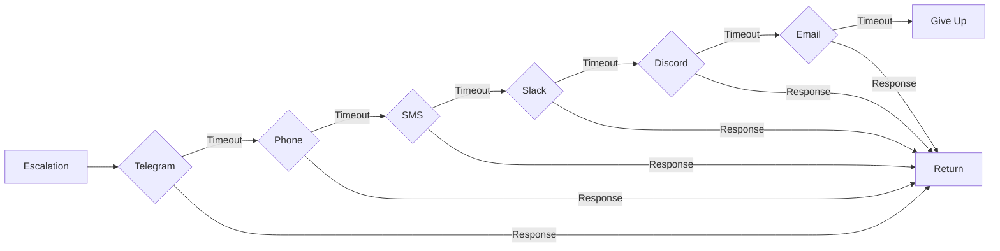
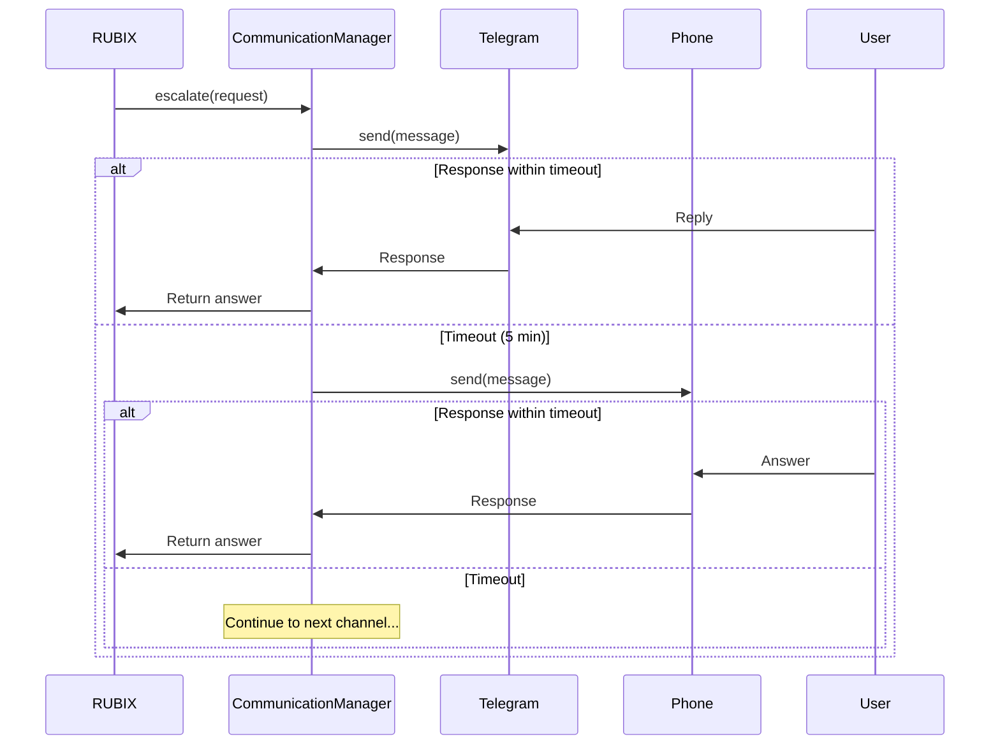

# CommunicationManager

Multi-channel escalation with automatic fallback chain.

## Location

`src/communication/CommunicationManager.ts`

## Purpose

Orchestrates human communication across multiple channels with automatic failover. When RUBIX needs human input, the CommunicationManager tries each channel in order until a response is received.

## Fallback Chain



Default timeout per channel: **5 minutes**

## Channels

| Channel | Provider | Configuration |
|---------|----------|---------------|
| Telegram | Bot API | `telegram.botToken`, `telegram.chatId` |
| Phone | CallMe/Twilio/Telnyx | `phone.provider`, `phone.phoneNumber` |
| SMS | Twilio/Telnyx | `sms.provider`, `sms.phoneNumber` |
| Slack | Webhook | `slack.webhookUrl` |
| Discord | Webhook | `discord.webhookUrl` |
| Email | SMTP | `email.smtp.*` |

## MCP Tools

| Tool | Purpose |
|------|---------|
| `god_comms_setup` | Configure channels |
| `god_comms_escalate` | Trigger escalation manually |

## Configuration

```typescript
interface CommunicationConfig {
  enabled: boolean;
  fallbackOrder: ChannelType[];  // Default: ['telegram', 'phone', 'sms', 'slack', 'discord', 'email']
  timeoutMs: number;             // Default: 300000 (5 min)
  retryAttempts: number;         // Default: 1
  webhookServer: {
    port: number;                // Default: 3456
  };

  // Channel-specific configs
  telegram?: TelegramConfig;
  phone?: PhoneConfig;
  sms?: SMSConfig;
  slack?: SlackConfig;
  discord?: DiscordConfig;
  email?: EmailConfig;
}
```

## Escalation Types

```typescript
type EscalationType =
  | 'clarification'  // Need more information
  | 'decision'       // Choose between options
  | 'blocked'        // Cannot proceed
  | 'approval';      // Irreversible action needs approval
```

## Usage

### Sending an Escalation

```typescript
const manager = new CommunicationManager({
  enabled: true,
  telegram: {
    enabled: true,
    botToken: process.env.TELEGRAM_BOT_TOKEN,
    chatId: process.env.TELEGRAM_CHAT_ID
  }
});

manager.initialize();

const response = await manager.escalate({
  type: 'decision',
  title: 'Choose Authentication Method',
  message: 'The spec mentions auth but doesn\'t specify the method.',
  options: [
    { label: 'JWT', description: 'Stateless tokens' },
    { label: 'Session', description: 'Server-side sessions' },
    { label: 'OAuth', description: 'Third-party providers' }
  ]
});

console.log(`User chose: ${response.answer}`);
```

### Via MCP Tool

```typescript
// Setup Telegram
await god_comms_setup({
  mode: 'set',
  channel: 'telegram',
  config: {
    botToken: '...',
    chatId: '...'
  }
});

// Manual escalation
const response = await god_comms_escalate({
  type: 'clarification',
  title: 'Missing requirement',
  message: 'Should the API support pagination?',
  options: [
    { label: 'Yes', description: 'Add pagination with limit/offset' },
    { label: 'No', description: 'Return all results' }
  ]
});
```

## Escalation Flow



## Channel Configuration Examples

### Telegram

```typescript
{
  telegram: {
    enabled: true,
    botToken: 'bot123456:ABC...',
    chatId: '-1001234567890'
  }
}
```

### Slack

```typescript
{
  slack: {
    enabled: true,
    webhookUrl: 'https://hooks.slack.com/services/...',
    channel: '#rubix-alerts',
    username: 'RUBIX'
  }
}
```

### Phone (CallMe)

```typescript
{
  phone: {
    enabled: true,
    provider: 'callme',
    phoneNumber: '+15551234567',
    apiKey: '...'
  }
}
```

## Related

- [Telegram Bot Guide](telegram-bot-guide.md) - Interactive bot commands and session modes
- [EscalationGate](../codex/escalation-gate.md) - Decides when to escalate
- [Communication Tools](../tools/communication-tools.md) - MCP tools reference
- [TaskExecutor](../codex/task-executor.md) - Uses CommunicationManager for escalations
