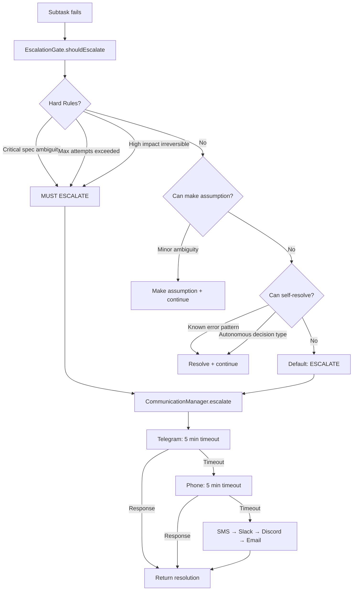
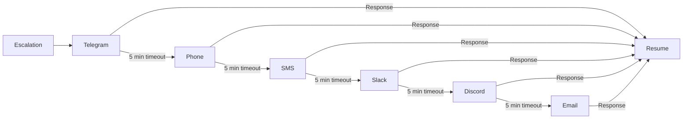
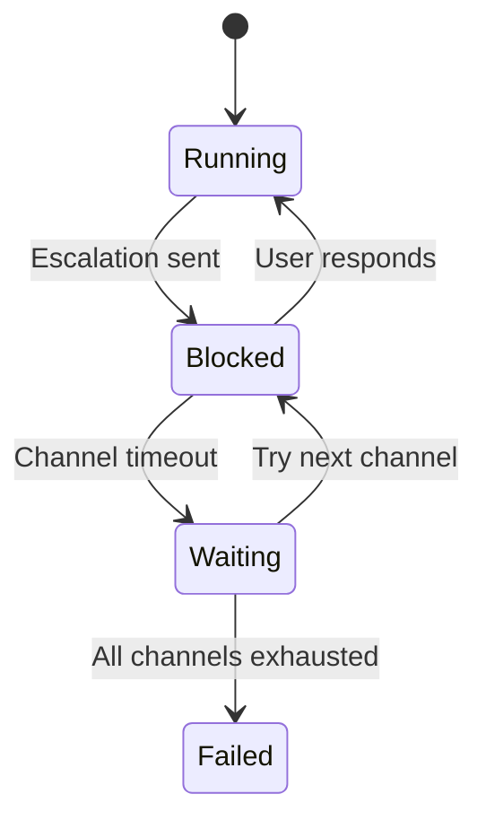

# Escalation Flow

How RUBIX decides when to escalate to humans.

## Decision Flow



## Communication Fallback Chain



## Escalation Types

| Type | Description | Example |
|------|-------------|---------|
| `clarification` | Need more info | "Which database should I use?" |
| `decision` | Business choice needed | "Should we delete old data?" |
| `blocked` | Cannot proceed | "Missing API credentials" |
| `approval` | Irreversible action | "Deploy to production?" |

## Hard Escalation Rules

These **always** trigger escalation:

1. **Critical specification ambiguity** - Core requirements unclear
2. **Max attempts exceeded** - 3+ failures on same subtask
3. **High-impact irreversible** - Destructive operations
4. **Security-sensitive** - Credential handling

## Autonomous Decisions

These can be made **without** escalation:

- Formatting choices (tabs vs spaces)
- Variable naming conventions
- Import ordering
- Comment style

## Escalation Message Format

```typescript
{
  type: "decision",
  title: "Database Selection Required",
  message: "The task requires a database but none is specified.",
  options: [
    { label: "PostgreSQL", description: "ACID compliant, good for relations" },
    { label: "MongoDB", description: "Flexible schema, good for documents" },
    { label: "SQLite", description: "Simple, file-based, no server" }
  ]
}
```

## State During Escalation



## Related

- [Task Execution Flow](task-execution-flow.md)
- [Communication Tools](../tools/communication-tools.md)
- [EscalationGate](../codex/escalation-gate.md)
