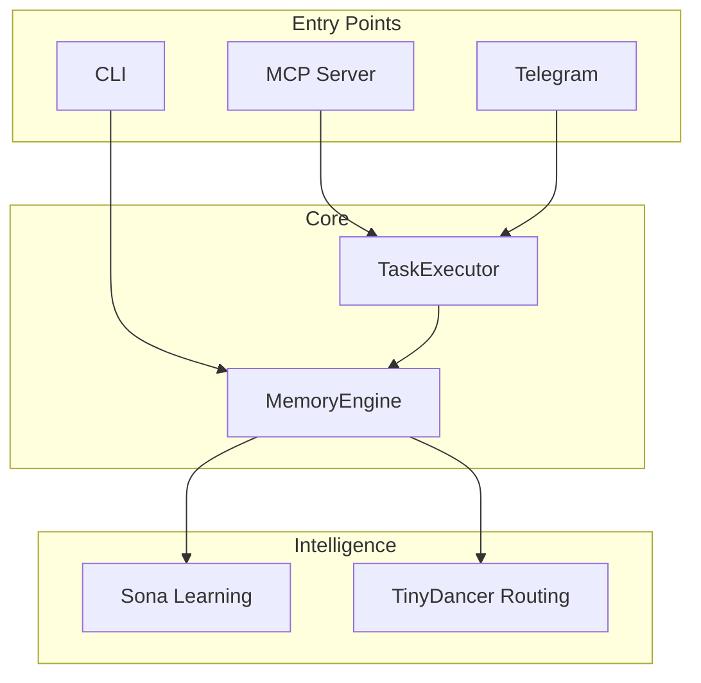

# Flowcharts

Visual architecture diagrams for the RUBIX/god-agent system.

## Diagrams

| Diagram | Description |
|---------|-------------|
| [System Architecture](system-architecture.md) | High-level system overview |
| [Task Execution Flow](task-execution-flow.md) | RUBIX task processing |
| [Memory Flow](memory-flow.md) | Storage and retrieval pipeline |
| [Learning Flow](learning-flow.md) | Sona trajectory learning |
| [Escalation Flow](escalation-flow.md) | Human escalation decisions |
| [Compression Flow](compression-flow.md) | Token compression pipeline |

## Quick Overview

## Diagram Technology

All diagrams use [Mermaid](https://mermaid.js.org/) syntax, rendered automatically by MkDocs Material.

Supported diagram types:
- `flowchart` - Process flows
- `sequenceDiagram` - Interaction sequences
- `graph` - Relationships
- `stateDiagram` - State machines
