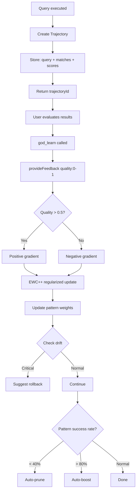
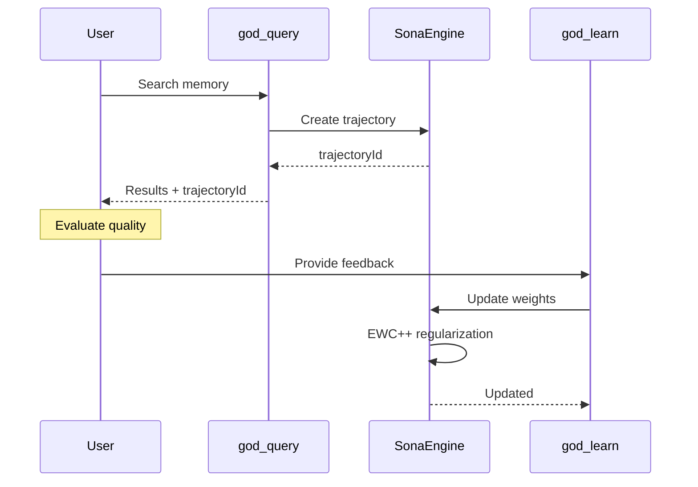
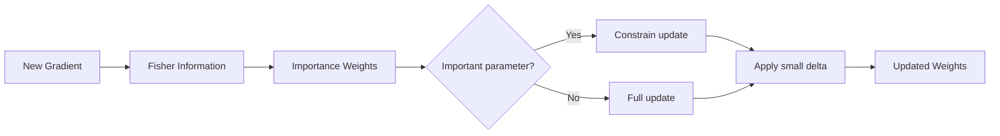
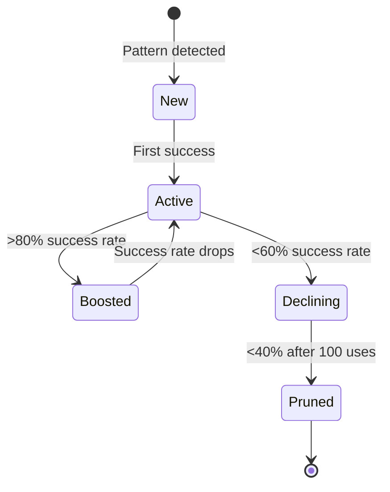

# Learning Flow

How Sona learns from query outcomes.

## Trajectory Learning

## Feedback Loop

## EWC++ Regularization

## Pattern Lifecycle

## Quality Scores

| Score | Meaning | Action |
|-------|---------|--------|
| 0.0 | Completely useless | Strong negative gradient |
| 0.3 | Poor results | Negative gradient |
| 0.5 | Neutral | No change |
| 0.7 | Good results | Positive gradient |
| 1.0 | Perfect match | Strong positive gradient |

## Drift Detection

| Drift Level | Threshold | Action |
|-------------|-----------|--------|
| Normal | < 0.3 | Continue |
| Elevated | 0.3 - 0.5 | Log warning |
| Critical | > 0.5 | Suggest rollback |

## Related

- [System Architecture](system-architecture.md)
- [Learning Tools](../tools/learning-tools.md)
- [Sona Engine](../learning/sona-engine.md)
