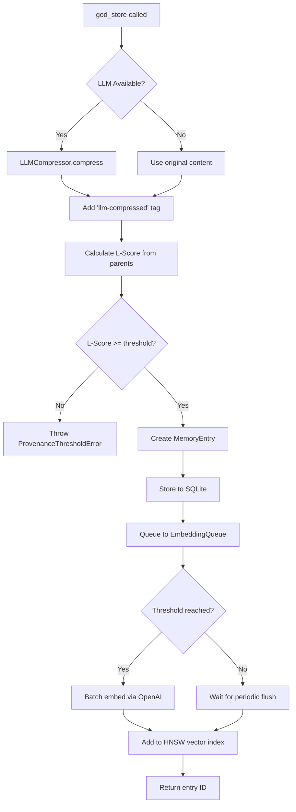
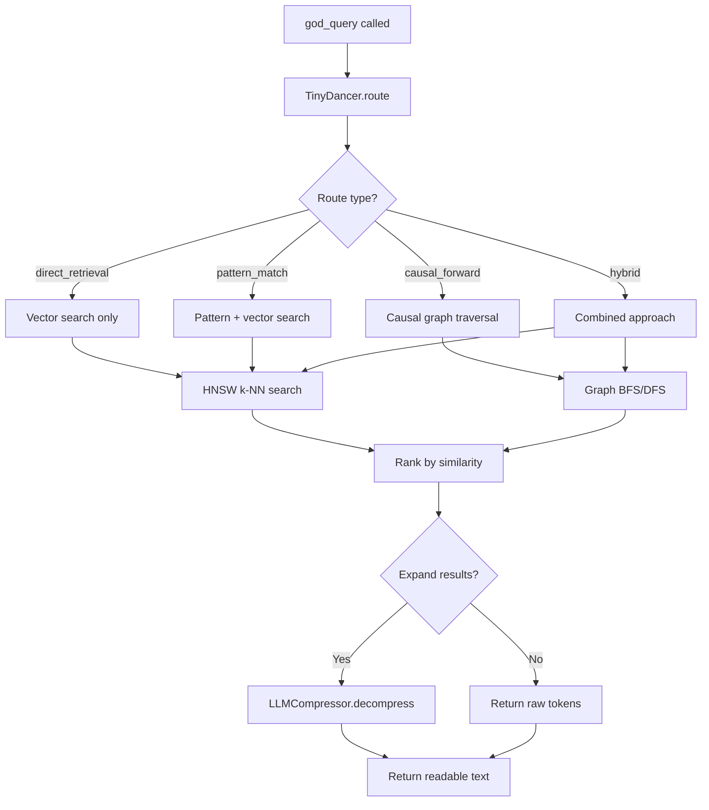
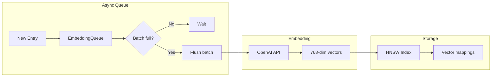
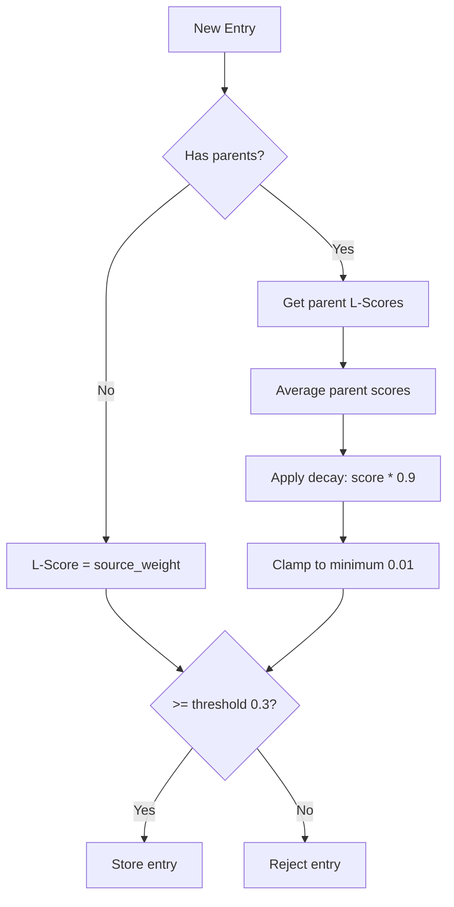

# Memory Flow

How data flows through the memory system.

## Storage Flow

## Query Flow

## Embedding Pipeline

## L-Score Calculation

## Source Weights

| Source | Base L-Score |
|--------|--------------|
| `user_input` | 1.0 |
| `tool_output` | 0.9 |
| `system` | 0.85 |
| `external` | 0.7 |
| `agent_inference` | 0.6 |

## Related

- [System Architecture](system-architecture.md)
- [Memory Tools](../tools/memory-tools.md)
- [Compression Flow](compression-flow.md)
