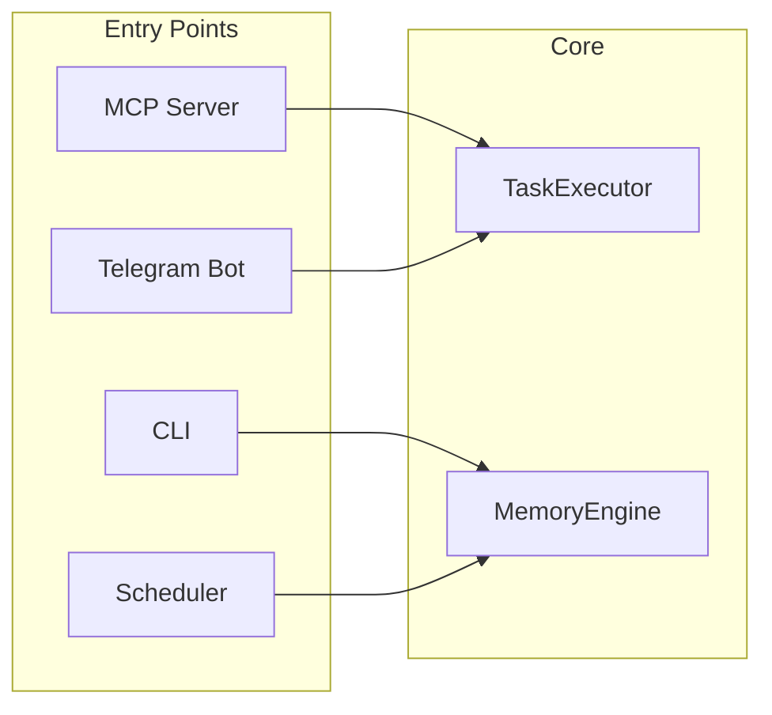

# Getting Started

Welcome to the RUBIX/God-Agent documentation. This section will help you get started with installation, configuration, and your first tasks.

## Quick Links

| Guide | Description |
|-------|-------------|
| [Installation](installation.md) | System requirements and setup |
| [Configuration](configuration.md) | Environment variables and settings |
| [Quick Start](quick-start.md) | Your first task in 5 minutes |

## What is RUBIX?

RUBIX (god-agent) is an **autonomous AI developer agent** that:

- **Executes complex tasks** - Break down and complete multi-step development tasks
- **Self-heals from failures** - Analyzes errors and tries alternative approaches
- **Learns continuously** - Improves from successes and failures via Sona engine
- **Escalates intelligently** - Only bothers you when genuinely blocked

## Deployment Modes



### 1. MCP Server Mode (Claude Code Integration)

The most common mode - integrates with Claude Code via Model Context Protocol.

```bash
# Configured in .claude/mcp.json
node dist/mcp-server.js
```

### 2. CLI Mode (Direct Commands)

Use god-agent directly from the command line.

```bash
god-agent init              # Initialize database
god-agent query "search"    # Search memory
god-agent store "content"   # Store to memory
```

### 3. Telegram Bot Mode (Standalone)

Submit tasks via Telegram, receive escalation notifications.

```bash
TELEGRAM_BOT_TOKEN=... node dist/telegram/standalone.js
```

### 4. Scheduler Daemon (Background)

Run scheduled tasks with cron, file watch, and event triggers.

```typescript
const daemon = new SchedulerDaemon(engine);
daemon.start();
```

## Prerequisites

- **Node.js 20+** (LTS recommended)
- **npm 10+** or compatible package manager
- **OpenAI API Key** - For embeddings (text-embedding-3-small)
- **Anthropic API Key** - For code generation (Claude Opus)

## Next Steps

1. **[Install RUBIX](installation.md)** - Get the system running
2. **[Configure Settings](configuration.md)** - Set up API keys and preferences
3. **[Run Your First Task](quick-start.md)** - Submit a task and see RUBIX in action
