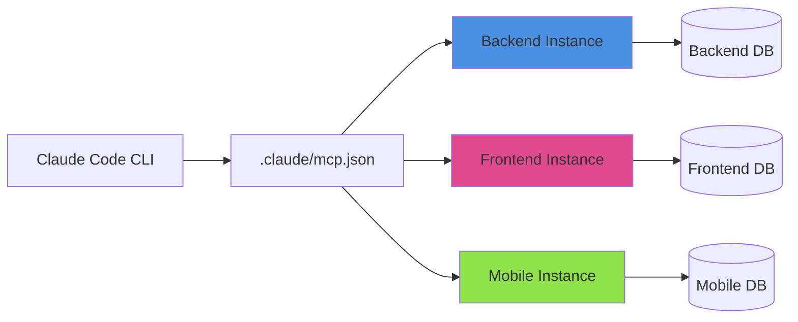

# Multi-Project Support

## Welcome to Multi-Project Mode

God-Agent's multi-project support enables you to work on **multiple projects simultaneously** with complete isolation. Each project runs as an independent MCP server instance with its own memory, containment rules, and execution context.

---

## What is Multi-Project Mode?

Instead of working on a single project at a time, you can configure God-Agent to manage multiple projects in parallel:

- **Backend API** (Express + TypeScript)
- **Web Frontend** (React + TypeScript)
- **Mobile App** (React Native)
- **Infrastructure** (Terraform)
- **Documentation** (MkDocs)

All running **simultaneously** with complete isolation.

---

## Key Features

### ✨ Complete Isolation

Each project instance has:
- **Separate SQLite database** - No memory cross-contamination
- **Independent HNSW indexes** - Isolated vector embeddings
- **Project-specific containment** - Can only write to project root
- **Dedicated task execution** - Independent CODEX queues

### ⚡ True Parallelism

Execute tasks on all projects at the same time:
- Backend task runs while frontend task runs
- Mobile task runs independently
- All instances process in parallel
- No waiting for sequential completion

### 🎯 Zero Code Changes

Everything is configuration-based:
- Edit `.claude/mcp.json` to add projects
- No modifications to God-Agent core
- Backward compatible with single-project mode

### 💡 Lightweight

Efficient resource usage:
- ~20MB per idle instance
- ~100-200MB per active instance
- 5 idle instances = ~100MB total
- 5 active instances = ~500MB-1GB total

---

## How It Works



### Architecture

Each MCP instance is configured with environment variables:

- **`RUBIX_PROJECT_ROOT`** - Absolute path to project directory
- **`RUBIX_PROJECT_NAME`** - Human-readable name
- **`RUBIX_DATA_DIR`** - Isolated data storage path

When God-Agent starts, each instance:

1. **Reads project configuration** from environment
2. **Initializes isolated memory** (separate SQLite DB)
3. **Sets up containment rules** (can only write to project root)
4. **Stores project context** in high-priority memory
5. **Makes tools available** with instance-specific prefix

---

## Quick Start

### 1. Run Configuration Helper

```bash
cd D:\rubix-protocol
node scripts/configure-projects.js
```

### 2. Follow Interactive Prompts

```
How many projects? 3

Project 1:
  Path: D:\projects\backend-api
  Name: Backend API
  ID: backend-api

Project 2:
  Path: D:\projects\web-frontend
  Name: Web Frontend
  ID: frontend

Project 3:
  Path: D:\projects\mobile-app
  Name: Mobile App
  ID: mobile

Generate configuration? yes
```

### 3. Restart Claude Code

Close and reopen Claude Code to load the new configuration.

### 4. Start Using

```typescript
// Work on backend
mcp__rubix_backend_api__god_codex_do({
  task: "Add authentication middleware"
});

// Work on frontend (in parallel!)
mcp__rubix_frontend__god_codex_do({
  task: "Create login form component"
});
```

---

## Documentation Structure

### Getting Started
- **[Multi-Project Setup](./multi-project-setup.md)** - Complete setup guide with configuration
- **[CLI Usage Guide](./multi-project-cli-usage.md)** - Detailed CLI commands and workflows from A to Z
- **[Manual Configuration](./multi-project-manual-config.md)** - Manual configuration without helper script

### Reference
- **[Quick Reference](../reference/multi-project-quick-reference.md)** - Command cheat sheet and quick reference

### Examples
- **[Multi-Project Examples](../examples/multi-project-examples.md)** - Real-world usage examples

---

## Common Use Cases

### Full-Stack Development

Work on backend, frontend, and mobile simultaneously:

```typescript
// Define API contract once
const contract = "POST /api/auth/login ...";

// Implement across all projects in parallel
mcp__rubix_backend_api__god_codex_do({ task: `Backend: ${contract}` });
mcp__rubix_frontend__god_codex_do({ task: `Frontend: ${contract}` });
mcp__rubix_mobile__god_codex_do({ task: `Mobile: ${contract}` });
```

### Microservices Architecture

Manage multiple services:

```json
{
  "rubix-auth-service": {...},
  "rubix-user-service": {...},
  "rubix-payment-service": {...},
  "rubix-notification-service": {...}
}
```

### Monorepo Packages

Work on packages and apps:

```json
{
  "rubix-pkg-core": { "RUBIX_PROJECT_ROOT": "./packages/core" },
  "rubix-pkg-ui": { "RUBIX_PROJECT_ROOT": "./packages/ui" },
  "rubix-app-web": { "RUBIX_PROJECT_ROOT": "./apps/web" },
  "rubix-app-admin": { "RUBIX_PROJECT_ROOT": "./apps/admin" }
}
```

### Client Projects

Separate instances per client:

```json
{
  "rubix-client-acme": {...},
  "rubix-client-globex": {...},
  "rubix-client-initech": {...}
}
```

---

## Benefits

### For Solo Developers

- Work on multiple projects without switching contexts
- Execute tasks in parallel for faster completion
- Keep project-specific knowledge isolated
- Easily switch between projects

### For Teams

- Share configuration templates
- Consistent project setup across team
- Isolated environments prevent conflicts
- Parallel development across stack

### For Agencies

- Separate client projects cleanly
- No context leakage between clients
- Efficient resource utilization
- Scale to multiple concurrent projects

---

## Comparison: Single vs. Multi-Project

| Feature | Single Project | Multi-Project |
|---------|---------------|---------------|
| **Projects** | 1 | 2-10 |
| **Memory** | Shared | Isolated per project |
| **Containment** | Global | Per-project |
| **Task Execution** | Sequential | Parallel across projects |
| **Context** | Single project | Project-specific |
| **Configuration** | Simple | Requires setup |
| **Resource Usage** | ~50MB idle | ~100MB idle (5 projects) |
| **Setup Time** | 2 minutes | 5 minutes |
| **Use Cases** | Single codebase | Full-stack, microservices, monorepo |

---

## System Requirements

### Minimum

- Node.js 14+
- 8GB RAM
- Claude Code CLI
- 2-3 active projects

### Recommended

- Node.js 18+
- 16GB RAM
- Claude Code CLI
- 4-5 active projects

### For 10+ Projects

- Node.js 20+
- 32GB RAM
- High-performance SSD
- Consider splitting into groups

---

## Next Steps

1. **[Complete Setup Guide](./multi-project-setup.md)** - Full configuration walkthrough
2. **[CLI Usage Guide](./multi-project-cli-usage.md)** - Learn all CLI commands and workflows
3. **[Examples](../examples/multi-project-examples.md)** - See real-world usage patterns
4. **[Quick Reference](../reference/multi-project-quick-reference.md)** - Command cheat sheet

---

## Support

- **Documentation**: See guides linked above
- **Issues**: https://github.com/rubix-protocol/god-agent/issues
- **CLAUDE.md**: Check "DIRECTIVE: MULTI-PROJECT CONTEXT" section

---

## FAQ

### Can I use both single and multi-project modes?

Yes! Single-project configuration (one instance in `.claude/mcp.json`) works exactly as before. Multi-project is opt-in.

### How many projects can I configure?

Technically up to 10, but 2-5 is optimal for most use cases. Configure only projects you're actively working on.

### Will this break my existing setup?

No! If you have an existing `.claude/mcp.json` with a single instance, it continues to work. Multi-project is additive.

### Do I need separate API keys for each project?

No, all instances can share the same `OPENAI_API_KEY` and `ANTHROPIC_API_KEY`.

### Can instances share data?

No, each instance has completely isolated data. This is intentional for security and clarity.

### Can I work on the same codebase with multiple instances?

Yes, but ensure each instance has a unique `RUBIX_DATA_DIR`. For example, dev/staging/prod instances of the same project.

### How do I remove a project?

Edit `.claude/mcp.json` to remove the instance entry, optionally delete `data/projects/{id}/`, then restart Claude Code.

### Does this work with Telegram mode?

Multi-project is designed for MCP (CLI) mode. Telegram mode uses a different project selection mechanism.

---

## Version History

- **v1.0** (2026-01-25) - Initial multi-project support release
  - Multi-instance MCP configuration
  - Environment-based project selection
  - Automatic project context storage
  - Complete isolation guarantees

---

*Ready to get started? Head to the [Multi-Project Setup Guide](./multi-project-setup.md)!*
