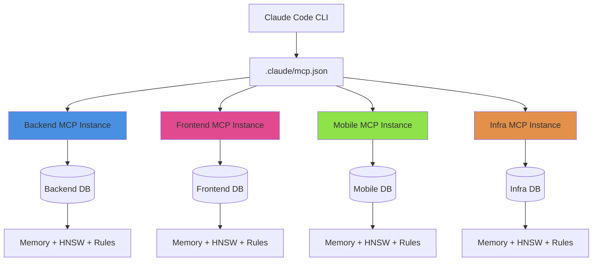

# Multi-Project Setup Guide

## Overview

God-Agent supports working on **multiple projects simultaneously** with complete isolation. Each project runs as an independent MCP server instance with its own memory, containment rules, and execution context.

!!! success "Key Benefits"
    - ✅ Work on 5+ projects at the same time
    - ✅ Complete isolation - no cross-contamination
    - ✅ True parallelism - all instances run independently
    - ✅ Lightweight - ~100MB for 5 idle instances
    - ✅ Configuration-based - no code changes needed

---

## Architecture

### Multi-Instance Design



### How It Works

Each MCP instance is configured with:

| Component | Purpose | Isolation |
|-----------|---------|-----------|
| **RUBIX_PROJECT_ROOT** | Absolute path to project directory | Per-instance |
| **RUBIX_PROJECT_NAME** | Human-readable project name | Per-instance |
| **RUBIX_DATA_DIR** | Isolated data storage | Separate SQLite DB |
| **ContainmentManager** | Write restrictions | Project-scoped |
| **MemoryEngine** | Context and history | No cross-talk |
| **CODEX Tasks** | Code execution | Independent queues |

---

## Prerequisites

Before setting up multi-project support, ensure:

1. ✅ God-Agent is installed and built (`npm install && npm run build`)
2. ✅ Claude Code CLI is installed
3. ✅ You have identified the projects you want to work on (absolute paths)
4. ✅ API keys are configured (`OPENAI_API_KEY`, `ANTHROPIC_API_KEY`)

---

## Quick Start (5 Minutes)

### Option 1: Interactive Configuration Helper (Recommended)

```bash
# Navigate to rubix-protocol directory
cd /var/www/html/rubix-protocol

# Run the interactive configuration tool
node scripts/configure-projects.js
```

**Follow the prompts:**

1. Enter number of projects (1-10)
2. For each project:
   - Enter absolute path (e.g., `/home/user/projects/backend-api`)
   - Enter project name (e.g., `Backend API`)
   - Enter project ID (e.g., `backend-api`)
   - Enter description (optional)
3. Confirm configuration

**What it does:**

- ✅ Validates all project paths
- ✅ Generates `.claude/mcp.json` configuration
- ✅ Creates `data/projects/{id}/` directories
- ✅ Backs up existing configuration
- ✅ Provides usage instructions

### Option 2: Manual Configuration

See [Manual Configuration Guide](./multi-project-manual-config.md) for detailed steps.

---

## Post-Setup Steps

### 1. Verify Configuration

Check that `.claude/mcp.json` was created:

```bash
# View the generated configuration
cat .claude/mcp.json

# View contents
cat .claude/mcp.json
```

Expected structure:

```json
{
  "mcpServers": {
    "rubix-backend-api": {
      "command": "node",
      "args": ["dist/mcp-server.js"],
      "cwd": "/var/www/html/rubix-protocol",
      "env": {
        "OPENAI_API_KEY": "...",
        "ANTHROPIC_API_KEY": "...",
        "RUBIX_DATA_DIR": "./data/projects/backend-api",
        "RUBIX_PROJECT_ROOT": "/home/user/projects/backend-api",
        "RUBIX_PROJECT_NAME": "Backend API"
      }
    }
    // ... more instances
  }
}
```

### 2. Verify Data Directories

Check that data directories were created:

```bash
# List project directories
ls data/projects/

# Expected output:
# backend-api/
# frontend/
# mobile/
# infra/
# docs/
```

### 3. Restart Claude Code

!!! warning "Important"
    You **must restart Claude Code** after creating or modifying `.claude/mcp.json` for changes to take effect.

**Steps:**

1. Close Claude Code completely
2. Reopen Claude Code
3. Verify instances loaded (check available tools)

### 4. Verify Instances Loaded

In your first interaction with Claude Code, check available tools:

```typescript
// Available tools will include project-specific prefixes:
// mcp__rubix_backend_api__god_codex_do
// mcp__rubix_frontend__god_codex_do
// mcp__rubix_mobile__god_codex_do
// etc.
```

---

## Usage Examples

### Basic Operations

#### Query Project Context

```typescript
// Query backend project
const backendContext = mcp__rubix_backend_api__god_query({
  query: "What is the current project structure?",
  topK: 10
});

// Query frontend project (separate memory)
const frontendContext = mcp__rubix_frontend__god_query({
  query: "What React components exist?",
  topK: 10
});
```

#### Execute Tasks

```typescript
// Add feature to backend
mcp__rubix_backend_api__god_codex_do({
  task: "Add authentication middleware to Express routes"
});

// Add feature to frontend (can run in parallel!)
mcp__rubix_frontend__god_codex_do({
  task: "Create login form component with validation"
});
```

#### Store Project Context

```typescript
// Store project-specific conventions
mcp__rubix_backend_api__god_store({
  content: `Project Conventions:
- Use Express.js with TypeScript
- All routes in src/routes/
- Authentication via JWT
- Tests with Jest`,
  tags: ['project_config', 'always_recall'],
  importance: 1.0
});
```

### Cross-Project Coordination

When implementing features that span multiple projects:

```typescript
// Step 1: Define API contract
const apiContract = `
API Endpoint: POST /api/auth/login
Request: { email: string, password: string }
Response: { token: string, user: { id, name, email } }
Status Codes:
  200 - Success
  401 - Invalid credentials
  400 - Validation error
`;

// Step 2: Implement backend endpoint
mcp__rubix_backend_api__god_codex_do({
  task: `Implement login endpoint with this contract:\n${apiContract}`
});

// Step 3: Implement frontend (can run in parallel)
mcp__rubix_frontend__god_codex_do({
  task: `Create login form that calls this API:\n${apiContract}`
});

// Step 4: Implement mobile app
mcp__rubix_mobile__god_codex_do({
  task: `Add login screen using this API:\n${apiContract}`
});
```

---

## Advanced Configuration

### Adding New Projects

To add a new project to an existing configuration:

1. **Run the configuration helper again:**

```bash
node scripts/configure-projects.js
```

2. **Or manually edit `.claude/mcp.json`:**

```json
{
  "mcpServers": {
    // ... existing instances ...
    "rubix-new-project": {
      "command": "node",
      "args": ["dist/mcp-server.js"],
      "cwd": "/var/www/html/rubix-protocol",
      "env": {
        "OPENAI_API_KEY": "...",
        "ANTHROPIC_API_KEY": "...",
        "RUBIX_DATA_DIR": "./data/projects/new-project",
        "RUBIX_PROJECT_ROOT": "/home/user/projects/new-project",
        "RUBIX_PROJECT_NAME": "New Project"
      }
    }
  }
}
```

3. **Create data directory:**

```bash
mkdir -p data/projects/new-project
```

4. **Restart Claude Code**

### Removing Projects

To remove a project instance:

1. **Edit `.claude/mcp.json`** and remove the instance entry
2. **Optionally delete data directory:**

```bash
rm -rf data/projects/{project-id}
```

3. **Restart Claude Code**

### Sharing Instances Between Team Members

To share a project configuration:

1. **Export the MCP configuration:**

```json
{
  "rubix-team-project": {
    "command": "node",
    "args": ["dist/mcp-server.js"],
    "cwd": "/var/www/html/rubix-protocol",
    "env": {
      "RUBIX_DATA_DIR": "./data/projects/team-project",
      "RUBIX_PROJECT_ROOT": "/home/user/projects/shared-project",
      "RUBIX_PROJECT_NAME": "Team Project"
    }
  }
}
```

2. **Team members update:**
   - Replace `cwd` with their god-agent path
   - Replace `RUBIX_PROJECT_ROOT` with their local project path
   - Keep `RUBIX_DATA_DIR` relative (starts fresh)

---

## Troubleshooting

### Instance Not Loading

**Symptoms:**
- Tools not appearing with project prefix
- Error messages about missing MCP server

**Solutions:**

1. Check `.claude/mcp.json` syntax is valid JSON
2. Verify `cwd` path points to god-agent directory
3. Ensure `dist/mcp-server.js` exists (run `npm run build`)
4. Restart Claude Code completely

### Path Issues

**Symptoms:**
- "Path does not exist" errors
- "Not a directory" errors

**Solutions:**

1. Use **absolute paths** for `RUBIX_PROJECT_ROOT`
2. Check path exists: `test -d "/path/to/project" && echo "exists"`
3. Verify path permissions (readable by Node.js)

### Cross-Contamination

**Symptoms:**
- Queries returning results from wrong project
- Context mixing between projects

**Solutions:**

1. Verify each instance has unique `RUBIX_DATA_DIR`
2. Check you're using correct tool prefix
3. Clear data directories if needed: `rm -rf data/projects/*`
4. Restart and reconfigure

### High Memory Usage

**Symptoms:**
- System running out of memory
- Slow performance

**Solutions:**

1. Reduce number of configured instances (keep 2-5 active)
2. Remove unused instances from `.claude/mcp.json`
3. Restart Claude Code to free memory
4. Close unused instances

---

## Best Practices

### 1. Name Instances Descriptively

```json
// Good - clear purpose
"rubix-backend-api": { ... }
"rubix-web-frontend": { ... }
"rubix-mobile-ios": { ... }

// Bad - ambiguous
"rubix-proj1": { ... }
"rubix-test": { ... }
```

### 2. Use Relative Data Directories

```json
// Good - portable
"RUBIX_DATA_DIR": "./data/projects/backend-api"

// Bad - absolute path (breaks on different machines)
"RUBIX_DATA_DIR": "/var/www/html/rubix-protocol/data/projects/backend-api"
```

### 3. Configure Only Active Projects

- Keep 2-5 instances for projects you're actively working on
- Remove instances for inactive projects
- Add back when needed

### 4. Document Project Conventions

Store conventions in high-priority memory:

```typescript
mcp__rubix_backend_api__god_store({
  content: `Architecture: Express.js + TypeScript + PostgreSQL
Patterns: Repository pattern, dependency injection
Testing: Jest + Supertest
Code Style: Airbnb ESLint + Prettier`,
  tags: ['project_config', 'always_recall'],
  importance: 1.0
});
```

### 5. Use Consistent Tool Prefixes

Always use the full prefix for clarity:

```typescript
// Good - explicit
mcp__rubix_backend_api__god_codex_do({ ... })

// Bad - assuming context
god_codex_do({ ... })  // Which project?
```

---

## Next Steps

- [CLI Usage Guide](./multi-project-cli-usage.md) - Detailed CLI commands and workflows
- [Manual Configuration](./multi-project-manual-config.md) - Manual setup instructions

---

## Quick Reference

### Configuration Helper

```bash
node scripts/configure-projects.js
```

### Manual Setup

```bash
# Create data directory
mkdir -p data/projects/{project-id}

# Edit .claude/mcp.json
# Add instance configuration

# Restart Claude Code
```

### Tool Naming Pattern

```
mcp__rubix_{project-id}__god_{tool-name}
         └─────┬─────┘       └────┬────┘
           Instance ID         Tool Name
```

### Resource Usage

| Instances | Idle | Active |
|-----------|------|--------|
| 1 | ~50MB | ~100-200MB |
| 5 | ~100MB | ~500MB-1GB |
| 10 | ~200MB | ~1-2GB |
