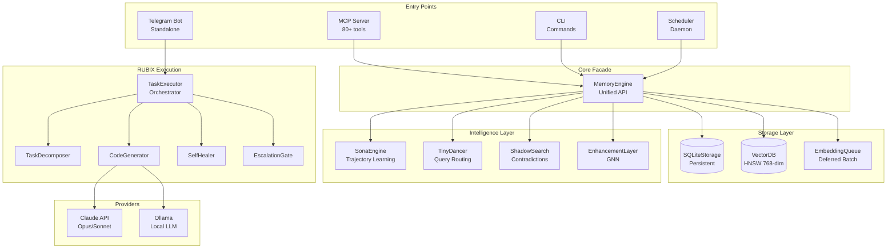

# RUBIX/God-Agent Documentation

**RUBIX** is an autonomous AI developer agent with persistent memory, continuous learning, and intelligent escalation. It can execute complex multi-step tasks, self-heal from failures, and only escalate to humans when genuinely blocked.

## System Overview



## Key Features

### Autonomous Task Execution
- **Task Decomposition**: Breaks complex tasks into research, design, code, test, integrate, verify, and review subtasks
- **Self-Healing**: Analyzes failures, queries similar past failures, and suggests alternative approaches
- **Intelligent Escalation**: Only escalates to humans when genuinely blocked (respects user attention)
- **Multi-Channel Communication**: Telegram → Phone → SMS → Slack → Discord → Email fallback chain

### Persistent Memory System
- **Semantic Compression**: LLM-based compression for efficient token usage
- **768-dim Vector Search**: HNSW index for fast semantic search
- **L-Score Provenance**: Tracks information reliability through lineage
- **Causal Relations**: Hypergraph relationships with TTL support

### Continuous Learning (Sona)
- **Trajectory-Based Learning**: Records query → patterns → outcomes
- **EWC++ Regularization**: Prevents catastrophic forgetting
- **Auto-Prune/Boost**: Removes failing patterns, strengthens successful ones

### 80+ MCP Tools
Access to memory, causal reasoning, learning, scheduling, browser automation, code review, and more.

## Quick Start

```bash
# Install dependencies
cd rubix-protocol
npm install

# Set up environment
cp .env.example .env
# Edit .env with your API keys

# Build
npm run build

# Run MCP server
node dist/mcp-server.js
```

## Documentation Sections

| Section | Description |
|---------|-------------|
| [Getting Started](getting-started/installation.md) | Installation, configuration, quick start |
| [Architecture](architecture/overview.md) | System design, data flow, component relationships |
| [Core System](core/memory-engine.md) | MemoryEngine, types, configuration |
| [CODEX/RUBIX](codex/task-executor.md) | Task execution, decomposition, self-healing |
| [Memory System](memory/compression-schemas.md) | Compression, embeddings, async writes |
| [Learning System](learning/sona-engine.md) | Sona engine, weights, regularization |
| [Providers](providers/provider-factory.md) | LLM providers, Ollama, factory |
| [MCP Tools](tools/index.md) | Complete 80+ tool reference |
| [Prompts](prompts/all-prompts.md) | LLM prompts used in the system |
| [Flowcharts](flowcharts/system-architecture.md) | Visual architecture diagrams |
| [Reference](reference/environment-variables.md) | Environment variables, file listing |

## Environment Variables

### Required
```bash
OPENAI_API_KEY=sk-...        # For 768-dim embeddings
ANTHROPIC_API_KEY=sk-ant-... # For code generation
```

### Optional
```bash
GOD_AGENT_DATA_DIR=./data     # Database location
RUBIX_MODEL=claude-opus-4-5-20251101  # Model for RUBIX
OLLAMA_ENDPOINT=http://localhost:11434  # Local LLM
TELEGRAM_BOT_TOKEN=...        # For Telegram bot
```

See [Environment Variables Reference](reference/environment-variables.md) for complete list.

## Source Code Structure

```
god-agent/src/
├── core/           # MemoryEngine, types, config, errors
├── codex/          # RUBIX task execution system (24 files)
├── memory/         # Compression schemas, LLM compressor
├── storage/        # SQLite persistence
├── learning/       # Sona trajectory learning
├── routing/        # TinyDancer query router
├── providers/      # LLM provider abstraction
├── capabilities/   # 10 IDE capabilities (LSP, Git, AST...)
├── communication/  # Multi-channel escalation
├── notification/   # Slack, Discord, webhooks
├── scheduler/      # Cron-based task scheduling
├── mcp-server.ts   # Main MCP server (80+ tools)
└── telegram/       # Standalone Telegram bot
```

## License

MIT License - See [LICENSE](https://github.com/rubix-protocol/god-agent/blob/main/LICENSE) for details.
