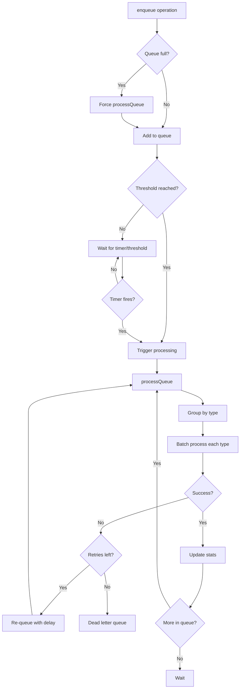

# AsyncWriteQueue

**File:** `src/memory/AsyncWriteQueue.ts` (~298 lines)

The AsyncWriteQueue provides non-blocking write operations for improved performance in high-throughput scenarios.

## Overview

```mermaid
graph TB
    AWQ[AsyncWriteQueue]

    subgraph "Queue Structure"
        Q[Operation Queue<br/>FIFO]
        BATCH[Batch Buffer<br/>Accumulator]
        FLUSH[Flush Timer<br/>Periodic]
    end

    subgraph "Operations"
        ENQ[enqueue()]
        PROC[processQueue()]
        DRAIN[waitForDrain()]
    end

    subgraph "Storage"
        SQL[(SQLite)]
        VEC[(VectorDB)]
    end

    AWQ --> Q
    AWQ --> BATCH
    AWQ --> FLUSH

    AWQ --> ENQ
    AWQ --> PROC
    AWQ --> DRAIN

    PROC --> SQL
    PROC --> VEC
```

## Class Structure

```typescript
class AsyncWriteQueue {
  private queue: WriteOperation[];
  private processing: boolean;
  private maxQueueSize: number;
  private flushThreshold: number;
  private flushInterval: number;
  private flushTimer: NodeJS.Timer | null;
  private stats: QueueStats;

  constructor(options: AsyncWriteQueueOptions) {
    this.queue = [];
    this.processing = false;
    this.maxQueueSize = options.maxQueueSize ?? 1000;
    this.flushThreshold = options.flushThreshold ?? 100;
    this.flushInterval = options.flushInterval ?? 1000;
    this.stats = { enqueued: 0, processed: 0, failed: 0 };
  }
}
```

## Write Operation Types

```typescript
interface WriteOperation {
  id: string;
  type: 'store' | 'update' | 'delete' | 'vector';
  data: OperationData;
  priority: number;
  createdAt: number;
  retryCount: number;
}

type OperationData =
  | StoreOperation
  | UpdateOperation
  | DeleteOperation
  | VectorOperation;

interface StoreOperation {
  entryId: string;
  content: string;
  tags: string[];
  metadata: Record<string, unknown>;
}

interface VectorOperation {
  entryId: string;
  embedding: number[];
  label: number;
}
```

## Constructor Options

```typescript
interface AsyncWriteQueueOptions {
  maxQueueSize?: number;    // Max queue size (default: 1000)
  flushThreshold?: number;  // Batch size trigger (default: 100)
  flushInterval?: number;   // Periodic flush (default: 1000ms)
  maxRetries?: number;      // Retry attempts (default: 3)
  retryDelay?: number;      // Retry delay (default: 1000ms)
}

const queue = new AsyncWriteQueue({
  maxQueueSize: 1000,
  flushThreshold: 100,
  flushInterval: 1000,
  maxRetries: 3
});
```

## Core Methods

### enqueue()

```typescript
async enqueue(operation: WriteOperation): Promise<void> {
  // Check queue capacity
  if (this.queue.length >= this.maxQueueSize) {
    // Force immediate processing
    await this.processQueue();
  }

  // Add to queue
  this.queue.push(operation);
  this.stats.enqueued++;

  // Check if should flush
  if (this.queue.length >= this.flushThreshold) {
    // Non-blocking trigger
    this.triggerProcessing();
  }
}
```

### processQueue()

```typescript
async processQueue(): Promise<void> {
  if (this.processing || this.queue.length === 0) {
    return;
  }

  this.processing = true;

  try {
    // Take batch from queue
    const batch = this.queue.splice(0, this.flushThreshold);

    // Group by operation type
    const grouped = this.groupByType(batch);

    // Process each group
    await Promise.all([
      this.processStoreOperations(grouped.store),
      this.processUpdateOperations(grouped.update),
      this.processDeleteOperations(grouped.delete),
      this.processVectorOperations(grouped.vector)
    ]);

    this.stats.processed += batch.length;
  } catch (error) {
    await this.handleProcessingError(error);
  } finally {
    this.processing = false;

    // Continue if more items
    if (this.queue.length > 0) {
      setImmediate(() => this.processQueue());
    }
  }
}
```

### waitForDrain()

```typescript
async waitForDrain(timeoutMs: number = 30000): Promise<void> {
  const startTime = Date.now();

  while (this.queue.length > 0 || this.processing) {
    if (Date.now() - startTime > timeoutMs) {
      throw new Error(`Queue drain timeout after ${timeoutMs}ms`);
    }

    // Wait for processing
    await new Promise(resolve => setTimeout(resolve, 100));
  }
}
```

## Batch Processing

### groupByType()

```typescript
private groupByType(operations: WriteOperation[]): GroupedOperations {
  const grouped: GroupedOperations = {
    store: [],
    update: [],
    delete: [],
    vector: []
  };

  for (const op of operations) {
    grouped[op.type].push(op);
  }

  return grouped;
}
```

### processStoreOperations()

```typescript
private async processStoreOperations(
  operations: WriteOperation[]
): Promise<void> {
  if (operations.length === 0) return;

  // Batch insert for SQLite
  const values = operations.map(op => {
    const data = op.data as StoreOperation;
    return {
      id: data.entryId,
      content: data.content,
      tags: JSON.stringify(data.tags),
      metadata: JSON.stringify(data.metadata),
      created_at: Date.now()
    };
  });

  await this.storage.batchInsert('memory_entries', values);
}
```

### processVectorOperations()

```typescript
private async processVectorOperations(
  operations: WriteOperation[]
): Promise<void> {
  if (operations.length === 0) return;

  // Batch add to vector index
  const vectors = operations.map(op => {
    const data = op.data as VectorOperation;
    return {
      label: data.label,
      embedding: data.embedding
    };
  });

  await this.vectorDB.batchAdd(vectors);
}
```

## Periodic Flushing

### start()

```typescript
start(): void {
  if (this.flushTimer) return;

  this.flushTimer = setInterval(() => {
    this.processQueue();
  }, this.flushInterval);
}
```

### stop()

```typescript
async stop(): Promise<void> {
  if (this.flushTimer) {
    clearInterval(this.flushTimer);
    this.flushTimer = null;
  }

  // Drain remaining items
  await this.waitForDrain();
}
```

## Error Handling

### handleProcessingError()

```typescript
private async handleProcessingError(error: Error): Promise<void> {
  console.error('Queue processing error:', error);

  // Identify failed operations
  const failedOps = this.queue.filter(op => op.retryCount < this.maxRetries);

  // Re-queue with incremented retry count
  for (const op of failedOps) {
    op.retryCount++;

    if (op.retryCount < this.maxRetries) {
      // Delay before retry
      await new Promise(r => setTimeout(r, this.retryDelay * op.retryCount));
      this.queue.push(op);
    } else {
      this.stats.failed++;
      await this.handlePermanentFailure(op);
    }
  }
}
```

### handlePermanentFailure()

```typescript
private async handlePermanentFailure(operation: WriteOperation): Promise<void> {
  console.error('Permanent write failure:', {
    id: operation.id,
    type: operation.type,
    retries: operation.retryCount
  });

  // Store in dead letter queue
  await this.deadLetterQueue?.enqueue(operation);

  // Emit failure event
  this.emit('writeFailure', operation);
}
```

## Priority Queue

```typescript
// Higher priority = processed first
enqueueWithPriority(operation: WriteOperation, priority: number): void {
  operation.priority = priority;

  // Insert in priority order
  const insertIndex = this.queue.findIndex(op => op.priority < priority);

  if (insertIndex === -1) {
    this.queue.push(operation);
  } else {
    this.queue.splice(insertIndex, 0, operation);
  }
}
```

## Statistics

### getStats()

```typescript
interface QueueStats {
  enqueued: number;
  processed: number;
  failed: number;
  queueSize: number;
  isProcessing: boolean;
  avgProcessingTime: number;
}

getStats(): QueueStats {
  return {
    ...this.stats,
    queueSize: this.queue.length,
    isProcessing: this.processing,
    avgProcessingTime: this.calculateAvgProcessingTime()
  };
}
```

## Flow Diagram



## Configuration

| Option | Type | Default | Description |
|--------|------|---------|-------------|
| `maxQueueSize` | number | `1000` | Max pending operations |
| `flushThreshold` | number | `100` | Batch size trigger |
| `flushInterval` | number | `1000` | Periodic flush (ms) |
| `maxRetries` | number | `3` | Retry attempts |
| `retryDelay` | number | `1000` | Retry delay (ms) |

## Performance Characteristics

| Metric | Value | Notes |
|--------|-------|-------|
| Enqueue latency | < 1ms | Non-blocking |
| Batch size | 100 | Configurable |
| Flush interval | 1s | Configurable |
| Throughput | ~1000 ops/s | Depends on storage |

## Usage Example

```typescript
const queue = new AsyncWriteQueue({
  maxQueueSize: 1000,
  flushThreshold: 100,
  flushInterval: 1000
});

// Start periodic flushing
queue.start();

// Enqueue operations (non-blocking)
await queue.enqueue({
  id: 'op_1',
  type: 'store',
  data: {
    entryId: 'entry_123',
    content: 'Memory content',
    tags: ['tag1', 'tag2'],
    metadata: {}
  },
  priority: 1,
  createdAt: Date.now(),
  retryCount: 0
});

// High-priority vector operation
queue.enqueueWithPriority({
  id: 'op_2',
  type: 'vector',
  data: {
    entryId: 'entry_123',
    embedding: [...768 floats...],
    label: 42
  },
  priority: 10,
  createdAt: Date.now(),
  retryCount: 0
}, 10);

// Wait for all operations before shutdown
await queue.waitForDrain();

// Stop the queue
await queue.stop();
```

## Integration with MemoryEngine

```typescript
class MemoryEngine {
  private writeQueue: AsyncWriteQueue;

  constructor(config: Config) {
    this.writeQueue = new AsyncWriteQueue({
      maxQueueSize: config.writeQueueSize ?? 1000,
      flushThreshold: config.writeFlushThreshold ?? 100
    });

    this.writeQueue.start();
  }

  async store(content: string, options: StoreOptions): Promise<string> {
    const entryId = generateId();

    // Non-blocking storage
    await this.writeQueue.enqueue({
      id: `store_${entryId}`,
      type: 'store',
      data: {
        entryId,
        content,
        tags: options.tags ?? [],
        metadata: options.metadata ?? {}
      },
      priority: options.priority ?? 1,
      createdAt: Date.now(),
      retryCount: 0
    });

    return entryId;
  }

  async shutdown(): Promise<void> {
    await this.writeQueue.stop();
  }
}
```

## Event Handling

```typescript
// Listen for events
queue.on('writeFailure', (operation) => {
  console.error('Write failed permanently:', operation.id);
});

queue.on('batchProcessed', (count) => {
  console.log(`Processed ${count} operations`);
});

queue.on('queueDrained', () => {
  console.log('Queue is empty');
});
```

## Next Steps

- [EmbeddingCache](embedding-cache.md) - Embedding caching
- [Memory System](index.md) - Memory system overview
- [MemoryEngine](../core/memory-engine.md) - Core memory API
