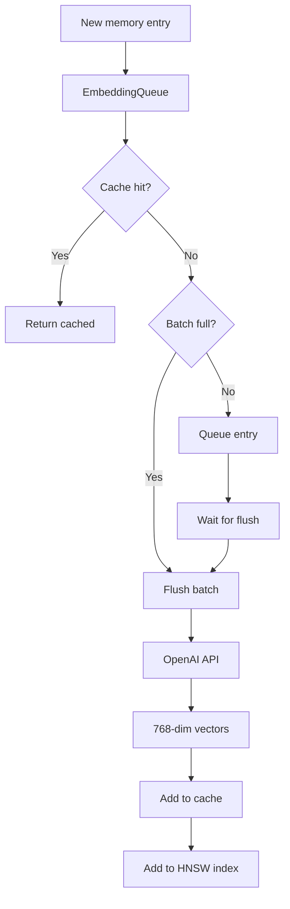

# Embedding System

Vector embedding generation and storage.

## Overview

The embedding system converts text content into 768-dimensional vectors for semantic search.

## Components

| Component | Purpose |
|-----------|---------|
| EmbeddingQueue | Batched async embedding generation |
| EmbeddingCache | LRU cache for frequent lookups |
| VectorDB (HNSW) | Fast approximate nearest neighbor search |

## Embedding Flow



## Configuration

| Variable | Default | Purpose |
|----------|---------|---------|
| `GOD_AGENT_EMBEDDING_MODEL` | `text-embedding-3-small` | OpenAI model |
| `GOD_AGENT_EMBEDDING_DIMENSIONS` | `768` | Vector dimensions |
| `GOD_AGENT_HNSW_MAX_ELEMENTS` | `100000` | Max vectors |
| `GOD_AGENT_HNSW_EF_CONSTRUCTION` | `200` | Build quality |
| `GOD_AGENT_HNSW_EF_SEARCH` | `100` | Search quality |
| `GOD_AGENT_HNSW_M` | `16` | Connections per node |

## HNSW Parameters

| Parameter | Purpose | Trade-off |
|-----------|---------|-----------|
| `M` | Connections per node | Higher = better recall, more memory |
| `efConstruction` | Build-time search depth | Higher = better quality, slower build |
| `efSearch` | Query-time search depth | Higher = better recall, slower query |

## Batch Processing

```typescript
interface EmbeddingQueue {
  threshold: number;      // Batch size trigger (default: 10)
  flushInterval: number;  // Auto-flush interval (default: 5000ms)

  add(content: string): Promise<number[]>;
  flush(): Promise<void>;
}
```

## Cache Strategy

```typescript
interface EmbeddingCache {
  maxSize: number;        // Max cached embeddings
  ttl: number;            // Time-to-live

  get(hash: string): number[] | undefined;
  set(hash: string, embedding: number[]): void;
}
```

## Vector Search

```typescript
// k-NN search
const results = await vectorDB.search(queryEmbedding, {
  k: 10,                  // Number of results
  ef: 100                 // Search depth
});

// Results include similarity scores
results.forEach(r => {
  console.log(`${r.id}: ${r.score}`);
});
```

## Memory Usage

| Elements | Approximate RAM |
|----------|-----------------|
| 10,000 | ~60 MB |
| 100,000 | ~600 MB |
| 1,000,000 | ~6 GB |

## Related

- [Memory Flow](../flowcharts/memory-flow.md)
- [Embedding Cache](embedding-cache.md)
- [Async Write Queue](async-write-queue.md)
