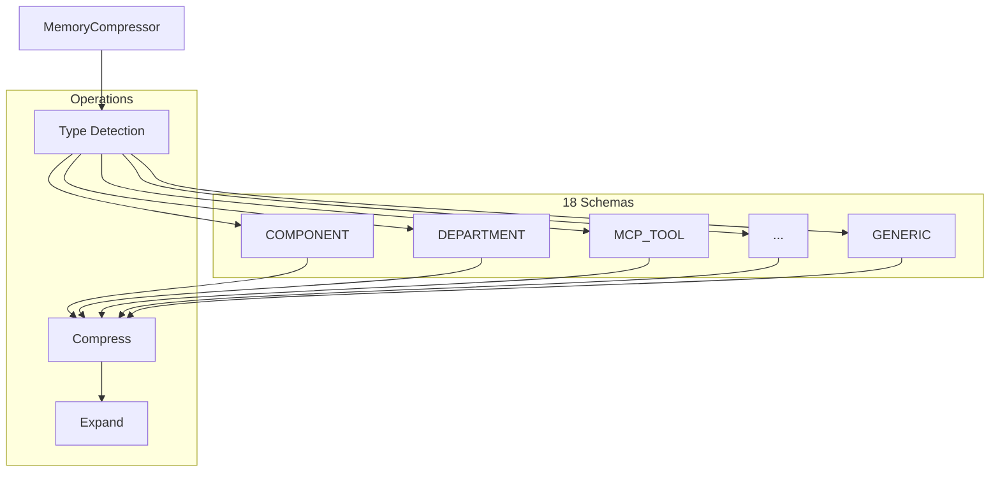
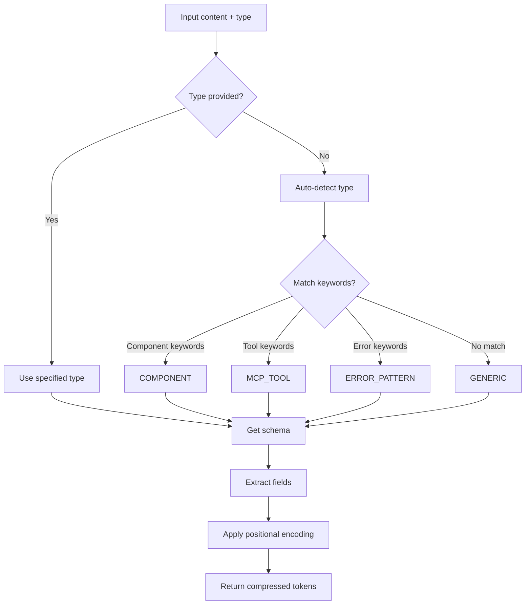

# MemoryCompressor

**File:** `src/memory/MemoryCompressor.ts` (~392 lines)

The MemoryCompressor provides schema-based compression using 18 positional token schemas.

## Overview



## Class Structure

```typescript
class MemoryCompressor {
  private schemas: Map<MemoryType, CompressionSchema>;

  constructor() {
    this.schemas = new Map([
      ['component', COMPONENT_SCHEMA],
      ['department', DEPARTMENT_SCHEMA],
      ['mcp_tool', MCP_TOOL_SCHEMA],
      // ... 18 total schemas
    ]);
  }
}
```

## Compression Flow



## Type Detection

```typescript
detectType(content: string): MemoryType {
  const lower = content.toLowerCase();

  // Component detection
  if (this.hasComponentIndicators(lower)) {
    return 'component';
  }

  // Tool detection
  if (lower.includes('god_') || lower.includes('mcp')) {
    return 'mcp_tool';
  }

  // Error pattern detection
  if (lower.includes('error') || lower.includes('exception')) {
    return 'error_pattern';
  }

  // Department detection
  if (this.hasDepartmentIndicators(lower)) {
    return 'department';
  }

  // Default to generic
  return 'generic';
}

private hasComponentIndicators(text: string): boolean {
  const indicators = [
    'component', 'class', 'module', 'service',
    'manager', 'handler', 'controller', 'engine'
  ];
  return indicators.some(i => text.includes(i));
}
```

## Compression Methods

### compress()

```typescript
interface CompressResult {
  compressed: string;
  type: MemoryType;
  ratio: number;
  fields: Record<string, string>;
}

compress(content: string, type?: MemoryType): CompressResult {
  const detectedType = type ?? this.detectType(content);
  const schema = this.schemas.get(detectedType);

  if (!schema) {
    return this.genericCompress(content);
  }

  const fields = this.extractFields(content, schema);
  const compressed = this.applyPositionalEncoding(fields, schema);

  return {
    compressed,
    type: detectedType,
    ratio: compressed.length / content.length,
    fields
  };
}
```

### extractFields()

```typescript
private extractFields(
  content: string,
  schema: CompressionSchema
): Record<string, string> {
  const fields: Record<string, string> = {};

  for (const field of schema.fields) {
    const value = this.extractField(content, field);
    if (value) {
      fields[field.name] = value;
    }
  }

  return fields;
}

private extractField(content: string, field: FieldDef): string | null {
  // Try patterns in order
  for (const pattern of field.patterns) {
    const match = content.match(pattern);
    if (match) {
      return match[1] || match[0];
    }
  }

  // Try keywords
  for (const keyword of field.keywords) {
    const idx = content.toLowerCase().indexOf(keyword);
    if (idx !== -1) {
      return this.extractValueAfter(content, idx);
    }
  }

  return null;
}
```

### applyPositionalEncoding()

```typescript
private applyPositionalEncoding(
  fields: Record<string, string>,
  schema: CompressionSchema
): string {
  const parts: string[] = [];

  for (const field of schema.fields) {
    const value = fields[field.name];
    if (value) {
      // Apply field-specific abbreviations
      const abbreviated = this.abbreviate(value, field.abbreviations);
      parts.push(abbreviated);
    } else if (field.required) {
      parts.push('?');  // Placeholder for missing required field
    }
  }

  return parts.join(schema.delimiter);
}
```

## Expansion Methods

### expand()

```typescript
interface ExpandResult {
  expanded: string;
  type: MemoryType;
  fields: Record<string, string>;
}

expand(compressed: string, type?: MemoryType): ExpandResult {
  const detectedType = type ?? this.detectCompressedType(compressed);
  const schema = this.schemas.get(detectedType);

  if (!schema) {
    return { expanded: compressed, type: 'generic', fields: {} };
  }

  const fields = this.parseCompressed(compressed, schema);
  const expanded = this.buildExpanded(fields, schema);

  return {
    expanded,
    type: detectedType,
    fields
  };
}
```

### parseCompressed()

```typescript
private parseCompressed(
  compressed: string,
  schema: CompressionSchema
): Record<string, string> {
  const parts = compressed.split(schema.delimiter);
  const fields: Record<string, string> = {};

  for (let i = 0; i < schema.fields.length; i++) {
    const field = schema.fields[i];
    const value = parts[i];

    if (value && value !== '?') {
      // Expand abbreviations
      fields[field.name] = this.expandAbbreviations(value, field.abbreviations);
    }
  }

  return fields;
}
```

### buildExpanded()

```typescript
private buildExpanded(
  fields: Record<string, string>,
  schema: CompressionSchema
): string {
  const parts: string[] = [];

  for (const field of schema.fields) {
    const value = fields[field.name];
    if (value) {
      parts.push(`${field.label}: ${value}`);
    }
  }

  return parts.join('. ');
}
```

## Schema Definition

```typescript
interface CompressionSchema {
  type: MemoryType;
  delimiter: string;
  fields: FieldDef[];
  typeIndicators: string[];
}

interface FieldDef {
  name: string;
  label: string;
  required: boolean;
  patterns: RegExp[];
  keywords: string[];
  abbreviations: Map<string, string>;
}
```

## Example Schemas

### COMPONENT Schema

```typescript
const COMPONENT_SCHEMA: CompressionSchema = {
  type: 'component',
  delimiter: '|',
  fields: [
    {
      name: 'name',
      label: 'Name',
      required: true,
      patterns: [/^(\w+(?:Manager|Service|Engine|Handler))/],
      keywords: ['class', 'component'],
      abbreviations: new Map([
        ['Manager', 'Mgr'],
        ['Service', 'Svc'],
        ['Handler', 'Hdlr']
      ])
    },
    {
      name: 'type',
      label: 'Type',
      required: true,
      patterns: [/type[:\s]+(\w+)/i],
      keywords: ['orchestrator', 'facade', 'utility'],
      abbreviations: new Map([
        ['orchestrator', 'O'],
        ['facade', 'F'],
        ['utility', 'U']
      ])
    },
    {
      name: 'actions',
      label: 'Actions',
      required: false,
      patterns: [/actions?[:\s]+([^.]+)/i],
      keywords: ['executes', 'handles', 'manages'],
      abbreviations: new Map([
        ['execute', 'exe'],
        ['decompose', 'dec'],
        ['heal', 'heal']
      ])
    },
    {
      name: 'deps',
      label: 'Dependencies',
      required: false,
      patterns: [/depends?[:\s]+([^.]+)/i],
      keywords: ['uses', 'requires'],
      abbreviations: new Map([
        ['CodeGenerator', 'CG'],
        ['SelfHealer', 'SH']
      ])
    },
    {
      name: 'path',
      label: 'Path',
      required: false,
      patterns: [/(?:path|location|file)[:\s]+([^\s]+)/i],
      keywords: [],
      abbreviations: new Map()
    },
    {
      name: 'lines',
      label: 'Lines',
      required: false,
      patterns: [/~?(\d+)\s*lines?/i],
      keywords: [],
      abbreviations: new Map()
    }
  ],
  typeIndicators: ['component', 'class', 'module', 'service']
};
```

### ERROR_PATTERN Schema

```typescript
const ERROR_PATTERN_SCHEMA: CompressionSchema = {
  type: 'error_pattern',
  delimiter: '|',
  fields: [
    {
      name: 'id',
      label: 'Error ID',
      required: false,
      patterns: [/error[:\s#]+(\w+)/i],
      keywords: [],
      abbreviations: new Map()
    },
    {
      name: 'symptom',
      label: 'Symptom',
      required: true,
      patterns: [/(?:error|exception)[:\s]+([^.]+)/i],
      keywords: ['symptom', 'manifests'],
      abbreviations: new Map([
        ['TypeError', 'TE'],
        ['ReferenceError', 'RE'],
        ['undefined', 'undef']
      ])
    },
    {
      name: 'root',
      label: 'Root Cause',
      required: false,
      patterns: [/(?:cause|because)[:\s]+([^.]+)/i],
      keywords: ['root', 'caused by'],
      abbreviations: new Map()
    },
    {
      name: 'fix',
      label: 'Fix',
      required: false,
      patterns: [/(?:fix|solution)[:\s]+([^.]+)/i],
      keywords: ['fix', 'resolve'],
      abbreviations: new Map()
    },
    {
      name: 'file',
      label: 'File',
      required: false,
      patterns: [/(?:at|in)\s+([^\s:]+(?::\d+)?)/i],
      keywords: [],
      abbreviations: new Map()
    }
  ],
  typeIndicators: ['error', 'exception', 'bug', 'failure']
};
```

## Generic Compression

```typescript
private genericCompress(content: string): CompressResult {
  // Remove filler words
  const fillerWords = [
    'the', 'a', 'an', 'is', 'are', 'was', 'were',
    'been', 'being', 'have', 'has', 'had', 'do',
    'does', 'did', 'will', 'would', 'could', 'should',
    'may', 'might', 'must', 'shall', 'can', 'need',
    'please', 'basically', 'actually', 'really'
  ];

  let compressed = content;
  for (const word of fillerWords) {
    const regex = new RegExp(`\\b${word}\\b\\s*`, 'gi');
    compressed = compressed.replace(regex, '');
  }

  // Normalize whitespace
  compressed = compressed.replace(/\s+/g, ' ').trim();

  return {
    compressed,
    type: 'generic',
    ratio: compressed.length / content.length,
    fields: {}
  };
}
```

## Abbreviation System

### Standard Abbreviations

| Full | Abbreviated |
|------|-------------|
| component | comp |
| configuration | cfg |
| function | fn |
| implementation | impl |
| request | req |
| response | res |
| error | err |
| message | msg |
| execute | exe |
| initialize | init |
| parameter | param |
| context | ctx |
| dependencies | deps |

### Type-Specific Abbreviations

| Type | Full | Abbreviated |
|------|------|-------------|
| Component Type | orchestrator | O |
| Component Type | facade | F |
| Component Type | utility | U |
| Error Type | TypeError | TE |
| Error Type | ReferenceError | RE |
| Department | RESEARCHER | R |
| Department | ARCHITECT | A |
| Department | ENGINEER | E |

## Compression Metrics

| Schema | Average Ratio | Best Case | Worst Case |
|--------|---------------|-----------|------------|
| COMPONENT | 0.35 | 0.25 | 0.45 |
| ERROR_PATTERN | 0.40 | 0.30 | 0.55 |
| MCP_TOOL | 0.45 | 0.35 | 0.55 |
| DEPARTMENT | 0.35 | 0.25 | 0.45 |
| GENERIC | 0.70 | 0.60 | 0.80 |

## Usage Example

```typescript
const compressor = new MemoryCompressor();

// Compress a component description
const result = compressor.compress(
  "TaskExecutor is an orchestrator component that executes tasks, " +
  "decomposes them into subtasks, and heals from failures. " +
  "It depends on CodeGenerator and SelfHealer. " +
  "Location: codex/TaskExecutor.ts (~1800 lines)"
);

// Result:
// {
//   compressed: "TaskExecutor|O|exe.dec.heal|CG.SH|codex/TaskExecutor.ts|1800",
//   type: "component",
//   ratio: 0.31,
//   fields: {
//     name: "TaskExecutor",
//     type: "orchestrator",
//     actions: "execute, decompose, heal",
//     deps: "CodeGenerator, SelfHealer",
//     path: "codex/TaskExecutor.ts",
//     lines: "1800"
//   }
// }

// Expand back
const expanded = compressor.expand(result.compressed, 'component');

// Result:
// {
//   expanded: "Name: TaskExecutor. Type: orchestrator. Actions: execute, decompose, heal. Dependencies: CodeGenerator, SelfHealer. Path: codex/TaskExecutor.ts. Lines: 1800",
//   type: "component",
//   fields: { ... }
// }
```

## Integration with MemoryEngine

```typescript
// In MemoryEngine.store()
const compressor = new MemoryCompressor();

// First try schema compression
const schemaResult = compressor.compress(content, type);

if (schemaResult.ratio < 0.5) {
  // Good compression, use schema result
  finalContent = schemaResult.compressed;
  tags.push('schema-compressed');
} else if (this.llmCompressor.isAvailable()) {
  // Try LLM compression for better results
  const llmResult = await this.llmCompressor.compress(content);
  if (llmResult.ratio < schemaResult.ratio) {
    finalContent = llmResult.compressed;
    tags.push('llm-compressed');
  }
}
```

## Next Steps

- [Compression Schemas](compression-schemas.md) - All 18 schema definitions
- [LLM Compressor](llm-compressor.md) - LLM-based compression
- [Memory System](index.md) - Memory system overview
