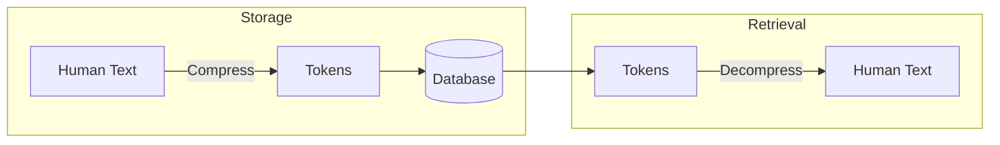

# All LLM Prompts

This document contains all LLM prompts used throughout the god-agent system.

## Compression Prompt

**Location:** `src/memory/LLMCompressor.ts:203-227`

**Used by:** `god_store`, `god_store_compressed`, memory compression pipeline

```
You are a semantic compression engine. Extract the pure meaning from this content using minimal tokens.

Rules:
- Strip ALL filler words (the, a, an, please, basically, actually, etc.)
- Strip ALL NLP pleasantries
- Keep ONLY semantic content that carries meaning
- Use abbreviations for common patterns:
  - comp = component
  - cfg = configuration/config
  - fn = function
  - impl = implementation
  - req = request/requirement
  - res = response
  - err = error
  - msg = message
- Use | as delimiter between distinct fields/concepts
- Use → for flows/sequences/causation
- Use . for lists within a field (A.B.C)
- Preserve technical terms, names, paths, and specific values exactly
- Format: TYPE|KEY_INFO|DETAILS|CONTEXT (adapt as needed)

Content to compress:
{CONTENT}

Output ONLY the compressed tokens. No explanation, no meta-commentary.
```

### Compression Examples

**Input:**
```
The TaskExecutor is an orchestrator component that executes tasks, decomposes them into subtasks, and heals from failures.
It depends on CodeGenerator and SelfHealer.
Location: codex/TaskExecutor.ts (~1800 lines)
```

**Output:**
```
TaskExecutor|O|exe.dec.heal|CG.SH|codex/TaskExecutor.ts|1800
```

---

## Decompression Prompt

**Location:** `src/memory/LLMCompressor.ts:229-242`

**Used by:** `god_query_expanded`, memory retrieval pipeline

```
You are a semantic decompression engine. Expand these compressed tokens to full human-readable meaning.

Rules:
- Expand ALL abbreviations to full words
- Restore natural language structure with proper grammar
- Preserve ALL semantic meaning - nothing should be lost
- Output clear, professional prose
- Maintain technical accuracy
- Do NOT add information that wasn't in the original

Compressed tokens:
{COMPRESSED}

Output ONLY the expanded human-readable text. No meta-commentary.
```

### Decompression Examples

**Input:**
```
TaskExecutor|O|exe.dec.heal|CG.SH|codex/TaskExecutor.ts|1800
```

**Output:**
```
TaskExecutor is an orchestrator component.
Actions: execute, decompose, heal
Dependencies: CodeGenerator, SelfHealer
Location: codex/TaskExecutor.ts (~1800 lines)
```

---

## Standard Abbreviations

| Abbreviation | Full Form |
|--------------|-----------|
| comp | component |
| cfg | configuration/config |
| fn | function |
| impl | implementation |
| req | request/requirement |
| res | response |
| err | error |
| msg | message |
| exec | execute |
| init | initialize |
| param | parameter |
| ctx | context |
| deps | dependencies |

## Delimiter Conventions

| Delimiter | Meaning | Example |
|-----------|---------|---------|
| `\|` | Field separator | `name\|type\|actions` |
| `→` | Flow/sequence | `input→process→output` |
| `.` | List items | `exe.dec.heal` |
| `:` | Key-value | `content:string` |
| `,` | Enumeration | `path1,path2,path3` |

## Compression vs Decompression Flow



## Provider Selection

| Provider | When Used |
|----------|-----------|
| **Claude Opus** | Primary (better quality) |
| **Ollama** | Fallback (rate limited/offline) |

The system tries Claude first, falls back to Ollama if:
- Anthropic API returns 429 (rate limited)
- Anthropic API is unavailable
- OLLAMA_ENDPOINT is configured

## Compression Metrics

Typical compression results with LLM compression:

| Content Type | Original | Compressed | Reduction |
|--------------|----------|------------|-----------|
| Failure record | 845 chars | 264 chars | 69% |
| Component docs | 400 chars | 120 chars | 70% |
| Error pattern | 300 chars | 90 chars | 70% |
| Generic text | 200 chars | 140 chars | 30% |

## Best Practices

1. **Preserve semantics**: The prompt emphasizes preserving technical terms, names, and paths exactly
2. **Use standard abbreviations**: Consistent abbreviations improve pattern matching
3. **Format consistently**: TYPE|KEY_INFO|DETAILS|CONTEXT pattern
4. **No meta-commentary**: Both prompts explicitly forbid explanations in output
