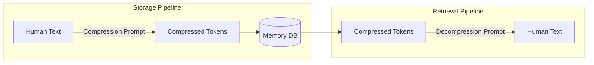

# Prompts

LLM prompts used throughout the RUBIX/god-agent system.

## Overview

The god-agent system uses carefully crafted prompts for:

| Prompt | Purpose | Location |
|--------|---------|----------|
| [Compression](compression-prompt.md) | Reduce content to minimal tokens | `LLMCompressor.ts` |
| [Decompression](decompression-prompt.md) | Expand tokens back to readable text | `LLMCompressor.ts` |

## Prompt Architecture

## Provider Fallback

Prompts are executed via:

1. **Claude Opus** (primary) - Higher quality compression
2. **Ollama** (fallback) - When rate limited or offline

## Quick Reference

- [Compression Prompt](compression-prompt.md) - Token reduction
- [Decompression Prompt](decompression-prompt.md) - Token expansion
- [All Prompts](all-prompts.md) - Complete reference with examples
