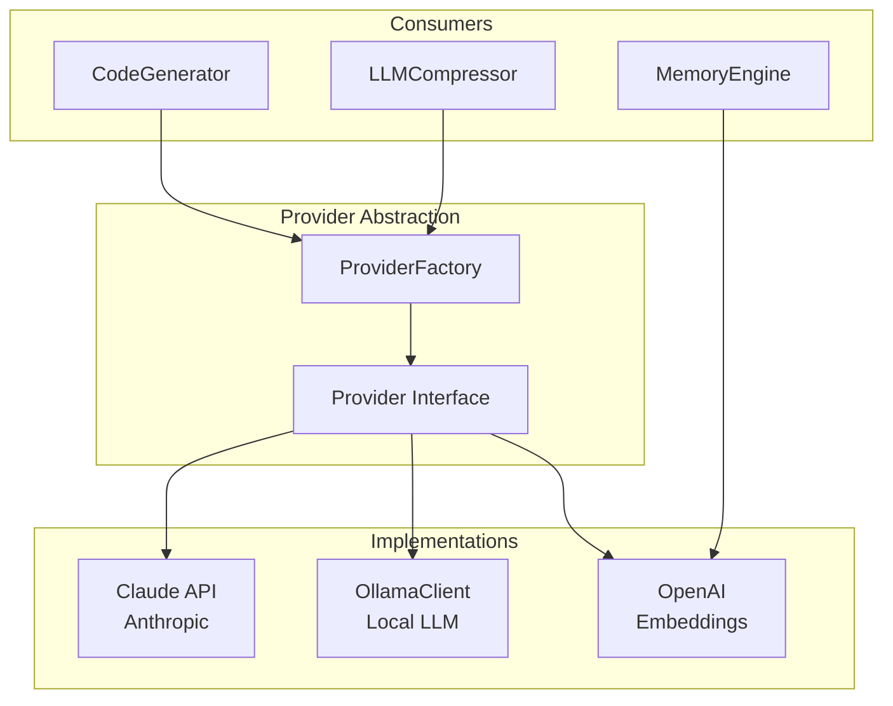
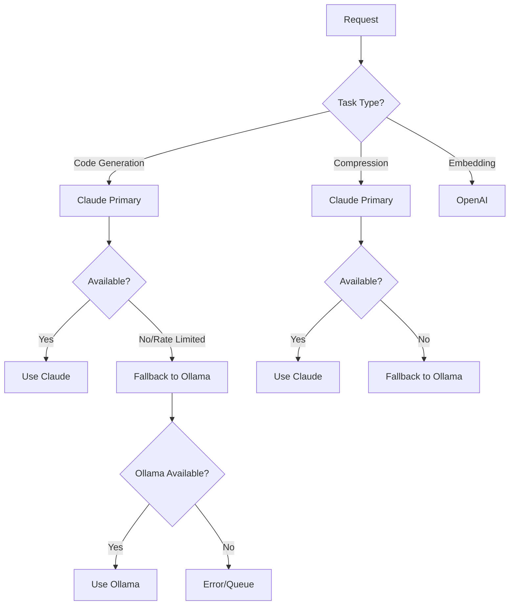
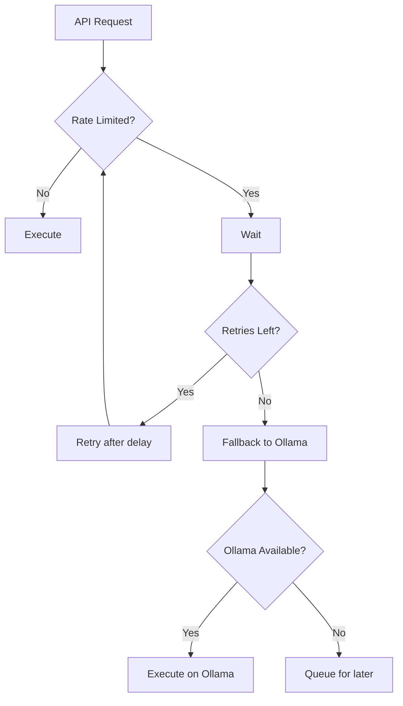

# Providers Documentation

The providers system provides a unified abstraction layer for LLM integrations.

## Overview



## File Reference

| File | Lines | Purpose |
|------|-------|---------|
| [ProviderFactory](provider-factory.md) | ~150 | Provider creation and management |
| [OllamaClient](ollama-client.md) | ~200 | Local LLM integration |
| [types.ts](types.md) | ~100 | Provider type definitions |

## Provider Interface

```typescript
interface LLMProvider {
  // Generate completion
  complete(prompt: string, options?: CompletionOptions): Promise<string>;

  // Check availability
  isAvailable(): boolean;

  // Get provider name
  getName(): string;

  // Get model info
  getModelInfo(): ModelInfo;
}

interface CompletionOptions {
  maxTokens?: number;
  temperature?: number;
  stopSequences?: string[];
  systemPrompt?: string;
}
```

## Available Providers

### Claude (Anthropic)

Primary provider for code generation and complex reasoning:

```typescript
const claude = ProviderFactory.createClaude({
  apiKey: process.env.ANTHROPIC_API_KEY,
  model: 'claude-opus-4-5-20251101',
  maxTokens: 8192
});

const response = await claude.complete(prompt, {
  systemPrompt: 'You are a code generation expert.',
  temperature: 0.7
});
```

### Ollama (Local)

Fallback provider for local LLM inference:

```typescript
const ollama = ProviderFactory.createOllama({
  endpoint: 'http://localhost:11434',
  model: 'qwen2.5-coder:32b'
});

const response = await ollama.complete(prompt);
```

### OpenAI (Embeddings)

Used exclusively for embedding generation:

```typescript
const openai = ProviderFactory.createOpenAI({
  apiKey: process.env.OPENAI_API_KEY,
  model: 'text-embedding-3-small',
  dimensions: 768
});

const embedding = await openai.embed(content);
```

## Provider Selection



## Configuration

### Environment Variables

| Variable | Default | Purpose |
|----------|---------|---------|
| `ANTHROPIC_API_KEY` | - | Claude API authentication |
| `OPENAI_API_KEY` | - | OpenAI API for embeddings |
| `OLLAMA_ENDPOINT` | `http://localhost:11434` | Local Ollama server |
| `OLLAMA_MODEL` | `qwen2.5-coder:32b` | Default Ollama model |
| `RUBIX_MODEL` | `claude-opus-4-5-20251101` | Claude model for RUBIX |

### Provider Priority

```typescript
const providerConfig = {
  primary: 'claude',
  fallback: ['ollama'],
  embeddings: 'openai',

  claude: {
    model: 'claude-opus-4-5-20251101',
    maxTokens: 8192,
    rateLimitRetries: 3
  },

  ollama: {
    endpoint: 'http://localhost:11434',
    model: 'qwen2.5-coder:32b',
    timeout: 120000
  },

  openai: {
    model: 'text-embedding-3-small',
    dimensions: 768
  }
};
```

## Rate Limiting



### Rate Limit Handling

```typescript
async function withRateLimitHandling<T>(
  fn: () => Promise<T>,
  maxRetries: number = 3
): Promise<T> {
  for (let attempt = 0; attempt < maxRetries; attempt++) {
    try {
      return await fn();
    } catch (error) {
      if (error.status === 429) {
        const waitMs = Math.pow(2, attempt) * 60000; // Exponential backoff
        await delay(waitMs);
        continue;
      }
      throw error;
    }
  }

  throw new Error('Max retries exceeded');
}
```

## Provider Metrics

```typescript
interface ProviderMetrics {
  requests: number;
  successes: number;
  failures: number;
  rateLimits: number;
  avgLatencyMs: number;
  tokensUsed: number;
}

// Get metrics
const metrics = provider.getMetrics();
console.log(`Success rate: ${(metrics.successes / metrics.requests * 100).toFixed(1)}%`);
```

## Usage in RUBIX

```typescript
// CodeGenerator uses Claude with Ollama fallback
class CodeGenerator {
  private provider: LLMProvider;

  constructor() {
    this.provider = ProviderFactory.create({
      primary: 'claude',
      fallback: 'ollama'
    });
  }

  async generate(prompt: string): Promise<CodeGenResult> {
    const response = await this.provider.complete(prompt, {
      maxTokens: 8192,
      systemPrompt: CODE_GEN_SYSTEM_PROMPT
    });

    return this.parseResponse(response);
  }
}
```

## Next Steps

- [ProviderFactory](provider-factory.md) - Factory implementation
- [OllamaClient](ollama-client.md) - Local LLM details
- [Types](types.md) - Type definitions
