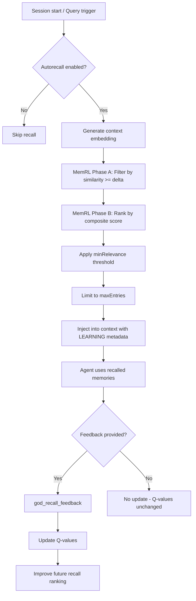

# Autorecall Tools

Tools for configuring and monitoring automatic memory recall, and for providing feedback on recalled memory quality to improve future retrieval.

## Tool Reference

| Tool | Purpose |
|------|---------|
| [god_autorecall_config](#god_autorecall_config) | Configure autorecall |
| [god_autorecall_status](#god_autorecall_status) | Check status |
| [god_recall_feedback](#god_recall_feedback) | Rate recalled memories |

---

## god_autorecall_config

Configure automatic memory recall settings. Controls when and how memories are automatically loaded into context.

### Parameters

| Parameter | Type | Required | Description |
|-----------|------|----------|-------------|
| `enabled` | boolean | No | Enable or disable automatic recall |
| `maxEntries` | number | No | Maximum number of entries to recall per trigger (default: 15) |
| `minRelevance` | number | No | Minimum relevance score for recalled entries (0.0 to 1.0, default: 0.5) |
| `triggerOn` | enum | No | When to trigger autorecall: `session_start`, `query`, or `both` (default: `session_start`) |

### Trigger Modes

| Mode | Description |
|------|-------------|
| `session_start` | Recall relevant memories at session start only |
| `query` | Recall relevant memories before each query |
| `both` | Recall at session start and before each query |

### Response

```json
{
  "success": true,
  "config": {
    "enabled": true,
    "maxEntries": 15,
    "minRelevance": 0.5,
    "triggerOn": "session_start"
  },
  "previousConfig": {
    "enabled": true,
    "maxEntries": 10,
    "minRelevance": 0.6,
    "triggerOn": "session_start"
  }
}
```

### Example

```typescript
// Enable autorecall with custom settings
await mcp__rubix__god_autorecall_config({
  enabled: true,
  maxEntries: 20,
  minRelevance: 0.4,
  triggerOn: "both"
});
```

```typescript
// Reduce autorecall to save context window space
await mcp__rubix__god_autorecall_config({
  maxEntries: 5,
  minRelevance: 0.7,
  triggerOn: "session_start"
});
```

```typescript
// Disable autorecall entirely
await mcp__rubix__god_autorecall_config({
  enabled: false
});
```

### Configuration Notes

1. **maxEntries**: Higher values provide more context but consume more of the context window. Start with 10-15 and adjust based on needs.
2. **minRelevance**: Lower thresholds recall more entries but may include less relevant ones. The MemRL system refines relevance scoring over time.
3. **triggerOn**: Using `both` provides the most context but uses more tokens per interaction. Use `session_start` for token-conscious workflows.

---

## god_autorecall_status

Check the current autorecall system status, including configuration and statistics from the last recall operation.

### Parameters

None.

### Response

```json
{
  "success": true,
  "status": {
    "enabled": true,
    "config": {
      "maxEntries": 15,
      "minRelevance": 0.5,
      "triggerOn": "session_start"
    },
    "lastRecall": {
      "timestamp": "2024-01-15T09:00:00Z",
      "trigger": "session_start",
      "entriesRecalled": 12,
      "entriesConsidered": 85,
      "averageRelevance": 0.72,
      "highestRelevance": 0.95,
      "lowestRelevance": 0.52,
      "tokensUsed": 3200,
      "duration": "1.2s"
    },
    "cumulativeStats": {
      "totalRecalls": 45,
      "totalEntriesRecalled": 540,
      "averageEntriesPerRecall": 12,
      "feedbackReceived": 30,
      "averageFeedbackScore": 0.74
    }
  }
}
```

### Example

```typescript
const status = await mcp__rubix__god_autorecall_status();

if (status.status.enabled) {
  console.log("Autorecall is enabled");
  console.log(`Trigger: ${status.status.config.triggerOn}`);
  console.log(`Max entries: ${status.status.config.maxEntries}`);

  if (status.status.lastRecall) {
    console.log(`\nLast recall: ${status.status.lastRecall.timestamp}`);
    console.log(`  Entries recalled: ${status.status.lastRecall.entriesRecalled}`);
    console.log(`  Avg relevance: ${status.status.lastRecall.averageRelevance}`);
    console.log(`  Tokens used: ${status.status.lastRecall.tokensUsed}`);
  }

  console.log(`\nTotal recalls: ${status.status.cumulativeStats.totalRecalls}`);
  console.log(`Feedback score: ${status.status.cumulativeStats.averageFeedbackScore}`);
} else {
  console.log("Autorecall is disabled");
}
```

### Use Cases

1. **Monitoring**: Check if autorecall is working as expected
2. **Tuning**: Review recall statistics to adjust configuration
3. **Debugging**: Verify that memories are being recalled with adequate relevance

---

## god_recall_feedback

Provide feedback on the quality of recalled memories. This updates MemRL Q-values, improving the relevance of future recall operations.

### Parameters

| Parameter | Type | Required | Description |
|-----------|------|----------|-------------|
| `trajectoryId` | string | Yes | Trajectory ID from the recall operation (provided in `[LEARNING]` context) |
| `quality` | number | Yes | Quality rating from 0.0 (useless) to 1.0 (perfect) |
| `memrlQueryId` | string | No | MemRL query ID for fine-grained Q-value updates (provided in `[LEARNING]` context) |

### Quality Scale

| Range | Meaning |
|-------|---------|
| 0.0 - 0.2 | Completely irrelevant or harmful |
| 0.2 - 0.4 | Mostly irrelevant, minor overlap |
| 0.4 - 0.6 | Somewhat relevant but not particularly useful |
| 0.6 - 0.8 | Relevant and useful context |
| 0.8 - 1.0 | Highly relevant, directly applicable |

### Response

```json
{
  "success": true,
  "trajectoryId": "traj_abc123",
  "quality": 0.85,
  "memrlUpdated": true,
  "qValueChanges": {
    "entriesUpdated": 12,
    "averageQBefore": 0.55,
    "averageQAfter": 0.62
  }
}
```

### Example

```typescript
// After evaluating recalled memories from session start
// The trajectoryId and memrlQueryId are provided in [LEARNING] context blocks
await mcp__rubix__god_recall_feedback({
  trajectoryId: "traj_abc123",
  quality: 0.8,
  memrlQueryId: "mq_xyz789"
});
```

```typescript
// Low-quality feedback pushes irrelevant entries down in future ranking
await mcp__rubix__god_recall_feedback({
  trajectoryId: "traj_def456",
  quality: 0.2,
  memrlQueryId: "mq_uvw321"
});
```

### How Feedback Works

1. **Q-Value Update**: Each recalled entry's Q-value is adjusted using the formula: `Q_new = Q_old + alpha * (reward - Q_old)`
2. **MemRL Phase B Impact**: Higher Q-values cause entries to rank higher in Phase B scoring: `score = (1-lambda) * sim_norm + lambda * Q_norm`
3. **Sona Integration**: Feedback also flows to the Sona trajectory learning system for broader pattern updates
4. **Drift Detection**: Large quality shifts trigger drift detection to prevent catastrophic forgetting

### When to Provide Feedback

- **After `/recall` at session start**: Rate the batch of memories loaded
- **After task completion**: Rate whether recalled context was helpful
- **Periodically**: Batch feedback every 3+ recall cycles
- **On explicit request**: When asked via `/rate` command

---

## Autorecall Flow



---

## Integration with MemRL

Autorecall is powered by the MemRL two-phase retrieval system:

```
Phase A (Filtering):
  - Compute similarity between query/context and all memory embeddings
  - Filter out entries below delta threshold
  - Purpose: Remove clearly irrelevant entries

Phase B (Ranking):
  - Normalize similarity scores (z-score)
  - Normalize Q-values (z-score)
  - Composite score = (1 - lambda) * sim_norm + lambda * Q_norm
  - Purpose: Rank by both relevance and learned quality
```

Feedback from `god_recall_feedback` directly updates the Q-values used in Phase B, creating a reinforcement learning loop where the system progressively learns which memories are most useful in which contexts.

---

## Best Practices

### Configuration

1. **Start Conservative**: Begin with `maxEntries: 10`, `minRelevance: 0.6`, `triggerOn: "session_start"`
2. **Adjust Based on Feedback**: If average feedback scores are low, increase `minRelevance`
3. **Expand Gradually**: If you need more context, increase `maxEntries` in steps of 5
4. **Token Awareness**: Monitor `tokensUsed` in status to ensure autorecall fits within context budget

### Providing Feedback

1. **Be Consistent**: Rate on the same scale each time for reliable MemRL updates
2. **Rate Honestly**: Low ratings are as valuable as high ones for learning
3. **Include memrlQueryId**: When available, include it for per-entry Q-value updates
4. **Batch Feedback**: Do not feel obligated to rate every recall; batch ratings are effective

### Monitoring

1. **Check Status Weekly**: Ensure autorecall is performing well
2. **Watch Average Relevance**: Should trend upward over time with feedback
3. **Review Feedback Scores**: Consistently low scores suggest configuration or memory quality issues
4. **Track Token Usage**: Ensure autorecall is not consuming too much of the context window

## Next Steps

- [Learning Tools](learning-tools.md) - Sona and MemRL systems
- [Memory Tools](memory-tools.md) - Core memory operations
- [Compression Tools](compression-tools.md) - Compressed memory storage
- [Tools Overview](index.md) - All tools