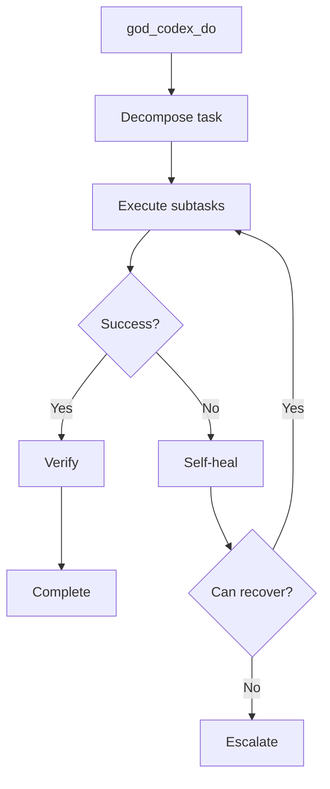

# CODEX Tools

Tools for interacting with the RUBIX autonomous task execution system.

## Tool Reference

| Tool | Purpose |
|------|---------|
| [god_codex_do](#god_codex_do) | Submit task |
| [god_codex_status](#god_codex_status) | Get status |
| [god_codex_answer](#god_codex_answer) | Answer escalation |
| [god_codex_decision](#god_codex_decision) | Make decision |
| [god_codex_cancel](#god_codex_cancel) | Cancel task |
| [god_codex_log](#god_codex_log) | Get work log |
| [god_codex_wait](#god_codex_wait) | Extend timeout |

---

## god_codex_do

Submit a task to RUBIX for autonomous execution.

### Parameters

| Parameter | Type | Required | Description |
|-----------|------|----------|-------------|
| `description` | string | Yes | What you want RUBIX to do |
| `codebase` | string | Yes | Path to codebase |
| `specification` | string | No | Detailed requirements |
| `constraints` | string[] | No | Constraints to follow |
| `verificationUrl` | string | No | URL for visual verification |
| `dryRun` | boolean | No | Preview without executing |

### Response

```json
{
  "success": true,
  "taskId": "task_abc123...",
  "status": "decomposing",
  "message": "Task submitted. Check status with god_codex_status."
}
```

### Example

```typescript
await mcp__rubix__god_codex_do({
  description: "Add user authentication with JWT",
  codebase: "D:/my-project",
  constraints: [
    "Use TypeScript",
    "Add unit tests",
    "Follow existing patterns"
  ],
  verificationUrl: "http://localhost:3000"
});
```

### Execution Flow



---

## god_codex_status

Get current RUBIX execution status.

### Parameters

None.

### Response

```json
{
  "success": true,
  "status": "executing",
  "taskId": "task_abc123...",
  "currentTask": {
    "description": "Add user authentication with JWT",
    "subtasks": [
      { "id": "sub1", "type": "research", "status": "completed" },
      { "id": "sub2", "type": "design", "status": "completed" },
      { "id": "sub3", "type": "code", "status": "in_progress" },
      { "id": "sub4", "type": "test", "status": "pending" }
    ]
  },
  "progress": {
    "completed": 2,
    "total": 4,
    "percentage": 50
  },
  "currentSubtask": {
    "id": "sub3",
    "type": "code",
    "description": "Implement authentication controller",
    "attempt": 1
  },
  "pendingDecisions": [],
  "pendingEscalations": [],
  "activeTime": 45000,
  "errors": []
}
```

### Status Values

| Status | Description |
|--------|-------------|
| `idle` | No task running |
| `decomposing` | Breaking down task |
| `executing` | Running subtasks |
| `verifying` | Verifying results |
| `waiting_for_user` | Waiting for escalation response |
| `completed` | Task finished successfully |
| `failed` | Task failed |
| `cancelled` | Task was cancelled |

### Example

```typescript
const status = await mcp__rubix__god_codex_status();

if (status.status === 'waiting_for_user') {
  console.log('Escalation pending:', status.pendingEscalations);
}
```

---

## god_codex_answer

Answer a pending RUBIX escalation.

### Parameters

| Parameter | Type | Required | Description |
|-----------|------|----------|-------------|
| `escalationId` | string | Yes | Escalation ID |
| `answer` | string | Yes | Your answer/resolution |
| `optionIndex` | number | No | Selected option index (if options provided) |

### Response

```json
{
  "success": true,
  "escalationId": "esc_xyz...",
  "resolved": true,
  "message": "Escalation resolved. Task execution resumed."
}
```

### Example

```typescript
// Get status to see pending escalations
const status = await mcp__rubix__god_codex_status();

if (status.pendingEscalations.length > 0) {
  const escalation = status.pendingEscalations[0];

  // Answer the escalation
  await mcp__rubix__god_codex_answer({
    escalationId: escalation.id,
    answer: "Use JWT tokens with 24-hour expiry",
    optionIndex: 0  // If options were provided
  });
}
```

---

## god_codex_decision

Answer a pending RUBIX decision (similar to answer, for business decisions).

### Parameters

| Parameter | Type | Required | Description |
|-----------|------|----------|-------------|
| `decisionId` | string | Yes | Decision ID |
| `answer` | string | Yes | Your decision |
| `optionIndex` | number | No | Selected option index |

### Response

```json
{
  "success": true,
  "decisionId": "dec_xyz...",
  "resolved": true
}
```

### Example

```typescript
await mcp__rubix__god_codex_decision({
  decisionId: "dec_123",
  answer: "Add bcrypt dependency",
  optionIndex: 1
});
```

---

## god_codex_cancel

Cancel the current RUBIX task.

### Parameters

None.

### Response

```json
{
  "success": true,
  "taskId": "task_abc123...",
  "message": "Task cancelled. Completed subtasks remain."
}
```

### Example

```typescript
await mcp__rubix__god_codex_cancel();
```

### Notes

- Stops execution immediately
- Completed subtasks remain complete
- Generated files remain in codebase
- Use git to revert if needed

---

## god_codex_log

Get the full work log from RUBIX.

### Parameters

None.

### Response

```json
{
  "success": true,
  "entries": [
    {
      "timestamp": "2024-01-15T10:00:01Z",
      "event": "task_started",
      "taskId": "task_abc123...",
      "details": "Add user authentication with JWT"
    },
    {
      "timestamp": "2024-01-15T10:00:05Z",
      "event": "decomposition_complete",
      "subtaskCount": 4
    },
    {
      "timestamp": "2024-01-15T10:00:10Z",
      "event": "subtask_started",
      "subtaskId": "sub1",
      "type": "research"
    },
    {
      "timestamp": "2024-01-15T10:00:30Z",
      "event": "subtask_completed",
      "subtaskId": "sub1",
      "duration": 20000
    },
    {
      "timestamp": "2024-01-15T10:01:00Z",
      "event": "file_created",
      "path": "src/auth/controller.ts"
    }
  ]
}
```

### Event Types

| Event | Description |
|-------|-------------|
| `task_started` | Task execution began |
| `decomposition_complete` | Task broken into subtasks |
| `subtask_started` | Subtask execution began |
| `subtask_completed` | Subtask finished successfully |
| `subtask_failed` | Subtask failed |
| `file_created` | New file created |
| `file_modified` | File was modified |
| `escalation_created` | Escalation sent to user |
| `escalation_resolved` | User responded to escalation |
| `task_completed` | Task finished |
| `task_failed` | Task failed |
| `task_cancelled` | Task was cancelled |

### Example

```typescript
const log = await mcp__rubix__god_codex_log();

// Filter to failures
const failures = log.entries.filter(e => e.event === 'subtask_failed');
```

---

## god_codex_wait

Extend the timeout for pending escalations.

### Parameters

| Parameter | Type | Required | Description |
|-----------|------|----------|-------------|
| `minutes` | number | No | Minutes to extend (default: 10) |

### Response

```json
{
  "success": true,
  "extendedBy": 10,
  "newTimeout": "2024-01-15T10:20:00Z"
}
```

### Example

```typescript
// Extend by default 10 minutes
await mcp__rubix__god_codex_wait();

// Extend by 30 minutes
await mcp__rubix__god_codex_wait({ minutes: 30 });
```

### When to Use

Use when you need more time to respond to an escalation:

```typescript
// Get status
const status = await mcp__rubix__god_codex_status();

if (status.status === 'waiting_for_user') {
  // Need more time to think
  await mcp__rubix__god_codex_wait({ minutes: 30 });

  // Later, answer the escalation
  await mcp__rubix__god_codex_answer({
    escalationId: status.pendingEscalations[0].id,
    answer: "..."
  });
}
```

---

## Workflow Examples

### Basic Task Execution

```typescript
// 1. Submit task
await mcp__rubix__god_codex_do({
  description: "Add user profile page",
  codebase: "D:/my-app"
});

// 2. Monitor progress
let status;
do {
  await delay(5000);
  status = await mcp__rubix__god_codex_status();
  console.log(`Progress: ${status.progress.percentage}%`);
} while (status.status === 'executing');

// 3. Handle escalations
if (status.status === 'waiting_for_user') {
  for (const esc of status.pendingEscalations) {
    await mcp__rubix__god_codex_answer({
      escalationId: esc.id,
      answer: "Use existing UserCard component"
    });
  }
}

// 4. Check final result
const finalStatus = await mcp__rubix__god_codex_status();
if (finalStatus.status === 'completed') {
  console.log('Task completed successfully!');
}
```

### With Verification

```typescript
await mcp__rubix__god_codex_do({
  description: "Add login button to header",
  codebase: "D:/my-webapp",
  verificationUrl: "http://localhost:3000",
  constraints: [
    "Button should be visible on all pages",
    "Use primary button style"
  ]
});

// RUBIX will:
// 1. Generate the code
// 2. Launch browser via Playwright
// 3. Navigate to verification URL
// 4. Assert button is visible
// 5. Take screenshot as proof
```

### Dry Run

```typescript
// Preview what would happen
const preview = await mcp__rubix__god_codex_do({
  description: "Refactor auth module",
  codebase: "D:/my-app",
  dryRun: true
});

// Review the plan
console.log('Planned subtasks:', preview.subtasks);

// If happy, run for real
await mcp__rubix__god_codex_do({
  description: "Refactor auth module",
  codebase: "D:/my-app"
});
```

## Next Steps

- [Task Execution](../architecture/task-execution.md) - Execution architecture
- [TaskExecutor](../codex/task-executor.md) - TaskExecutor documentation
- [Self-Healer](../codex/self-healer.md) - Self-healing system
