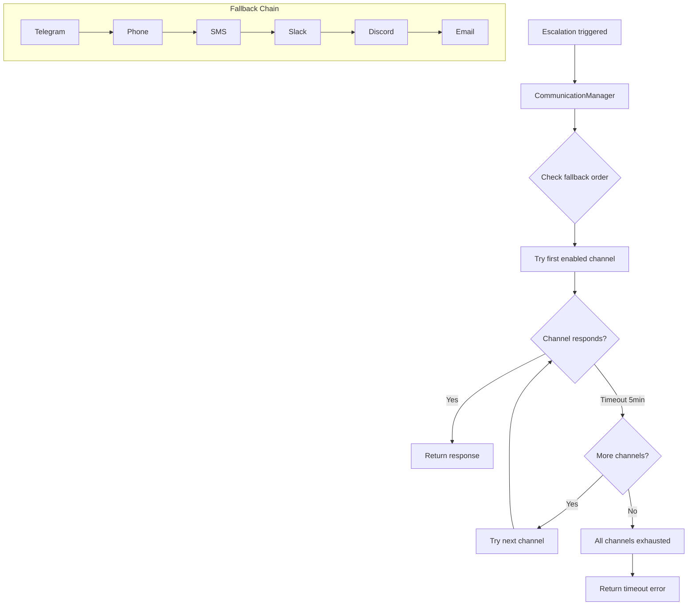

# Communication Tools

Tools for configuring and using multi-channel escalation.

## Tool Reference

| Tool | Purpose |
|------|---------|
| [god_comms_setup](#god_comms_setup) | Configure channels |
| [god_comms_escalate](#god_comms_escalate) | Trigger escalation |

---

## god_comms_setup

Configure RUBIX escalation communication channels.

### Parameters

| Parameter | Type | Required | Description |
|-----------|------|----------|-------------|
| `mode` | enum | No | Setup mode (default: wizard) |
| `channel` | enum | No | Channel to configure (for set/disable) |
| `config` | object | No | Channel-specific configuration |
| `fallbackOrder` | string[] | No | New fallback order |

### Modes

| Mode | Description |
|------|-------------|
| `wizard` | Show setup instructions |
| `status` | Show current configuration |
| `test` | Test all configured channels |
| `set` | Configure a specific channel |
| `disable` | Disable a specific channel |
| `enable` | Enable a specific channel |
| `order` | Set fallback order |

### Channels

| Channel | Timeout | Description |
|---------|---------|-------------|
| `telegram` | 5 min | Telegram bot messages |
| `phone` | 5 min | Voice call (CallMe/Twilio/Telnyx) |
| `sms` | 5 min | SMS text message |
| `slack` | 5 min | Slack webhook |
| `discord` | 5 min | Discord webhook |
| `email` | 5 min | Email notification |

### Response (status mode)

```json
{
  "success": true,
  "channels": {
    "telegram": {
      "enabled": true,
      "configured": true,
      "config": {
        "chatId": "123456789"
      }
    },
    "phone": {
      "enabled": false,
      "configured": false,
      "config": null
    },
    "sms": {
      "enabled": false,
      "configured": false,
      "config": null
    },
    "slack": {
      "enabled": true,
      "configured": true,
      "config": {
        "webhookUrl": "https://hooks.slack.com/..."
      }
    },
    "discord": {
      "enabled": false,
      "configured": false,
      "config": null
    },
    "email": {
      "enabled": false,
      "configured": false,
      "config": null
    }
  },
  "fallbackOrder": ["telegram", "slack", "discord", "email"],
  "defaultTimeout": 300000
}
```

### Examples

```typescript
// Check current status
await mcp__rubix__god_comms_setup({
  mode: "status"
});

// Configure phone channel
await mcp__rubix__god_comms_setup({
  mode: "set",
  channel: "phone",
  config: {
    phoneNumber: "+15551234567",
    provider: "callme"  // callme, twilio, telnyx
  }
});

// Configure Slack
await mcp__rubix__god_comms_setup({
  mode: "set",
  channel: "slack",
  config: {
    webhookUrl: "https://hooks.slack.com/services/T00/B00/XXX",
    channel: "#alerts"
  }
});

// Set fallback order
await mcp__rubix__god_comms_setup({
  mode: "order",
  fallbackOrder: ["telegram", "phone", "slack", "email"]
});

// Test all channels
await mcp__rubix__god_comms_setup({
  mode: "test"
});

// Disable a channel
await mcp__rubix__god_comms_setup({
  mode: "disable",
  channel: "sms"
});
```

### Channel Configuration Objects

#### Telegram

```typescript
{
  chatId: "123456789",       // Required: Chat ID to send to
  botToken: "..."            // Optional: Override bot token
}
```

#### Phone

```typescript
{
  phoneNumber: "+15551234567",  // Required: Phone number
  provider: "callme",          // Required: callme, twilio, telnyx
  // Provider-specific options
  twilioSid: "...",            // For Twilio
  twilioAuth: "...",           // For Twilio
  telnyxApiKey: "..."          // For Telnyx
}
```

#### SMS

```typescript
{
  phoneNumber: "+15551234567",  // Required: Phone number
  provider: "twilio",          // Required: twilio, telnyx
  // Provider credentials
}
```

#### Slack

```typescript
{
  webhookUrl: "https://hooks.slack.com/...",  // Required
  channel: "#alerts",                          // Optional
  username: "RUBIX Bot",                       // Optional
  iconEmoji: ":robot_face:"                    // Optional
}
```

#### Discord

```typescript
{
  webhookUrl: "https://discord.com/api/webhooks/...",  // Required
  username: "RUBIX Bot",                                // Optional
  avatarUrl: "https://..."                              // Optional
}
```

#### Email

```typescript
{
  to: "user@example.com",       // Required: Recipient
  from: "rubix@example.com",    // Required: Sender
  smtpHost: "smtp.example.com", // Required: SMTP host
  smtpPort: 587,                // Required: SMTP port
  smtpUser: "...",              // Required: SMTP username
  smtpPass: "..."               // Required: SMTP password
}
```

---

## god_comms_escalate

Manually trigger an escalation through the communication chain.

### Parameters

| Parameter | Type | Required | Description |
|-----------|------|----------|-------------|
| `title` | string | Yes | Escalation title |
| `message` | string | Yes | Message to send |
| `type` | enum | No | Escalation type |
| `options` | array | No | Response options to present |

### Escalation Types

| Type | Description |
|------|-------------|
| `clarification` | Need more information |
| `decision` | Need a decision |
| `blocked` | Cannot proceed |
| `approval` | Need approval |

### Response

```json
{
  "success": true,
  "escalationId": "esc_abc123...",
  "channelUsed": "telegram",
  "response": {
    "answer": "Proceed with option A",
    "selectedOption": 0,
    "respondedAt": "2024-01-15T10:05:00Z"
  },
  "totalWaitTime": 180000
}
```

### Examples

```typescript
// Ask for clarification
const response = await mcp__rubix__god_comms_escalate({
  title: "Database Type Clarification",
  message: "Which database should I use for the user service?",
  type: "clarification",
  options: [
    { label: "PostgreSQL", description: "Relational, ACID compliant" },
    { label: "MongoDB", description: "Document store, flexible schema" },
    { label: "SQLite", description: "Embedded, single-file" }
  ]
});

console.log(`User chose: ${response.response.answer}`);

// Request approval
const approval = await mcp__rubix__god_comms_escalate({
  title: "Schema Migration Approval",
  message: "About to run migration that drops the 'legacy_users' table. 1,234 rows will be deleted. Proceed?",
  type: "approval",
  options: [
    { label: "Approve", description: "Proceed with migration" },
    { label: "Reject", description: "Cancel the migration" }
  ]
});

if (approval.response.selectedOption === 0) {
  // Run migration
}

// Report blocked state
await mcp__rubix__god_comms_escalate({
  title: "Build Blocked",
  message: "Cannot compile: missing dependency '@company/internal-lib'. I don't have access to the private npm registry.",
  type: "blocked",
  options: [
    { label: "Provide credentials", description: "User will add npm token" },
    { label: "Skip dependency", description: "Find alternative approach" },
    { label: "Cancel task", description: "Abort the current task" }
  ]
});
```

---

## Escalation Flow



---

## Escalation Message Format

### Telegram

```
🚨 RUBIX Escalation

Type: Decision
Title: Database Type Clarification

Which database should I use for the user service?

Options:
1. PostgreSQL - Relational, ACID compliant
2. MongoDB - Document store, flexible schema
3. SQLite - Embedded, single-file

Reply with number (1-3) or custom response:
```

### Slack

```json
{
  "attachments": [{
    "color": "#ff9800",
    "title": "🚨 RUBIX Escalation: Database Type Clarification",
    "text": "Which database should I use for the user service?",
    "fields": [
      { "title": "Type", "value": "Decision", "short": true }
    ],
    "actions": [
      { "type": "button", "text": "PostgreSQL", "value": "0" },
      { "type": "button", "text": "MongoDB", "value": "1" },
      { "type": "button", "text": "SQLite", "value": "2" }
    ]
  }]
}
```

---

## Integration with CODEX

Escalations are automatic in RUBIX task execution:

```typescript
// In EscalationGate.ts
async shouldEscalate(context: EscalationContext): Promise<EscalationDecision> {
  // Check hard rules
  if (this.isCriticalSpecAmbiguity(context)) {
    return { mustEscalate: true, reason: "Critical spec ambiguity" };
  }

  if (context.attemptCount >= this.maxAttempts) {
    return { mustEscalate: true, reason: "Max attempts exceeded" };
  }

  // Check if we can make autonomous decision
  if (this.canDecideAutonomously(context)) {
    return { mustEscalate: false };
  }

  return { mustEscalate: true, reason: "Cannot resolve without user" };
}

// In TaskExecutor.ts
if (escalationDecision.mustEscalate) {
  const response = await this.communicationManager.escalate({
    title: `Blocked: ${subtask.description}`,
    message: context.error,
    type: "blocked",
    options: context.alternatives
  });

  // Use response to continue
}
```

---

## Best Practices

### Channel Setup

1. **Configure Multiple Channels**: Don't rely on just one
2. **Test Regularly**: Use `mode: "test"` to verify
3. **Order by Priority**: Put fastest-response channel first
4. **Keep Credentials Secure**: Use environment variables

### Escalation Messages

1. **Be Specific**: Include all relevant context
2. **Provide Options**: When possible, give clear choices
3. **Explain Impact**: What happens with each choice
4. **Include Urgency**: Type indicates importance

### Response Handling

1. **Handle Timeouts**: Have fallback behavior
2. **Log All Escalations**: For audit trail
3. **Learn from Patterns**: Reduce future escalations

---

## Configuration Example

```typescript
// Full communication setup
async function setupCommunication() {
  // 1. Configure Telegram (primary)
  await mcp__rubix__god_comms_setup({
    mode: "set",
    channel: "telegram",
    config: { chatId: process.env.TELEGRAM_CHAT_ID }
  });

  // 2. Configure Slack (backup)
  await mcp__rubix__god_comms_setup({
    mode: "set",
    channel: "slack",
    config: { webhookUrl: process.env.SLACK_WEBHOOK }
  });

  // 3. Set fallback order
  await mcp__rubix__god_comms_setup({
    mode: "order",
    fallbackOrder: ["telegram", "slack", "email"]
  });

  // 4. Test configuration
  const test = await mcp__rubix__god_comms_setup({
    mode: "test"
  });

  console.log("Communication setup complete");
  return test;
}
```

## Next Steps

- [Telegram Bot Guide](../communication/telegram-bot-guide.md) - Interactive bot commands
- [CODEX Tools](codex-tools.md) - Task execution
- [Notification Tools](notification-tools.md) - Notifications
- [Escalation Gate](../codex/escalation-gate.md) - Escalation logic
