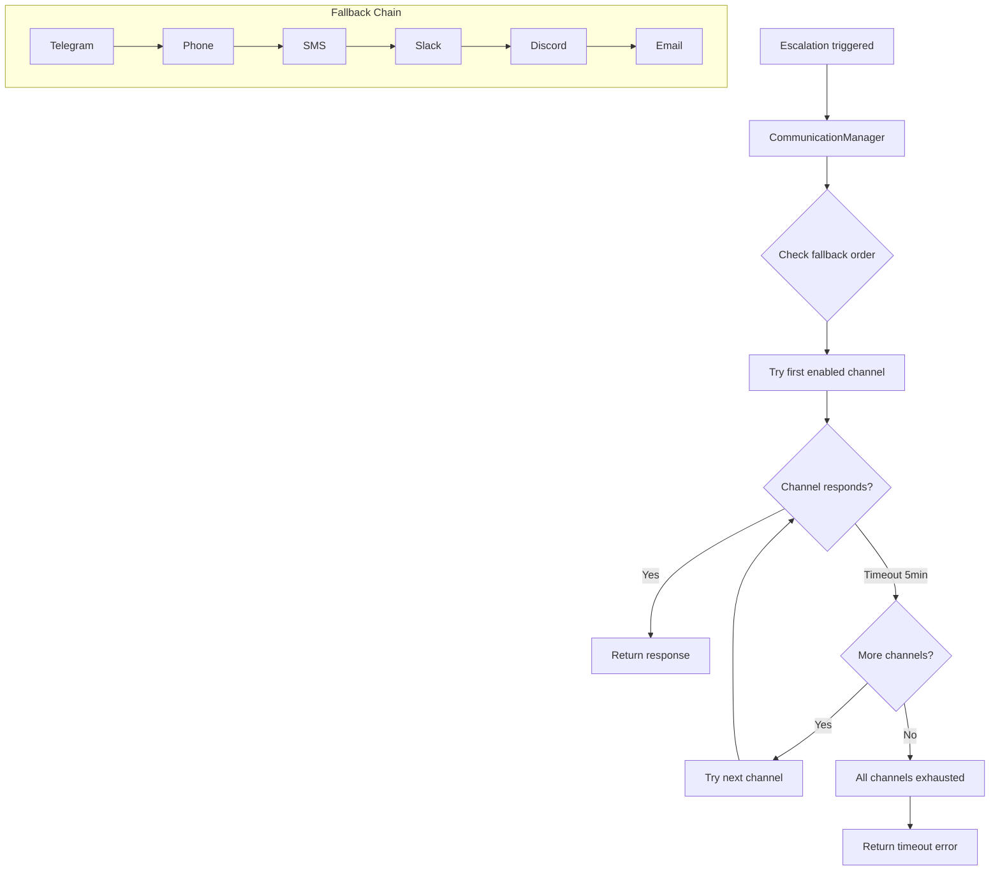
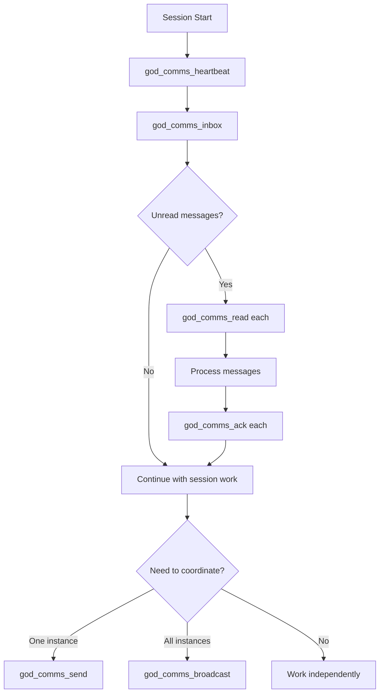

# Communication Tools

Tools for multi-channel escalation, inter-instance messaging, remote control, and autonomous triggers.

## Tool Reference

| Tool | Section | Purpose |
|------|---------|---------|
| [god_comms_setup](#god_comms_setup) | Escalation | Configure escalation channels |
| [god_comms_escalate](#god_comms_escalate) | Escalation | Trigger escalation to user |
| [god_comms_heartbeat](#god_comms_heartbeat) | Messaging | Register instance presence |
| [god_comms_send](#god_comms_send) | Messaging | Send message to specific instance |
| [god_comms_broadcast](#god_comms_broadcast) | Messaging | Send message to all instances |
| [god_comms_inbox](#god_comms_inbox) | Messaging | Check unread messages |
| [god_comms_read](#god_comms_read) | Messaging | Mark message as read |
| [god_comms_ack](#god_comms_ack) | Messaging | Acknowledge processed message |
| [god_comms_thread](#god_comms_thread) | Messaging | Get full conversation thread |
| [god_comms_peers](#god_comms_peers) | Messaging | List known instances |
| [god_afk](#god_afk) | Remote Control | Toggle AFK mode |
| [god_comms_trigger](#god_comms_trigger) | Triggers | Create session-spawning trigger |
| [god_comms_trigger_status](#god_comms_trigger_status) | Triggers | Check trigger status |
| [god_comms_trigger_cancel](#god_comms_trigger_cancel) | Triggers | Cancel a pending trigger |

---

# Escalation

Tools for configuring and using multi-channel escalation to reach the user.

---

## god_comms_setup

Configure RUBIX escalation communication channels.

### Parameters

| Parameter | Type | Required | Description |
|-----------|------|----------|-------------|
| `mode` | enum | No | Setup mode (default: wizard) |
| `channel` | enum | No | Channel to configure (for set/disable) |
| `config` | object | No | Channel-specific configuration |
| `fallbackOrder` | string[] | No | New fallback order |

### Modes

| Mode | Description |
|------|-------------|
| `wizard` | Show setup instructions |
| `status` | Show current configuration |
| `test` | Test all configured channels |
| `set` | Configure a specific channel |
| `disable` | Disable a specific channel |
| `enable` | Enable a specific channel |
| `order` | Set fallback order |

### Channels

| Channel | Timeout | Description |
|---------|---------|-------------|
| `telegram` | 5 min | Telegram bot messages |
| `phone` | 5 min | Voice call (CallMe/Twilio/Telnyx) |
| `sms` | 5 min | SMS text message |
| `slack` | 5 min | Slack webhook |
| `discord` | 5 min | Discord webhook |
| `email` | 5 min | Email notification |

### Response (status mode)

```json
{
  "success": true,
  "channels": {
    "telegram": {
      "enabled": true,
      "configured": true,
      "config": {
        "chatId": "123456789"
      }
    },
    "phone": {
      "enabled": false,
      "configured": false,
      "config": null
    },
    "sms": {
      "enabled": false,
      "configured": false,
      "config": null
    },
    "slack": {
      "enabled": true,
      "configured": true,
      "config": {
        "webhookUrl": "https://hooks.slack.com/..."
      }
    },
    "discord": {
      "enabled": false,
      "configured": false,
      "config": null
    },
    "email": {
      "enabled": false,
      "configured": false,
      "config": null
    }
  },
  "fallbackOrder": ["telegram", "slack", "discord", "email"],
  "defaultTimeout": 300000
}
```

### Examples

```typescript
// Check current status
await mcp__rubix__god_comms_setup({
  mode: "status"
});

// Configure phone channel
await mcp__rubix__god_comms_setup({
  mode: "set",
  channel: "phone",
  config: {
    phoneNumber: "+15551234567",
    provider: "callme"  // callme, twilio, telnyx
  }
});

// Configure Slack
await mcp__rubix__god_comms_setup({
  mode: "set",
  channel: "slack",
  config: {
    webhookUrl: "https://hooks.slack.com/services/T00/B00/XXX",
    channel: "#alerts"
  }
});

// Set fallback order
await mcp__rubix__god_comms_setup({
  mode: "order",
  fallbackOrder: ["telegram", "phone", "slack", "email"]
});

// Test all channels
await mcp__rubix__god_comms_setup({
  mode: "test"
});

// Disable a channel
await mcp__rubix__god_comms_setup({
  mode: "disable",
  channel: "sms"
});
```

### Channel Configuration Objects

#### Telegram

```typescript
{
  chatId: "123456789",       // Required: Chat ID to send to
  botToken: "..."            // Optional: Override bot token
}
```

#### Phone

```typescript
{
  phoneNumber: "+15551234567",  // Required: Phone number
  provider: "callme",          // Required: callme, twilio, telnyx
  // Provider-specific options
  twilioSid: "...",            // For Twilio
  twilioAuth: "...",           // For Twilio
  telnyxApiKey: "..."          // For Telnyx
}
```

#### SMS

```typescript
{
  phoneNumber: "+15551234567",  // Required: Phone number
  provider: "twilio",          // Required: twilio, telnyx
  // Provider credentials
}
```

#### Slack

```typescript
{
  webhookUrl: "https://hooks.slack.com/...",  // Required
  channel: "#alerts",                          // Optional
  username: "RUBIX Bot",                       // Optional
  iconEmoji: ":robot_face:"                    // Optional
}
```

#### Discord

```typescript
{
  webhookUrl: "https://discord.com/api/webhooks/...",  // Required
  username: "RUBIX Bot",                                // Optional
  avatarUrl: "https://..."                              // Optional
}
```

#### Email

```typescript
{
  to: "user@example.com",       // Required: Recipient
  from: "rubix@example.com",    // Required: Sender
  smtpHost: "smtp.example.com", // Required: SMTP host
  smtpPort: 587,                // Required: SMTP port
  smtpUser: "...",              // Required: SMTP username
  smtpPass: "..."               // Required: SMTP password
}
```

---

## god_comms_escalate

Manually trigger an escalation through the communication chain. The system auto-detects whether the daemon is running and routes accordingly: Telegram when daemon is active, CLI fallback when it is not.

### Parameters

| Parameter | Type | Required | Description |
|-----------|------|----------|-------------|
| `title` | string | Yes | Escalation title |
| `message` | string | Yes | Message to send |
| `type` | enum | No | Escalation type |
| `options` | array | No | Response options to present |

### Escalation Types

| Type | Description |
|------|-------------|
| `clarification` | Need more information |
| `decision` | Need a decision |
| `blocked` | Cannot proceed |
| `approval` | Need approval |

### Response

```json
{
  "success": true,
  "escalationId": "esc_abc123...",
  "channelUsed": "telegram",
  "response": {
    "answer": "Proceed with option A",
    "selectedOption": 0,
    "respondedAt": "2024-01-15T10:05:00Z"
  },
  "totalWaitTime": 180000
}
```

### Examples

```typescript
// Ask for clarification
const response = await mcp__rubix__god_comms_escalate({
  title: "Database Type Clarification",
  message: "Which database should I use for the user service?",
  type: "clarification",
  options: [
    { label: "PostgreSQL", description: "Relational, ACID compliant" },
    { label: "MongoDB", description: "Document store, flexible schema" },
    { label: "SQLite", description: "Embedded, single-file" }
  ]
});

console.log(`User chose: ${response.response.answer}`);

// Request approval
const approval = await mcp__rubix__god_comms_escalate({
  title: "Schema Migration Approval",
  message: "About to run migration that drops the 'legacy_users' table. 1,234 rows will be deleted. Proceed?",
  type: "approval",
  options: [
    { label: "Approve", description: "Proceed with migration" },
    { label: "Reject", description: "Cancel the migration" }
  ]
});

if (approval.response.selectedOption === 0) {
  // Run migration
}

// Report blocked state
await mcp__rubix__god_comms_escalate({
  title: "Build Blocked",
  message: "Cannot compile: missing dependency '@company/internal-lib'. I don't have access to the private npm registry.",
  type: "blocked",
  options: [
    { label: "Provide credentials", description: "User will add npm token" },
    { label: "Skip dependency", description: "Find alternative approach" },
    { label: "Cancel task", description: "Abort the current task" }
  ]
});
```

---

# Inter-Instance Messaging

Tools for communication between God-Agent instances via a shared `comms.db` database. Each instance must call `god_comms_heartbeat` before using any other messaging tool.

---

## god_comms_heartbeat

Register instance presence and identity. This must be called before any other inter-instance messaging tool. Heartbeats are used to track which instances are online and when they were last active.

### Parameters

| Parameter | Type | Required | Description |
|-----------|------|----------|-------------|
| `instanceId` | string | Yes | Unique instance identifier (e.g., `"instance_1"`) |
| `name` | string | No | Human-readable instance name (e.g., `"Forge"`) |
| `role` | string | No | Instance role (e.g., `"orchestrator"`, `"worker"`) |

### Response

```json
{
  "success": true,
  "instanceId": "instance_1",
  "name": "Forge",
  "role": "orchestrator",
  "registeredAt": "2026-02-14T10:00:00Z"
}
```

### Examples

```typescript
// Register as the primary orchestrator instance
await mcp__rubix__god_comms_heartbeat({
  instanceId: "instance_1",
  name: "Forge",
  role: "orchestrator"
});

// Register as a worker instance (minimal)
await mcp__rubix__god_comms_heartbeat({
  instanceId: "instance_3"
});

// Register with a descriptive role
await mcp__rubix__god_comms_heartbeat({
  instanceId: "instance_4",
  name: "Loom",
  role: "cross-cutting coordinator"
});
```

---

## god_comms_send

Send a message to a specific instance. Messages are stored in `comms.db` and the target instance will see them when it checks its inbox. Use `threadId` to create threaded conversations.

### Parameters

| Parameter | Type | Required | Description |
|-----------|------|----------|-------------|
| `to` | string | Yes | Target instance ID (e.g., `"instance_2"`) |
| `type` | enum | Yes | Message type: `task`, `notification`, `question`, `response`, `status` |
| `subject` | string | Yes | Message subject line |
| `payload` | object | Yes | Message content (free-form object) |
| `threadId` | string | No | Thread ID to reply to (use original message ID) |
| `priority` | enum | No | Priority level: `normal` (default), `high`, `urgent` |

### Response

```json
{
  "success": true,
  "messageId": "msg_a1b2c3d4...",
  "to": "instance_2",
  "type": "task",
  "subject": "Implement auth middleware",
  "sentAt": "2026-02-14T10:05:00Z"
}
```

### Examples

```typescript
// Assign a task to another instance
await mcp__rubix__god_comms_send({
  to: "instance_2",
  type: "task",
  subject: "Implement JWT authentication middleware",
  payload: {
    description: "Add passport-jwt middleware to all /api routes",
    files: ["src/middleware/auth.ts", "src/routes/api.ts"],
    deadline: "end of session"
  },
  priority: "high"
});

// Ask a question (creating a thread)
await mcp__rubix__god_comms_send({
  to: "instance_3",
  type: "question",
  subject: "Which icon format for new feature type?",
  payload: {
    context: "Adding CATV feature type to pole plugin",
    options: ["SVG inline", "PNG sprite", "Font icon"]
  }
});

// Reply in an existing thread
await mcp__rubix__god_comms_send({
  to: "instance_1",
  type: "response",
  subject: "Re: Which icon format",
  payload: {
    answer: "Use PNG sprite for consistency with existing icons"
  },
  threadId: "msg_original123"
});

// Send a status update
await mcp__rubix__god_comms_send({
  to: "instance_1",
  type: "status",
  subject: "Auth middleware complete",
  payload: {
    status: "done",
    filesChanged: ["src/middleware/auth.ts"],
    testsPass: true
  }
});
```

---

## god_comms_broadcast

Send a message to all known instances. Useful for announcements, rename notifications, and coordination messages that every instance needs to see.

### Parameters

| Parameter | Type | Required | Description |
|-----------|------|----------|-------------|
| `type` | enum | Yes | Message type: `task`, `notification`, `question`, `response`, `status` |
| `subject` | string | Yes | Message subject line |
| `payload` | object | Yes | Message content (free-form object) |
| `priority` | enum | No | Priority level: `normal` (default), `high`, `urgent` |

### Response

```json
{
  "success": true,
  "messageId": "msg_b2c3d4e5...",
  "to": "broadcast",
  "recipientCount": 4,
  "sentAt": "2026-02-14T10:10:00Z"
}
```

### Examples

```typescript
// Announce a variable rename (per cross-instance protocol)
await mcp__rubix__god_comms_broadcast({
  type: "notification",
  subject: "RENAME: FRMMapState.selectedEntity -> FRMMapState.activeEntity",
  payload: {
    oldName: "FRMMapState.selectedEntity",
    newName: "FRMMapState.activeEntity",
    filesUpdated: ["js/frm-map-state.js", "js/features/poles.js"],
    action: "grep your files for the old name and update"
  },
  priority: "high"
});

// Broadcast a coordination status
await mcp__rubix__god_comms_broadcast({
  type: "status",
  subject: "Database migration complete",
  payload: {
    migration: "add_catv_feature_type",
    environment: "frmdev",
    newColumns: ["feature_subtype"],
    effectiveNow: true
  }
});

// Request input from all instances
await mcp__rubix__god_comms_broadcast({
  type: "question",
  subject: "Any objections to switching to ESM modules?",
  payload: {
    proposal: "Convert all CommonJS requires to ESM imports",
    deadline: "respond within 1 hour"
  }
});
```

---

## god_comms_inbox

Check unread messages for the current instance. Returns all messages that have not been acknowledged. Call this at the start of every session after `god_comms_heartbeat`.

### Parameters

None.

### Response

```json
{
  "success": true,
  "instanceId": "instance_1",
  "unreadCount": 3,
  "messages": [
    {
      "messageId": "msg_x1y2z3...",
      "from": "instance_2",
      "fromName": "Axis",
      "type": "status",
      "subject": "Auth middleware complete",
      "priority": "normal",
      "threadId": null,
      "sentAt": "2026-02-14T09:45:00Z",
      "readAt": null,
      "ackedAt": null
    },
    {
      "messageId": "msg_a4b5c6...",
      "from": "instance_3",
      "fromName": "Trace",
      "type": "question",
      "subject": "Need DB schema clarification",
      "priority": "high",
      "threadId": null,
      "sentAt": "2026-02-14T09:50:00Z",
      "readAt": null,
      "ackedAt": null
    }
  ]
}
```

### Examples

```typescript
// Check inbox at session start
const inbox = await mcp__rubix__god_comms_inbox();

if (inbox.unreadCount > 0) {
  console.log(`${inbox.unreadCount} unread message(s)`);
  for (const msg of inbox.messages) {
    console.log(`[${msg.type}] from ${msg.fromName}: ${msg.subject}`);
  }
}
```

---

## god_comms_read

Mark a message as read and retrieve its full content, including the payload. Use this to get the details of a message after seeing it in the inbox.

### Parameters

| Parameter | Type | Required | Description |
|-----------|------|----------|-------------|
| `messageId` | string | Yes | The message ID to read |

### Response

```json
{
  "success": true,
  "message": {
    "messageId": "msg_a4b5c6...",
    "from": "instance_3",
    "fromName": "Trace",
    "type": "question",
    "subject": "Need DB schema clarification",
    "payload": {
      "question": "Is the features table using INT or VARCHAR for feature_type?",
      "context": "Preparing migration for CATV feature type",
      "urgency": "blocking my current task"
    },
    "priority": "high",
    "threadId": null,
    "sentAt": "2026-02-14T09:50:00Z",
    "readAt": "2026-02-14T10:15:00Z"
  }
}
```

### Examples

```typescript
// Read a specific message
const detail = await mcp__rubix__god_comms_read({
  messageId: "msg_a4b5c6"
});

console.log(`From: ${detail.message.fromName}`);
console.log(`Payload:`, detail.message.payload);
```

---

## god_comms_ack

Mark a message as processed/acknowledged. This removes it from the unread inbox. Unacknowledged messages are automatically cleaned up after 48 hours.

### Parameters

| Parameter | Type | Required | Description |
|-----------|------|----------|-------------|
| `messageId` | string | Yes | The message ID to acknowledge |

### Response

```json
{
  "success": true,
  "messageId": "msg_a4b5c6...",
  "ackedAt": "2026-02-14T10:20:00Z"
}
```

### Examples

```typescript
// Process and acknowledge all inbox messages
const inbox = await mcp__rubix__god_comms_inbox();

for (const msg of inbox.messages) {
  // Read the full message
  const detail = await mcp__rubix__god_comms_read({
    messageId: msg.messageId
  });

  // Process it (handle task, answer question, etc.)
  // ...

  // Acknowledge it
  await mcp__rubix__god_comms_ack({
    messageId: msg.messageId
  });
}
```

---

## god_comms_thread

Get the full conversation thread for a given thread ID. Returns all messages in the thread in chronological order, useful for understanding the full context of a conversation.

### Parameters

| Parameter | Type | Required | Description |
|-----------|------|----------|-------------|
| `threadId` | string | Yes | The thread ID (typically the original message ID) |

### Response

```json
{
  "success": true,
  "threadId": "msg_original123",
  "messageCount": 3,
  "messages": [
    {
      "messageId": "msg_original123",
      "from": "instance_1",
      "fromName": "Forge",
      "type": "question",
      "subject": "Which icon format for new feature type?",
      "payload": { "options": ["SVG", "PNG", "Font"] },
      "sentAt": "2026-02-14T09:00:00Z"
    },
    {
      "messageId": "msg_reply456",
      "from": "instance_3",
      "fromName": "Trace",
      "type": "response",
      "subject": "Re: Which icon format",
      "payload": { "answer": "PNG sprite" },
      "sentAt": "2026-02-14T09:15:00Z"
    },
    {
      "messageId": "msg_reply789",
      "from": "instance_1",
      "fromName": "Forge",
      "type": "response",
      "subject": "Re: Which icon format",
      "payload": { "decision": "PNG sprite confirmed, proceed" },
      "sentAt": "2026-02-14T09:20:00Z"
    }
  ]
}
```

### Examples

```typescript
// Get the full thread for context
const thread = await mcp__rubix__god_comms_thread({
  threadId: "msg_original123"
});

console.log(`Thread has ${thread.messageCount} messages`);
for (const msg of thread.messages) {
  console.log(`[${msg.fromName}]: ${msg.subject}`);
}
```

---

## god_comms_peers

List all known instances with their last heartbeat time. Useful for checking which instances are online and available for communication.

### Parameters

None.

### Response

```json
{
  "success": true,
  "peers": [
    {
      "instanceId": "instance_1",
      "name": "Forge",
      "role": "orchestrator",
      "lastHeartbeat": "2026-02-14T10:00:00Z",
      "status": "online"
    },
    {
      "instanceId": "instance_2",
      "name": "Axis",
      "role": "worker",
      "lastHeartbeat": "2026-02-14T09:55:00Z",
      "status": "online"
    },
    {
      "instanceId": "instance_3",
      "name": "Trace",
      "role": "implementation",
      "lastHeartbeat": "2026-02-13T18:00:00Z",
      "status": "offline"
    }
  ]
}
```

### Examples

```typescript
// List all known instances
const peers = await mcp__rubix__god_comms_peers();

for (const peer of peers.peers) {
  console.log(`${peer.name} (${peer.instanceId}): ${peer.status} - last seen ${peer.lastHeartbeat}`);
}

// Check if a specific instance is online before sending
const target = peers.peers.find(p => p.instanceId === "instance_2");
if (target?.status === "online") {
  await mcp__rubix__god_comms_send({
    to: "instance_2",
    type: "task",
    subject: "New task available",
    payload: { description: "..." }
  });
}
```

---

# Remote Control

Tools for controlling God-Agent remotely via Telegram.

---

## god_afk

Toggle AFK (Away From Keyboard) mode. When AFK is active, all tool permission requests, questions, and escalations route through Telegram, allowing the user to control Claude Code entirely from their phone.

### Parameters

| Parameter | Type | Required | Description |
|-----------|------|----------|-------------|
| `action` | enum | Yes | Action to perform: `on`, `off`, `toggle`, `status` |

### Actions

| Action | Description |
|--------|-------------|
| `on` | Enable AFK mode (route everything to Telegram) |
| `off` | Disable AFK mode (normal CLI operation) |
| `toggle` | Switch between on and off |
| `status` | Check current AFK state without changing it |

### Response

```json
{
  "success": true,
  "afk": true,
  "message": "AFK mode enabled. All interactions will route through Telegram.",
  "toggledAt": "2026-02-14T10:30:00Z"
}
```

### Examples

```typescript
// Enable AFK mode before stepping away
await mcp__rubix__god_afk({
  action: "on"
});

// Check current status
const status = await mcp__rubix__god_afk({
  action: "status"
});
console.log(`AFK mode is: ${status.afk ? "ON" : "OFF"}`);

// Toggle (flip current state)
await mcp__rubix__god_afk({
  action: "toggle"
});

// Disable when returning to keyboard
await mcp__rubix__god_afk({
  action: "off"
});
```

---

# Triggers

Tools for creating autonomous triggers that spawn new Claude Code sessions when conditions are met.

---

## god_comms_trigger

Create a trigger that spawns a new Claude Code session when specified conditions are met. Triggers enable one instance to schedule work for another instance to pick up autonomously.

### Parameters

| Parameter | Type | Required | Description |
|-----------|------|----------|-------------|
| `targetInstance` | string | Yes | Instance ID that should execute the task |
| `task` | string | Yes | Task description for the spawned session |
| `conditions` | object | No | Conditions that must be met before triggering |
| `priority` | string | No | Priority level for the triggered task |

### Response

```json
{
  "success": true,
  "triggerId": "trg_f1g2h3...",
  "targetInstance": "instance_2",
  "task": "Run integration tests after auth middleware merge",
  "status": "pending",
  "createdAt": "2026-02-14T10:35:00Z"
}
```

### Examples

```typescript
// Trigger a test run after a dependency task completes
await mcp__rubix__god_comms_trigger({
  targetInstance: "instance_3",
  task: "Run the full integration test suite for the auth module and report results",
  conditions: {
    afterMessage: "msg_auth_complete",
    requireStatus: "done"
  },
  priority: "high"
});

// Schedule a review task for another instance
await mcp__rubix__god_comms_trigger({
  targetInstance: "instance_4",
  task: "Review all changes made by instance_2 in src/middleware/ for consistency",
  priority: "normal"
});

// Trigger cleanup work
await mcp__rubix__god_comms_trigger({
  targetInstance: "instance_5",
  task: "Clean up deprecated API endpoints flagged in today's session",
  conditions: {
    afterTime: "2026-02-14T18:00:00Z"
  }
});
```

---

## god_comms_trigger_status

Check the status of one or all triggers. Use this to monitor whether triggers have fired, are still pending, or have been cancelled.

### Parameters

| Parameter | Type | Required | Description |
|-----------|------|----------|-------------|
| `triggerId` | string | No | Specific trigger ID to check (omit for all triggers) |

### Response

```json
{
  "success": true,
  "triggers": [
    {
      "triggerId": "trg_f1g2h3...",
      "targetInstance": "instance_3",
      "task": "Run integration tests after auth middleware merge",
      "status": "pending",
      "priority": "high",
      "conditions": {
        "afterMessage": "msg_auth_complete",
        "requireStatus": "done"
      },
      "createdAt": "2026-02-14T10:35:00Z",
      "firedAt": null
    },
    {
      "triggerId": "trg_j4k5l6...",
      "targetInstance": "instance_4",
      "task": "Review middleware changes",
      "status": "fired",
      "priority": "normal",
      "conditions": null,
      "createdAt": "2026-02-14T10:40:00Z",
      "firedAt": "2026-02-14T10:41:00Z"
    }
  ]
}
```

### Examples

```typescript
// Check a specific trigger
const status = await mcp__rubix__god_comms_trigger_status({
  triggerId: "trg_f1g2h3"
});

console.log(`Trigger status: ${status.triggers[0].status}`);

// List all triggers
const all = await mcp__rubix__god_comms_trigger_status({});

for (const trg of all.triggers) {
  console.log(`[${trg.status}] ${trg.task} -> ${trg.targetInstance}`);
}
```

---

## god_comms_trigger_cancel

Cancel a pending trigger. Only triggers with status `pending` can be cancelled. Triggers that have already fired cannot be cancelled.

### Parameters

| Parameter | Type | Required | Description |
|-----------|------|----------|-------------|
| `triggerId` | string | Yes | The trigger ID to cancel |

### Response

```json
{
  "success": true,
  "triggerId": "trg_f1g2h3...",
  "previousStatus": "pending",
  "newStatus": "cancelled",
  "cancelledAt": "2026-02-14T11:00:00Z"
}
```

### Examples

```typescript
// Cancel a trigger that is no longer needed
await mcp__rubix__god_comms_trigger_cancel({
  triggerId: "trg_f1g2h3"
});

// Check status, then cancel if still pending
const status = await mcp__rubix__god_comms_trigger_status({
  triggerId: "trg_f1g2h3"
});

if (status.triggers[0].status === "pending") {
  await mcp__rubix__god_comms_trigger_cancel({
    triggerId: "trg_f1g2h3"
  });
  console.log("Trigger cancelled");
} else {
  console.log("Trigger already fired, cannot cancel");
}
```

---

# Reference

## Escalation Flow



## Inter-Instance Messaging Flow



## Escalation Message Format

### Telegram

```
RUBIX Escalation

Type: Decision
Title: Database Type Clarification

Which database should I use for the user service?

Options:
1. PostgreSQL - Relational, ACID compliant
2. MongoDB - Document store, flexible schema
3. SQLite - Embedded, single-file

Reply with number (1-3) or custom response:
```

### Slack

```json
{
  "attachments": [{
    "color": "#ff9800",
    "title": "RUBIX Escalation: Database Type Clarification",
    "text": "Which database should I use for the user service?",
    "fields": [
      { "title": "Type", "value": "Decision", "short": true }
    ],
    "actions": [
      { "type": "button", "text": "PostgreSQL", "value": "0" },
      { "type": "button", "text": "MongoDB", "value": "1" },
      { "type": "button", "text": "SQLite", "value": "2" }
    ]
  }]
}
```

---

## Integration with CODEX

Escalations are automatic in RUBIX task execution:

```typescript
// In EscalationGate.ts
async shouldEscalate(context: EscalationContext): Promise<EscalationDecision> {
  // Check hard rules
  if (this.isCriticalSpecAmbiguity(context)) {
    return { mustEscalate: true, reason: "Critical spec ambiguity" };
  }

  if (context.attemptCount >= this.maxAttempts) {
    return { mustEscalate: true, reason: "Max attempts exceeded" };
  }

  // Check if we can make autonomous decision
  if (this.canDecideAutonomously(context)) {
    return { mustEscalate: false };
  }

  return { mustEscalate: true, reason: "Cannot resolve without user" };
}

// In TaskExecutor.ts
if (escalationDecision.mustEscalate) {
  const response = await this.communicationManager.escalate({
    title: `Blocked: ${subtask.description}`,
    message: context.error,
    type: "blocked",
    options: context.alternatives
  });

  // Use response to continue
}
```

---

## Best Practices

### Channel Setup

1. **Configure Multiple Channels**: Don't rely on just one
2. **Test Regularly**: Use `mode: "test"` to verify
3. **Order by Priority**: Put fastest-response channel first
4. **Keep Credentials Secure**: Use environment variables

### Escalation Messages

1. **Be Specific**: Include all relevant context
2. **Provide Options**: When possible, give clear choices
3. **Explain Impact**: What happens with each choice
4. **Include Urgency**: Type indicates importance

### Inter-Instance Messaging

1. **Always Heartbeat First**: Other comms tools require it
2. **Don't Store Coordination in memory.db**: Use comms tools instead
3. **Ack Messages After Processing**: Cleanup runs automatically after 48h
4. **Use Threads**: Set `threadId` to the original message ID for replies
5. **Broadcast Renames**: When renaming variables/functions, broadcast to all instances

### Response Handling

1. **Handle Timeouts**: Have fallback behavior
2. **Log All Escalations**: For audit trail
3. **Learn from Patterns**: Reduce future escalations

---

## Configuration Example

```typescript
// Full communication setup
async function setupCommunication() {
  // 1. Register this instance
  await mcp__rubix__god_comms_heartbeat({
    instanceId: "instance_1",
    name: "Forge",
    role: "orchestrator"
  });

  // 2. Configure Telegram (primary)
  await mcp__rubix__god_comms_setup({
    mode: "set",
    channel: "telegram",
    config: { chatId: process.env.TELEGRAM_CHAT_ID }
  });

  // 3. Configure Slack (backup)
  await mcp__rubix__god_comms_setup({
    mode: "set",
    channel: "slack",
    config: { webhookUrl: process.env.SLACK_WEBHOOK }
  });

  // 4. Set fallback order
  await mcp__rubix__god_comms_setup({
    mode: "order",
    fallbackOrder: ["telegram", "slack", "email"]
  });

  // 5. Check for messages from other instances
  const inbox = await mcp__rubix__god_comms_inbox();
  if (inbox.unreadCount > 0) {
    console.log(`${inbox.unreadCount} unread message(s) to process`);
  }

  // 6. Test escalation channels
  const test = await mcp__rubix__god_comms_setup({
    mode: "test"
  });

  console.log("Communication setup complete");
  return test;
}
```

## Next Steps

- [Telegram Bot Guide](../communication/telegram-bot-guide.md) - Interactive bot commands
- [CODEX Tools](codex-tools.md) - Task execution
- [Notification Tools](notification-tools.md) - Notifications
- [Escalation Gate](../codex/escalation-gate.md) - Escalation logic
