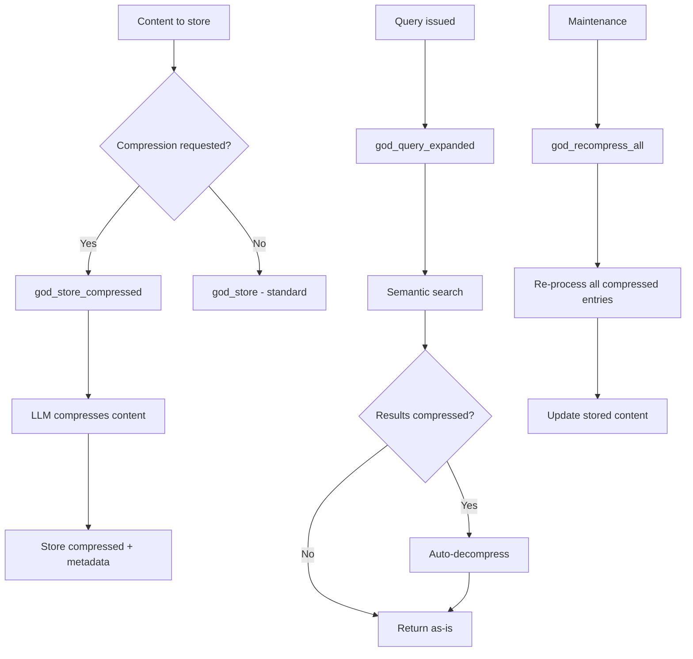

# Compression & Self-Knowledge Tools

Tools for storing and querying memories with automatic LLM compression, and for managing the agent's self-knowledge bootstrap system.

## Tool Reference

| Tool | Purpose |
|------|---------|
| [god_store_compressed](#god_store_compressed) | Store with compression |
| [god_query_expanded](#god_query_expanded) | Query with decompression |
| [god_self_query](#god_self_query) | Query self-knowledge |
| [god_compression_stats](#god_compression_stats) | Get statistics |
| [god_bootstrap_status](#god_bootstrap_status) | Check bootstrap status |
| [god_recompress_all](#god_recompress_all) | Recompress all memories |

---

## god_store_compressed

Store content with automatic LLM compression. The content is compressed before storage, reducing token usage while preserving semantic meaning.

### Parameters

| Parameter | Type | Required | Description |
|-----------|------|----------|-------------|
| `content` | string | Yes | Content to compress and store |
| `tags` | string[] | No | Tags for categorization and retrieval |
| `importance` | number | No | Importance score (0.0 to 1.0) |
| `compressionLevel` | enum | No | Compression level: `standard` or `aggressive` (default: `standard`) |

### Compression Levels

| Level | Description |
|-------|-------------|
| `standard` | Preserves most detail, moderate token savings |
| `aggressive` | Maximizes compression, retains core meaning only |

### Response

```json
{
  "success": true,
  "entryId": "mem_abc123...",
  "originalTokens": 1250,
  "compressedTokens": 380,
  "compressionRatio": 0.304,
  "savings": "69.6%",
  "tags": ["architecture", "compressed"],
  "storedAt": "2024-01-15T10:00:00Z"
}
```

### Example

```typescript
await mcp__rubix__god_store_compressed({
  content: `The authentication system uses JWT tokens with RS256 signing.
    Access tokens expire after 15 minutes. Refresh tokens are stored in
    HTTP-only cookies and expire after 7 days. The middleware chain is:
    rateLimit -> authenticate -> authorize -> handler. Token rotation
    happens automatically on refresh. Blacklisted tokens are stored in
    Redis with TTL matching their original expiry.`,
  tags: ["auth", "jwt", "architecture"],
  importance: 0.8,
  compressionLevel: "standard"
});
```

### When to Use

1. **Long Content**: Architecture docs, meeting notes, verbose explanations
2. **Archival Storage**: Older memories worth keeping but rarely accessed
3. **Token Budget**: When memory storage is approaching limits

---

## god_query_expanded

Query memories with automatic decompression of results. Compressed memories are expanded back to their full meaning before being returned.

### Parameters

| Parameter | Type | Required | Description |
|-----------|------|----------|-------------|
| `query` | string | Yes | Search query text |
| `topK` | number | No | Maximum results to return (default: 10) |
| `tags` | string[] | No | Filter results by tags |
| `includeProvenance` | boolean | No | Include provenance and L-Score data (default: false) |

### Response

```json
{
  "success": true,
  "query": "JWT authentication flow",
  "results": [
    {
      "id": "mem_abc123",
      "content": "The authentication system uses JWT tokens with RS256...",
      "expanded": true,
      "originalCompressed": true,
      "similarity": 0.91,
      "tags": ["auth", "jwt", "architecture"],
      "importance": 0.8,
      "created": "2024-01-15T10:00:00Z"
    }
  ],
  "totalResults": 1,
  "expandedCount": 1
}
```

### Example

```typescript
// Query with auto-decompression
const results = await mcp__rubix__god_query_expanded({
  query: "How does authentication work in this project?",
  topK: 5,
  tags: ["auth"],
  includeProvenance: true
});

for (const entry of results.results) {
  console.log(`[${entry.similarity.toFixed(2)}] ${entry.content}`);
  if (entry.expanded) {
    console.log("  (decompressed from stored format)");
  }
}
```

### Behavior

1. Performs standard semantic search across all memories
2. Identifies compressed entries in the result set
3. Automatically decompresses them before returning
4. Marks decompressed entries with `expanded: true`

---

## god_self_query

Query the agent's own stored knowledge about itself. Used by the bootstrap system to recall capabilities, architecture, patterns, and tool knowledge.

### Parameters

| Parameter | Type | Required | Description |
|-----------|------|----------|-------------|
| `aspect` | enum | No | Self-knowledge aspect: `capabilities`, `architecture`, `patterns`, or `tools` |

### Aspects

| Aspect | Description |
|--------|-------------|
| `capabilities` | What the agent can do (tools, skills, integrations) |
| `architecture` | How the agent is built (components, data flow) |
| `patterns` | Known effective patterns and anti-patterns |
| `tools` | Detailed tool usage knowledge and tips |

### Response

```json
{
  "success": true,
  "aspect": "architecture",
  "entries": [
    {
      "id": "bootstrap_arch_001",
      "content": "God-Agent uses a 6-phase execution pipeline...",
      "category": "architecture",
      "confidence": 0.95,
      "lastUpdated": "2024-01-15T10:00:00Z"
    }
  ],
  "totalEntries": 12
}
```

### Example

```typescript
// Query agent's knowledge about its own capabilities
const selfKnowledge = await mcp__rubix__god_self_query({
  aspect: "capabilities"
});

console.log(`Agent knows about ${selfKnowledge.totalEntries} capabilities`);
for (const entry of selfKnowledge.entries) {
  console.log(`- ${entry.content.substring(0, 100)}...`);
}
```

### Use Cases

1. **Session Start**: Bootstrap the agent's self-awareness
2. **Tool Discovery**: Recall which tools are available and how to use them
3. **Architecture Queries**: Understand internal component relationships

---

## god_compression_stats

Get compression statistics for the memory system.

### Parameters

None.

### Response

```json
{
  "success": true,
  "stats": {
    "totalEntries": 500,
    "compressedEntries": 320,
    "uncompressedEntries": 180,
    "compressionRatio": 0.35,
    "totalOriginalTokens": 125000,
    "totalCompressedTokens": 43750,
    "tokensSaved": 81250,
    "savingsPercent": "65.0%",
    "byLevel": {
      "standard": 250,
      "aggressive": 70
    },
    "averageCompressionRatio": {
      "standard": 0.42,
      "aggressive": 0.25
    }
  }
}
```

### Example

```typescript
const stats = await mcp__rubix__god_compression_stats();

console.log(`Compressed: ${stats.stats.compressedEntries}/${stats.stats.totalEntries} entries`);
console.log(`Tokens saved: ${stats.stats.tokensSaved} (${stats.stats.savingsPercent})`);
console.log(`Avg ratio (standard): ${stats.stats.averageCompressionRatio.standard}`);
console.log(`Avg ratio (aggressive): ${stats.stats.averageCompressionRatio.aggressive}`);
```

---

## god_bootstrap_status

Check the self-knowledge initialization status. Reports whether the agent's bootstrap knowledge has been loaded and how many self-knowledge entries exist.

### Parameters

None.

### Response

```json
{
  "success": true,
  "bootstrap": {
    "initialized": true,
    "completionPercent": 100,
    "entryCounts": {
      "capabilities": 15,
      "architecture": 12,
      "patterns": 20,
      "tools": 50
    },
    "totalEntries": 97,
    "lastBootstrap": "2024-01-15T08:00:00Z"
  }
}
```

### Example

```typescript
const status = await mcp__rubix__god_bootstrap_status();

if (!status.bootstrap.initialized) {
  console.warn("Bootstrap not complete - agent may have limited self-awareness");
  console.log(`Completion: ${status.bootstrap.completionPercent}%`);
} else {
  console.log(`Bootstrap complete: ${status.bootstrap.totalEntries} self-knowledge entries`);
}
```

---

## god_recompress_all

Recompress all stored memories with current compression settings. Useful after updating compression models or changing compression configuration.

### Parameters

| Parameter | Type | Required | Description |
|-----------|------|----------|-------------|
| `dryRun` | boolean | No | If true, report what would change without modifying data (default: false) |

### Response

```json
{
  "success": true,
  "dryRun": false,
  "processed": 320,
  "improved": 180,
  "unchanged": 140,
  "totalTokensBefore": 43750,
  "totalTokensAfter": 38200,
  "additionalSavings": 5550,
  "duration": "12.5s"
}
```

### Example

```typescript
// Preview changes first
const preview = await mcp__rubix__god_recompress_all({
  dryRun: true
});

console.log(`Would recompress ${preview.processed} entries`);
console.log(`Expected additional savings: ${preview.additionalSavings} tokens`);

// Apply if savings are worthwhile
if (preview.additionalSavings > 1000) {
  const result = await mcp__rubix__god_recompress_all({
    dryRun: false
  });
  console.log(`Recompressed ${result.improved} entries, saved ${result.additionalSavings} tokens`);
}
```

### Caution

- This operation processes all compressed entries and may take time
- Use `dryRun: true` first to estimate the impact
- Existing embeddings are preserved; only compressed text is updated

---

## Compression Flow



---

## Best Practices

### Storing Compressed Content

1. **Choose Level Wisely**: Use `standard` for content you query often, `aggressive` for archival
2. **Tag Consistently**: Tags are not compressed, so use them for reliable filtering
3. **Set Importance**: High-importance entries benefit more from `standard` compression
4. **Check Stats**: Monitor compression ratios to ensure quality

### Querying Compressed Content

1. **Use `god_query_expanded`**: Always use this instead of `god_query` when compressed entries may exist
2. **Include Provenance**: Helps assess reliability of decompressed content
3. **Combine with Tags**: Tag filtering happens before decompression, saving compute

### Self-Knowledge Management

1. **Check Bootstrap on Start**: Verify self-knowledge is initialized at session start
2. **Query by Aspect**: Narrow self-queries to specific aspects for faster results
3. **Periodic Recompression**: Run `god_recompress_all` after model or config updates

## Next Steps

- [Memory Tools](memory-tools.md) - Core memory operations
- [Learning Tools](learning-tools.md) - Sona and MemRL learning
- [Tools Overview](index.md) - All tools