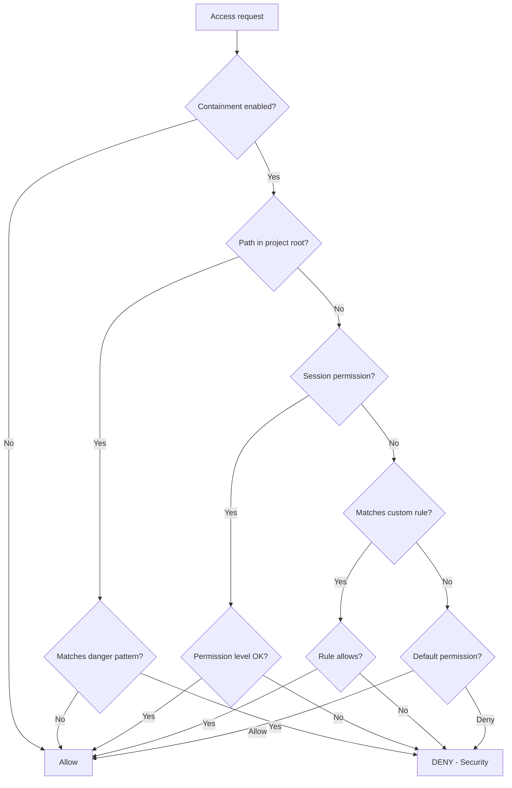

# Containment Tools

Tools for managing path-based permissions and file access control.

## Tool Reference

| Tool | Purpose |
|------|---------|
| [god_containment_check](#god_containment_check) | Check path permission |
| [god_containment_config](#god_containment_config) | Configure containment |
| [god_containment_add_rule](#god_containment_add_rule) | Add permission rule |
| [god_containment_remove_rule](#god_containment_remove_rule) | Remove rule |
| [god_containment_status](#god_containment_status) | Get status |
| [god_containment_session](#god_containment_session) | Session permissions |

---

## Overview

The ContainmentManager enforces path-based permissions:

- **Project folder**: Always allowed (read-write)
- **Dangerous paths**: Always denied (secrets, keys, credentials)
- **Other paths**: Follow configured rules
- **Session permissions**: Temporary access for specific paths

---

## god_containment_check

Check if a path is allowed for an operation.

### Parameters

| Parameter | Type | Required | Description |
|-----------|------|----------|-------------|
| `path` | string | Yes | File path to check |
| `operation` | enum | Yes | Operation type (read/write) |

### Response

```json
{
  "success": true,
  "allowed": true,
  "path": "D:/my-project/src/api/users.ts",
  "operation": "write",
  "reason": "Path is within project root"
}
```

### Denial Response

```json
{
  "success": true,
  "allowed": false,
  "path": "D:/my-project/.env",
  "operation": "read",
  "reason": "Matches blocked pattern: **/.env*",
  "rule": {
    "pattern": "**/.env*",
    "permission": "deny",
    "reason": "Environment files may contain secrets"
  }
}
```

### Examples

```typescript
// Check if we can write to a file
const check = await mcp__rubix__god_containment_check({
  path: "D:/my-project/src/config.ts",
  operation: "write"
});

if (check.allowed) {
  // Safe to write
} else {
  console.error(`Access denied: ${check.reason}`);
}

// Check read access to external file
const external = await mcp__rubix__god_containment_check({
  path: "C:/Users/admin/.ssh/id_rsa",
  operation: "read"
});
// Will be denied - sensitive file
```

---

## god_containment_config

Configure containment settings.

### Parameters

| Parameter | Type | Required | Description |
|-----------|------|----------|-------------|
| `enabled` | boolean | No | Enable/disable containment |
| `projectRoot` | string | No | Project root (always allowed) |
| `defaultPermission` | enum | No | Default for unmatched paths |

### Default Permissions

| Permission | Description |
|------------|-------------|
| `deny` | Block access by default |
| `read` | Allow read only |
| `write` | Allow write only |
| `read-write` | Allow both |

### Response

```json
{
  "success": true,
  "config": {
    "enabled": true,
    "projectRoot": "D:/my-project",
    "defaultPermission": "deny"
  }
}
```

### Examples

```typescript
// Enable containment with project root
await mcp__rubix__god_containment_config({
  enabled: true,
  projectRoot: "D:/my-project",
  defaultPermission: "deny"
});

// Temporarily disable containment (not recommended)
await mcp__rubix__god_containment_config({
  enabled: false
});
```

---

## god_containment_add_rule

Add a path permission rule.

### Parameters

| Parameter | Type | Required | Description |
|-----------|------|----------|-------------|
| `pattern` | string | Yes | Glob pattern to match |
| `permission` | enum | Yes | Permission level |
| `reason` | string | No | Human-readable reason |
| `priority` | number | No | Priority (higher = checked first) |

### Pattern Examples

| Pattern | Matches |
|---------|---------|
| `**/.env*` | Any .env file |
| `/etc/**` | Anything under /etc |
| `**/secrets*` | Files with "secrets" in name |
| `*.key` | Any .key file |
| `D:/projects/**` | Anything under D:/projects |

### Response

```json
{
  "success": true,
  "rule": {
    "id": "rule_abc123",
    "pattern": "**/credentials.*",
    "permission": "deny",
    "reason": "Credentials files",
    "priority": 100
  }
}
```

### Examples

```typescript
// Block credentials files
await mcp__rubix__god_containment_add_rule({
  pattern: "**/credentials.*",
  permission: "deny",
  reason: "Credentials files are sensitive",
  priority: 100
});

// Allow read access to docs
await mcp__rubix__god_containment_add_rule({
  pattern: "D:/docs/**",
  permission: "read",
  reason: "Documentation is safe to read"
});

// Block all .key files
await mcp__rubix__god_containment_add_rule({
  pattern: "**/*.key",
  permission: "deny",
  reason: "Private key files"
});
```

---

## god_containment_remove_rule

Remove a path permission rule by pattern.

### Parameters

| Parameter | Type | Required | Description |
|-----------|------|----------|-------------|
| `pattern` | string | Yes | Glob pattern to remove |

### Response

```json
{
  "success": true,
  "removed": true,
  "pattern": "**/credentials.*"
}
```

### Example

```typescript
// Remove a previously added rule
await mcp__rubix__god_containment_remove_rule({
  pattern: "D:/docs/**"
});
```

---

## god_containment_status

Get current containment status and rules.

### Parameters

None.

### Response

```json
{
  "success": true,
  "containment": {
    "enabled": true,
    "projectRoot": "D:/my-project",
    "defaultPermission": "deny"
  },
  "rules": [
    {
      "pattern": "**/.env*",
      "permission": "deny",
      "reason": "Environment files",
      "priority": 100,
      "builtin": true
    },
    {
      "pattern": "**/credentials.*",
      "permission": "deny",
      "reason": "Credentials files",
      "priority": 100,
      "builtin": false
    }
  ],
  "sessionPermissions": [
    {
      "pattern": "D:/external-lib/**",
      "permission": "read",
      "reason": "Temporary access for library research",
      "expiresAt": "session_end"
    }
  ],
  "statistics": {
    "checksPerformed": 150,
    "accessGranted": 145,
    "accessDenied": 5
  }
}
```

---

## god_containment_session

Grant or revoke temporary session-scoped access.

### Parameters

| Parameter | Type | Required | Description |
|-----------|------|----------|-------------|
| `action` | enum | Yes | Action to perform |
| `pattern` | string | No | Glob pattern (for add/remove) |
| `permission` | enum | No | Permission level (for add) |
| `reason` | string | No | Reason for access |

### Actions

| Action | Description |
|--------|-------------|
| `add` | Grant temporary access |
| `remove` | Revoke temporary access |
| `clear` | Clear all session permissions |
| `list` | List current session permissions |

### Response (add)

```json
{
  "success": true,
  "action": "add",
  "pattern": "D:/external/**",
  "permission": "read",
  "note": "Session permissions are cleared on server restart"
}
```

### Response (list)

```json
{
  "success": true,
  "action": "list",
  "sessionPermissions": [
    {
      "pattern": "D:/external/**",
      "permission": "read",
      "reason": "Research external library",
      "addedAt": "2024-01-15T10:00:00Z"
    }
  ]
}
```

### Examples

```typescript
// Grant read access to external drive
await mcp__rubix__god_containment_session({
  action: "add",
  pattern: "D:/**",
  permission: "read",
  reason: "Search for project files"
});

// Grant read-write to specific folder
await mcp__rubix__god_containment_session({
  action: "add",
  pattern: "C:/Users/dev/temp/**",
  permission: "read-write",
  reason: "Temporary workspace"
});

// List current session permissions
const list = await mcp__rubix__god_containment_session({
  action: "list"
});

// Revoke specific permission
await mcp__rubix__god_containment_session({
  action: "remove",
  pattern: "D:/**"
});

// Clear all session permissions
await mcp__rubix__god_containment_session({
  action: "clear"
});
```

---

## Permission Check Flow



---

## Built-in Security Rules

These patterns are always blocked:

| Pattern | Reason |
|---------|--------|
| `**/.env*` | Environment variables with secrets |
| `**/credentials*` | Credential files |
| `**/*.key` | Private key files |
| `**/*.pem` | Certificate/key files |
| `**/*secret*` | Secret files |
| `**/.ssh/**` | SSH keys |
| `**/.aws/**` | AWS credentials |
| `**/.azure/**` | Azure credentials |
| `**/id_rsa*` | SSH private keys |
| `**/id_ed25519*` | SSH private keys |

---

## Integration with CODEX

ContainmentManager protects file operations:

```typescript
// In CodeGenerator.ts
async writeFile(path: string, content: string): Promise<void> {
  // Check containment before writing
  const check = await this.containment.check(path, "write");

  if (!check.allowed) {
    throw new ContainmentError(
      `Cannot write to ${path}: ${check.reason}`
    );
  }

  // Safe to write
  await fs.writeFile(path, content);
}

// In ContextScout.ts
async readFile(path: string): Promise<string> {
  // Check containment before reading
  const check = await this.containment.check(path, "read");

  if (!check.allowed) {
    throw new ContainmentError(
      `Cannot read ${path}: ${check.reason}`
    );
  }

  return fs.readFile(path, "utf-8");
}
```

---

## Best Practices

### Configuration

1. **Always Enable**: Keep containment on in production
2. **Set Project Root**: Ensure it's correctly configured
3. **Default Deny**: Use `deny` as default permission

### Rules

1. **Be Specific**: Use precise patterns
2. **Document Reasons**: Explain why rules exist
3. **Review Regularly**: Remove obsolete rules

### Session Permissions

1. **Minimal Access**: Grant only what's needed
2. **Time-Limited**: Clear when done
3. **Document Purpose**: Include reason for audit

---

## Complete Example

```typescript
// 1. Configure containment
await mcp__rubix__god_containment_config({
  enabled: true,
  projectRoot: "D:/my-project",
  defaultPermission: "deny"
});

// 2. Add custom rules
await mcp__rubix__god_containment_add_rule({
  pattern: "D:/shared-libs/**",
  permission: "read",
  reason: "Shared libraries for development"
});

await mcp__rubix__god_containment_add_rule({
  pattern: "**/test-fixtures/**",
  permission: "read-write",
  reason: "Test data can be modified"
});

// 3. Check current status
const status = await mcp__rubix__god_containment_status();
console.log(`Rules configured: ${status.rules.length}`);

// 4. Grant temporary access for a task
await mcp__rubix__god_containment_session({
  action: "add",
  pattern: "C:/temp/downloads/**",
  permission: "read",
  reason: "Analyzing downloaded files for task #123"
});

// 5. Check specific path
const check = await mcp__rubix__god_containment_check({
  path: "C:/temp/downloads/data.json",
  operation: "read"
});
console.log(`Access: ${check.allowed ? "granted" : "denied"}`);

// 6. Clean up session permissions when done
await mcp__rubix__god_containment_session({
  action: "clear"
});
```

## Next Steps

- [Partner Tools](partner-tools.md) - Collaborative Partner
- [CODEX Tools](codex-tools.md) - Task execution
- [Tools Overview](index.md) - All tools
