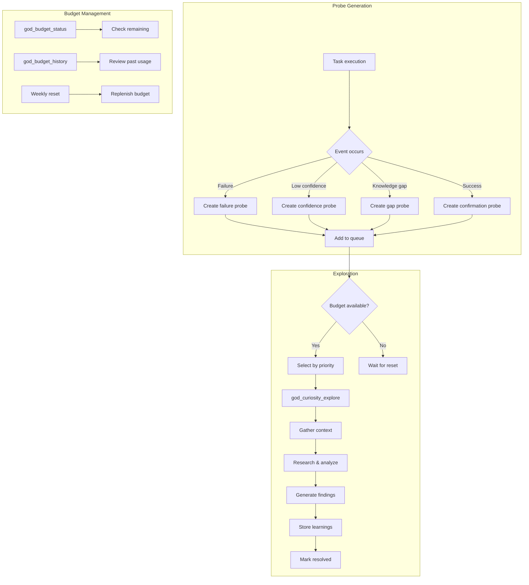

# Curiosity Tools

Tools for managing the Collaborative Partner's proactive curiosity system.

## Tool Reference

| Tool | Purpose |
|------|---------|
| [god_curiosity_list](#god_curiosity_list) | List probes |
| [god_curiosity_explore](#god_curiosity_explore) | Explore probe |
| [god_curiosity_web_explore](#god_curiosity_web_explore) | Web explore topic |
| [god_budget_status](#god_budget_status) | Budget status |
| [god_budget_history](#god_budget_history) | Budget history |

---

## Overview

The curiosity system generates "probes" - questions that arise during task execution:

- **Failure probes**: Why did this fail?
- **Low confidence probes**: Is this assumption correct?
- **Knowledge gap probes**: What's the best practice here?
- **Success confirmation probes**: Did this work for the right reasons?

Probes are ranked by priority and explored when budget allows.

---

## god_curiosity_list

List current curiosity probes.

### Parameters

| Parameter | Type | Required | Description |
|-----------|------|----------|-------------|
| `status` | enum | No | Filter by status (default: pending) |
| `limit` | number | No | Max results (default: 10) |

### Probe Status

| Status | Description |
|--------|-------------|
| `pending` | Not yet explored |
| `exploring` | Currently being explored |
| `resolved` | Exploration complete |
| `all` | Show all probes |

### Response

```json
{
  "success": true,
  "probes": [
    {
      "id": "probe_abc123",
      "question": "Why does the authentication fail with expired tokens even after refresh?",
      "origin": "failure",
      "priority": 1.0,
      "context": {
        "taskId": "task_xyz789",
        "subtaskId": "sub_def456",
        "error": "TokenExpiredError: Token invalid after refresh"
      },
      "status": "pending",
      "createdAt": "2024-01-15T10:00:00Z"
    },
    {
      "id": "probe_def456",
      "question": "Is using localStorage for auth tokens secure enough for this app?",
      "origin": "low_confidence",
      "priority": 0.7,
      "context": {
        "approach": "localStorage token storage",
        "confidence": 0.45
      },
      "status": "pending",
      "createdAt": "2024-01-15T09:30:00Z"
    }
  ],
  "total": 15,
  "byOrigin": {
    "failure": 3,
    "low_confidence": 5,
    "knowledge_gap": 4,
    "success_confirmation": 3
  }
}
```

### Priority Ranking

| Origin | Priority | Description |
|--------|----------|-------------|
| `failure` | 1.0 | Highest - investigate failures |
| `low_confidence` | 0.7 | High - validate assumptions |
| `knowledge_gap` | 0.5 | Medium - learn best practices |
| `success_confirmation` | 0.2 | Low - verify successes |

### Example

```typescript
// List all pending probes
const probes = await mcp__rubix__god_curiosity_list({
  status: "pending",
  limit: 20
});

console.log(`${probes.total} pending probes`);
console.log(`${probes.byOrigin.failure} from failures`);

// Show top priority probes
for (const probe of probes.probes.slice(0, 5)) {
  console.log(`[${probe.priority}] ${probe.question}`);
}
```

---

## god_curiosity_explore

Manually trigger exploration of a curiosity probe.

### Parameters

| Parameter | Type | Required | Description |
|-----------|------|----------|-------------|
| `probeId` | string | No | Specific probe ID (optional) |

If `probeId` is not provided, the highest-priority pending probe is selected.

### Response

```json
{
  "success": true,
  "probeId": "probe_abc123",
  "question": "Why does the authentication fail with expired tokens even after refresh?",
  "exploration": {
    "findings": [
      "The refresh endpoint returns new tokens but they have the same expiration as the original",
      "Token expiration is set server-side to 1 hour, but clock skew between client and server causes early expiration",
      "The token refresh logic doesn't account for network latency"
    ],
    "recommendations": [
      "Add a buffer time (e.g., 5 minutes) before token expiration to trigger refresh",
      "Use server time from response headers instead of client time",
      "Implement token refresh retry with exponential backoff"
    ],
    "learnings": [
      "JWT expiration should account for clock skew",
      "Always refresh tokens slightly before actual expiration"
    ],
    "relatedMemories": [
      { "id": "mem_123", "content": "JWT best practices...", "similarity": 0.85 }
    ]
  },
  "tokensUsed": 45000,
  "explorationTimeMs": 12500,
  "status": "resolved"
}
```

### Example

```typescript
// Explore specific probe
const result = await mcp__rubix__god_curiosity_explore({
  probeId: "probe_abc123"
});

console.log("Findings:");
for (const finding of result.exploration.findings) {
  console.log(`- ${finding}`);
}

console.log("\nRecommendations:");
for (const rec of result.exploration.recommendations) {
  console.log(`- ${rec}`);
}

// Explore top priority probe automatically
const topResult = await mcp__rubix__god_curiosity_explore({});
```

### Exploration Process

1. **Context Gathering**: Load related memories and task context
2. **Question Analysis**: Break down the probe question
3. **Research**: Search codebase, docs, and memory
4. **Synthesis**: Generate findings and recommendations
5. **Learning**: Store insights for future use

---

## god_curiosity_web_explore

Explore a topic using web search and Playwright browser automation.

### Parameters

| Parameter | Type | Required | Description |
|-----------|------|----------|-------------|
| `topic` | string | Yes | Topic to explore |
| `keywords` | string[] | No | Additional search keywords to guide exploration |
| `maxPages` | number | No | Maximum pages to visit (default: 3) |

### Response

```json
{
  "success": true,
  "topic": "JWT token refresh best practices",
  "exploration": {
    "sources": [
      {
        "url": "https://auth0.com/blog/refresh-tokens-what-are-they-and-when-to-use-them",
        "title": "Refresh Tokens: What They Are and When to Use Them",
        "relevance": 0.95
      },
      {
        "url": "https://datatracker.ietf.org/doc/html/rfc6749#section-1.5",
        "title": "RFC 6749 - OAuth 2.0 Refresh Tokens",
        "relevance": 0.88
      },
      {
        "url": "https://stackoverflow.com/questions/27726066/jwt-refresh-token-flow",
        "title": "JWT Refresh Token Flow - Stack Overflow",
        "relevance": 0.82
      }
    ],
    "findings": [
      "Refresh tokens should be stored securely (httpOnly cookies, not localStorage)",
      "Implement token rotation: issue new refresh token on each use, invalidate the old one",
      "Set short access token TTL (5-15 min) with longer refresh token TTL (days/weeks)",
      "Use absolute expiration on refresh tokens to limit session lifetime"
    ],
    "recommendations": [
      "Adopt sliding window refresh with absolute maximum lifetime",
      "Store refresh tokens server-side with device fingerprinting",
      "Implement refresh token families to detect token reuse attacks"
    ],
    "learnings": [
      "Token rotation prevents replay attacks on stolen refresh tokens",
      "Refresh token families enable detecting compromised token chains"
    ]
  },
  "pagesVisited": 3,
  "tokensUsed": 65000,
  "explorationTimeMs": 18500
}
```

### Example

```typescript
// Explore a topic with default settings
const result = await mcp__rubix__god_curiosity_web_explore({
  topic: "JWT token refresh best practices"
});

console.log(`Visited ${result.pagesVisited} pages`);
console.log("\nFindings:");
for (const finding of result.exploration.findings) {
  console.log(`- ${finding}`);
}

// Explore with keywords and more pages
const deepResult = await mcp__rubix__god_curiosity_web_explore({
  topic: "React Server Components performance",
  keywords: ["streaming", "suspense", "bundle size"],
  maxPages: 5
});

console.log("\nSources:");
for (const source of deepResult.exploration.sources) {
  console.log(`[${source.relevance}] ${source.title}`);
  console.log(`  ${source.url}`);
}
```

### Exploration Process

1. **Keyword Generation**: Combines topic with provided keywords for search queries
2. **Web Search**: Searches the web for relevant pages
3. **Page Navigation**: Uses Playwright to visit top results
4. **Content Extraction**: Extracts relevant content from each page
5. **Synthesis**: Analyzes findings with Claude to produce structured results
6. **Learning Storage**: Stores valuable insights for future use

### Notes

- Requires Playwright to be available (falls back to text-only exploration if not)
- Each page visit counts toward the curiosity token budget
- Pages are visited in relevance order; stops early if budget is exceeded
- Results are stored as learnings and can be recalled in future sessions

---

## god_budget_status

Check curiosity token budget status.

### Parameters

None.

### Response

```json
{
  "success": true,
  "budget": {
    "weeklyAllocation": 400000,
    "tokensUsed": 145000,
    "tokensRemaining": 255000,
    "probesRemaining": 5,
    "cyclePosition": 2,
    "nextProbeType": "moderate",
    "weekStartDate": "2024-01-08T00:00:00Z",
    "weekEndDate": "2024-01-14T23:59:59Z",
    "resetIn": "3 days"
  },
  "pattern": {
    "description": "3:1 high:moderate priority ratio",
    "highPriorityProbes": 3,
    "moderatePriorityProbes": 1,
    "currentCycle": "high"
  }
}
```

### Budget Allocation

| Item | Value | Description |
|------|-------|-------------|
| Weekly allocation | 400K tokens | Total budget per week |
| Per-probe budget | ~100K tokens | Maximum per exploration |
| Probes per week | ~4-6 | Depending on complexity |
| Priority ratio | 3:1 | High vs moderate priority |

### Example

```typescript
const status = await mcp__rubix__god_budget_status();

console.log(`Budget: ${status.budget.tokensRemaining}/${status.budget.weeklyAllocation} tokens remaining`);
console.log(`Probes: ${status.budget.probesRemaining} explorations remaining this week`);
console.log(`Next probe: ${status.budget.nextProbeType} priority`);
console.log(`Reset in: ${status.budget.resetIn}`);
```

---

## god_budget_history

Get curiosity exploration history.

### Parameters

| Parameter | Type | Required | Description |
|-----------|------|----------|-------------|
| `weeks` | number | No | Weeks to look back (default: 4) |

### Response

```json
{
  "success": true,
  "history": [
    {
      "week": "2024-01-08",
      "explorations": [
        {
          "probeId": "probe_abc123",
          "question": "Why does authentication fail...",
          "origin": "failure",
          "tokensUsed": 45000,
          "outcome": "resolved",
          "learningsGenerated": 3,
          "exploredAt": "2024-01-10T14:00:00Z"
        }
      ],
      "summary": {
        "totalProbes": 4,
        "totalTokens": 180000,
        "byOrigin": {
          "failure": 2,
          "low_confidence": 1,
          "knowledge_gap": 1
        },
        "learningsGenerated": 8
      }
    },
    {
      "week": "2024-01-01",
      "explorations": [...],
      "summary": {...}
    }
  ],
  "totals": {
    "totalProbes": 15,
    "totalTokens": 720000,
    "avgTokensPerProbe": 48000,
    "learningsGenerated": 32
  }
}
```

### Example

```typescript
const history = await mcp__rubix__god_budget_history({
  weeks: 4
});

console.log(`Last 4 weeks: ${history.totals.totalProbes} probes explored`);
console.log(`Total tokens used: ${history.totals.totalTokens}`);
console.log(`Learnings generated: ${history.totals.learningsGenerated}`);

// Show weekly breakdown
for (const week of history.history) {
  console.log(`\nWeek of ${week.week}:`);
  console.log(`  Probes: ${week.summary.totalProbes}`);
  console.log(`  Tokens: ${week.summary.totalTokens}`);
}
```

---

## Curiosity Flow



---

## Probe Origins

### Failure Probes (Priority: 1.0)

Generated when a subtask fails:

```typescript
// Automatically created by TaskExecutor
{
  question: "Why did the database migration fail with constraint violation?",
  origin: "failure",
  context: {
    taskId: "task_123",
    subtaskId: "sub_456",
    error: "Error: violates foreign key constraint",
    attempt: 3
  }
}
```

### Low Confidence Probes (Priority: 0.7)

Generated when approach confidence is low:

```typescript
// Created when CollaborativePartner detects uncertainty
{
  question: "Is using WebSocket better than polling for this real-time feature?",
  origin: "low_confidence",
  context: {
    approach: "WebSocket implementation",
    confidence: 0.4,
    alternatives: ["Long polling", "Server-sent events"]
  }
}
```

### Knowledge Gap Probes (Priority: 0.5)

Generated when missing best practice knowledge:

```typescript
// Created when encountering unfamiliar patterns
{
  question: "What's the recommended way to handle rate limiting in this API?",
  origin: "knowledge_gap",
  context: {
    topic: "API rate limiting",
    relatedCode: "src/api/client.ts"
  }
}
```

### Success Confirmation Probes (Priority: 0.2)

Generated to validate successful approaches:

```typescript
// Created after successful completion
{
  question: "Did the caching implementation improve performance for the right reasons?",
  origin: "success_confirmation",
  context: {
    taskId: "task_789",
    approach: "Redis caching layer",
    metrics: { beforeMs: 500, afterMs: 50 }
  }
}
```

---

## Integration with Collaborative Partner

The curiosity system is part of the Collaborative Partner:

```typescript
// In CollaborativePartner.ts
async onSubtaskComplete(result: SubtaskResult) {
  // Check if we should create a confirmation probe
  if (result.success && this.shouldConfirmSuccess(result)) {
    await this.createProbe({
      question: `Did ${result.approach} work for the right reasons?`,
      origin: "success_confirmation",
      context: result
    });
  }

  // Check for low confidence
  if (result.confidence < 0.5) {
    await this.createProbe({
      question: `Is ${result.approach} the best solution?`,
      origin: "low_confidence",
      context: { confidence: result.confidence }
    });
  }
}

async onSubtaskFailed(context: FailureContext) {
  // Create failure probe
  await this.createProbe({
    question: `Why did ${context.description} fail?`,
    origin: "failure",
    context
  });
}
```

---

## Best Practices

### Managing Probes

1. **Review Regularly**: Check pending probes weekly
2. **Prioritize Failures**: Failure probes often reveal systemic issues
3. **Learn from History**: Review past explorations for patterns

### Budget Management

1. **Monitor Usage**: Don't exhaust budget early in week
2. **Save for Failures**: Keep reserve for unexpected failure probes
3. **Review History**: Identify if certain probe types are more valuable

### Exploration Quality

1. **Provide Context**: More context = better exploration
2. **Follow Up**: Apply learnings to current tasks
3. **Store Insights**: Ensure valuable learnings are stored

## Next Steps

- [Partner Tools](partner-tools.md) - Collaborative Partner
- [Learning Tools](learning-tools.md) - Sona learning
- [Failure Tools](failure-tools.md) - Failure learning
