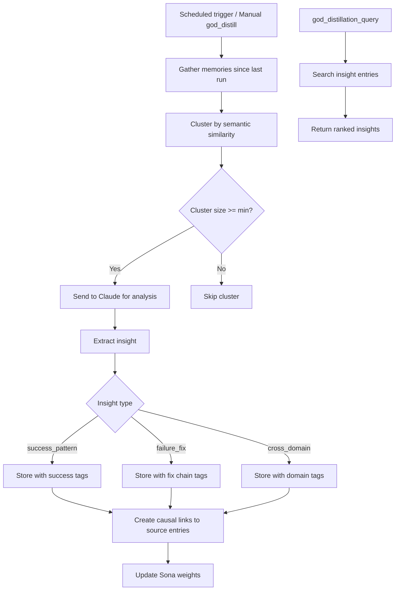

# Distillation Tools

Tools for running and querying memory distillation. The distillation system periodically analyzes accumulated memories to extract high-level insights, including success patterns, failure-fix chains, and cross-domain knowledge.

## Tool Reference

| Tool | Purpose |
|------|---------|
| [god_distill](#god_distill) | Run distillation cycle |
| [god_distillation_stats](#god_distillation_stats) | Get statistics |
| [god_distillation_config](#god_distillation_config) | Configure settings |
| [god_distillation_query](#god_distillation_query) | Query distilled insights |

---

## god_distill

Run a memory distillation cycle. Analyzes accumulated memories to extract high-level insights such as recurring success patterns, failure-to-fix chains, and cross-domain knowledge.

### Parameters

| Parameter | Type | Required | Description |
|-----------|------|----------|-------------|
| `type` | enum | No | Distillation type: `success_pattern`, `failure_fix`, `cross_domain`, or `all` (default: `all`) |
| `since` | string | No | ISO date string; only analyze memories created after this date (default: since last distillation run) |

### Distillation Types

| Type | Description |
|------|-------------|
| `success_pattern` | Clusters successful outcomes and extracts common approaches |
| `failure_fix` | Traces causal chains from failures to their resolutions |
| `cross_domain` | Identifies patterns that appear across different domains or projects |
| `all` | Runs all three distillation types |

### Response

```json
{
  "success": true,
  "type": "all",
  "since": "2024-01-08T00:00:00Z",
  "insights": {
    "success_pattern": [
      {
        "id": "insight_sp_001",
        "summary": "Defensive null checking at API boundaries prevents 60% of runtime errors",
        "supportingEntries": 12,
        "confidence": 0.88,
        "tags": ["distilled_insight", "type:success_pattern", "api", "null_safety"]
      }
    ],
    "failure_fix": [
      {
        "id": "insight_ff_001",
        "summary": "Timeout errors in file operations consistently resolved by switching to async/streaming APIs",
        "chainLength": 4,
        "confidence": 0.91,
        "tags": ["distilled_insight", "type:failure_fix", "timeout", "async"]
      }
    ],
    "cross_domain": [
      {
        "id": "insight_cd_001",
        "summary": "Input validation patterns from API routes also reduce form submission bugs in frontend",
        "domains": ["backend_api", "frontend_forms"],
        "confidence": 0.75,
        "tags": ["distilled_insight", "type:cross_domain", "validation"]
      }
    ]
  },
  "totalInsights": 3,
  "tokensUsed": 18500,
  "duration": "8.2s"
}
```

### Example

```typescript
// Run full distillation cycle
const result = await mcp__rubix__god_distill({
  type: "all",
  since: "2024-01-01T00:00:00Z"
});

console.log(`Generated ${result.totalInsights} insights`);
console.log(`Tokens used: ${result.tokensUsed}`);

for (const insight of result.insights.success_pattern) {
  console.log(`[Success] ${insight.summary} (confidence: ${insight.confidence})`);
}

for (const insight of result.insights.failure_fix) {
  console.log(`[Fix Chain] ${insight.summary} (chain: ${insight.chainLength} steps)`);
}

for (const insight of result.insights.cross_domain) {
  console.log(`[Cross-Domain] ${insight.summary} (domains: ${insight.domains.join(", ")})`);
}
```

### How It Works

1. **Extract**: Gathers memories created since the last run (or `since` date)
2. **Cluster**: Groups related memories by semantic similarity (minimum cluster size applies)
3. **Analyze**: Sends each cluster to Claude for insight generation
4. **Store**: Saves insights as memory entries with `distilled_insight` tag and causal links
5. **Weight**: Updates Sona learning weights for high-confidence insights

---

## god_distillation_stats

Get statistics about the distillation system.

### Parameters

None.

### Response

```json
{
  "success": true,
  "stats": {
    "totalInsights": 45,
    "byType": {
      "success_pattern": 18,
      "failure_fix": 15,
      "cross_domain": 8,
      "contradiction": 2,
      "consolidation": 2
    },
    "lastRun": "2024-01-14T03:00:00Z",
    "nextScheduledRun": "2024-01-21T03:00:00Z",
    "totalTokensUsed": 185000,
    "averageTokensPerRun": 18500,
    "averageInsightsPerRun": 4.5,
    "averageConfidence": 0.82,
    "memoriesProcessed": 1200,
    "memoriesRemaining": 150
  }
}
```

### Example

```typescript
const stats = await mcp__rubix__god_distillation_stats();

console.log(`Total insights: ${stats.stats.totalInsights}`);
console.log(`Last run: ${stats.stats.lastRun}`);
console.log(`Next run: ${stats.stats.nextScheduledRun}`);
console.log(`Tokens used: ${stats.stats.totalTokensUsed}`);

console.log("\nInsight breakdown:");
for (const [type, count] of Object.entries(stats.stats.byType)) {
  console.log(`  ${type}: ${count}`);
}

if (stats.stats.memoriesRemaining > 100) {
  console.log(`\n${stats.stats.memoriesRemaining} memories pending distillation - consider running manually`);
}
```

---

## god_distillation_config

Configure distillation settings.

### Parameters

| Parameter | Type | Required | Description |
|-----------|------|----------|-------------|
| `schedule` | string | No | Cron expression for automatic distillation (default: `0 3 * * 0` - Sundays at 3am) |
| `minClusterSize` | number | No | Minimum number of related memories to form a cluster (default: 3) |
| `maxTokensPerRun` | number | No | Maximum tokens to use per distillation run (default: 20000) |

### Response

```json
{
  "success": true,
  "config": {
    "schedule": "0 3 * * 0",
    "minClusterSize": 3,
    "maxTokensPerRun": 20000,
    "nextScheduledRun": "2024-01-21T03:00:00Z"
  }
}
```

### Example

```typescript
// Increase frequency and token budget for active development
await mcp__rubix__god_distillation_config({
  schedule: "0 3 * * 0,3",       // Sundays and Wednesdays at 3am
  minClusterSize: 2,              // Smaller clusters for faster insights
  maxTokensPerRun: 30000          // Higher budget for more thorough analysis
});
```

### Configuration Notes

1. **Schedule**: Uses standard cron syntax. More frequent runs catch patterns sooner but use more tokens.
2. **Cluster Size**: Lower values produce more but potentially weaker insights. Higher values require more data before generating insights.
3. **Token Budget**: Caps the LLM usage per run. Larger budgets allow processing more clusters in a single run.

---

## god_distillation_query

Query distilled insights directly. Searches specifically within the distilled insight entries rather than all memories.

### Parameters

| Parameter | Type | Required | Description |
|-----------|------|----------|-------------|
| `query` | string | Yes | Search query text |
| `type` | string | No | Filter by insight type: `success_pattern`, `failure_fix`, `cross_domain`, `contradiction`, `consolidation` |
| `topK` | number | No | Maximum results to return (default: 5) |

### Response

```json
{
  "success": true,
  "query": "API error handling patterns",
  "insights": [
    {
      "id": "insight_sp_001",
      "type": "success_pattern",
      "summary": "Defensive null checking at API boundaries prevents 60% of runtime errors",
      "content": "Across 12 successful task completions, consistent use of optional chaining and nullish coalescing at API response boundaries eliminated TypeError exceptions...",
      "confidence": 0.88,
      "supportingEntries": 12,
      "similarity": 0.87,
      "tags": ["distilled_insight", "type:success_pattern", "api", "null_safety"],
      "created": "2024-01-14T03:15:00Z"
    },
    {
      "id": "insight_ff_003",
      "type": "failure_fix",
      "summary": "Unhandled promise rejections in API calls resolved by global error boundary",
      "content": "A chain of 3 failures involving unhandled promise rejections in fetch calls was resolved by implementing a global error boundary...",
      "confidence": 0.82,
      "supportingEntries": 6,
      "similarity": 0.79,
      "tags": ["distilled_insight", "type:failure_fix", "api", "promises"],
      "created": "2024-01-14T03:18:00Z"
    }
  ],
  "totalResults": 2
}
```

### Example

```typescript
// Find distilled insights about authentication patterns
const insights = await mcp__rubix__god_distillation_query({
  query: "authentication and authorization patterns",
  type: "success_pattern",
  topK: 3
});

for (const insight of insights.insights) {
  console.log(`[${insight.type}] ${insight.summary}`);
  console.log(`  Confidence: ${insight.confidence}, Based on: ${insight.supportingEntries} entries`);
  console.log(`  ${insight.content.substring(0, 200)}...`);
}
```

### Use Cases

1. **Pre-Task Research**: Query insights before starting work to leverage accumulated knowledge
2. **Pattern Review**: Periodically review cross-domain insights for systemic improvements
3. **Fix Guidance**: Search failure-fix insights when encountering known error categories
4. **Contradiction Detection**: Find contradictory patterns that need resolution

---

## Distillation Flow



---

## Insight Types

### Success Patterns
Extracted from clusters of successful task completions. Identify approaches, tools, and strategies that consistently lead to good outcomes.

### Failure-Fix Chains
Traced from causal links between failure records and their eventual resolutions. Capture the journey from problem to solution.

### Cross-Domain Insights
Found when the same pattern appears in different contexts (e.g., validation logic in both API and frontend). Suggest generalizable approaches.

### Contradictions
Detected when two insights provide conflicting guidance. Flagged for manual review and resolution.

### Consolidations
Created when multiple similar insights are merged into a single, stronger insight with higher confidence.

---

## Best Practices

### Running Distillation

1. **Let It Run Automatically**: The weekly schedule handles most cases
2. **Manual Runs After Sprints**: Run `god_distill` after completing a large batch of tasks
3. **Use Type Filters**: If you only need failure analysis, run with `type: "failure_fix"` to save tokens
4. **Monitor Token Usage**: Check `god_distillation_stats` to ensure runs stay within budget

### Querying Insights

1. **Query Before Tasks**: Distilled insights are more refined than raw memories
2. **Filter by Type**: Narrow results to the relevant insight category
3. **Check Confidence**: Higher confidence insights are backed by more supporting evidence
4. **Review Contradictions**: Periodically query for `contradiction` type to resolve conflicting guidance

### Configuration

1. **Active Projects**: Use more frequent schedules and lower cluster sizes
2. **Mature Projects**: Higher cluster sizes produce stronger, more reliable insights
3. **Token Management**: Adjust `maxTokensPerRun` based on memory accumulation rate

## Next Steps

- [Learning Tools](learning-tools.md) - Sona and MemRL learning
- [Memory Tools](memory-tools.md) - Core memory operations
- [Reflexion Tools](reflexion-tools.md) - Failure reflections
- [Tools Overview](index.md) - All tools