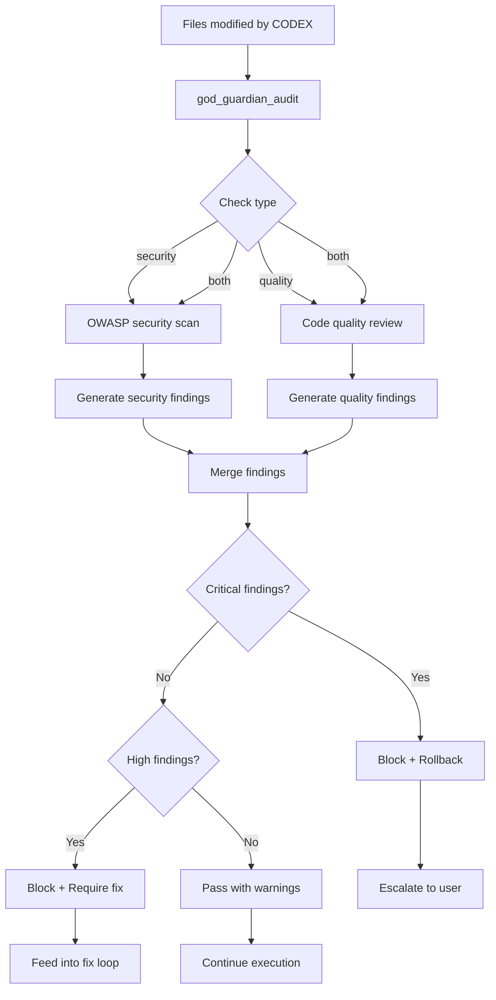

# Guardian & Agent Card Tools

Tools for running post-execution security and quality audits, and for generating the agent's capability card.

## Tool Reference

| Tool | Purpose |
|------|---------|
| [god_guardian_audit](#god_guardian_audit) | Run security/quality audit |
| [god_agent_card](#god_agent_card) | Generate capability card |

---

## god_guardian_audit

Run a post-execution security and quality audit on modified files. The PostExecGuardian analyzes file changes for security vulnerabilities, code quality issues, and compliance concerns.

### Parameters

| Parameter | Type | Required | Description |
|-----------|------|----------|-------------|
| `files` | string[] | Yes | Array of file paths to audit |
| `taskDescription` | string | No | Description of the task that produced the changes (improves audit context) |
| `checkTypes` | enum | No | Types of checks to run: `security`, `quality`, or `both` (default: `both`) |

### Check Types

| Type | Description |
|------|-------------|
| `security` | OWASP-based security scan: injection, auth issues, secrets, XSS, unsafe operations |
| `quality` | Code quality review: patterns, complexity, error handling, naming, documentation |
| `both` | Run both security and quality checks |

### Severity Levels

| Level | Description | Action |
|-------|-------------|--------|
| `critical` | Immediate risk (e.g., leaked credentials, SQL injection) | Blocks execution; may trigger rollback |
| `high` | Significant concern (e.g., missing auth checks, XSS vectors) | Reported as blocker; requires fix |
| `medium` | Notable issue (e.g., poor error handling, missing validation) | Reported as warning; should fix |
| `low` | Minor concern (e.g., naming conventions, missing docs) | Informational; fix when convenient |

### Response

```json
{
  "success": true,
  "audit": {
    "filesAudited": 3,
    "checkTypes": "both",
    "findings": [
      {
        "file": "src/routes/api/users.ts",
        "line": 42,
        "severity": "high",
        "category": "security",
        "rule": "OWASP-A01-Injection",
        "message": "User input passed directly to SQL query without parameterization",
        "suggestion": "Use parameterized queries: db.query('SELECT * FROM users WHERE id = ?', [userId])",
        "cwe": "CWE-89"
      },
      {
        "file": "src/routes/api/users.ts",
        "line": 58,
        "severity": "medium",
        "category": "quality",
        "rule": "error-handling",
        "message": "Catch block swallows error without logging",
        "suggestion": "Add error logging: logger.error('Failed to fetch user', { error, userId })"
      },
      {
        "file": "src/utils/auth.ts",
        "line": 15,
        "severity": "critical",
        "category": "security",
        "rule": "OWASP-A07-Secrets",
        "message": "Hardcoded API key detected in source code",
        "suggestion": "Move to environment variable: process.env.API_KEY"
      }
    ],
    "summary": {
      "critical": 1,
      "high": 1,
      "medium": 1,
      "low": 0,
      "total": 3,
      "passed": false
    },
    "recommendation": "Critical finding requires immediate fix before deployment. Hardcoded credentials must be removed from source code."
  }
}
```

### Example

```typescript
// Audit files after a codex task completes
const audit = await mcp__rubix__god_guardian_audit({
  files: [
    "src/routes/api/users.ts",
    "src/utils/auth.ts",
    "src/middleware/validate.ts"
  ],
  taskDescription: "Added user profile CRUD endpoints with authentication",
  checkTypes: "both"
});

console.log(`Audit: ${audit.audit.summary.total} findings`);

// Check for blockers
if (audit.audit.summary.critical > 0 || audit.audit.summary.high > 0) {
  console.error("BLOCKED: Critical or high severity findings must be resolved");
  for (const finding of audit.audit.findings) {
    if (finding.severity === "critical" || finding.severity === "high") {
      console.error(`  [${finding.severity.toUpperCase()}] ${finding.file}:${finding.line}`);
      console.error(`    ${finding.message}`);
      console.error(`    Fix: ${finding.suggestion}`);
    }
  }
}

// Security-only audit
const securityAudit = await mcp__rubix__god_guardian_audit({
  files: ["src/routes/api/users.ts"],
  checkTypes: "security"
});
```

### Integration with CODEX

The guardian audit runs automatically as Phase 5a in the PhasedExecutor pipeline:

```typescript
// In PhasedExecutor.ts (Phase 5a: POST_AUDIT)
const auditResult = await this.guardian.audit({
  files: writtenFiles,
  taskDescription: task.description,
  checkTypes: "both"
});

if (auditResult.summary.critical > 0) {
  // Rollback file writes
  await this.rollbackFiles(writtenFiles);
  // Escalate to user
  throw new GuardianBlockError("Critical security finding - rollback triggered");
}
```

### OWASP Rules Checked

| Rule | Description |
|------|-------------|
| `OWASP-A01-Injection` | SQL injection, command injection, LDAP injection |
| `OWASP-A02-CryptoFailure` | Weak encryption, insecure hashing, plaintext secrets |
| `OWASP-A03-Injection` | XSS, template injection, header injection |
| `OWASP-A04-InsecureDesign` | Missing rate limiting, improper access control design |
| `OWASP-A05-Misconfiguration` | Debug mode enabled, default credentials, verbose errors |
| `OWASP-A06-VulnerableComponents` | Known vulnerable dependencies |
| `OWASP-A07-Secrets` | Hardcoded keys, tokens, passwords in source |
| `OWASP-A08-Integrity` | Unsigned data, missing CSRF protection |
| `OWASP-A09-Logging` | Missing audit logs, sensitive data in logs |
| `OWASP-A10-SSRF` | Server-side request forgery vectors |

---

## god_agent_card

Generate or retrieve the agent's capability card. Provides a structured description of the agent's capabilities, available tools, supported endpoints, and configuration.

### Parameters

| Parameter | Type | Required | Description |
|-----------|------|----------|-------------|
| `format` | enum | No | Output format: `json` or `markdown` (default: `json`) |

### Response (JSON format)

```json
{
  "success": true,
  "card": {
    "name": "God-Agent",
    "version": "1.0.0",
    "description": "Autonomous development agent with memory, learning, and multi-channel communication",
    "capabilities": {
      "memory": {
        "description": "Persistent semantic memory with provenance tracking",
        "tools": ["god_store", "god_query", "god_edit", "god_delete", "god_trace", "god_stats"]
      },
      "codex": {
        "description": "6-phase autonomous code execution with self-healing",
        "tools": ["god_codex_do", "god_codex_status", "god_codex_answer", "god_codex_cancel"]
      },
      "learning": {
        "description": "Sona trajectory learning and MemRL reinforcement",
        "tools": ["god_learn", "god_learning_stats", "god_prune_patterns"]
      },
      "communication": {
        "description": "Multi-channel communication with escalation",
        "tools": ["god_comms_setup", "god_comms_escalate", "god_notify"]
      },
      "analysis": {
        "description": "LSP, AST, Git, and static analysis capabilities",
        "tools": ["god_lsp_start", "god_ast_parse", "god_git_blame", "god_analyze_lint"]
      }
    },
    "endpoints": {
      "mcp": "stdio transport via mcp-server.ts",
      "http": "localhost:3456 (when daemon running)",
      "telegram": "Bot interface (when configured)"
    },
    "models": {
      "primary": "claude-opus-4-5",
      "routing": {
        "low": "claude-haiku",
        "medium": "claude-sonnet",
        "high": "claude-opus-4-5"
      }
    },
    "storage": {
      "type": "SQLite",
      "tables": 15,
      "vectorDimensions": 768,
      "embeddingModel": "text-embedding-3-small"
    }
  }
}
```

### Response (Markdown format)

```json
{
  "success": true,
  "card": "# God-Agent Capability Card\n\n## Overview\n\nAutonomous development agent with memory, learning, and multi-channel communication.\n\n## Capabilities\n\n### Memory\nPersistent semantic memory with provenance tracking...\n..."
}
```

### Example

```typescript
// Get capability card as JSON for programmatic use
const card = await mcp__rubix__god_agent_card({
  format: "json"
});

console.log(`Agent: ${card.card.name} v${card.card.version}`);
console.log("Capabilities:");
for (const [name, cap] of Object.entries(card.card.capabilities)) {
  console.log(`  ${name}: ${cap.description} (${cap.tools.length} tools)`);
}
```

```typescript
// Get capability card as markdown for display or documentation
const markdownCard = await mcp__rubix__god_agent_card({
  format: "markdown"
});

// Display or save the markdown
console.log(markdownCard.card);
```

### Use Cases

1. **Self-Awareness**: Agent can query its own capabilities at session start
2. **Documentation**: Generate up-to-date capability documentation
3. **Inter-Agent Communication**: Share capabilities with other agents or systems
4. **Debugging**: Verify which tools and endpoints are available

---

## Guardian Audit Flow



---

## Best Practices

### Running Audits

1. **Audit All Modified Files**: Include every file changed by a task, not just the primary ones
2. **Provide Task Context**: The `taskDescription` parameter helps the auditor understand intent
3. **Security First**: Run security-only audits on sensitive code even outside of CODEX tasks
4. **Act on Findings**: Critical and high findings should always be addressed before merging

### Interpreting Results

1. **Critical = Stop**: Never ignore critical findings; they represent immediate security risks
2. **High = Fix Now**: Address before the code is deployed or merged
3. **Medium = Plan Fix**: Add to technical debt tracking if not fixed immediately
4. **Low = Optional**: Address during refactoring or code review

### Agent Card Usage

1. **Session Start**: Retrieve the card to understand current capabilities
2. **After Updates**: Regenerate after configuration changes to verify new capabilities
3. **Sharing**: Use markdown format when sharing with humans, JSON for programmatic access

## Next Steps

- [Review Tools](review-tools.md) - Code review capabilities
- [Containment Tools](containment-tools.md) - Path and permission management
- [CODEX Tools](codex-tools.md) - Task execution pipeline
- [Tools Overview](index.md) - All tools