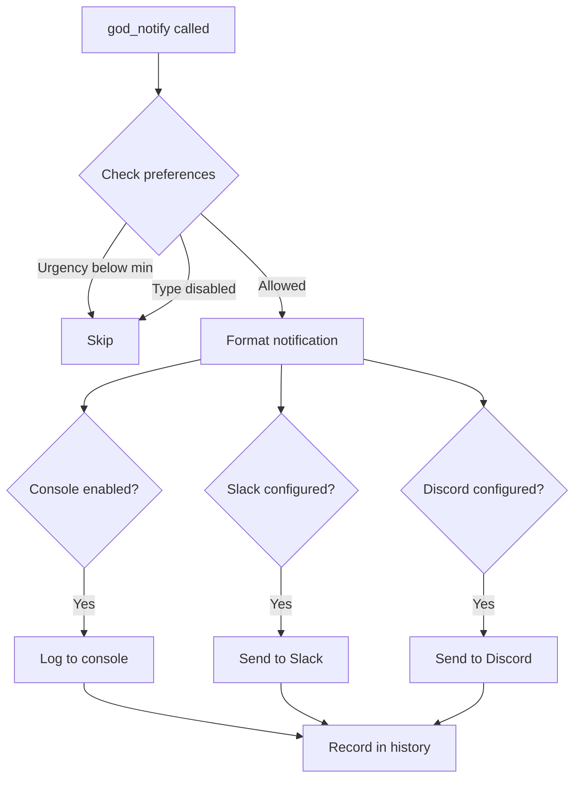

# Notification Tools

Tools for sending notifications and configuring notification channels.

## Tool Reference

| Tool | Purpose |
|------|---------|
| [god_notify](#god_notify) | Send notification |
| [god_notify_slack](#god_notify_slack) | Configure Slack |
| [god_notify_discord](#god_notify_discord) | Configure Discord |
| [god_notify_preferences](#god_notify_preferences) | Set preferences |
| [god_notify_test](#god_notify_test) | Test channels |
| [god_notify_history](#god_notify_history) | Get history |

---

## god_notify

Send a notification via console, Slack, Discord, or webhooks.

### Parameters

| Parameter | Type | Required | Description |
|-----------|------|----------|-------------|
| `type` | enum | Yes | Notification type |
| `title` | string | Yes | Notification title |
| `message` | string | Yes | Notification message |
| `task` | string | No | Task description |
| `taskId` | string | No | Associated task ID |
| `summary` | string | No | Short summary |
| `context` | string | No | Additional context |
| `urgency` | enum | No | Urgency level (default: normal) |
| `actions` | array | No | Available actions |

### Notification Types

| Type | Description | Use Case |
|------|-------------|----------|
| `complete` | Task completed | Successful task completion |
| `blocked` | Task blocked | Cannot proceed |
| `decision` | Decision needed | Choices to make |
| `review_ready` | Review ready | Code review available |
| `progress` | Progress update | Task progress |
| `error` | Error occurred | Something failed |
| `escalation` | Escalation needed | Requires attention |
| `approval` | Approval needed | Awaiting approval |
| `info` | Information | General info |

### Urgency Levels

| Level | Description |
|-------|-------------|
| `low` | Low priority, can wait |
| `normal` | Standard priority |
| `high` | Important, needs attention |
| `critical` | Urgent, immediate attention |

### Response

```json
{
  "success": true,
  "notificationId": "notif_abc123...",
  "type": "complete",
  "channels": ["console", "slack"],
  "timestamp": "2024-01-15T10:00:00Z"
}
```

### Example

```typescript
// Task completion notification
await mcp__rubix__god_notify({
  type: "complete",
  title: "Task Completed",
  message: "Successfully implemented user authentication",
  task: "Add JWT authentication",
  taskId: "task_abc123",
  urgency: "normal"
});

// Decision needed
await mcp__rubix__god_notify({
  type: "decision",
  title: "Database Choice Needed",
  message: "Which database should we use for the new feature?",
  urgency: "high",
  actions: [
    { label: "PostgreSQL", style: "primary" },
    { label: "MongoDB", style: "secondary" },
    { label: "SQLite", style: "secondary" }
  ]
});

// Error notification
await mcp__rubix__god_notify({
  type: "error",
  title: "Build Failed",
  message: "TypeScript compilation failed with 3 errors",
  context: "See error log for details",
  urgency: "high"
});
```

---

## god_notify_slack

Configure Slack webhook for notifications.

### Parameters

| Parameter | Type | Required | Description |
|-----------|------|----------|-------------|
| `webhookUrl` | string | Yes | Slack webhook URL |
| `channel` | string | No | Default channel |
| `username` | string | No | Bot username |
| `iconEmoji` | string | No | Bot icon emoji |
| `enabled` | boolean | No | Enable Slack notifications |

### Response

```json
{
  "success": true,
  "channel": "#dev-alerts",
  "username": "RUBIX Bot",
  "enabled": true
}
```

### Example

```typescript
await mcp__rubix__god_notify_slack({
  webhookUrl: "https://hooks.slack.com/services/T00/B00/XXX",
  channel: "#dev-alerts",
  username: "RUBIX Bot",
  iconEmoji: ":robot_face:",
  enabled: true
});
```

### Getting Webhook URL

1. Go to Slack App settings
2. Create incoming webhook
3. Select channel
4. Copy webhook URL

---

## god_notify_discord

Configure Discord webhook for notifications.

### Parameters

| Parameter | Type | Required | Description |
|-----------|------|----------|-------------|
| `webhookUrl` | string | Yes | Discord webhook URL |
| `username` | string | No | Bot username |
| `avatarUrl` | string | No | Bot avatar URL |
| `enabled` | boolean | No | Enable Discord notifications |

### Response

```json
{
  "success": true,
  "username": "RUBIX Bot",
  "enabled": true
}
```

### Example

```typescript
await mcp__rubix__god_notify_discord({
  webhookUrl: "https://discord.com/api/webhooks/XXX/YYY",
  username: "RUBIX Bot",
  enabled: true
});
```

### Getting Webhook URL

1. Server Settings → Integrations
2. Create Webhook
3. Select channel
4. Copy webhook URL

---

## god_notify_preferences

Configure notification preferences.

### Parameters

| Parameter | Type | Required | Description |
|-----------|------|----------|-------------|
| `onComplete` | boolean | No | Notify on task completion |
| `onBlocked` | boolean | No | Notify when blocked |
| `onDecision` | boolean | No | Notify when decision needed |
| `onError` | boolean | No | Notify on errors |
| `onProgress` | boolean | No | Notify on progress |
| `onReviewReady` | boolean | No | Notify when review ready |
| `minUrgency` | enum | No | Minimum urgency to notify |

### Response

```json
{
  "success": true,
  "preferences": {
    "onComplete": true,
    "onBlocked": true,
    "onDecision": true,
    "onError": true,
    "onProgress": false,
    "onReviewReady": true,
    "minUrgency": "normal"
  }
}
```

### Example

```typescript
// Configure to only receive important notifications
await mcp__rubix__god_notify_preferences({
  onComplete: true,
  onBlocked: true,
  onDecision: true,
  onError: true,
  onProgress: false,  // Skip progress updates
  minUrgency: "high"  // Only high/critical
});
```

---

## god_notify_test

Send a test notification to verify configuration.

### Parameters

None.

### Response

```json
{
  "success": true,
  "testedChannels": ["console", "slack", "discord"],
  "results": {
    "console": { "success": true },
    "slack": { "success": true },
    "discord": { "success": false, "error": "Invalid webhook URL" }
  }
}
```

### Example

```typescript
const test = await mcp__rubix__god_notify_test();

for (const [channel, result] of Object.entries(test.results)) {
  if (result.success) {
    console.log(`✓ ${channel} working`);
  } else {
    console.log(`✗ ${channel} failed: ${result.error}`);
  }
}
```

---

## god_notify_history

Get recent notification history.

### Parameters

| Parameter | Type | Required | Description |
|-----------|------|----------|-------------|
| `limit` | number | No | Max notifications (default: 20) |

### Response

```json
{
  "success": true,
  "notifications": [
    {
      "id": "notif_abc123",
      "type": "complete",
      "title": "Task Completed",
      "message": "...",
      "urgency": "normal",
      "channels": ["console", "slack"],
      "timestamp": "2024-01-15T10:00:00Z",
      "status": "delivered"
    }
  ],
  "total": 150
}
```

### Example

```typescript
const history = await mcp__rubix__god_notify_history({
  limit: 10
});

for (const notif of history.notifications) {
  console.log(`[${notif.type}] ${notif.title}`);
}
```

---

## Notification Flow



---

## Notification Format

### Console Output

```
╔═══════════════════════════════════════╗
║ 🎉 Task Completed                     ║
╠═══════════════════════════════════════╣
║ Successfully implemented user auth    ║
║                                       ║
║ Task: Add JWT authentication          ║
║ Urgency: normal                       ║
╚═══════════════════════════════════════╝
```

### Slack Message

```json
{
  "text": "Task Completed",
  "blocks": [
    {
      "type": "header",
      "text": { "type": "plain_text", "text": "🎉 Task Completed" }
    },
    {
      "type": "section",
      "text": { "type": "mrkdwn", "text": "Successfully implemented user auth" }
    },
    {
      "type": "context",
      "elements": [
        { "type": "mrkdwn", "text": "*Task:* Add JWT authentication" }
      ]
    }
  ]
}
```

---

## Configuration Example

```typescript
// Configure all channels
await mcp__rubix__god_notify_slack({
  webhookUrl: process.env.SLACK_WEBHOOK!,
  channel: "#rubix-alerts",
  username: "RUBIX Bot"
});

await mcp__rubix__god_notify_discord({
  webhookUrl: process.env.DISCORD_WEBHOOK!,
  username: "RUBIX Bot"
});

// Set preferences
await mcp__rubix__god_notify_preferences({
  onComplete: true,
  onBlocked: true,
  onDecision: true,
  onError: true,
  minUrgency: "normal"
});

// Test configuration
const test = await mcp__rubix__god_notify_test();
console.log('Notification test:', test.results);
```

## Next Steps

- [Deep Work Tools](deepwork-tools.md) - Focus mode
- [Communication Tools](communication-tools.md) - Escalation
- [CODEX Tools](codex-tools.md) - Task execution
