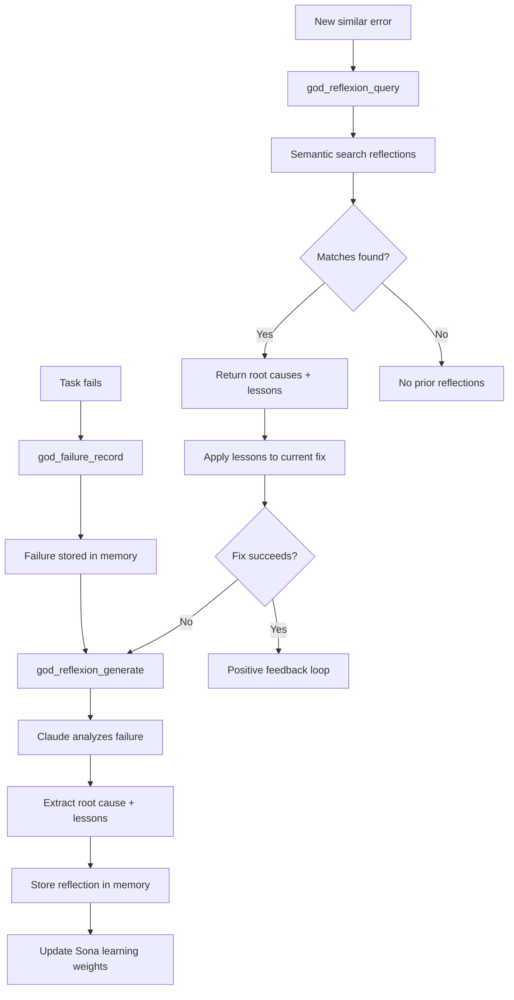

# Reflexion Tools

Tools for generating and querying failure reflections. The reflexion system analyzes past failures to extract root causes, lessons learned, and recommended approaches for similar future errors.

## Tool Reference

| Tool | Purpose |
|------|---------|
| [god_reflexion_query](#god_reflexion_query) | Search past reflections |
| [god_reflexion_generate](#god_reflexion_generate) | Generate reflection from failure |
| [god_reflexion_stats](#god_reflexion_stats) | Get statistics |

---

## god_reflexion_query

Search past failure reflections for similar errors. Uses semantic matching to find reflections whose root causes and lessons may apply to the current error.

### Parameters

| Parameter | Type | Required | Description |
|-----------|------|----------|-------------|
| `error` | string | Yes | Error message or description to find similar reflections for |
| `topK` | number | No | Maximum results to return (default: 5) |

### Response

```json
{
  "success": true,
  "query": "TypeError: Cannot read property 'map' of undefined",
  "reflections": [
    {
      "id": "refl_abc123",
      "rootCause": "missing_context",
      "rootCauseDescription": "API response shape changed after backend update, no null check on array field",
      "lessons": [
        "Always validate API response shape before accessing nested arrays",
        "Use optional chaining with fallback: data?.items ?? []",
        "Add response type validation at API boundary"
      ],
      "recommendedApproach": "Add defensive checks at the API response boundary and use TypeScript strict null checks",
      "similarity": 0.89,
      "originalError": "TypeError: Cannot read property 'filter' of undefined",
      "taskDescription": "Render user list component from API data",
      "created": "2024-01-10T14:30:00Z"
    }
  ],
  "totalResults": 1
}
```

### Example

```typescript
// Before attempting a fix, search for relevant reflections
const reflections = await mcp__rubix__god_reflexion_query({
  error: "TypeError: Cannot read property 'map' of undefined in UserList component",
  topK: 3
});

if (reflections.reflections.length > 0) {
  const best = reflections.reflections[0];
  console.log(`Root cause category: ${best.rootCause}`);
  console.log(`Analysis: ${best.rootCauseDescription}`);
  console.log("Lessons learned:");
  for (const lesson of best.lessons) {
    console.log(`  - ${lesson}`);
  }
  console.log(`Recommended approach: ${best.recommendedApproach}`);
}
```

### Use Cases

1. **Pre-Fix Research**: Check if a similar error has been analyzed before
2. **Pattern Identification**: Discover recurring root causes across failures
3. **Learning Transfer**: Apply lessons from one failure to a different but similar issue

---

## god_reflexion_generate

Generate a reflection from a recorded failure. Uses Claude to analyze the failure context, identify root causes, extract lessons, and recommend future approaches.

### Parameters

| Parameter | Type | Required | Description |
|-----------|------|----------|-------------|
| `failureId` | string | Yes | ID of the recorded failure to reflect on |
| `taskDescription` | string | Yes | Description of the task that failed |
| `subtaskDescription` | string | No | Description of the specific subtask that failed |
| `previousAttempts` | string[] | No | Descriptions of previous failed attempts for this task |

### Root Cause Categories

| Category | Description |
|----------|-------------|
| `missing_context` | Insufficient information to complete the task correctly |
| `wrong_approach` | Fundamentally incorrect strategy or algorithm |
| `external_dependency` | Failure in a third-party service, library, or API |
| `integration_mismatch` | Incompatibility between components or interfaces |
| `incomplete_spec` | Ambiguous or missing requirements |
| `environment_issue` | Configuration, versioning, or infrastructure problem |

### Response

```json
{
  "success": true,
  "reflection": {
    "id": "refl_xyz789",
    "failureId": "fail_abc123",
    "rootCause": "wrong_approach",
    "rootCauseDescription": "Used synchronous file read in async handler, blocking the event loop and causing timeout",
    "lessons": [
      "Always use async file operations in request handlers",
      "Check for blocking operations when debugging timeouts",
      "Use fs.promises instead of fs.readFileSync in server code"
    ],
    "recommendedApproach": "Replace fs.readFileSync with fs.promises.readFile and add proper error handling with try/catch around the await call",
    "confidence": 0.85,
    "created": "2024-01-15T11:00:00Z"
  },
  "storedInMemory": true
}
```

### Example

```typescript
// After a failure is recorded, generate a reflection
const reflection = await mcp__rubix__god_reflexion_generate({
  failureId: "fail_abc123",
  taskDescription: "Implement file upload endpoint for user avatars",
  subtaskDescription: "Read uploaded file and save to disk",
  previousAttempts: [
    "Used multer middleware with default config - timed out on large files",
    "Switched to busboy streaming - still blocking on file write"
  ]
});

console.log(`Root cause: ${reflection.reflection.rootCause}`);
console.log(`Analysis: ${reflection.reflection.rootCauseDescription}`);
console.log("Lessons for the future:");
for (const lesson of reflection.reflection.lessons) {
  console.log(`  - ${lesson}`);
}
```

### Reflection Pipeline

1. Fetches the failure record and its context
2. Sends failure details and previous attempts to Claude for analysis
3. Claude identifies root cause category and provides structured reflection
4. Reflection is stored in memory with semantic tags for future retrieval
5. Sona learning receives feedback based on reflection confidence

---

## god_reflexion_stats

Get statistics about the reflexion system.

### Parameters

None.

### Response

```json
{
  "success": true,
  "stats": {
    "totalReflections": 85,
    "byRootCause": {
      "missing_context": 25,
      "wrong_approach": 20,
      "external_dependency": 15,
      "integration_mismatch": 12,
      "incomplete_spec": 8,
      "environment_issue": 5
    },
    "averageConfidence": 0.78,
    "lessonsGenerated": 255,
    "reflectionsWithSuccessfulOutcome": 62,
    "successRate": 0.729,
    "recentTrends": {
      "last7d": 8,
      "last30d": 30
    },
    "topLessons": [
      {
        "lesson": "Always validate API response shape before accessing nested properties",
        "occurrences": 7
      },
      {
        "lesson": "Use async operations in request handlers to avoid blocking",
        "occurrences": 5
      }
    ]
  }
}
```

### Example

```typescript
const stats = await mcp__rubix__god_reflexion_stats();

console.log(`Total reflections: ${stats.stats.totalReflections}`);
console.log(`Success rate: ${(stats.stats.successRate * 100).toFixed(1)}%`);
console.log(`Average confidence: ${stats.stats.averageConfidence}`);

// Identify most common root causes
console.log("\nRoot cause breakdown:");
for (const [cause, count] of Object.entries(stats.stats.byRootCause)) {
  const pct = ((count / stats.stats.totalReflections) * 100).toFixed(1);
  console.log(`  ${cause}: ${count} (${pct}%)`);
}

// Show recurring lessons
console.log("\nMost common lessons:");
for (const item of stats.stats.topLessons) {
  console.log(`  [${item.occurrences}x] ${item.lesson}`);
}
```

---

## Reflexion Flow



---

## Integration with Self-Healing

The reflexion system integrates directly with the SelfHealer during task execution:

```typescript
// In SelfHealer.ts
async analyzeFailure(context: FailureContext): Promise<HealingAnalysis> {
  // 1. Query existing reflections for this error type
  const reflections = await this.reflexionService.query(context.error.message);

  // 2. Apply lessons from past reflections
  if (reflections.length > 0) {
    const lessons = reflections.flatMap(r => r.lessons);
    // Use lessons to inform the healing approach
  }

  // 3. Generate new reflection if no good matches exist
  if (reflections.length === 0 || reflections[0].similarity < 0.7) {
    await this.reflexionService.generate(
      context.failureId,
      context.taskDescription,
      context.subtaskDescription,
      context.previousAttempts
    );
  }

  return healingAnalysis;
}
```

---

## Best Practices

### Generating Reflections

1. **Include Previous Attempts**: The more context about what was tried, the better the analysis
2. **Be Specific in Descriptions**: Vague task descriptions produce vague reflections
3. **Generate After Each Failure**: Do not wait for resolution; reflections are useful immediately
4. **Review Confidence**: Low-confidence reflections may need manual review

### Querying Reflections

1. **Include Full Error Message**: More text gives better semantic matching
2. **Check Root Cause Category**: Helps determine if the lesson truly applies
3. **Use Multiple Queries**: Try different phrasings if the first query has no good matches
4. **Combine with Failure Query**: Use both `god_reflexion_query` and `god_failure_query` for comprehensive context

### Monitoring

1. **Track Success Rate**: Declining success rate may indicate stale reflections
2. **Review Top Lessons**: Recurring lessons suggest systemic issues worth addressing
3. **Monitor Root Cause Distribution**: Shifts may indicate changing project needs

## Next Steps

- [Failure Tools](failure-tools.md) - Recording and querying failures
- [Learning Tools](learning-tools.md) - Sona learning integration
- [CODEX Tools](codex-tools.md) - Task execution and self-healing
- [Tools Overview](index.md) - All tools