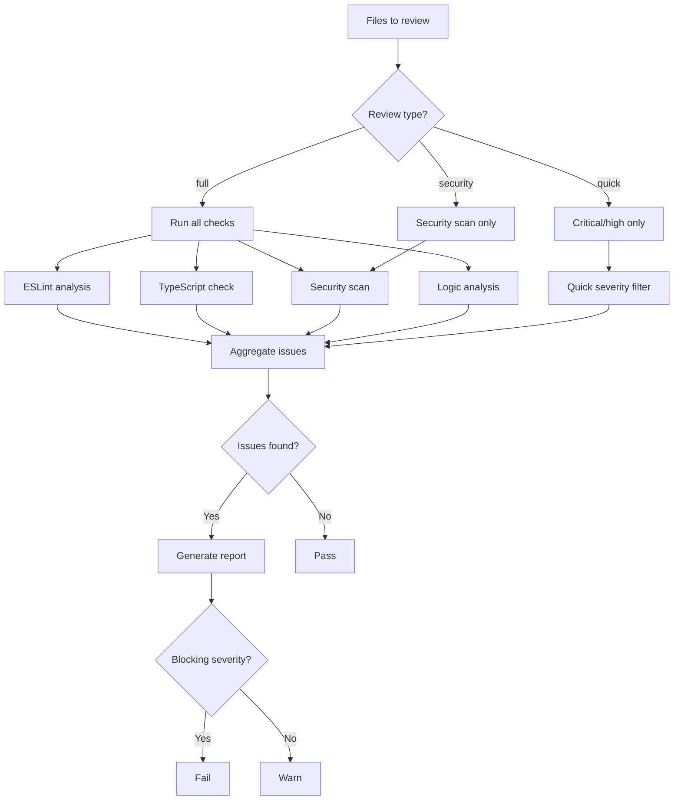

# Review Tools

Tools for automated code review and security scanning.

## Tool Reference

| Tool | Purpose |
|------|---------|
| [god_review](#god_review) | Full code review |
| [god_quick_review](#god_quick_review) | Pre-commit check |
| [god_security_review](#god_security_review) | Security scan |
| [god_review_config](#god_review_config) | Configure review |

---

## god_review

Perform automated code review on files.

### Parameters

| Parameter | Type | Required | Description |
|-----------|------|----------|-------------|
| `files` | string[] | Yes | Files to review (relative paths) |
| `type` | enum | No | Type of review (default: full) |
| `diff` | string | No | Git diff to review |
| `baseBranch` | string | No | Base branch for comparison |
| `targetBranch` | string | No | Target branch |
| `description` | string | No | Commit message or description |

### Review Types

| Type | Description | Speed |
|------|-------------|-------|
| `full` | Complete review (all checks) | Slowest |
| `security` | Security-focused only | Medium |
| `style` | Style/lint issues only | Fast |
| `logic` | Logic issues only | Medium |
| `quick` | Critical/high severity only | Fast |
| `pre-commit` | Pre-commit hook check | Fastest |

### Response

```json
{
  "success": true,
  "reviewId": "rev_abc123...",
  "type": "full",
  "filesReviewed": 5,
  "summary": {
    "passed": false,
    "issueCount": 8,
    "bySeverity": {
      "critical": 0,
      "high": 2,
      "medium": 4,
      "low": 2,
      "info": 0
    }
  },
  "issues": [
    {
      "id": "issue_1",
      "file": "src/auth/login.ts",
      "line": 42,
      "column": 10,
      "severity": "high",
      "category": "security",
      "rule": "no-sql-injection",
      "message": "Potential SQL injection vulnerability",
      "suggestion": "Use parameterized queries instead of string concatenation",
      "code": "const query = `SELECT * FROM users WHERE id = ${userId}`"
    }
  ],
  "metrics": {
    "reviewTimeMs": 5200,
    "linesReviewed": 450
  }
}
```

### Example

```typescript
// Full review of specific files
const review = await mcp__rubix__god_review({
  files: ["src/auth/login.ts", "src/auth/register.ts"],
  type: "full"
});

if (!review.summary.passed) {
  console.log(`Found ${review.summary.issueCount} issues`);
  for (const issue of review.issues) {
    console.log(`[${issue.severity}] ${issue.file}:${issue.line} - ${issue.message}`);
  }
}

// Review git diff
const diffReview = await mcp__rubix__god_review({
  files: ["src/api/users.ts"],
  diff: gitDiffOutput,
  description: "Add user profile endpoint"
});
```

---

## god_quick_review

Quick code review for pre-commit checks.

### Parameters

| Parameter | Type | Required | Description |
|-----------|------|----------|-------------|
| `files` | string[] | Yes | Files to review |

### Response

```json
{
  "success": true,
  "passed": true,
  "filesReviewed": 3,
  "criticalIssues": 0,
  "highIssues": 0,
  "message": "All checks passed"
}
```

### Example

```typescript
// Pre-commit hook
const quick = await mcp__rubix__god_quick_review({
  files: ["src/index.ts", "src/utils.ts"]
});

if (!quick.passed) {
  console.error("Pre-commit check failed!");
  process.exit(1);
}
```

### Use in Git Hook

```bash
#!/bin/sh
# .git/hooks/pre-commit

# Get staged files
FILES=$(git diff --cached --name-only --diff-filter=ACM | grep -E '\.(ts|tsx|js|jsx)$')

if [ -n "$FILES" ]; then
  # Run quick review via CLI
  god-agent quick-review $FILES
  if [ $? -ne 0 ]; then
    echo "Pre-commit review failed. Fix issues before committing."
    exit 1
  fi
fi
```

---

## god_security_review

Security-focused code review.

### Parameters

| Parameter | Type | Required | Description |
|-----------|------|----------|-------------|
| `files` | string[] | Yes | Files to scan |

### Security Checks (OWASP Top 10)

| Check | Description |
|-------|-------------|
| SQL Injection | Detects SQL injection vulnerabilities |
| XSS | Cross-site scripting vulnerabilities |
| Hardcoded Secrets | API keys, passwords in code |
| Cryptographic Failures | Weak encryption, insecure random |
| Authentication Issues | Insecure auth patterns |
| SSRF | Server-side request forgery |
| CSRF | Cross-site request forgery |
| Path Traversal | Directory traversal attacks |
| Command Injection | OS command injection |
| Insecure Deserialization | Unsafe deserialization |

### Response

```json
{
  "success": true,
  "reviewId": "sec_abc123...",
  "filesScanned": 10,
  "vulnerabilities": [
    {
      "id": "vuln_1",
      "file": "src/api/files.ts",
      "line": 25,
      "severity": "critical",
      "category": "A03:2021-Injection",
      "cwe": "CWE-78",
      "title": "OS Command Injection",
      "description": "User input passed directly to exec()",
      "recommendation": "Use a whitelist or sanitize input",
      "references": [
        "https://owasp.org/Top10/A03_2021-Injection/"
      ]
    }
  ],
  "summary": {
    "critical": 1,
    "high": 2,
    "medium": 3,
    "low": 5
  }
}
```

### Example

```typescript
const security = await mcp__rubix__god_security_review({
  files: ["src/**/*.ts"]
});

if (security.summary.critical > 0 || security.summary.high > 0) {
  console.error("Critical security issues found!");
  for (const vuln of security.vulnerabilities) {
    if (vuln.severity === "critical" || vuln.severity === "high") {
      console.error(`[${vuln.severity.toUpperCase()}] ${vuln.title}`);
      console.error(`  File: ${vuln.file}:${vuln.line}`);
      console.error(`  ${vuln.description}`);
    }
  }
}
```

---

## god_review_config

Configure code review settings.

### Parameters

| Parameter | Type | Required | Description |
|-----------|------|----------|-------------|
| `security` | boolean | No | Enable security scanning |
| `style` | boolean | No | Enable style checking |
| `logic` | boolean | No | Enable logic review |
| `tests` | boolean | No | Enable test coverage check |
| `blockingSeverity` | enum | No | Min severity to block |
| `maxIssues` | number | No | Max issues before blocking |
| `sensitivePatterns` | string[] | No | File patterns to flag |

### Severity Levels

| Level | Description |
|-------|-------------|
| `critical` | Must fix immediately |
| `high` | Should fix before merge |
| `medium` | Should fix soon |
| `low` | Consider fixing |
| `info` | Informational |

### Response

```json
{
  "success": true,
  "config": {
    "security": true,
    "style": true,
    "logic": true,
    "tests": true,
    "blockingSeverity": "high",
    "maxIssues": 10,
    "sensitivePatterns": ["**/auth/**", "**/payment/**"]
  }
}
```

### Example

```typescript
// Configure strict review
await mcp__rubix__god_review_config({
  security: true,
  style: true,
  logic: true,
  tests: true,
  blockingSeverity: "medium",
  maxIssues: 5,
  sensitivePatterns: [
    "**/auth/**",
    "**/payment/**",
    "**/secrets/**"
  ]
});
```

---

## Review Flow



---

## Issue Categories

| Category | Description |
|----------|-------------|
| `security` | Security vulnerabilities |
| `performance` | Performance issues |
| `reliability` | Reliability/stability issues |
| `maintainability` | Code maintainability |
| `style` | Code style violations |
| `documentation` | Missing documentation |
| `testing` | Test coverage issues |
| `accessibility` | Accessibility issues |

---

## Integration with CODEX

Reviews are automatically triggered by CODEX after code generation:

```typescript
// In TaskExecutor
async verifyCodeGeneration(result: CodeGenResult) {
  const review = await this.reviewer.review({
    files: result.modifiedFiles,
    type: "full"
  });

  if (!review.summary.passed) {
    // Self-heal: fix issues
    return this.selfHealer.fixIssues(review.issues);
  }

  return { success: true };
}
```

---

## Complete Workflow Example

```typescript
// 1. Configure review settings
await mcp__rubix__god_review_config({
  security: true,
  blockingSeverity: "high"
});

// 2. Quick check before development
const quick = await mcp__rubix__god_quick_review({
  files: ["src/index.ts"]
});

// 3. Full review before merge
const full = await mcp__rubix__god_review({
  files: ["src/**/*.ts"],
  type: "full",
  baseBranch: "main",
  targetBranch: "feature/auth"
});

// 4. Security review for sensitive files
const security = await mcp__rubix__god_security_review({
  files: ["src/auth/**/*.ts", "src/payment/**/*.ts"]
});

// 5. Report
console.log(`
Review Summary:
- Files: ${full.filesReviewed}
- Issues: ${full.summary.issueCount}
- Security: ${security.summary.critical} critical, ${security.summary.high} high
- Passed: ${full.summary.passed && security.summary.critical === 0}
`);
```

## Next Steps

- [CODEX Tools](codex-tools.md) - Task execution
- [Config Tools](config-tools.md) - Configuration
- [Tools Overview](index.md) - All tools
