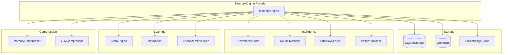
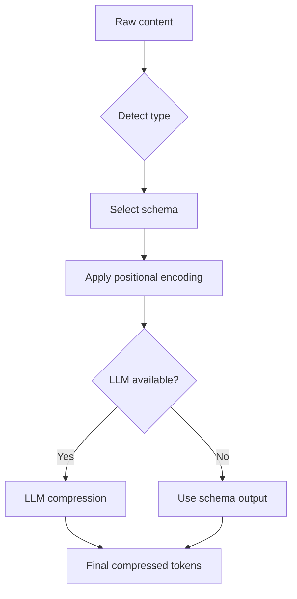

# Memory System Architecture

The MemoryEngine is the unified API facade that orchestrates all memory subsystems.

## Architecture Overview



## Core Components

### MemoryEngine

**File:** `src/core/MemoryEngine.ts` (~1100 lines)

The unified facade that coordinates all memory operations:

```typescript
class MemoryEngine {
  // Storage
  storage: SQLiteStorage;
  vectorDB: VectorDB;
  embeddingQueue: EmbeddingQueue;

  // Intelligence
  provenance: ProvenanceStore;
  causal: CausalMemory;
  shadow: ShadowSearch;
  patterns: PatternMatcher;

  // Learning
  sona: SonaEngine;
  tinyDancer: TinyDancer;
  enhancement: EnhancementLayer;

  // Compression
  compressor: MemoryCompressor;
  llmCompressor: LLMCompressor;

  // Main operations
  async store(entry: StoreInput): Promise<StoreResult>;
  async query(query: QueryInput): Promise<QueryResult>;
  async edit(entryId: string, updates: EditInput): Promise<void>;
  async delete(entryId: string): Promise<void>;
}
```

### SQLiteStorage

**File:** `src/storage/SQLiteStorage.ts` (~800 lines)

Persistent storage with 13+ tables:

| Table | Purpose |
|-------|---------|
| `memory_entries` | Core memory storage |
| `memory_tags` | Entry tags (many-to-many) |
| `provenance` | L-Score and lineage data |
| `causal_relations` | Hyperedge relations with TTL |
| `pattern_templates` | Reusable patterns |
| `scheduled_tasks` | Task definitions |
| `task_runs` | Execution history |
| `trajectories` | Learning trajectories |
| `pattern_weights` | Sona learning weights |
| `vector_mappings` | HNSW label mappings |
| `embedding_cache` | Cached embeddings |
| `compression_stats` | Compression metrics |
| `session_permissions` | Temporary permissions |

### VectorDB

**File:** `src/vector/VectorDB.ts`

HNSW-based semantic search:

```typescript
interface VectorDBConfig {
  maxElements: number;     // 100,000 default
  efConstruction: number;  // 200 (build quality)
  efSearch: number;        // 100 (search quality)
  M: number;              // 16 (connections per node)
  dimensions: number;      // 768 (embedding size)
}
```

**Operations:**
- `addPoint(id, vector)` - Add vector to index
- `search(vector, k)` - Find k nearest neighbors
- `removePoint(id)` - Remove vector from index

### EmbeddingQueue

**File:** `src/vector/EmbeddingQueue.ts`

Deferred batch embedding for efficiency:

```typescript
class EmbeddingQueue {
  queue: PendingEmbedding[];
  batchSize: number;      // 100 default
  flushInterval: number;  // 5000ms

  async add(entryId: string, content: string): Promise<void>;
  async flush(): Promise<void>;
  async processQueue(): Promise<void>;
}
```

**Flow:**
1. Entries added to queue
2. When batch size reached or interval expires
3. Batch sent to OpenAI API
4. Vectors added to HNSW index

## Provenance (L-Score)

### ProvenanceStore

Tracks reliability of information:

```typescript
interface ProvenanceData {
  entryId: string;
  parentIds: string[];
  lScore: number;       // 0.0 - 1.0
  lineageDepth: number;
  source: SourceType;
}
```

### L-Score Calculation

```typescript
function calculateLScore(parentScores: number[]): number {
  if (parentScores.length === 0) {
    return getBaseScore(source);  // user_input: 1.0, agent: 0.9, etc.
  }

  const avgParent = mean(parentScores);
  const decayed = avgParent * DECAY_FACTOR;  // 0.9 default
  return Math.max(decayed, MIN_LSCORE);      // 0.01 minimum
}
```

### Source Base Scores

| Source | Base L-Score |
|--------|--------------|
| `user_input` | 1.0 |
| `agent_inference` | 0.9 |
| `tool_output` | 0.8 |
| `system` | 1.0 |
| `external` | 0.7 |

## Causal Memory

### Hypergraph Relations

Supports n→m relations (not just 1→1):

```typescript
interface CausalRelation {
  id: string;
  sourceIds: string[];   // Multiple sources
  targetIds: string[];   // Multiple targets
  type: RelationType;
  strength: number;      // 0.0 - 1.0
  ttl?: number;         // Optional expiration
  expiresAt?: Date;
}
```

### Relation Types

| Type | Description | Example |
|------|-------------|---------|
| `causes` | Direct causation | Bug → Error |
| `enables` | Prerequisite | Auth → Access |
| `prevents` | Prevention | Validation → Injection |
| `correlates` | Correlation | High load ↔ Slow response |
| `precedes` | Temporal | Build → Deploy |
| `triggers` | Event trigger | Commit → CI |

### Temporal Hyperedges

Relations can expire (useful for regime-dependent correlations):

```typescript
// 7-day TTL for temporary correlation
await god_causal({
  sourceIds: ["entry1", "entry2"],
  targetIds: ["entry3"],
  type: "correlates",
  strength: 0.8,
  ttl: 604800000  // 7 days in ms
});
```

## Shadow Search

Find contradictory evidence:

```mermaid
flowchart TD
    A[Query: "X is true"] --> B[Generate embedding]
    B --> C[Invert embedding]
    C --> D[Search with -v]
    D --> E[Find opposing entries]
    E --> F[Calculate credibility]
    F --> G[Return contradictions]
```

### Credibility Score

```typescript
credibility = support / (support + contradiction)
```

Where:
- `support` = similarity to original query
- `contradiction` = similarity to inverted query

## Pattern Matching

Reusable templates for common patterns:

```typescript
interface PatternTemplate {
  id: string;
  name: string;
  pattern: string;      // Regex or glob
  category: string;
  successRate: number;
  useCount: number;
}
```

## Compression System

### Two-Stage Compression

1. **Schema Compression** (MemoryCompressor)
   - 18 positional schemas
   - Deterministic encoding
   - 50-75% reduction

2. **LLM Compression** (LLMCompressor)
   - Claude Opus primary
   - Ollama fallback
   - 60-70% additional reduction

### Compression Flow



## Embedding System

### EmbeddingService

Uses OpenAI text-embedding-3-small:

```typescript
interface EmbeddingConfig {
  model: string;        // text-embedding-3-small
  dimensions: number;   // 768
  batchSize: number;    // 100
}
```

### EmbeddingCache

LRU cache for frequently accessed embeddings:

```typescript
class EmbeddingCache {
  cache: LRUCache<string, Float32Array>;
  maxSize: number;  // 10,000 entries

  async get(content: string): Promise<Float32Array | null>;
  async set(content: string, embedding: Float32Array): Promise<void>;
}
```

## AsyncWriteQueue

Non-blocking writes for performance:

```typescript
class AsyncWriteQueue {
  queue: WriteOperation[];
  processing: boolean;

  async enqueue(op: WriteOperation): Promise<void>;
  async processQueue(): Promise<void>;
  async waitForDrain(): Promise<void>;
}
```

## Configuration

### Environment Variables

| Variable | Default | Description |
|----------|---------|-------------|
| `GOD_AGENT_DATA_DIR` | `./data` | Database location |
| `GOD_AGENT_HNSW_MAX_ELEMENTS` | `100000` | Max vectors |
| `GOD_AGENT_HNSW_EF_CONSTRUCTION` | `200` | Build quality |
| `GOD_AGENT_HNSW_EF_SEARCH` | `100` | Search quality |
| `GOD_AGENT_EMBEDDING_MODEL` | `text-embedding-3-small` | Embedding model |
| `GOD_AGENT_EMBEDDING_DIMENSIONS` | `768` | Vector size |
| `GOD_AGENT_LSCORE_DECAY` | `0.9` | L-Score decay |
| `GOD_AGENT_LSCORE_THRESHOLD` | `0.3` | Min L-Score |

## Usage Examples

### Store with Provenance

```typescript
const result = await engine.store({
  content: "New finding based on previous research",
  parentIds: ["entry_abc", "entry_def"],
  tags: ["research", "finding"],
  importance: 0.8
});
// L-Score calculated from parents
```

### Query with Routing

```typescript
const results = await engine.query({
  query: "What caused the authentication failure?",
  topK: 10,
  includeProvenance: true
});
// TinyDancer routes to causal_backward
// Returns results with L-Scores
```

### Add Causal Relation

```typescript
await engine.addCausalRelation({
  sourceIds: ["bug_entry"],
  targetIds: ["error_entry"],
  type: "causes",
  strength: 0.9
});
```

### Find Contradictions

```typescript
const contradictions = await engine.shadowSearch({
  query: "Our authentication is secure",
  topK: 5,
  threshold: 0.5
});
// Returns entries that contradict the claim
```

## Next Steps

- [Compression Schemas](../memory/compression-schemas.md) - All 18 schemas
- [Learning System](learning-system.md) - Sona trajectory learning
- [Routing System](routing-system.md) - TinyDancer query routing
