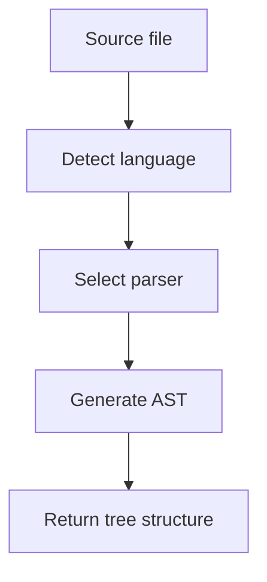

# AST Manager

Abstract Syntax Tree parsing and manipulation.

## Location

`src/capabilities/ASTManager.ts`

## Purpose

Provides code structure analysis:

- Parse files to AST
- Query for specific node types
- Safe refactoring operations
- Symbol extraction

## MCP Tools

| Tool | Purpose |
|------|---------|
| `god_ast_parse` | Parse file to AST |
| `god_ast_query` | Find specific node types |
| `god_ast_refactor` | Safe code transformations |
| `god_ast_symbols` | Extract all symbols |

## Supported Languages

| Language | Parser |
|----------|--------|
| TypeScript | `@typescript-eslint/parser` |
| JavaScript | `@babel/parser` |
| Python | `tree-sitter-python` |
| Go | `tree-sitter-go` |

## Parse Flow



## Example: Parse File

```typescript
const ast = await god_ast_parse({
  file: "src/utils.ts"
});

// Result:
{
  type: "Program",
  children: [
    { type: "ImportDeclaration", ... },
    { type: "FunctionDeclaration", name: "helper", ... },
    { type: "ExportDeclaration", ... }
  ]
}
```

## Example: Query Nodes

```typescript
const functions = await god_ast_query({
  file: "src/utils.ts",
  nodeType: "FunctionDeclaration"
});

// Result:
{
  matches: [
    { name: "helper", line: 5, params: ["x", "y"] },
    { name: "transform", line: 15, params: ["data"] }
  ]
}
```

## Safe Refactoring

| Operation | Description |
|-----------|-------------|
| `rename` | Rename symbol across scope |
| `extract` | Extract code to function |
| `inline` | Inline function calls |
| `move` | Move to different file |

```typescript
const result = await god_ast_refactor({
  type: "rename",
  target: "src/utils.ts:helper",
  newValue: "helperFunction",
  scope: "all"  // or specific file
});

// Result:
{
  filesModified: 3,
  occurrencesChanged: 12,
  changes: [
    { file: "src/utils.ts", line: 5, before: "helper", after: "helperFunction" },
    ...
  ]
}
```

## Symbol Extraction

```typescript
const symbols = await god_ast_symbols({
  file: "src/utils.ts"
});

// Result:
{
  functions: [
    { name: "helper", line: 5, exported: true },
    { name: "internal", line: 20, exported: false }
  ],
  classes: [],
  variables: [
    { name: "CONFIG", line: 3, exported: true }
  ],
  types: [
    { name: "Options", line: 8, exported: true }
  ]
}
```

## Related

- [Capability Tools](../tools/capability-tools.md)
- [Capabilities Overview](index.md)
- [LSP Manager](lsp-manager.md)
