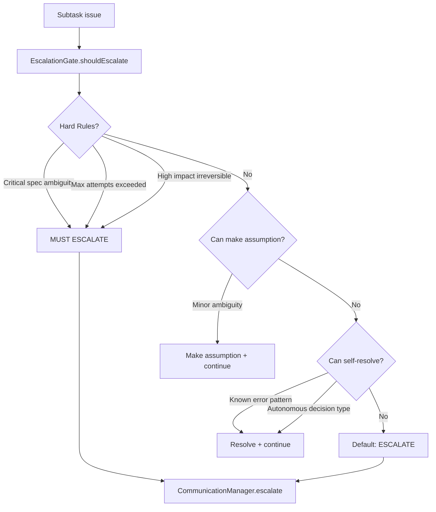

# EscalationGate

**File:** `src/codex/EscalationGate.ts` (~300 lines)

The EscalationGate decides when RUBIX should escalate to the user, balancing autonomy with appropriate human involvement.

## Overview



## Class Structure

```typescript
class EscalationGate {
  private config: EscalationConfig;
  private memoryEngine: MemoryEngine;
  private communicationManager: CommunicationManager;
}
```

## Constructor

```typescript
const gate = new EscalationGate({
  maxAttemptsBeforeEscalate: 5,
  autonomousDecisions: [
    'dependency_minor_versions',
    'code_formatting',
    'variable_naming',
    'test_structure'
  ],
  requireApproval: [
    'database_schema_changes',
    'api_breaking_changes',
    'new_dependencies',
    'architecture_changes'
  ]
});
```

## Main Method: shouldEscalate()

```typescript
interface EscalationInput {
  subtask: Subtask;
  error?: Error;
  analysis?: HealingAnalysis;
  attempt: number;
  decisionType?: string;
  businessImpact?: 'low' | 'medium' | 'high';
}

interface EscalationDecision {
  mustEscalate: boolean;
  reason: string;
  escalationType: EscalationType;
  canMakeAssumption: boolean;
  assumption?: string;
  suggestedOptions?: EscalationOption[];
}

const decision = await gate.shouldEscalate({
  subtask,
  error,
  analysis,
  attempt: 4,
  decisionType: 'new_dependencies',
  businessImpact: 'medium'
});
```

## Hard Rules (Must Escalate)

### 1. Critical Spec Ambiguity

```typescript
private isCriticalAmbiguity(input: EscalationInput): boolean {
  // High business impact ambiguity
  if (input.businessImpact === 'high' && input.analysis?.needsMoreContext) {
    return true;
  }

  // Core functionality unclear
  if (input.subtask.type === 'design' &&
      input.analysis?.suggestedActions.includes('clarify_requirements')) {
    return true;
  }

  return false;
}
```

### 2. Max Attempts Exceeded

```typescript
private isMaxAttemptsExceeded(input: EscalationInput): boolean {
  return input.attempt >= this.config.maxAttemptsBeforeEscalate;
}
```

### 3. High Impact Irreversible Actions

```typescript
private isHighImpactIrreversible(input: EscalationInput): boolean {
  const irreversiblePatterns = [
    'delete', 'drop', 'truncate', 'remove',
    'migrate', 'schema', 'production', 'deploy'
  ];

  const description = input.subtask.description.toLowerCase();

  return irreversiblePatterns.some(p => description.includes(p)) &&
         input.businessImpact !== 'low';
}
```

## Autonomous Decisions

Decisions RUBIX can make without asking:

```typescript
private canDecideAutonomously(input: EscalationInput): boolean {
  if (!input.decisionType) return false;

  return this.config.autonomousDecisions.includes(input.decisionType);
}

// Default autonomous decisions:
const autonomousDecisions = [
  'dependency_minor_versions',  // Minor version bumps
  'code_formatting',            // Formatting choices
  'variable_naming',            // Naming conventions
  'test_structure'              // Test organization
];
```

## Require Approval

Decisions that always require human approval:

```typescript
private requiresApproval(input: EscalationInput): boolean {
  if (!input.decisionType) return false;

  return this.config.requireApproval.includes(input.decisionType);
}

// Default require approval:
const requireApproval = [
  'database_schema_changes',    // Schema modifications
  'api_breaking_changes',       // Breaking API changes
  'new_dependencies',           // Adding dependencies
  'architecture_changes'        // Architectural decisions
];
```

## Assumption Making

```typescript
private canMakeAssumption(input: EscalationInput): CanAssumeResult {
  const { subtask, analysis } = input;

  // Check if assumption is safe
  if (analysis?.needsMoreContext) {
    const contextItems = analysis.contextNeeded;

    // Minor missing context - can assume
    if (contextItems.length === 1 &&
        this.isMinorContext(contextItems[0])) {
      return {
        canAssume: true,
        assumption: this.generateAssumption(contextItems[0]),
        confidence: 0.7
      };
    }
  }

  // Common pattern - can use convention
  if (this.hasConventionPattern(subtask)) {
    return {
      canAssume: true,
      assumption: 'Following codebase conventions',
      confidence: 0.9
    };
  }

  return { canAssume: false };
}

private isMinorContext(item: string): boolean {
  const minorPatterns = [
    'import path', 'file location', 'naming',
    'order', 'style', 'format'
  ];
  return minorPatterns.some(p => item.toLowerCase().includes(p));
}
```

## Self-Resolution

```typescript
private canSelfResolve(input: EscalationInput): CanResolveResult {
  const { analysis } = input;

  // Known error pattern from failure memory
  if (analysis?.similarFailures?.some(f => f.succeeded)) {
    const successfulFix = analysis.similarFailures.find(f => f.succeeded);
    return {
      canResolve: true,
      resolution: successfulFix.resolution,
      source: 'failure_memory'
    };
  }

  // Transient error - can retry
  if (analysis?.isTransient) {
    return {
      canResolve: true,
      resolution: 'Retry after delay',
      source: 'transient_handling'
    };
  }

  return { canResolve: false };
}
```

## Escalation Types

```typescript
type EscalationType =
  | 'clarification'   // Need more information
  | 'decision'        // Choose between options
  | 'blocked'         // Cannot proceed
  | 'approval';       // Irreversible action
```

## Decision Flow

```typescript
async shouldEscalate(input: EscalationInput): Promise<EscalationDecision> {
  // 1. Check hard rules
  if (this.isCriticalAmbiguity(input)) {
    return {
      mustEscalate: true,
      reason: 'Critical spec ambiguity with high business impact',
      escalationType: 'clarification',
      canMakeAssumption: false
    };
  }

  if (this.isMaxAttemptsExceeded(input)) {
    return {
      mustEscalate: true,
      reason: `Max attempts (${this.config.maxAttemptsBeforeEscalate}) exceeded`,
      escalationType: 'blocked',
      canMakeAssumption: false
    };
  }

  if (this.isHighImpactIrreversible(input)) {
    return {
      mustEscalate: true,
      reason: 'High-impact irreversible action requires approval',
      escalationType: 'approval',
      canMakeAssumption: false
    };
  }

  // 2. Check if requires approval
  if (this.requiresApproval(input)) {
    return {
      mustEscalate: true,
      reason: `Decision type '${input.decisionType}' requires approval`,
      escalationType: 'decision',
      canMakeAssumption: false,
      suggestedOptions: await this.generateOptions(input)
    };
  }

  // 3. Check if can decide autonomously
  if (this.canDecideAutonomously(input)) {
    return {
      mustEscalate: false,
      reason: 'Can decide autonomously',
      escalationType: 'decision',
      canMakeAssumption: true,
      assumption: await this.generateAutonomousDecision(input)
    };
  }

  // 4. Check if can make assumption
  const assumeResult = this.canMakeAssumption(input);
  if (assumeResult.canAssume) {
    return {
      mustEscalate: false,
      reason: 'Minor ambiguity - making reasonable assumption',
      escalationType: 'clarification',
      canMakeAssumption: true,
      assumption: assumeResult.assumption
    };
  }

  // 5. Check if can self-resolve
  const resolveResult = this.canSelfResolve(input);
  if (resolveResult.canResolve) {
    return {
      mustEscalate: false,
      reason: `Self-resolving via ${resolveResult.source}`,
      escalationType: 'blocked',
      canMakeAssumption: false
    };
  }

  // 6. Default: escalate
  return {
    mustEscalate: true,
    reason: 'Cannot resolve autonomously',
    escalationType: 'blocked',
    canMakeAssumption: false
  };
}
```

## Configuration

| Option | Type | Default | Description |
|--------|------|---------|-------------|
| `maxAttemptsBeforeEscalate` | number | `5` | Max attempts before escalating |
| `autonomousDecisions` | string[] | [...] | Decision types RUBIX can make |
| `requireApproval` | string[] | [...] | Decision types requiring approval |

## Usage with TaskExecutor

```typescript
// In TaskExecutor.handleFailure()
const decision = await this.escalation.shouldEscalate({
  subtask,
  error,
  analysis: healingAnalysis,
  attempt,
  businessImpact: this.assessBusinessImpact(subtask)
});

if (decision.mustEscalate) {
  await this.communicationManager.escalate({
    type: decision.escalationType,
    title: `Help needed: ${subtask.description}`,
    message: decision.reason,
    options: decision.suggestedOptions
  });
} else if (decision.canMakeAssumption) {
  // Continue with assumption
  context.assumptions.push(decision.assumption);
}
```

## Next Steps

- [TaskExecutor](task-executor.md) - Main orchestrator
- [SelfHealer](self-healer.md) - Failure analysis
- [CommunicationManager](../communication/communication-manager.md) - Escalation handling
