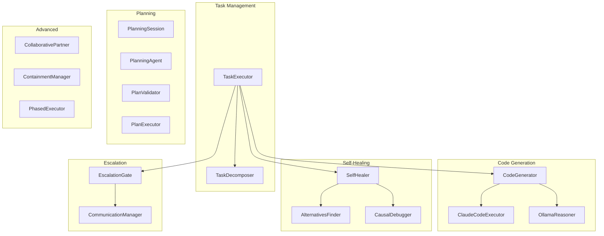
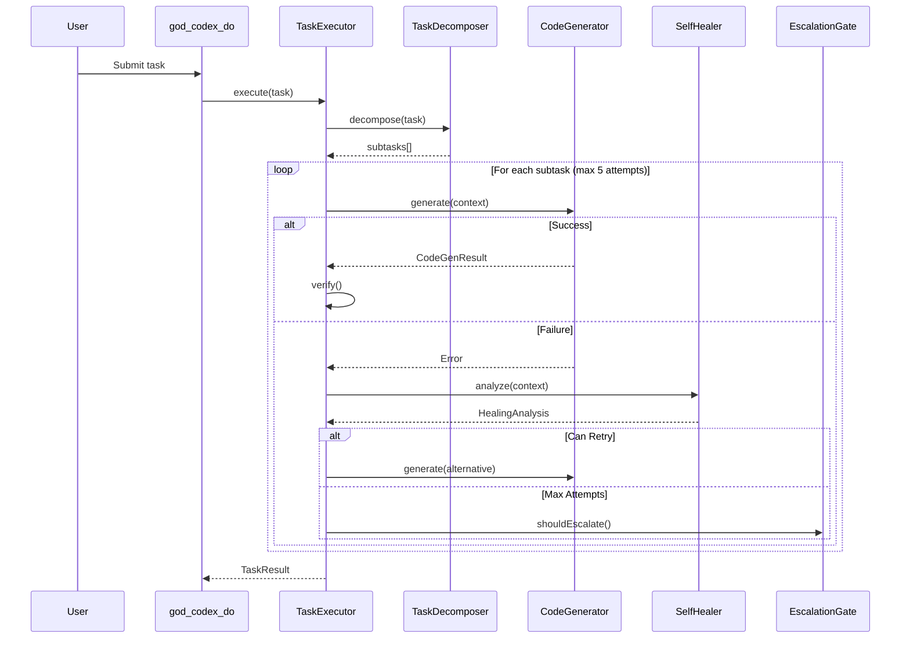

# CODEX System Documentation

The CODEX system is the core of RUBIX's autonomous development capabilities. It consists of 24 files that handle task decomposition, code generation, self-healing, and escalation.

## Overview



## File Reference

| File | Lines | Purpose |
|------|-------|---------|
| [TaskExecutor](task-executor.md) | ~1800 | Main orchestrator |
| [TaskDecomposer](task-decomposer.md) | ~200 | Task breakdown |
| [CodeGenerator](code-generator.md) | ~500 | Claude code generation |
| [SelfHealer](self-healer.md) | ~300 | Failure analysis |
| [EscalationGate](escalation-gate.md) | ~300 | Escalation logic |
| [CollaborativePartner](collaborative-partner.md) | ~300 | Proactive curiosity |
| [ContainmentManager](containment-manager.md) | ~400 | Path permissions |
| [PhasedExecutor](phased-executor.md) | ~400 | 6-phase execution |
| [types.ts](types.md) | ~500 | Type definitions |
| ClaudeCodeExecutor | ~200 | CLI executor |
| ContextScout | ~200 | Context gathering |
| OllamaReasoner | ~150 | Local LLM fallback |
| LearningIntegration | ~150 | Pattern learning |
| AlternativesFinder | ~150 | Alternative strategies |
| CausalDebugger | ~150 | Causal debugging |
| WorkingMemoryManager | ~100 | Active memory |
| PlanningSession | ~250 | Unlimited planning |
| ConversationSession | ~150 | Lightweight chat |
| PlanningAgent | ~200 | Agentic planning |
| PlanValidator | ~150 | Plan validation |
| PlanExecutor | ~200 | Plan execution |
| TokenRouter | ~150 | Token budget routing |
| PermissionDetector | ~100 | Permission detection |
| index.ts | ~50 | Export hub |

## Execution Flow



## 7 Subtask Types

| Type | Description | Example |
|------|-------------|---------|
| **research** | Analyze codebase, read docs | "Understand authentication flow" |
| **design** | Architecture planning | "Design component structure" |
| **code** | Code generation | "Implement login function" |
| **test** | Write/run tests | "Add unit tests for auth" |
| **integrate** | Wire components | "Connect auth to routes" |
| **verify** | Playwright verification | "Verify login works in browser" |
| **review** | Code quality check | "Review for security issues" |

## Retry Strategy

| Attempt | Strategy | Extended Thinking |
|---------|----------|-------------------|
| 1 | Standard approach | No |
| 2 | Alternative + learning suggestions | 5K tokens |
| 3 | Extended thinking | 10K tokens |
| 4 | Different alternative approach | 15K tokens |
| 5 | Final attempt with maximum context | 16K tokens |

## Execution Modes

### 1. Standard Mode

Default execution with Claude Code CLI.

```typescript
const result = await taskExecutor.execute({
  description: "Add user authentication",
  codebase: "/path/to/project"
});
```

### 2. RUBIX Mode

Department heads with parallel execution.

```typescript
taskExecutor.enableRubixMode({
  model: 'claude-sonnet-4-20250514',
  maxSubAgentsPerDepartment: 5
});
```

### 3. Phased Mode

6-phase tokenized execution for rate limit mitigation.

```typescript
const result = await phasedExecutor.execute(task);
```

## MCP Tools

### god_codex_do

Submit a task for execution:

```typescript
await mcp__rubix__god_codex_do({
  description: "Add login functionality",
  codebase: "D:/my-project",
  constraints: ["Use TypeScript", "Add tests"],
  verificationUrl: "http://localhost:3000"
});
```

### god_codex_status

Check execution status:

```typescript
const status = await mcp__rubix__god_codex_status();
```

### god_codex_answer

Answer an escalation:

```typescript
await mcp__rubix__god_codex_answer({
  escalationId: "esc_123",
  answer: "Use JWT tokens"
});
```

### god_codex_cancel

Cancel the current task:

```typescript
await mcp__rubix__god_codex_cancel();
```

### god_codex_log

Get the work log:

```typescript
const log = await mcp__rubix__god_codex_log();
```

## Self-Healing

When a subtask fails:

1. **Error Classification** - Type, transient check, strategy suggestion
2. **Failure Memory Query** - Find similar past failures
3. **Enhanced Analysis** - Stack traces, git history, diagnostics
4. **Strategy Selection** - Choose recovery approach

### Healing Strategies

| Strategy | Description |
|----------|-------------|
| `retry_with_context` | Retry with more context |
| `simplify_approach` | Try simpler approach |
| `try_alternative` | Use different approach |
| `gather_more_context` | Gather more information |
| `break_into_smaller_steps` | Decompose further |
| `escalate` | Ask user for help |

## Escalation Rules

### Must Escalate

- Critical spec ambiguity (high business impact)
- Max attempts exceeded
- High-impact irreversible actions

### Autonomous Decisions

- Dependency minor versions
- Code formatting
- Variable naming
- Test structure

### Requires Approval

- Database schema changes
- API breaking changes
- New dependencies
- Architecture changes

## Next Steps

- [TaskExecutor](task-executor.md) - Main orchestrator documentation
- [CodeGenerator](code-generator.md) - Code generation details
- [SelfHealer](self-healer.md) - Self-healing system
- [EscalationGate](escalation-gate.md) - Escalation logic
