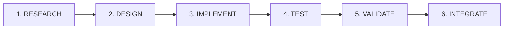
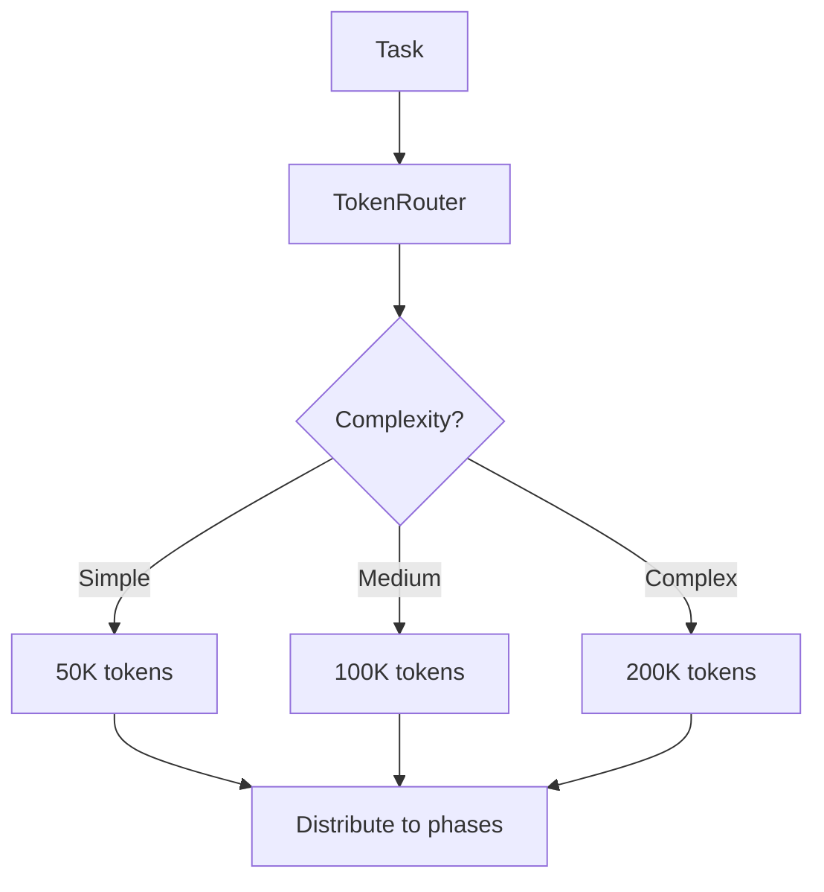
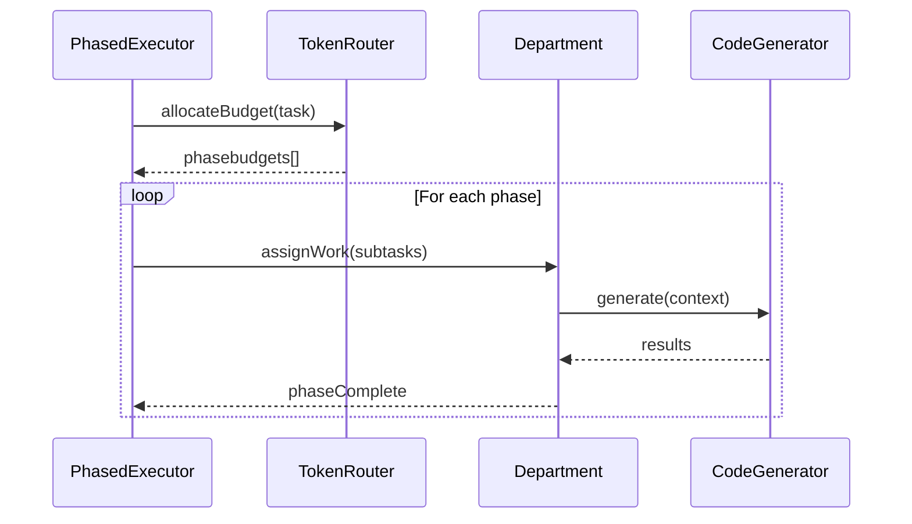

# PhasedExecutor

6-phase tokenized execution system for RUBIX tasks.

## Location

`src/codex/PhasedExecutor.ts`

## Purpose

Executes tasks through 6 distinct phases with token budget management and department-based parallelization.

## The 6 Phases



| Phase | Department | Purpose | Parallelism |
|-------|------------|---------|-------------|
| 1. RESEARCH | RESEARCHER | Understand codebase | Low |
| 2. DESIGN | ARCHITECT | Plan solution | Low |
| 3. IMPLEMENT | ENGINEER | Write code | **High** |
| 4. TEST | VALIDATOR | Write tests | Medium |
| 5. VALIDATE | GUARDIAN | Security/review | Medium |
| 6. INTEGRATE | ENGINEER | Wire together | Low |

## Token Budget Routing



## Department Model

```
                    ┌─────────────────┐
                    │     CLAUDE      │
                    │  (Head of Ops)  │
                    └────────┬────────┘
                             │
        ┌────────────────────┼────────────────────┐
        ▼                    ▼                    ▼
   ┌─────────┐          ┌─────────┐          ┌─────────┐
   │RESEARCHER│         │ARCHITECT│          │ENGINEER │
   └────┬────┘          └────┬────┘          └────┬────┘
        │                    │                    │
     Agents               Agents              Agents
     (1-2)                (1-2)               (1-5)
```

## Phase Configuration

```typescript
interface PhaseConfig {
  phase: Phase;
  department: Department;
  maxAgents: number;
  tokenBudget: number;
  canParallelize: boolean;
}

const PHASE_CONFIGS: PhaseConfig[] = [
  { phase: 'RESEARCH', department: 'RESEARCHER', maxAgents: 2, canParallelize: false },
  { phase: 'DESIGN', department: 'ARCHITECT', maxAgents: 2, canParallelize: false },
  { phase: 'IMPLEMENT', department: 'ENGINEER', maxAgents: 5, canParallelize: true },
  { phase: 'TEST', department: 'VALIDATOR', maxAgents: 3, canParallelize: true },
  { phase: 'VALIDATE', department: 'GUARDIAN', maxAgents: 2, canParallelize: true },
  { phase: 'INTEGRATE', department: 'ENGINEER', maxAgents: 2, canParallelize: false }
];
```

## Execution Flow



## Benefits

| Feature | Benefit |
|---------|---------|
| Phase isolation | Clear boundaries, easier debugging |
| Token budgeting | Predictable costs |
| Parallel IMPLEMENT | Faster code generation |
| Department model | Specialized prompts per role |

## Related

- [TaskExecutor](task-executor.md) - Main orchestrator
- [CodeGenerator](code-generator.md) - Generates code
- [Task Execution Flow](../flowcharts/task-execution-flow.md)
