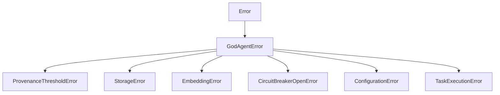

# Error Types

**File:** `src/core/errors.ts` (~50 lines)

Custom error types for specific failure modes in the RUBIX/god-agent system.

## Error Hierarchy



## Base Error

### GodAgentError

Base class for all RUBIX errors:

```typescript
class GodAgentError extends Error {
  code: string;
  context?: Record<string, unknown>;

  constructor(message: string, code: string, context?: Record<string, unknown>) {
    super(message);
    this.name = 'GodAgentError';
    this.code = code;
    this.context = context;
  }
}
```

## Specific Errors

### ProvenanceThresholdError

Thrown when L-Score is below the configured threshold:

```typescript
class ProvenanceThresholdError extends GodAgentError {
  lScore: number;
  threshold: number;

  constructor(lScore: number, threshold: number) {
    super(
      `L-Score ${lScore} is below threshold ${threshold}`,
      'PROVENANCE_THRESHOLD',
      { lScore, threshold }
    );
  }
}
```

**When thrown:**
- Storing with parent entries that have low L-Scores
- Calculated L-Score drops below threshold
- Enforcement is enabled (`GOD_AGENT_ENFORCE_LSCORE_THRESHOLD=true`)

**Handling:**
```typescript
try {
  await engine.store({ content: "...", parentIds: ["low_score_entry"] });
} catch (error) {
  if (error instanceof ProvenanceThresholdError) {
    console.warn(`L-Score too low: ${error.lScore}`);
    // Option 1: Store without parents
    await engine.store({ content: "...", parentIds: [] });
    // Option 2: Find higher-trust parents
    // Option 3: Disable enforcement
  }
}
```

### StorageError

Thrown for database-related failures:

```typescript
class StorageError extends GodAgentError {
  operation: string;
  table?: string;

  constructor(message: string, operation: string, table?: string) {
    super(message, 'STORAGE_ERROR', { operation, table });
  }
}
```

**When thrown:**
- Database connection failure
- Query execution error
- Transaction failure
- Constraint violation

**Handling:**
```typescript
try {
  await engine.store({ ... });
} catch (error) {
  if (error instanceof StorageError) {
    console.error(`Database error: ${error.operation}`);
    // Retry or fallback
  }
}
```

### EmbeddingError

Thrown for embedding generation failures:

```typescript
class EmbeddingError extends GodAgentError {
  provider: string;
  model: string;

  constructor(message: string, provider: string, model: string) {
    super(message, 'EMBEDDING_ERROR', { provider, model });
  }
}
```

**When thrown:**
- OpenAI API failure
- Rate limiting
- Invalid content (too long)
- Network error

**Handling:**
```typescript
try {
  await engine.store({ ... });
} catch (error) {
  if (error instanceof EmbeddingError) {
    console.error(`Embedding failed: ${error.provider}`);
    // Retry with backoff
    await delay(5000);
    await engine.store({ ... });
  }
}
```

### CircuitBreakerOpenError

Thrown when a circuit breaker is open:

```typescript
class CircuitBreakerOpenError extends GodAgentError {
  route: string;
  cooldownEndsAt: Date;

  constructor(route: string, cooldownEndsAt: Date) {
    super(
      `Circuit breaker open for route: ${route}`,
      'CIRCUIT_BREAKER_OPEN',
      { route, cooldownEndsAt }
    );
  }
}
```

**When thrown:**
- Route has exceeded failure threshold
- Circuit is in OPEN state
- Cooldown period not expired

**Handling:**
```typescript
try {
  await engine.query({ query: "...", route: "causal_backward" });
} catch (error) {
  if (error instanceof CircuitBreakerOpenError) {
    console.warn(`Route ${error.route} blocked until ${error.cooldownEndsAt}`);
    // Use alternative route
    await engine.query({ query: "...", route: "direct_retrieval" });
  }
}
```

### ConfigurationError

Thrown for configuration issues:

```typescript
class ConfigurationError extends GodAgentError {
  key: string;
  expected?: string;
  received?: string;

  constructor(message: string, key: string, expected?: string, received?: string) {
    super(message, 'CONFIGURATION_ERROR', { key, expected, received });
  }
}
```

**When thrown:**
- Missing required configuration
- Invalid configuration value
- Type mismatch

**Handling:**
```typescript
try {
  const config = await loadConfig();
} catch (error) {
  if (error instanceof ConfigurationError) {
    console.error(`Missing configuration: ${error.key}`);
    // Set default or prompt user
  }
}
```

### TaskExecutionError

Thrown for task execution failures:

```typescript
class TaskExecutionError extends GodAgentError {
  taskId: string;
  subtaskId?: string;
  phase: string;
  attempts: number;

  constructor(
    message: string,
    taskId: string,
    phase: string,
    attempts: number,
    subtaskId?: string
  ) {
    super(message, 'TASK_EXECUTION_ERROR', { taskId, subtaskId, phase, attempts });
  }
}
```

**When thrown:**
- Subtask fails after max attempts
- Task decomposition fails
- Code generation fails
- Verification fails

**Handling:**
```typescript
try {
  await taskExecutor.execute(task);
} catch (error) {
  if (error instanceof TaskExecutionError) {
    console.error(`Task ${error.taskId} failed at ${error.phase}`);
    // Escalate to user
    await communicationManager.escalate({
      type: 'blocked',
      message: error.message
    });
  }
}
```

## Error Codes

| Code | Error Class | Description |
|------|-------------|-------------|
| `PROVENANCE_THRESHOLD` | ProvenanceThresholdError | L-Score below threshold |
| `STORAGE_ERROR` | StorageError | Database operation failed |
| `EMBEDDING_ERROR` | EmbeddingError | Embedding generation failed |
| `CIRCUIT_BREAKER_OPEN` | CircuitBreakerOpenError | Route circuit is open |
| `CONFIGURATION_ERROR` | ConfigurationError | Configuration issue |
| `TASK_EXECUTION_ERROR` | TaskExecutionError | Task execution failed |

## Global Error Handler

```typescript
process.on('unhandledRejection', (error) => {
  if (error instanceof GodAgentError) {
    console.error(`[${error.code}] ${error.message}`);
    console.error('Context:', error.context);
  } else {
    console.error('Unexpected error:', error);
  }
});
```

## Error Logging

All errors include context for debugging:

```typescript
try {
  await engine.store({ ... });
} catch (error) {
  if (error instanceof GodAgentError) {
    logger.error({
      code: error.code,
      message: error.message,
      context: error.context,
      stack: error.stack
    });
  }
}
```

## Next Steps

- [Types](types.md) - Type definitions
- [Configuration](config.md) - Configuration reference
- [MemoryEngine](memory-engine.md) - API documentation
