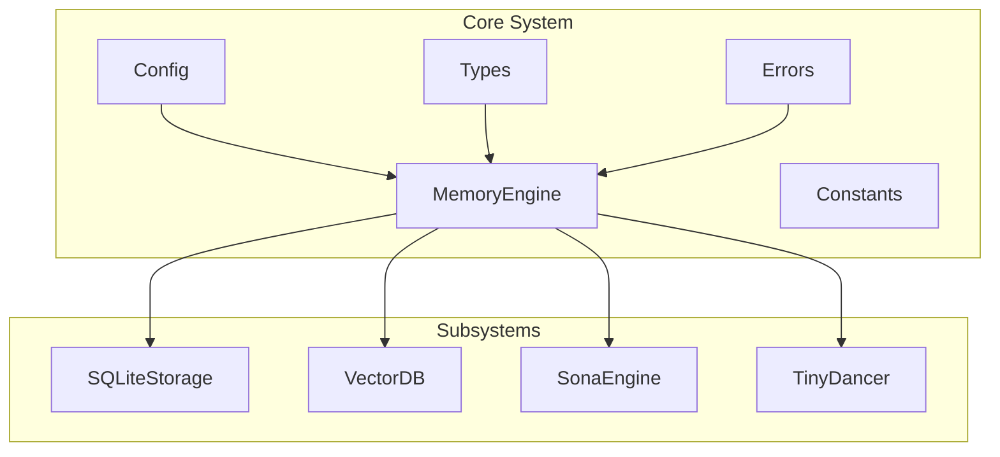
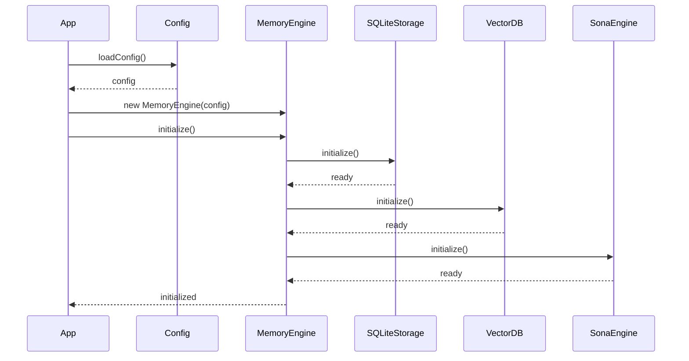

# Core System Documentation

The core system provides the foundation for the RUBIX/god-agent, including the unified MemoryEngine facade, type definitions, configuration, and error handling.

## Core Files

| File | Lines | Purpose |
|------|-------|---------|
| [MemoryEngine](memory-engine.md) | ~1100 | Unified API facade |
| [Types](types.md) | ~500 | All type definitions |
| [Config](config.md) | ~350 | Configuration loading |
| [Constants](constants.md) | ~30 | System tags and constants |
| [Errors](errors.md) | ~50 | Custom error types |

## Architecture



## MemoryEngine

The MemoryEngine is the unified facade that coordinates all memory operations:

```typescript
const engine = new MemoryEngine(config);
await engine.initialize();

// Store
const { entryId } = await engine.store({
  content: "Information to store",
  tags: ["tag1", "tag2"],
  importance: 0.8
});

// Query
const results = await engine.query({
  query: "search term",
  topK: 10
});
```

See [MemoryEngine documentation](memory-engine.md) for details.

## Configuration

Configuration is loaded from environment variables and codex.yaml:

```typescript
const config = await loadConfig();
// Or with custom path
const config = await loadConfig({ path: "./custom-codex.yaml" });
```

### Key Configuration Sections

| Section | Purpose |
|---------|---------|
| `memory` | Memory system settings |
| `hnsw` | Vector database settings |
| `lscore` | Provenance settings |
| `rubix` | Task execution settings |
| `providers` | LLM provider settings |

See [Configuration documentation](config.md) for complete reference.

## Type System

Comprehensive TypeScript types for type safety:

```typescript
import {
  MemoryEntry,
  StoreInput,
  QueryInput,
  QueryResult,
  CausalRelation,
  Trajectory,
  PatternWeight
} from '@rubix/god-agent';
```

See [Types documentation](types.md) for all type definitions.

## Error Handling

Custom error types for specific failure modes:

```typescript
import {
  ProvenanceThresholdError,
  CircuitBreakerOpenError,
  EmbeddingError,
  StorageError
} from '@rubix/god-agent';

try {
  await engine.store({ ... });
} catch (error) {
  if (error instanceof ProvenanceThresholdError) {
    // L-Score too low
  }
}
```

See [Errors documentation](errors.md) for all error types.

## Constants

System-wide constants and tags:

```typescript
import { SYSTEM_TAGS, DEFAULT_IMPORTANCE } from '@rubix/god-agent';

// SYSTEM_TAGS includes:
// - 'compressed', 'llm-compressed'
// - 'failure', 'success'
// - 'codex', 'learning'
// etc.
```

See [Constants documentation](constants.md) for all constants.

## Initialization Flow



## Next Steps

- [MemoryEngine](memory-engine.md) - Detailed API documentation
- [Configuration](config.md) - Complete configuration reference
- [Types](types.md) - Type definitions
