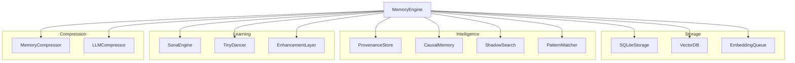

# MemoryEngine

**File:** `src/core/MemoryEngine.ts` (~1100 lines)

The MemoryEngine is the unified API facade that orchestrates all memory subsystems in RUBIX.

## Overview



## Class Structure

```typescript
class MemoryEngine {
  // Configuration
  private config: MemoryEngineConfig;

  // Storage components
  private storage: SQLiteStorage;
  private vectorDB: VectorDB;
  private embeddingQueue: EmbeddingQueue;
  private embeddingService: EmbeddingService;

  // Intelligence components
  private provenance: ProvenanceStore;
  private causal: CausalMemory;
  private shadow: ShadowSearch;
  private patterns: PatternMatcher;

  // Learning components
  private sona: SonaEngine;
  private tinyDancer: TinyDancer;
  private enhancement: EnhancementLayer;

  // Compression
  private compressor: MemoryCompressor;
  private llmCompressor: LLMCompressor;

  // State
  private initialized: boolean = false;
}
```

## Initialization

```typescript
const engine = new MemoryEngine({
  dataDir: './data',
  hnsw: {
    maxElements: 100000,
    efConstruction: 200,
    efSearch: 100,
    M: 16,
    dimensions: 768
  },
  lscore: {
    decay: 0.9,
    threshold: 0.3,
    enforce: true
  }
});

await engine.initialize();
```

### Initialization Flow

1. Create data directory if needed
2. Initialize SQLiteStorage (creates tables)
3. Initialize VectorDB (loads or creates HNSW index)
4. Initialize EmbeddingService (OpenAI client)
5. Initialize EmbeddingQueue (batch processing)
6. Initialize SonaEngine (learning)
7. Initialize TinyDancer (routing)
8. Initialize other subsystems

## Core Methods

### store()

Store a new memory entry with automatic compression and embedding.

```typescript
interface StoreInput {
  content: string;
  tags?: string[];
  importance?: number;     // 0.0 - 1.0, default 0.5
  source?: SourceType;     // user_input, agent_inference, etc.
  parentIds?: string[];    // For provenance tracking
  agentId?: string;
  sessionId?: string;
}

interface StoreResult {
  success: boolean;
  entryId: string;
  lScore: number;
  compressed: boolean;
  compressionRatio?: number;
}

const result = await engine.store({
  content: "The authentication module uses JWT tokens",
  tags: ["auth", "security"],
  importance: 0.8,
  source: "agent_inference"
});
```

### query()

Semantic search with optional routing and provenance.

```typescript
interface QueryInput {
  query: string;
  topK?: number;           // default 10
  tags?: string[];         // Filter by tags
  minImportance?: number;  // Minimum importance
  sources?: SourceType[];  // Filter by source
  includeProvenance?: boolean;  // Include L-Scores
  route?: RouteType;       // Override routing
}

interface QueryResult {
  success: boolean;
  results: MatchResult[];
  trajectoryId?: string;   // For learning feedback
  route?: RouteType;       // Route used
}

const result = await engine.query({
  query: "how does authentication work?",
  topK: 5,
  includeProvenance: true
});
```

### edit()

Update an existing memory entry.

```typescript
interface EditInput {
  content?: string;        // New content (re-embeds)
  tags?: string[];         // Replace all tags
  importance?: number;     // New importance
  source?: SourceType;     // New source
}

await engine.edit("entry_id", {
  content: "Updated content",
  importance: 0.9
});
```

### delete()

Permanently remove a memory entry.

```typescript
await engine.delete("entry_id", { confirm: true });
```

## Causal Operations

### addCausalRelation()

Create a causal relationship between entries.

```typescript
await engine.addCausalRelation({
  sourceIds: ["entry1", "entry2"],
  targetIds: ["entry3"],
  type: "causes",
  strength: 0.8,
  ttl: 604800000  // 7 days
});
```

### findCausalPaths()

Find causal paths between two entries.

```typescript
const paths = await engine.findCausalPaths({
  sourceId: "entry1",
  targetId: "entry2",
  maxDepth: 5
});
```

### cleanupExpired()

Remove expired causal relations.

```typescript
const cleaned = await engine.cleanupExpired({ dryRun: false });
```

## Learning Operations

### createTrajectory()

Create a learning trajectory from query results.

```typescript
const trajectoryId = await engine.createTrajectory(
  "search query",
  results
);
```

### provideFeedback()

Provide quality feedback for a trajectory.

```typescript
await engine.provideFeedback(trajectoryId, 0.8);  // 0.0 - 1.0
```

## Shadow Search

### shadowSearch()

Find contradictory evidence.

```typescript
const contradictions = await engine.shadowSearch({
  query: "Our system is secure",
  topK: 5,
  threshold: 0.5
});
```

## GNN Enhancement

### enhance()

Enhance an entry's embedding using GNN.

```typescript
const enhanced = await engine.enhance(entryId, {
  includeWeights: true
});
```

## Provenance

### trace()

Trace the provenance lineage of an entry.

```typescript
const lineage = await engine.trace(entryId, { depth: 5 });
// Returns: L-Score, parents, lineage depth, reliability category
```

## Statistics

### getStats()

Get memory system statistics.

```typescript
const stats = await engine.getStats();
// Returns: totalEntries, vectorCount, causalRelations, avgLScore
```

## Events

The MemoryEngine emits events for monitoring:

```typescript
engine.on('store', (entry) => console.log('Stored:', entry.id));
engine.on('query', (query) => console.log('Queried:', query));
engine.on('error', (error) => console.error('Error:', error));
```

## Error Handling

```typescript
try {
  await engine.store({ content: "...", parentIds: ["bad_id"] });
} catch (error) {
  if (error instanceof ProvenanceThresholdError) {
    console.error("L-Score below threshold");
  } else if (error instanceof StorageError) {
    console.error("Database error");
  } else if (error instanceof EmbeddingError) {
    console.error("Embedding failed");
  }
}
```

## Configuration Options

| Option | Type | Default | Description |
|--------|------|---------|-------------|
| `dataDir` | string | `./data` | Database directory |
| `hnsw.maxElements` | number | `100000` | Max vectors |
| `hnsw.efConstruction` | number | `200` | Build quality |
| `hnsw.efSearch` | number | `100` | Search quality |
| `hnsw.M` | number | `16` | Connections/node |
| `hnsw.dimensions` | number | `768` | Vector size |
| `lscore.decay` | number | `0.9` | L-Score decay |
| `lscore.threshold` | number | `0.3` | Min L-Score |
| `lscore.enforce` | boolean | `true` | Enforce threshold |

## Thread Safety

The MemoryEngine is designed for single-threaded Node.js use. For multi-process scenarios:

1. Use separate data directories
2. Or implement external locking
3. Or use a shared database with proper transaction handling

## Cleanup

```typescript
await engine.close();  // Flush queues, close connections
```

## Next Steps

- [Configuration](config.md) - Complete configuration reference
- [Types](types.md) - Type definitions
- [Memory System Architecture](../architecture/memory-system.md) - Architecture overview
